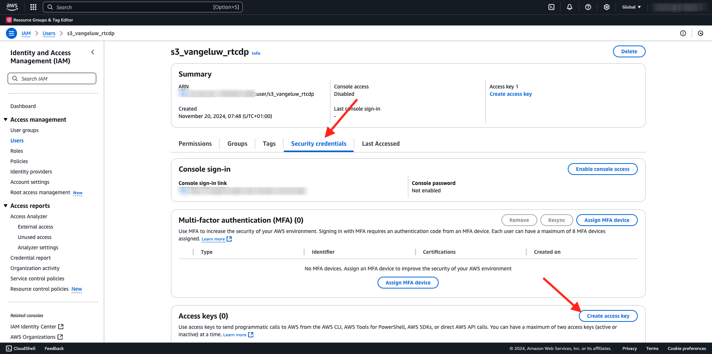

# 2.3.4 アクションの実行：オーディエンスを S3 の宛先に送信する

また、Adobe Experience Platformは、Salesforce Marketing Cloud、Oracle Eloqua、Oracle Responsys、Adobe Campaignなどのメールマーケティングの宛先に対してオーディエンスを共有できます。

これらの各メールマーケティングの宛先専用の宛先の一部として FTP または SFTP を使用できます。または、AWS S3 を使用して、Adobe Experience Platformとメールマーケティングの宛先の間で顧客のリストをやり取りできます。

このモジュールでは、AWS S3 バケットを使用して、このような宛先を設定します。

## S3 バケットを作成

[https://console.aws.amazon.com](https://console.aws.amazon.com) に移動し、サインインします。

>[!NOTE]
>
>AWS アカウントをまだお持ちでない場合は、個人のメールアドレスを使用して新しいAWS アカウントを作成してください。

ログインすると、**AWS Management Console** にリダイレクトされます。

検索バーで、「**s3**」を検索します。 最初の検索結果「**S3 - Scalable Storage in the Cloud**」をクリックします。

**Amazon S3** ホームページが表示されます。 **バケットを作成** をクリックします。

**バケットを作成** 画面で、`aepmodulertcdp--aepUserLdap--` の名前を使用します。

他のすべてのデフォルト設定はそのままにしておきます。 下にスクロールして、**バケットを作成** をクリックします。

その後、バケットが作成され、Amazon S3 のホームページにリダイレクトされます。

## S3 バケットにアクセスするための権限の設定

次の手順では、S3 バケットへのアクセスを設定します。

その場合は、[https://console.aws.amazon.com/iam/home](https://console.aws.amazon.com/iam/home) にアクセスしてください。

AWS リソースへのアクセスは、Amazon Identity and Access Management （IAM）によって制御されます。

このページが表示されます。

左側のメニューで、「**ユーザー**」をクリックします。 その後、**ユーザー** 画面が表示されます。 **ユーザーを作成** をクリックします。

次に、ユーザーを設定します。

- ユーザー名：使用 `s3_--aepUserLdap--_rtcdp`

「**次へ**」をクリックします。

その後、この権限画面が表示されます。 「**ポリシーを直接添付**」をクリックします。

検索語句 **s3** を入力すると、関連するすべての S3 ポリシーが表示されます。 ポリシー **AmazonS3FullAccess** を選択します。 下にスクロールして、「**次へ**」をクリックします。

設定を確認します。 **ユーザーを作成** をクリックします。

その後、これが表示されます。 **ユーザーを表示** をクリックします。

**セキュリティ資格情報** をクリックしてから、**アクセスキーを作成** をクリックします。

**AWS以外で実行中のアプリケーション** を選択します。 下にスクロールして、「**次へ**」をクリックします。

**アクセスキーを作成** をクリックします

その後、これが表示されます。 「**表示**」をクリックして、秘密アクセスキーを表示します。

**秘密アクセスキー** を表示しています。

>[!IMPORTANT]
>
>コンピューターのテキストファイルに資格情報を保存します。
>
> - アクセスキー ID : ...
> - 秘密アクセスキー：...
>
> 「完了 **をクリックすると** 資格情報が再び表示されなくなります。

「**完了**」をクリックします。

これで、AWS S3 バケットが正常に作成され、このバケットにアクセスする権限を持つユーザーが作成されました。

## Adobe Experience Platformでの宛先の設定

[Adobe Experience Platform](https://experience.adobe.com/platform) に移動します。 ログインすると、Adobe Experience Platformのホームページが表示されます。

続行する前に、**サンドボックス** を選択する必要があります。 選択するサンドボックスの名前は ``--aepSandboxName--`` です。 適切な [!UICONTROL &#x200B; サンドボックス &#x200B;] を選択すると、画面が変更され、専用の [!UICONTROL &#x200B; サンドボックス &#x200B;] が表示されます。

左側のメニューで **宛先** に移動し、**カタログ** に移動します。 **宛先カタログ** が表示されます。

**クラウドストレージ** をクリックし、**Amazon S3** カードの **設定** ボタン（または、お使いの環境に応じて **オーディエンスをアクティブ化**）をクリックします。

アカウントタイプとして **アクセスキー** を選択します。 前の手順で付与された S3 資格情報を使用してください。

| アクセスキー ID | シークレットアクセスキー |
|:-----------------------:| :-----------------------:|
| アキア… | 7 アイコン… |

**宛先に接続** をクリックします。

その後、この宛先が接続されたことを示す視覚的な確認が表示されます。

Adobe Experience Platformが S3 バケットに接続できるように、S3 バケットの詳細を指定する必要があります。

命名規則として、次を使用してください。

| アクセスキー ID | シークレットアクセスキー |
|:-----------------------:| :-----------------------:|
| 名前 | `AWS - S3 - --aepUserLdap--` |
| 説明 | `AWS - S3 - --aepUserLdap--` |
| バケット名 | `aepmodulertcdp--aepUserLdap--` |
| フォルダーパス | /now |

**オーディエンス** を選択します。

「**ファイルタイプ**」で「**CSV**」を選択し、デフォルト設定は変更しません。

下にスクロールします。 **圧縮形式** の場合は、「**なし** を選択します。 「**次へ**」をクリックします。

オプションで、新しい宛先にデータガバナンスポリシーを添付できるようになりました。 「**次へ**」をクリックします。

オーディエンスのリストで、前の演習で作成したオーディエンスを検索 `--aepUserLdap-- - Interest in Galaxy S24`、選択します。 「**次へ**」をクリックします。

その後、これが表示されます。 必要に応じて、**鉛筆** アイコンをクリックして、スケジュールとファイル名を編集できます。 「**次へ**」をクリックします。

AWS S3 に書き出すプロファイル属性を選択できるようになりました。 「**新しいフィールドを追加**」をクリックし、フィールド `--aepTenantId--.identification.core.ecid` が追加され、**重複排除キー** としてマークされていることを確認します。

オプションで、他のプロファイル属性を必要な数だけ追加できます。

すべてのフィールドを追加したら、「**次へ**」をクリックします。

設定を確認します。 「**終了**」をクリックして、設定を終了します。

その後、宛先のアクティベーション画面に戻り、この宛先に追加されたオーディエンスが表示されます。

オーディエンスの書き出しをさらに追加する場合は、「**オーディエンスをアクティブ化**」をクリックして、プロセスを再開し、オーディエンスを追加します。

## 次の手順

[2.3.5 に移動します。アクションの実行：オーディエンスをAdobe Targetに送信します ](./ex5.md){target="_blank"}

[Real-time CDP - オーディエンスの作成とアクションの実行 ](./real-time-cdp-build-a-segment-take-action.md){target="_blank"} に戻る

[ すべてのモジュール ](./../../../../overview.md){target="_blank"} に戻る
