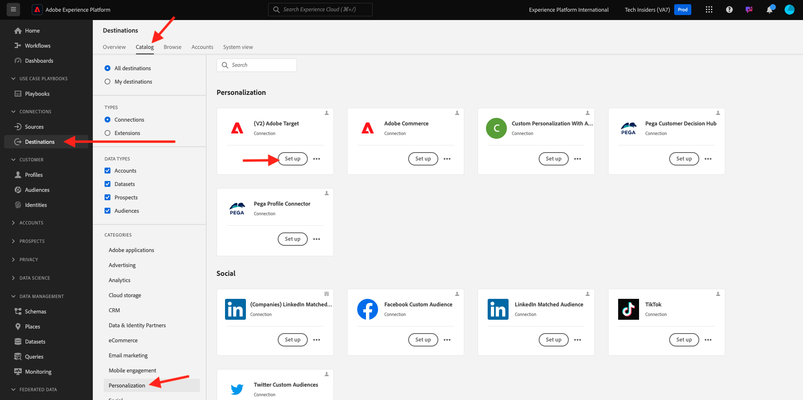
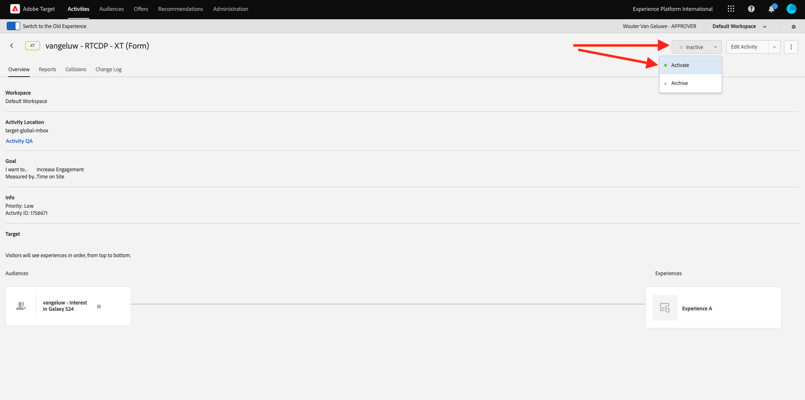
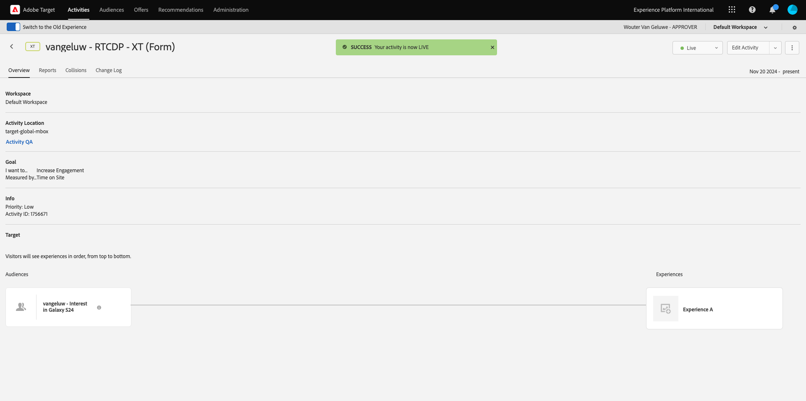

# 2.3.5 アクションの実行：オーディエンスをAdobe Targetに送信します

[Adobe Experience Platform](https://experience.adobe.com/platform) に移動します。 ログインすると、Adobe Experience Platformのホームページが表示されます。


続行する前に、**サンドボックス** を選択する必要があります。 選択するサンドボックスの名前は ``--aepSandboxName--`` です。 適切な [!UICONTROL  サンドボックス ] を選択すると、画面が変更され、専用の [!UICONTROL  サンドボックス ] が表示されます。


## データストリームの検証

Real-Time CDPのAdobe Targetの宛先は、Adobe Edge Network へのデータの取り込みに使用されるデータストリームに接続されています。 Adobe Targetの宛先を設定する場合、まず、データストリームが既にAdobe Targetで有効になっているかどうかを確認する必要があります。 データストリームは、[ 演習 0.2 データストリームの作成 ](./../../../modules/../getting-started/gettingstarted/ex2.md) で設定し、`--aepUserLdap-- - Demo System Datastream` という名前を付けました。

左側のメニューで、下にスクロールし、**データストリーム** をクリックします。 データストリームで、`--aepUserLdap-- - Demo System Datastream` という名前のデータストリームを検索します。 データストリームをクリックして開きます。


表示されたら、「**Adobe Experience Platform」の横にある「**...**」をクリックし** 「**編集**」をクリックします。


**Personalization セグメント化** と **2}Edgeの両方の宛先** チェックボックスをオンにします。 「**保存**」をクリックします。


次に、「**+ サービスを追加**」をクリックします。


サービス **Adobe Target** を選択します。 「**保存**」をクリックします。


これで、データストリームがAdobe Target用に設定されました。


## Adobe Targetの宛先の設定

Adobe Targetは、Real-Time CDPから入手できます。 Adobe Target統合を設定するには、**Destinations**/**Catalog** に移動します。

**カテゴリ** メニューの **Personalization** をクリックします。 **（v2）Adobe Target** の宛先カードが表示されます。



**宛先に接続** をクリックします。


その後、これが表示されます。 独自のAdobe Targetの宛先を作成するには、次のガイドラインに従う必要があります。

- 名前：名前 `--aepUserLdap-- - Adobe Target v2  (Web)` を使用します。
- データストリーム ID:[ 演習 0.2 データストリームの作成 ](./../../../modules/../getting-started/gettingstarted/ex2.md) で設定したデータストリームを選択する必要があります。 データストリームの名前は、`--aepUserLdap-- - Demo System Datastream` にする必要があります。
- Workspace：これはAdobe Target workspaces に関連しています。 使用する必要のある特定のワークスペースがない場合は、「**デフォルトのWorkspace**」を選択します。

「**次へ**」をクリックします。


オプションでデータガバナンスポリシーを選択できるようになりました。 「**次へ**」をクリックします。


使用可能なオーディエンスのリストで、前の演習 [ オーディエンスの作成 ](./ex1.md) で作成したオーディエンス（`--aepUserLdap-- - Interest in Galaxy S24` という名前）を選択します。 次に、「**次へ**」をクリックします。


**マッピング** 画面では、プロファイル属性をマッピングして、Adobe Targetで使用できるようにします。 これにより、web サイトにパーソナライゼーションのレイヤーを追加できます。 「**新しいフィールドを追加**」をクリックします。


新しいフィールドに「**person.name.firstName**」フィールドを選択します。 「**保存**」をクリックします。


これで完了です。 「**次へ**」をクリックします。


「**完了**」をクリックします。


これで、オーディエンスがAdobe Targetに対してアクティブ化されました。


>[!IMPORTANT]
>
>Adobe Targetの宛先をReal-Time CDPで作成した後、宛先が有効になるまで最大 1 時間かかる場合があります。 バックエンド設定が原因で、これは 1 回限りの待機時間です。 最初の 1 時間の待機時間とバックエンド設定が完了すると、Adobe Targetの宛先に送信される新しく追加されたオーディエンスを、リアルタイムでターゲティングできるようになります。

## Adobe Target フォームベースのアクティビティの設定

Real-Time CDP オーディエンスがAdobe Targetに送信されるように設定されたので、Adobe Targetでエクスペリエンスのターゲット設定アクティビティを設定できます。 この演習では、フォームベースのアクティビティを設定します。

[https://experiencecloud.adobe.com/](https://experiencecloud.adobe.com/) にアクセスして、Adobe Experience Cloud ホームページに移動します。 **Target** をクリックして開きます。


**Adobe Target** のホームページには、既存のすべてのアクティビティが表示されます。 「**アクティビティを作成**」をクリックし、「**エクスペリエンスのターゲット設定**」をクリックします。


「**Web**」、「**フォーム**」および「**プロパティの制限なし**」を選択します。 「**作成**」をクリックします。


これで、フォームベースのアクティビティコンポーザーが表示されます。


フィールド **LOCATION 1** で **target-global-mbox** を選択します。


デフォルトオーディエンスは、現在 **すべての訪問者** です。 **すべての訪問者** の横にある **3 ドットをクリックし****オーディエンスを変更** をクリックします。


これで、使用可能なオーディエンスのリストが表示され、以前に作成してAdobe Targetに送信したAdobe Experience Platform オーディエンスが、このリストの一部になりました。 Adobe Experience Platformで以前作成したオーディエンスを選択します。 **オーディエンスを割り当て** をクリックします。


Adobe Experience Platform オーディエンスは、このエクスペリエンスのターゲット設定アクティビティに含まれるようになりました。


次に、web サイトのホームページでヒーロー画像を変更します。 「デフォルトコンテンツ **の横にあるドロップダウンリストをクリックして開き** 「**HTML オファーを作成**」をクリックします。


次のコードを貼り付けます。

```javascript
<script>document.querySelector("#SpectrumProvider > div.App > div > div.Page.home > main > div.Banner.Banner--alignment-right.Banner--verticalAlignment-middle.main-banner > div.Image > img").src="https://tech-insiders.s3.us-west-2.amazonaws.com/citisignal-new-hero.png"; document.querySelector("#SpectrumProvider > div.App > div > div.Page.home > main > div.Banner.Banner--alignment-right.Banner--verticalAlignment-middle.main-banner > div.Banner__content > div > div > h1").innerHTML="Hi there ";
document.querySelector("#SpectrumProvider > div.App > div > div.Page.home > main > div.Banner.Banner--alignment-right.Banner--verticalAlignment-middle.main-banner > div.Banner__content > div > div > div > div > p").innerHTML="What about 10% off of your next Galaxy S24 smartphone?";
</script>
```


次に、Adobe Experience Platformのプロファイル属性からパーソナライゼーショントークンを追加する必要があります。 Adobe Targetに対してオーディエンスをアクティブ化した場合、Adobe Targetと共有するフィールド **person.name.firstName** も選択することに注意してください。 フィールドを取得するには、ソース **Adobe Experience Platform** を選択し、サンドボックス（`--aepSandboxName--` である必要があります）を選択して、属性 **person.name.firstName** を選択します。


「**追加**」ボタンをクリックする前に、次のように、`... > h1").innerHTML="Hi there ";` が表示される行に移動し、`there` という単語の後の角括弧内にカーソルを配置します。

```
... > h1").innerHTML="Hi there ";
```

次に、「**追加**」ボタンをクリックすると、トークンが追加され、次のようなコードが更新されます。

```
... > h1").innerHTML="Hi there ${aep.person.name.firstName}";
```


「**次へ**」をクリックします。


次に、選択したオーディエンスに対する新しい画像でのエクスペリエンスの概要が表示されます。 「**次へ**」をクリックします。


左上隅のアクティビティのタイトルをクリックして、名前を次のように変更します：`--aepUserLdap-- - RTCDP - XT (Form)`


**目標と設定** - ページで、**目標指標** に移動します。 プライマリ目標を **エンゲージメント** - **オンサイト滞在時間** に設定します。 **保存して閉じる** をクリックします。


**アクティビティの概要** ページが表示されます。 アクティビティをアクティベートする必要があります。 フィールド **非アクティブ** をクリックし、「**アクティブ化**」を選択します。



その後、アクティビティがライブになったことを示す視覚的な確認が表示されます。



アクティビティが実稼働し、デモ Web サイトでテストできます。

>[!IMPORTANT]
>
>Adobe Targetの宛先をReal-Time CDPで作成した後、宛先が有効になるまで最大 1 時間かかる場合があります。 バックエンド設定が原因で、これは 1 回限りの待機時間です。 最初の 1 時間の待機時間とバックエンド設定が完了すると、Adobe Targetの宛先に送信される新しく追加されたエッジオーディエンスを、リアルタイムでターゲティングできるようになります。

デモ Web サイトに戻って Galaxy S24 の商品ページにアクセスすると、作成したオーディエンスの対象となり、Adobe Target アクティビティがホームページにリアルタイムで表示されます。


## 次の手順

[2.3.6 宛先SDK](./ex6.md){target="_blank"} に移動します。

[Real-time CDP - オーディエンスの作成とアクションの実行 ](./real-time-cdp-build-a-segment-take-action.md){target="_blank"} に戻る

[ すべてのモジュール ](./../../../../overview.md){target="_blank"} に戻る
