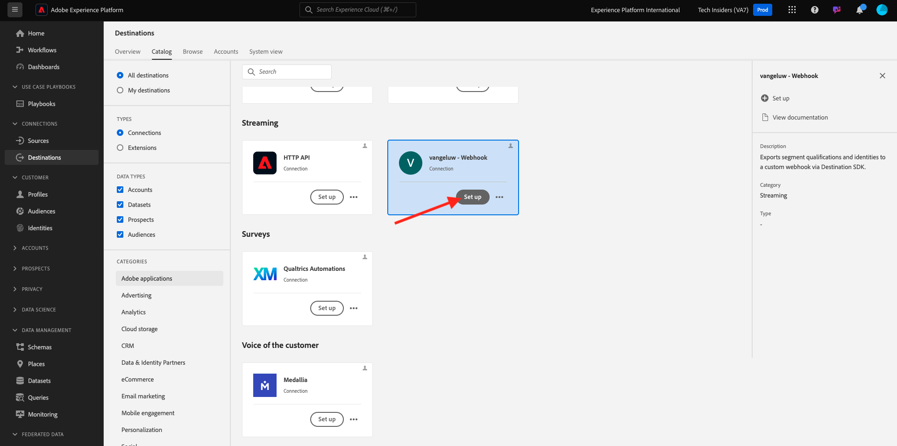
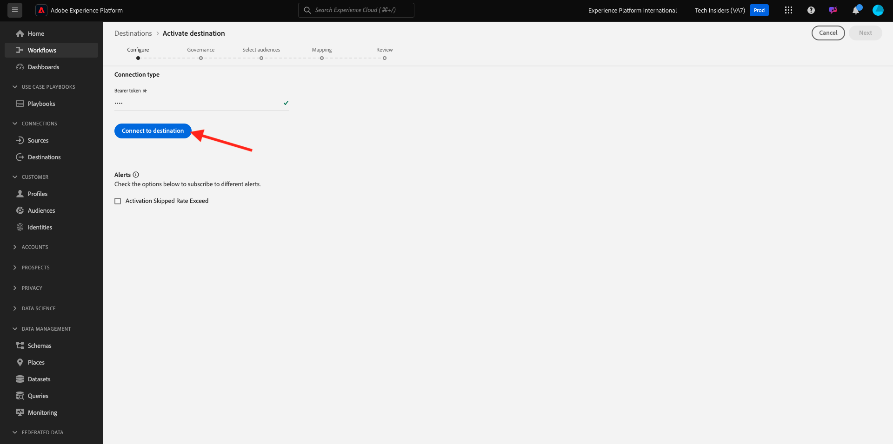

# 2.3.6 宛先SDK

## Adobe I/O プロジェクトの設定

この演習では、Adobe I/Oを再度使用して、Adobe Experience Platform API に対してクエリを実行します。Adobe I/O プロジェクトの設定が完了していない場合は、[ モジュール 2.1 の演習 3](../rtcdpb2c-1/ex3.md) に戻り、指示に従います。

>[!IMPORTANT]
>
>Adobeの従業員の場合は、こちらの手順に従って [PostBuster](./../../../../modules/getting-started/gettingstarted/ex8.md) を使用してください。

## Adobe I/Oに対する認証

この演習では、Postmanを再度使用して、Adobe Experience Platform API に対してクエリを実行します。Postman アプリケーションをまだ設定していない場合は、[ モジュール 2.1 の演習 3](../rtcdpb2c-1/ex3.md) に戻って、その指示に従ってください。

>[!IMPORTANT]
>
>Adobeの従業員の場合は、こちらの手順に従って [PostBuster](./../../../../modules/getting-started/gettingstarted/ex8.md) を使用してください。

## エンドポイントと形式の定義

この演習では、オーディエンスが認定されると認定イベントをそのエンドポイントにストリーミングできるように、エンドポイントを設定する必要があります。 この演習では、[https://pipedream.com/requestbin](https://pipedream.com/requestbin) を使用してサンプルエンドポイントを使用します。 [https://pipedream.com/requestbin](https://pipedream.com/requestbin) に移動し、アカウントを作成してから、ワークスペースを作成します。 ワークスペースを作成すると、次のような情報が表示されます。

「**コピー**」をクリックして、URL をコピーします。 次の演習では、この URL を指定する必要があります。 この例の URL は `https://eodts05snjmjz67.m.pipedream.net` です。


形式については、顧客識別子などのメタデータと共に、オーディエンスの選定または選定解除をストリーミングする標準テンプレートを使用します。 テンプレートは特定のエンドポイントの想定に合わせてカスタマイズできますが、この演習では標準テンプレートを再利用します。これにより、次のようなペイロードがエンドポイントにストリーミングされます。

```json
{
  "profiles": [
    {
      "identities": [
        {
          "type": "ecid",
          "id": "64626768309422151580190219823409897678"
        }
      ],
      "AdobeExperiencePlatformSegments": {
        "add": [
          "f58c723c-f1e5-40dd-8c79-7bb4ab47f041"
        ],
        "remove": []
      }
    }
  ]
}
```

## サーバーとテンプレートの設定の作成

Adobe Experience Platformで独自の宛先を作成する最初の手順は、Postmanを使用してサーバーとテンプレートの設定を作成することです。

これをおこなうには、Postman アプリケーションを開き、**Destination Authoring API**/**Destination server and templates** に移動し、クリックしてリクエストを開きます **POST - Create a destination server configuration**。

>[!NOTE]
>
>そのPostman コレクションがない場合は、[ モジュール 2.1 の演習 3](../rtcdpb2c-1/ex3.md) に戻り、その手順に従って、提供されたPostman コレクションでPostmanを設定します。

その後、これが表示されます。 **ヘッダー** の下で、キー **x-sandbox-name** の値を手動で更新し、`--aepSandboxName--` に設定する必要があります。 値 **{{SANDBOX_NAME}}** を選択します。


`--aepSandboxName--` で置き換えます。


次に、**本文** に移動します。 プレースホルダー **{{body}}** を選択します。


ここで、プレースホルダー **{{body}}** を以下のコードで置き換える必要があります。

```json
{
    "name": "Custom HTTP Destination",
    "destinationServerType": "URL_BASED",
    "urlBasedDestination": {
        "url": {
            "templatingStrategy": "PEBBLE_V1",
            "value": "yourURL"
        }
    },
    "httpTemplate": {
        "httpMethod": "POST",
        "requestBody": {
            "templatingStrategy": "PEBBLE_V1",
            "value": "{\n    \"profiles\": [\n    \n        {\n            \"identities\": [\n            \n            \n                \n                {\n                    \"type\": \"{{ namespace }}\",\n                    \"id\": \"{{ identity.id }}\"\n                },\n                ,\n            \n            ],\n            \"AdobeExperiencePlatformSegments\": {\n                \"add\": [\n                \n                    \"{{ segment.key }}\",\n                \n                ],\n                \"remove\": [\n                {#- Alternative syntax for filtering segments by status: -#}\n                \n                    \"{{ segment.key }}\",\n                \n                ]\n            }\n        },\n    \n    ]\n}"
        },
        "contentType": "application/json"
    }
}
```

上記のコードを貼り付けた後、フィールド **urlBasedDestination.url.value** を手動で更新し、前の手順で作成した Webhook の URL （この例で `https://eodts05snjmjz67.m.pipedream.net` 成）に設定する必要があります。


フィールド **urlBasedDestination.url.value** を更新すると、次のようになります。 「**送信**」をクリックします。


>[!NOTE]
>
>リクエストをAdobe I/Oに送信する前に、有効な `access_token` が必要であることを忘れないでください。 有効な `access_token` を取得するには、コレクション **3&rbrace;Adobe IO - OAuth** でリクエスト **POST - アクセストークンの取得 &rbrace; を実行します。**

「**送信**」をクリックすると、サーバーテンプレートが作成され、応答の一部として **instanceId** という名前のフィールドが表示されます。 次の手順で必要になるので、書き留めてください。 この例では、**instanceId** は
`52482c90-8a1e-42fc-b729-7f0252e5cebd`。


## 宛先設定の作成

Postmanの **Destination Authoring API** で **Destination configurations** に移動し、クリックしてリクエストを開きます **POST – 宛先設定を作成する**。 その後、これが表示されます。 **ヘッダー** の下で、キー **x-sandbox-name** の値を手動で更新し、`--aepSandboxName--` に設定する必要があります。 値 **{{SANDBOX_NAME}}** を選択し、`--aepSandboxName--` で置き換えます。


次に、**本文** に移動します。 プレースホルダー **{{body}}** を選択します。


ここで、プレースホルダー **{{body}}** を以下のコードで置き換える必要があります。

```json
{
    "name": "--aepUserLdap-- - Webhook",
    "description": "Exports segment qualifications and identities to a custom webhook via Destination SDK.",
    "status": "TEST",
    "customerAuthenticationConfigurations": [
        {
            "authType": "BEARER"
        }
    ],
    "customerDataFields": [
        {
            "name": "endpointsInstance",
            "type": "string",
            "title": "Select Endpoint",
            "description": "We could manage several instances across the globe for REST endpoints that our customers are provisioned for. Select your endpoint in the dropdown list.",
            "isRequired": true,
            "enum": [
                "US",
                "EU",
                "APAC",
                "NZ"
            ]
        }
    ],
    "uiAttributes": {
        "documentationLink": "https://experienceleague.adobe.com/docs/experience-platform/destinations/home.html?lang=ja",
        "category": "streaming",
        "connectionType": "Server-to-server",
        "frequency": "Streaming"
    },
    "identityNamespaces": {
        "ecid": {
            "acceptsAttributes": true,
            "acceptsCustomNamespaces": false
        }
    },
    "segmentMappingConfig": {
        "mapExperiencePlatformSegmentName": true,
        "mapExperiencePlatformSegmentId": true,
        "mapUserInput": false
    },
    "aggregation": {
        "aggregationType": "BEST_EFFORT",
        "bestEffortAggregation": {
            "maxUsersPerRequest": "1000",
            "splitUserById": false
        }
    },
    "schemaConfig": {
        "profileRequired": false,
        "segmentRequired": true,
        "identityRequired": true
    },
    "destinationDelivery": [
        {
            "authenticationRule": "NONE",
            "destinationServerId": "yourTemplateInstanceID"
        }
    ]
}
```


上記のコードを貼り付けた後、フィールド **destinationDelivery を手動で更新する必要があります。 destinationServerId**。この例で `52482c90-8a1e-42fc-b729-7f0252e5cebd` 成した、前の手順で作成した宛先サーバーテンプレートの **instanceId** に設定する必要があります。 次に、「**送信** をクリックします。


この応答が表示されます。


これで、宛先がAdobe Experience Platformに作成されました。 そこへ行って、それを調べてみよう。

[Adobe Experience Platform](https://experience.adobe.com/platform) に移動します。 ログインすると、Adobe Experience Platformのホームページが表示されます。


続行する前に、**サンドボックス** を選択する必要があります。 選択するサンドボックスの名前は ``--aepSandboxName--`` です。 適切な [!UICONTROL &#x200B; サンドボックス &#x200B;] を選択すると、画面が変更され、専用の [!UICONTROL &#x200B; サンドボックス &#x200B;] が表示されます。


左側のメニューで、**宛先** に移動し、「**カタログ** をクリックして、カテゴリ **ストリーミング** まで下にスクロールします。 今すぐそこに利用可能な宛先が表示されます。


## オーディエンスを宛先にリンクする

**宛先**/**カタログ** で、宛先の **設定** をクリックして、新しい宛先へのオーディエンスの追加を開始します。



**ベアラートークン** に対して、ランダムな値を入力します（例：**1234**）。 **宛先に接続** をクリックします。



その後、これが表示されます。 宛先の名前として、`--aepUserLdap-- - Webhook` を使用します。 任意のエンドポイント（この例では **EU**）を選択します。 「**次へ**」をクリックします。


オプションで、データガバナンスポリシーを選択できます。 「**次へ**」をクリックします。


前に作成したオーディエンス（`--aepUserLdap-- - Interest in Galaxy S24` という名前）を選択します。 「**次へ**」をクリックします。


その後、これが表示されます。 必ず **SOURCE FIELD** `--aepTenantId--.identification.core.ecid` をフィールド `Identity: ecid` にマッピングしてください。 「**次へ**」をクリックします。


「**完了**」をクリックします。


宛先がライブになりました。新しいオーディエンス選定は、現在カスタム Webhook にストリーミングされます。


## Audience Activation のテスト

[https://dsn.adobe.com](https://dsn.adobe.com) に移動します。 Adobe IDでログインすると、このが表示されます。 Web サイトプロジェクトで「。..**」** いう 3 つのドットをクリックし、「**実行**」をクリックして開きます。


その後、デモ Web サイトが開きます。 URL を選択してクリップボードにコピーします。


新しい匿名ブラウザーウィンドウを開きます。


前の手順でコピーしたデモ Web サイトの URL を貼り付けます。 その後、Adobe IDを使用してログインするように求められます。


アカウントタイプを選択し、ログインプロセスを完了します。


次に、匿名ブラウザーウィンドウに web サイトが読み込まれます。 演習ごとに、新しい匿名ブラウザーウィンドウを使用して、デモ Web サイトの URL を読み込む必要があります。


この例では、特定の顧客に応答して特定の製品を表示します。
**Citi Signal** のホームページから **電話とデバイス** に移動し、製品 **Galaxy S24** をクリックします。


これで Galaxy S24 の製品ページが表示されたので、オーディエンスは数分後にプロファイルの対象となります。


プロファイルビューアを開き、**オーディエンス** に移動すると、オーディエンスが選定されていることがわかります。


次に、[https://eodts05snjmjz67.m.pipedream.net](https://eodts05snjmjz67.m.pipedream.net) で開いている Webhook に戻ると、Adobe Experience Platformから送信され、オーディエンスの選定イベントが含まれている新しい受信リクエストが表示されます。


## 次の手順

[ 概要とメリット ](./summary.md){target="_blank"} に移動します。

[Real-time CDP - オーディエンスの作成とアクションの実行 ](./real-time-cdp-build-a-segment-take-action.md){target="_blank"} に戻る

[ すべてのモジュール ](./../../../../overview.md){target="_blank"} に戻る
