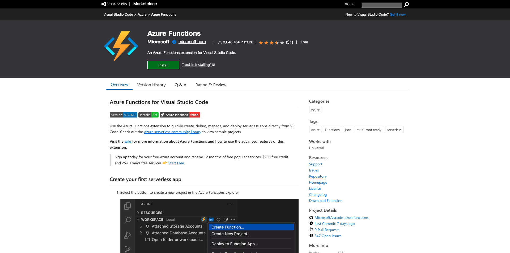

# 2.4.1 環境の設定

## Azure サブスクリプションの作成

>[!NOTE]
>
>既に Azure サブスクリプションがある場合は、この手順をスキップできます。 その場合は次の演習に進んでください。

[https://portal.azure.com](https://portal.azure.com) に移動し、Azure アカウントでログインします。 お持ちでない場合は、個人の電子メール アドレスを使用して Azure アカウントを作成してください。


ログインに成功すると、次の画面が表示されます。


左側のメニューをクリックして **すべてのリソース** を選択すると、まだ購読していない場合は Azure サブスクリプション画面が表示されます。 その場合は、「**Azure 無料体験版で開始** を選択します。


Azure サブスクリプションフォームに入力し、アクティベーション用に携帯電話とクレジットカードを提供します（30 日間無料の層があり、アップグレードしない限り請求されません）。

購読プロセスが完了したら、次の操作を実行できます。


## Visual Code Studio のインストール

Microsoft Visual Code Studio を使用して、Azure プロジェクトを管理します。 [&#x200B; このリンク &#x200B;](https://code.visualstudio.com/download) からダウンロードできます。 同じ Web サイト上の特定の OS のインストール手順に従います。

## ビジュアルコード拡張機能のインストール

[https://marketplace.visualstudio.com/items?itemName=ms-azuretools.vscode-azurefunctions](https://marketplace.visualstudio.com/items?itemName=ms-azuretools.vscode-azurefunctions) から Visual Studio Code 用の Azure 関数をインストールします。 インストールボタンをクリックします。



Azure アカウントをインストールし、[https://marketplace.visualstudio.com/items?itemName=ms-vscode.azure-account](https://marketplace.visualstudio.com/items?itemName=ms-vscode.azure-account) から Visual Studio Code にサインインします。 インストールボタンをクリックします。


## node.js のインストール

>[!NOTE]
>
>既に node.js がインストールされている場合は、この手順をスキップできます。 その場合は次の演習に進んでください。

### macOS

最初に [Homebrew](https://brew.sh/) がインストールされていることを確認します。 [&#x200B; こちら &#x200B;](https://brew.sh/) の手順に従います。


Homebrew をインストールしたら、次のコマンドを実行します。

```javascript
brew install node
```

### Windows

[nodejs.org](https://nodejs.org/en/#home-downloadhead) web サイトから [Windows インストーラー &#x200B;](https://nodejs.org/en/) を直接ダウンロードします。

## node.js のバージョンの確認

このモジュールでは、node.js バージョン 18 がインストールされている必要があります。 その他のバージョンの node.js では、この演習で問題が発生する場合があります。

続行する前に、node.js のバージョンを今すぐ確認してください。

次のコマンドを実行して、node.js のバージョンを確認します。

```javascript
node -v
```

バージョンが 18 未満または 18 を超える場合は、アップグレードまたはダウングレードする必要があります。

### macOSの node.js バージョンのアップグレード/ダウングレード

パッケージ **n** がインストールされていることを確認します。

パッケージ **n** をインストールするには、次のコマンドを実行します。

```javascript
sudo npm install -g n
```

バージョンがバージョン 12 以下またはバージョンより上の場合は、次のコマンドを実行してアップグレードまたはダウングレードします。

```javascript
sudo n 18
```

### Windows での node.js バージョンのアップグレード/ダウングレード

Windows/Campaign コントロールパネル/プログラムの追加と削除で、node.js をアンインストールします。

[nodejs.org](https://nodejs.org/en/) web サイトから必要なバージョンをインストールする。

## NPM パッケージのインストール：リクエスト

node.js の設定の一環として、パッケージ **リクエスト** をインストールする必要があります。

パッケージ **request** をインストールするには、次のコマンドを実行します。

```javascript
npm install request
```

## Azure Functions コアツールをインストールします。

```
brew tap azure/functions
brew install azure-functions-core-tools@4
```

## 次の手順

[2.4.2 Microsoft Azure EventHub 環境の設定に移動します &#x200B;](./ex2.md){target="_blank"}

[Real-Time CDP:Audience ActivationからMicrosoft Azure Event Hub に戻る &#x200B;](./segment-activation-microsoft-azure-eventhub.md){target="_blank"}

[&#x200B; すべてのモジュール &#x200B;](./../../../../overview.md){target="_blank"} に戻る
