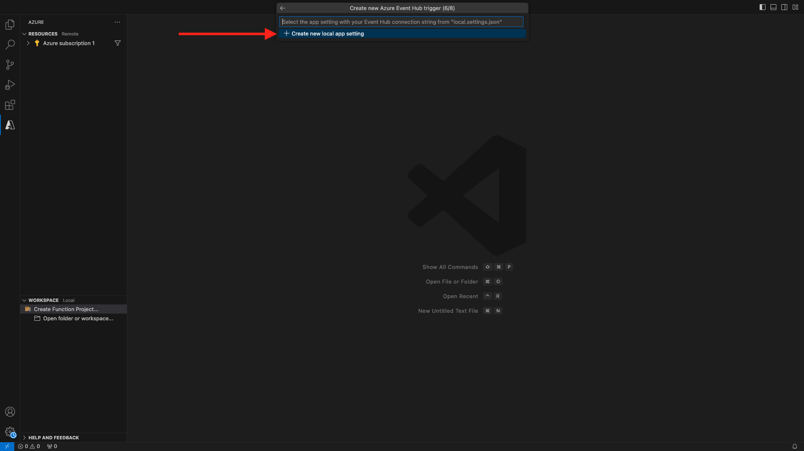
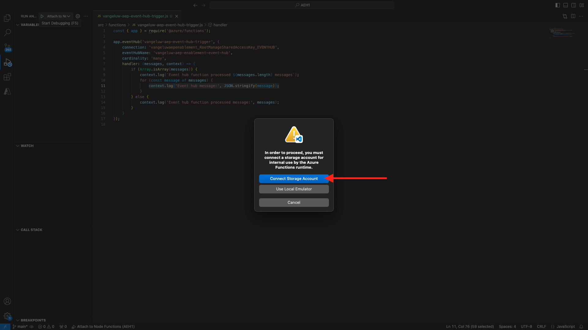

# 2.4.6 Microsoft Azure プロジェクトの作成

## Azure Event Hub 関数の理解

Azure 関数を使用すると、アプリケーションインフラストラクチャを気にすることなく、小さなコード（**functions** と呼ばれます）を実行できます。 Azure Functions を使用すると、クラウドインフラストラクチャは、アプリケーションを大規模に実行するために必要な最新のサーバーをすべて提供します。
関数は、特定のタイプのイベントによって **トリガー** されます。 サポートされるトリガーには、データの変化への対応、メッセージ（Event Hubs など）への対応、スケジュールに従った実行、または HTTP リクエストの結果としての応答が含まれます。
Azure Functions は、インフラストラクチャを明示的にプロビジョニングまたは管理することなく、イベントトリガーコードを実行できる、サーバーレスの計算サービスです。
Azure Event Hubs は、サーバーレス アーキテクチャのために Azure Functions と統合されています。

## Visual Studio Code を開き、Azure にログオンします

Visual Studio Code を使用すると、次のことが簡単になります。
- azure 関数の定義と Event Hubs へのバインド- ローカルでテスト- azure にデプロイ- リモートログ関数の実行

### Visual Studio Code を開きます。

### Azure へのログオン

前の演習で登録に使用した Azure アカウントでログオンすると、Visual Studio Code ですべての Event Hub リソースを検索してバインドできます。
Visual Studio Code を開き、「**Azure**」アイコンをクリックします。
次に、「**Azure にログイン**」を選択します。

ログインするには、ブラウザーにリダイレクトされます。 登録に使用した Azure アカウントを忘れずに選択してください。
ブラウザーに次の画面が表示されたら、Visual Code Studio にログインしています。

Visual Code Studio に戻ります（例：**Azure サブスクリプション 1**）。


## Azure プロジェクトの作成

「**関数プロジェクトを作成…**」をクリックします。

プロジェクトを保存するローカルフォルダーを選択または作成し、「**選択**」をクリックします。

プロジェクト作成ウィザードに入ります。 プロジェクトの言語として **Javascript** をクリックします。

次に、「**モデル v4**」を選択します。

プロジェクトの最初の関数トリガーとして **Azure Event Hub テンプレート** を選択します。

関数の名前を入力し、次の書式 `--aepUserLdap---aep-event-hub-trigger` を使用して Enter キーを押します。

**新しいローカルアプリ設定を作成** を選択します。

クリックして、前の手順で作成した `--aepUserLdap---aep-enablement` という名前のイベント ハブ名前空間を選択します。

次に、前の手順で作成した `--aepUserLdap---aep-enablement-event-hub` という名前のイベント ハブをクリックして選択します。

イベントハブポリシーとして **RootManageSharedAccessKey** をクリックして選択します。

プロジェクトを開く方法については、**ワークスペースに追加** を選択してください。

次のようなメッセージが表示される場合があります。 その場合は、「はい、作成者を信頼します **をクリックし** す。

プロジェクトを作成したら、エディターで `--aepUserLdap---aep-event-hub-trigger.js` ファイルを開きます。

Adobe Experience Platformからイベントハブに送信されるペイロードは次のようになります。

```json
{
  "identityMap": {
    "ecid": [
      {
        "id": "36281682065771928820739672071812090802"
      }
    ]
  },
  "segmentMembership": {
    "ups": {
      "94db5aed-b90e-478d-9637-9b0fad5bba11": {
        "createdAt": 1732129904025,
        "lastQualificationTime": "2024-11-21T07:33:52Z",
        "mappingCreatedAt": 1732130611000,
        "mappingUpdatedAt": 1732130611000,
        "name": "vangeluw - Interest in Plans",
        "status": "realized",
        "updatedAt": 1732129904025
      }
    }
  }
}
```

以下のコードを使用して、Visual Studio Code の `--aepUserLdap---aep-event-hub-trigger.js` のコードを更新します。 このコードは、Real-time CDP がイベントハブ宛先にオーディエンス選定を送信するたびに実行されます。 この例では、コードは受信ペイロードの表示に過ぎませんが、オーディエンスの選定をリアルタイムで処理し、データパイプラインエコシステムの下方で使用するために、あらゆる種類の追加の関数を想像できます。
ファイル `--aepUserLdap---aep-event-hub-trigger.js` の 11 行目には、現在、次の情報が表示されています。

```javascript
context.log('Event hub message:', message);
```

`--aepUserLdap---aep-event-hub-trigger.js` の 11 行目を次のように変更します。

```javascript
context.log('Event hub message:', JSON.stringify(message));
```

合計ペイロードは次のようになります。

```javascript
const { app } = require('@azure/functions');

app.eventHub('--aepUserLdap---aep-event-hub-trigger', {
    connection: '--aepUserLdap--aepenablement_RootManageSharedAccessKey_EVENTHUB',
    eventHubName: '--aepUserLdap---aep-enablement-event-hub',
    cardinality: 'many',
    handler: (messages, context) => {
        if (Array.isArray(messages)) {
            context.log(`Event hub function processed ${messages.length} messages`);
            for (const message of messages) {
                context.log('Event hub message:', message);
            }
        } else {
            context.log('Event hub function processed message:', messages);
        }
    }
});
```


結果は次のようになります。


## Azure プロジェクトの実行

次に、プロジェクトを実行します。 この段階では、プロジェクトを Azure にデプロイしません。 デバッグモードでローカルに実行します。 [ ファイル名を指定して実行 ] アイコンを選択し、緑色の矢印をクリックします。

初めてデバッグモードでプロジェクトを実行する際は、Azure ストレージアカウントを添付し、「**ストレージアカウントを選択**」をクリックする必要があります。

次に、前の手順で作成した `--aepUserLdap--aepstorage` という名前のストレージ アカウントを選択します。

これで、プロジェクトが起動および実行され、イベントハブにイベントがリストされるようになりました。 次の演習では、オーディエンスの資格を得る CitiSignal デモ web サイトで動作を実演します。 その結果、Event Hub トリガー関数のターミナルにオーディエンスの選定ペイロードが届きます。


## Azure プロジェクトを停止

プロジェクトを停止するには、VSC の lenu **コールスタック** に移動し、実行中のプロジェクトの矢印をクリックして **停止** をクリックします。


## 次の手順

[2.4.7 エンドツーエンドのシナリオに移動 ](./ex7.md){target="_blank"}
[Real-Time CDP:Audience ActivationからMicrosoft Azure Event Hub に戻る ](./segment-activation-microsoft-azure-eventhub.md){target="_blank"}
[ すべてのモジュール ](./../../../../overview.md){target="_blank"} に戻る
