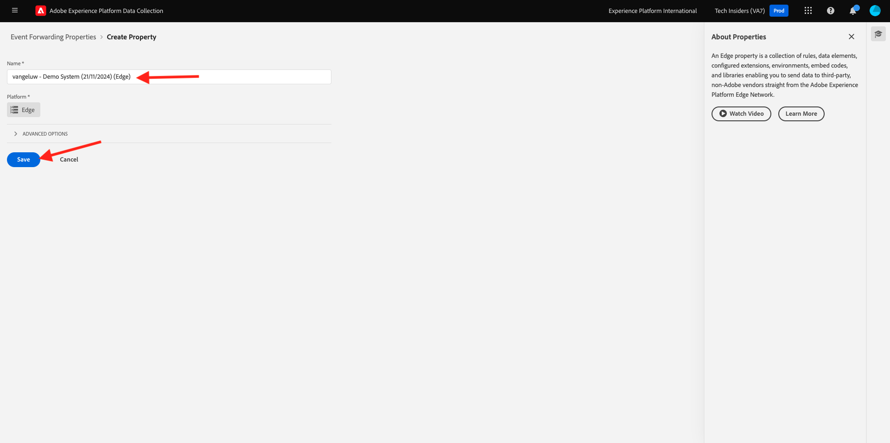
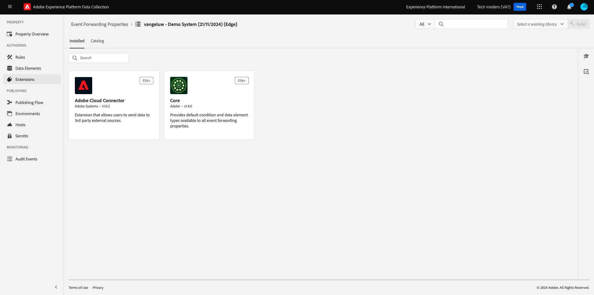

# 2.5.1 Adobe Experience Platform Data Collection Event Forwarding プロパティを作成する

## Adobe Experience Platform データ収集イベント転送プロパティとは何ですか？

通常、Adobe Experience Platform データ収集を使用してデータを収集する場合、データは **クライアントサイド** で収集されます。 **クライアントサイド** は web サイトやモバイルアプリケーションなどの環境です。 「はじめに」と「データ収集」では、Adobe Experience Platform データ収集クライアントプロパティの設定について詳しく説明し、顧客が web サイトやモバイルアプリケーションを操作する際にデータを収集できるように、Adobe Experience Platform データ収集クライアントプロパティを web サイトやモバイルアプリケーションに実装しました。

そのインタラクションデータがAdobe Experience Platform データ収集クライアントプロパティによって収集されると、web サイトまたはモバイルアプリからAdobe Edgeにリクエストが送信されます。 Edgeは、Adobeのデータ収集環境であり、クリックストリームデータをAdobe エコシステムに入力するためのエントリポイントです。 Edgeから収集されたデータは、Adobe Experience Platform、Adobe Analytics、Adobe Audience Manager、Adobe Targetなどのアプリケーションに送信されます。

Adobe Experience Platform Data Collection Event Forwarding プロパティの追加により、Edgeで受信データをリッスンするAdobe Experience Platform Data Collection プロパティを設定できるようになりました。 Edgeで実行中のAdobe Experience Platform Data Collection Event Forwarding プロパティは、受信データを表示すると、そのデータを使用して別の場所に転送できます。 他の場所もAdobe以外の外部 Webhook にできるようになりました。これにより、そのデータを、例えば、任意のデータレイク、決定アプリケーション、または Webhook を開くことができるその他のアプリケーションに送信できます。

Adobe Experience Platform データ収集イベント転送プロパティの設定はクライアントサイドプロパティによく知られていますが、Adobe Experience Platform データ収集クライアントプロパティでデータ要素とルールを以前と同じように設定できます。 ただし、データにアクセスして使用する方法は、使用例によって若干異なります。

まず、Adobe Experience Platform Data Collection Event Forwarding プロパティを作成します。

## Adobe Experience Platform データ収集イベント転送プロパティの作成

[https://experience.adobe.com/#/data-collection/](https://experience.adobe.com/#/data-collection/) に移動します。 左側のメニューで、「**イベント転送**」をクリックします。 次に、使用可能なすべてのAdobe Experience Platform Data Collection Event Forwarding プロパティの概要が表示されます。 「**プロパティを作成**」ボタンをクリックします。

または、他のイベント転送プロパティが既に作成されている場合、UI は少し異なって見えます。 その場合は、「**新規プロパティ**」をクリックします。

Adobe Experience Platform Data Collection Event Forwarding プロパティの名前を入力する必要があります。 命名規則として、`--aepUserLdap-- - Demo System (DD/MM/YYYY) (Edge)` を使用します。 例えば、この例では、名前は **vangeluw - Demo System （22/02/2022） （Edge）** です。 「**保存**」をクリックします。

Adobe Experience Platform Data Collection Event Forwarding プロパティのリストに戻ります。 クリックして、作成したプロパティを開きます。

## Adobe Cloud Connector 拡張機能の設定

左側のメニューで、**拡張機能** に移動します。 **Core** 拡張機能が既に設定されていることがわかります。

**カタログ** に移動します。 他の多くの拡張機能と共に、**Adobe Cloud Connector** 拡張機能が表示されます。 「**インストール**」をクリックして、インストールします。

その後、拡張機能が追加されます。 この手順では、行う設定はありません。 インストールされた拡張機能の概要に戻されます。

## Adobe Experience Platform Data Collection Event Forwarding プロパティのデプロイ

左側のメニューで、**公開フロー** に移動します。 **ライブラリを追加** をクリックします。

名前 **メイン** を入力し、環境 **開発（開発）** を選択して、「**+変更されたすべてのリソースを追加**」をクリックします。

その後、これが表示されます。 「**保存して開発用にビルド**」をクリックします。

その後、ライブラリが構築されます（1～2 分かかる場合があります）。

## 次の手順

[2.5.2 データストリームを更新して、データ収集イベント転送プロパティでデータを使用できるようにするに ](./ex2.md){target="_blank"}

[Real-Time CDP Connections：イベント転送 ](./aep-data-collection-ssf.md){target="_blank"} に戻る

[ すべてのモジュール ](./../../../../overview.md){target="_blank"} に戻る
