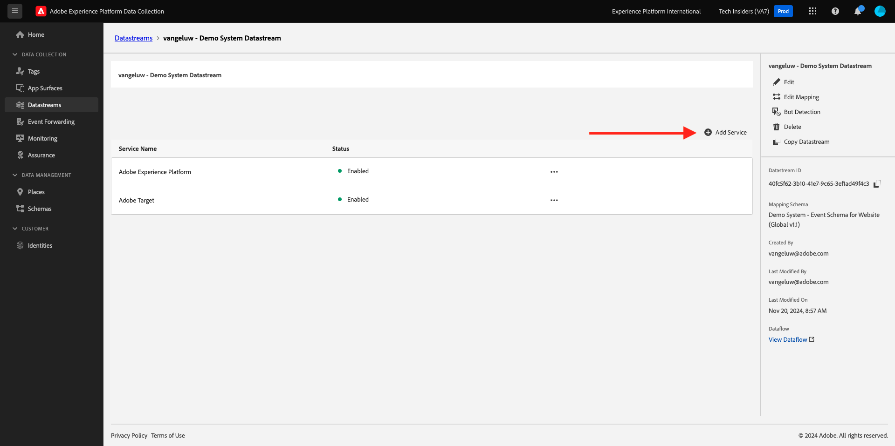

# 2.5.2 Adobe Experience Platform Data Collection Server プロパティでデータを使用できるように、データストリームを更新します。

## データストリームの更新

[ はじめに ](./../../../getting-started/gettingstarted/ex2.md) で、独自の **[!UICONTROL データストリーム]** を作成しました。 その後、`--aepUserLdap-- - Demo System Datastream` という名前を使用しました。

この演習では、**[!UICONTROL データ収集サーバープロパティ]** と連携するように **Datastream** を設定する必要があります。

その場合は、[https://experience.adobe.com/#/data-collection/](https://experience.adobe.com/#/data-collection/) にアクセスしてください。 その後、これが表示されます。 左側のメニューで、「**[!UICONTROL データストリーム]**」をクリックします。

画面の右上隅にあるサンドボックス名を選択します（`--aepSandboxName--` にする必要があります）。

**[!UICONTROL Datastream]** を検索します。名前は `--aepUserLdap-- - Demo System Datastream` です。 **[!UICONTROL データストリーム]** をクリックして開きます。

その後、これが表示されます。 「**[!UICONTROL + サービスを追加]**」をクリックします。

サービス **イベント転送** を選択します。 これにより、2 つの追加設定が表示されます。 前の演習で作成し、`--aepUserLdap-- - Demo System (DD/MM/YYYY) (Edge)` という名前のイベント転送プロパティを選択します。 次に、「環境 **の下の** 開発 **を選択し** す。 「**保存**」をクリックします。

これでデータストリームが更新され、使用する準備が整いました。

これで、データストリームが **[!DNL Event Forwarding property]** で動作する準備ができました。

## 次の手順

[2.5.3 カスタム Webhook の作成と設定に移動し ](./ex3.md){target="_blank"} す。

[Real-Time CDP Connections：イベント転送 ](./aep-data-collection-ssf.md){target="_blank"} に戻る

[ すべてのモジュール ](./../../../../overview.md){target="_blank"} に戻る
