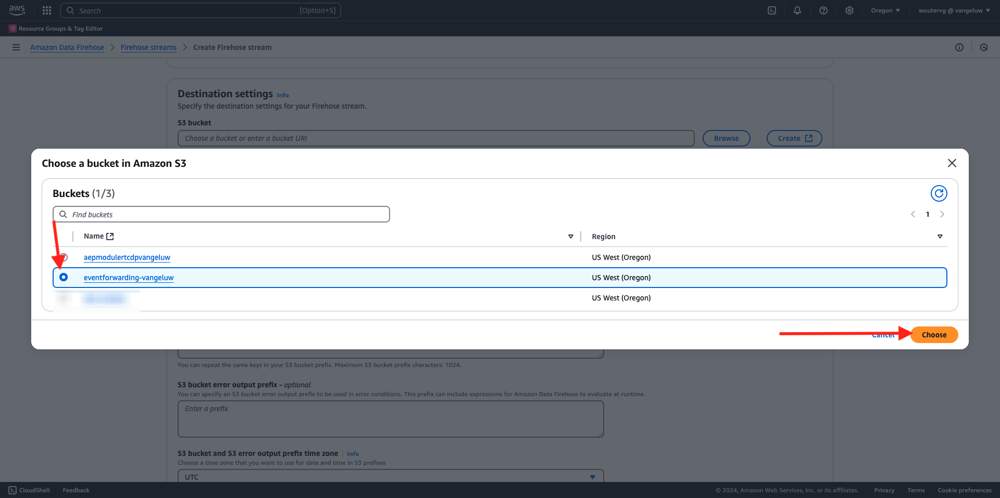
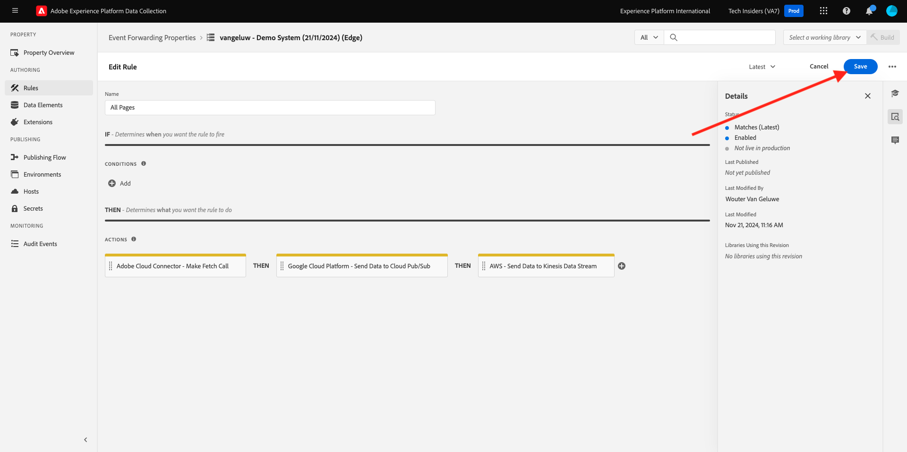
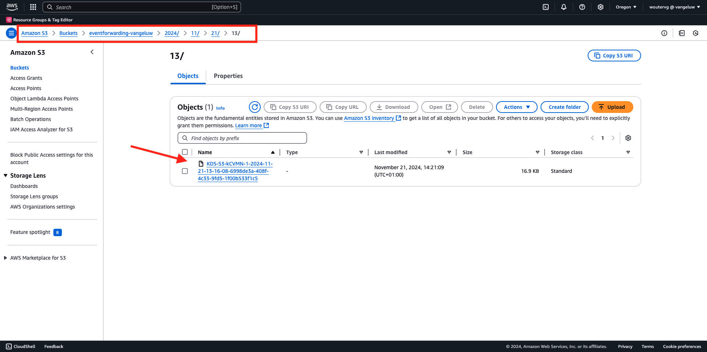

# 2.5.5 AWS Kinesis およびAWS S3 へのフォワードイベント

>[!IMPORTANT]
>
>この演習の完了は任意で、AWS Kinesis を使用するためのコストがかかります。 AWSには無料利用枠アカウントがあり、コストをかけずに多くのサービスをテストおよび設定できますが、AWS Kinesis は無料利用枠アカウントに含まれていません。 そのため、この演習を実装およびテストするには、AWS Kinesis を使用するためのコストがかかります。

## 知っておいて良い

Adobe Experience Platformは、様々なAmazon サービスを宛先としてサポートしています。
Kinesis と S3 はどちらも [&#x200B; プロファイル書き出し先 &#x200B;](https://experienceleague.adobe.com/docs/experience-platform/destinations/destination-types.html?lang=ja) であり、Adobe Experience PlatformのReal-Time CDPの一部として使用できます。
価値の高いセグメントイベントや関連するプロファイル属性を、選択したシステムに簡単にフィードできます。

この演習では、独自のAmazon Kinesis ストリームを設定して、Adobe Experience Platform Edge エコシステムから得られたイベントデータをAmazon S3 などのクラウドストレージ宛先にストリーミングする方法について説明します。 これは、web およびモバイルプロパティからエクスペリエンスイベントを収集し、分析と運用レポートのためにデータレイクにプッシュする場合に便利です。 データレイクは通常、大規模な毎日のファイルインポートでバッチ方式でデータを取り込み、イベント転送と組み合わせて使用できるパブリック http エンドポイントを公開しません。

上記のユースケースをサポートするには、ストリーミングデータをファイルに書き込む前にバッファリングするかキューに配置する必要があります。 複数のプロセスにまたがる書き込みアクセスでは、ファイルを開かないように注意する必要があります。 このタスクを専用システムに委任することは、優れたレベルのサービスを確保しながら適切に拡張するのに最適です。ここで Kinesis が役に立ちます。

Amazon Kinesis データストリームは、データストリームの取り込みと保存に重点を置いています。 Kinesis Data Firehose は、S3 バケットなど、選択した宛先へのデータストリームの配信に重点を置いています。

この演習の一部として、次の操作を行います。

- Kinesis データ ストリームの基本設定を実行する
- Firehose 配信ストリームを作成し、S3 バケットを宛先として使用
- Amazon API ゲートウェイを REST API エンドポイントとして設定して、イベントデータを受け取ります
- Adobe Edgeから Kinesis ストリームに生のイベントデータを転送する

## AWS S3 バケットの設定

[https://console.aws.amazon.com](https://console.aws.amazon.com) に移動し、Amazon アカウントでログインします。

ログインすると、**AWS Management Console** にリダイレクトされます。

**サービスを検索** メニューで、**s3** を検索します。 最初の検索結果「**S3 - Scalable Storage in the Cloud**」をクリックします。

**Amazon S3** ホームページが表示されます。 **バケットを作成** をクリックします。

**バケットを作成** 画面では、次の 2 つを設定する必要があります。

- 名前：名前 `eventforwarding---aepUserLdap--` を使用します。

他のすべてのデフォルト設定はそのままにしておきます。 下にスクロールして、**バケットを作成** をクリックします。

その後、バケットが作成され、Amazon S3 のホームページにリダイレクトされます。

## AWS Kinesis データストリームの設定

**サービスを検索** メニューで **kinesis** を検索します。 最初の検索結果 **Kinesis - リアルタイムストリーミングデータの操作** をクリックします。

**Kinesis データストリーム** を選択します。 **データストリームを作成** をクリックします。

**データストリーム名** には、`--aepUserLdap---datastream` を使用します。

その他の設定を変更する必要はありません。 下にスクロールして、「**データストリームを作成**」をクリックします。

その後、これが表示されます。 データストリームが正常に作成されたら、次の演習に進むことができます。

## AWS Firehose 配信ストリームを設定

**サービスを検索** メニューで **kinesis** を検索します。 **Kinesis Data Firehose** をクリックします。

**Firehose ストリームを作成** をクリックします。

**Source&rbrace; の場合は** 2&rbrace;Amazon Kinesis データストリーム **を選択します。**&#x200B;**宛先** については、**Amazon S3** を選択します。 **参照** をクリックして、データストリームを選択します。

データストリームを選択します。 **選択** をクリックします。

その後、これが表示されます。 **Firehose ストリーム名** は、後で必要になるので覚えておいてください。

**宛先設定** が表示されるまで下にスクロールします。 **参照** をクリックして、S3 バケットを選択します。

S3 バケットを選択して、「**選択**」をクリックします。

次のようなメッセージが表示されます。 次の設定を更新します。

- 新しい行区切り：を **有効** に設定
- 動的パーティション化：に設定 **無効**

もう少し下にスクロールして、**Firehose ストリームを作成** をクリックします

数分後、Firehose ストリームが作成され、**アクティブ** になります。

## IAM ユーザーの作成

左側のAWS IAM メニューで、**ユーザー** をクリックします。 その後、**ユーザー** 画面が表示されます。 **ユーザーを作成** をクリックします。

次に、ユーザーを設定します。

- ユーザー名：使用 `--aepUserLdap--_kinesis_forwarding`

「**次へ**」をクリックします。

その後、この権限画面が表示されます。 「**ポリシーを直接添付**」をクリックします。

検索語句 **kinesisfirehose** を入力すると、関連するすべてのポリシーが表示されます。 ポリシー **AmazonKinesisFirehoseFullAccess** を選択します。 下にスクロールして、「**次へ**」をクリックします。

設定を確認します。 **ユーザーを作成** をクリックします。

その後、これが表示されます。 **ユーザーを表示** をクリックします。

**権限を追加** をクリックし、**インラインポリシーを作成** をクリックします。

その後、これが表示されます。 サービス **Kinesis** を選択します。

「**Write**」に移動し、「**PutRecord**」のチェックボックスをオンにします。

**リソース** までスクロールし、「**すべて**」を選択します。 「**次へ**」をクリックします。

**Kinesis_PutRecord** という名前をポリシーに付け、「**ポリシーを作成**」をクリックします。

その後、これが表示されます。 **セキュリティ認証情報** をクリックします。

**アクセスキーを作成** をクリックします。

**AWS以外で実行中のアプリケーション** を選択します。 下にスクロールして、「**次へ**」をクリックします。

**アクセスキーを作成** をクリックします

その後、これが表示されます。 「**表示**」をクリックして、秘密アクセスキーを表示します。

**秘密アクセスキー** を表示しています。

>[!IMPORTANT]
>
>コンピューターのテキストファイルに資格情報を保存します。
>
> - アクセスキー ID : ...
> - 秘密アクセスキー：...
>
> 「完了 **をクリックすると** 資格情報が再び表示されなくなります。

「**完了**」をクリックします。

これで、適切な権限を持つ IAM ユーザーが正常に作成されました。このユーザーは、イベント転送プロパティでAWS拡張機能を設定する際に指定する必要があります。

## イベント転送プロパティの更新：拡張機能

秘密鍵とデータ要素が設定されたので、イベント転送プロパティでGoogle Cloud Platform の拡張機能を設定できるようになりました。

[https://experience.adobe.com/#/data-collection/](https://experience.adobe.com/#/data-collection/) に移動し、**イベント転送** に移動して、イベント転送プロパティを開きます。

次に、**拡張機能**、**カタログ** に移動します。 **AWS** 拡張機能をクリックし、「**インストール**」をクリックします。

前の演習で生成した IAM ユーザー資格情報を入力します。 「**保存**」をクリックします。

次に、イベントデータの Kinesis への転送を開始するルールを設定する必要があります。

## イベント転送プロパティの更新：ルール

左側のメニューで、「ルール **に移動** ます。 クリックして、前の演習の 1 つで作成したルール **すべてのページ** を開きます。

その後、これが表示されます。 **+** アイコンをクリックして、新しいアクションを追加します。

その後、これが表示されます。 次の選択を行います。

- **拡張機能** を選択：**AWS**
- **アクションタイプ**: **Kinesis データストリームにデータを送信** を選択します。
- 名前：**AWS - Kinesis データストリームにデータを送信**

次の情報が表示されます。

次に、以下を設定します。

- ストリーム名：`--aepUserLdap---datastream`
- AWS リージョン：AWS データストリーム設定でリージョンを確認します
- パーティション キー：**0**

AWSの地域は、次の場所で確認できます。

これで、このが得られます。 次に、「**データ** フィールドのデータ要素アイコンをクリックします。

**XDM イベント** を選択し、「**選択**」をクリックします。

これで完了です。 「**変更を保存**」をクリックします。

その後、これが表示されます。 「**保存**」をクリックします。

**公開フロー** に移動して、変更を公開します。
**メイン** をクリックして、開発ライブラリを開きます。

「**変更されたすべてのリソースを追加**」ボタンをクリックすると、ルールとデータ要素の変更がこのライブラリに表示されます。 次に、「開発用に保存してビルド **をクリックします**。 変更をデプロイしています。

数分後、デプロイメントが完了し、テストする準備が整ったことが表示されます。

## 設定のテスト

[https://dsn.adobe.com](https://dsn.adobe.com) に移動します。 Adobe IDでログインすると、このが表示されます。 Web サイトプロジェクトで「。..**」** いう 3 つのドットをクリックし、「**実行**」をクリックして開きます。

その後、デモ Web サイトが開きます。 URL を選択してクリップボードにコピーします。

新しい匿名ブラウザーウィンドウを開きます。

前の手順でコピーしたデモ Web サイトの URL を貼り付けます。 その後、Adobe IDを使用してログインするように求められます。

アカウントタイプを選択し、ログインプロセスを完了します。

次に、匿名ブラウザーウィンドウに web サイトが読み込まれます。 演習ごとに、新しい匿名ブラウザーウィンドウを使用して、デモ Web サイトの URL を読み込む必要があります。

ビューを **AWS** に切り替えます。 データストリームを開いて「**監視**」タブに移動すると、受信トラフィックが表示されます。

Data Firehose ストリームを開いて「**モニタリング**」タブに移動すると、受信トラフィックも表示されます。

最後に、S3 バケットを見ると、データ取り込みの結果として、そこにファイルが作成されていることがわかります。

そのようなファイルをダウンロードし、テキストエディターを使用して開くと、転送されたイベントの XDM ペイロードが含まれていることがわかります。

>[!IMPORTANT]
>
>設定が期待どおりに動作したら、AWS Kinesis データストリームと Data Firehose をオフにして、料金が発生するのを避けてください。

## 次の手順

[&#x200B; 概要とメリット &#x200B;](./summary.md){target="_blank"} に移動します。

[Real-Time CDP Connections：イベント転送 &#x200B;](./aep-data-collection-ssf.md){target="_blank"} に戻る

[&#x200B; すべてのモジュール &#x200B;](./../../../../overview.md){target="_blank"} に戻る
