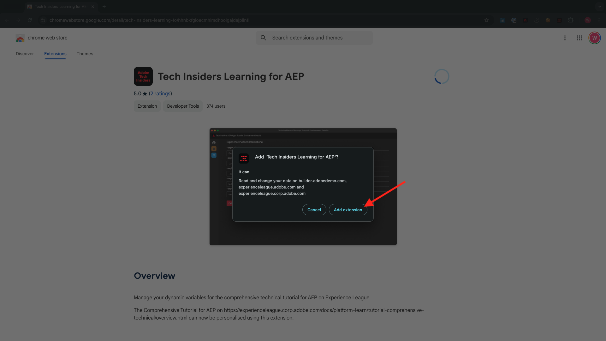
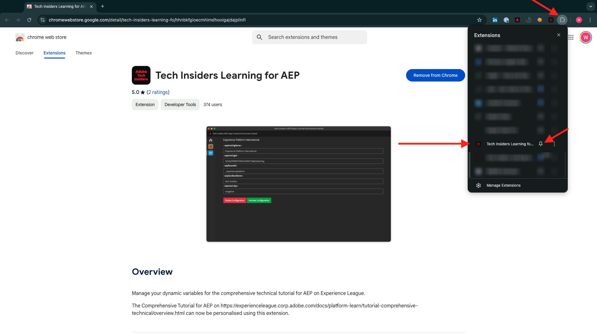

# Experience League ドキュメント用のChrome拡張機能のインストール

## Chrome拡張機能について

このチュートリアルは、任意のAdobe Experience Cloud インスタンスを使用して、誰でも簡単に再利用できるように、汎用的に作成されています。

ドキュメントを再利用できるようにするために、チュートリアルに&#x200B;**環境変数**&#x200B;が導入されました。これは、ドキュメントに以下の&#x200B;**プレースホルダー**&#x200B;が含まれていることを意味します。 各プレースホルダーは特定の環境の固有の変数です。Chrome拡張機能は、その変数を変更して、チュートリアルページからコードとテキストをコピーし、チュートリアルの一部として使用するさまざまなユーザーインターフェイスに簡単に貼り付けられるようにします。

そのような値の例は以下にあります。 現在、これらの値はまだ使用できませんが、Chrome拡張機能をインストールしてアクティベートすると、これらの変数が通常のテキストに変わり、コピーして再利用できるようになります。

| 名前 | キー | 例 |
|:-------------:| :---------------:| :---------------:|
| IMS Org ID | `--aepImsOrgId--` | `907075E95BF479EC0A495C73@AdobeOrg` |
| IMS組織名 | `--aepImsOrgName--` | `Adobe Tech Insiders` |
| AEP テナント ID | `--aepTenantId--` | `_experienceplatform` |
| AEP サンドボックス名 | `--aepSandboxName--` | `one-adobe` |
| Learner Profile LDAP | `--aepUserLdap--` | `vangeluw` |

例えば、以下のスクリーンショットでは、`aepImsOrgName`への参照を確認できます。

拡張機能がインストールされると、インスタンス固有の値を反映するために、同じテキストが自動的に変更されます。

## Chrome拡張機能のインストール

そのChrome拡張機能をインストールするには、Chrome ブラウザーを開き、[https://chromewebstore.google.com/detail/tech-insiders-learning-fo/hhnbkfgioecmhimdhooigajdajplinfi](https://chromewebstore.google.com/detail/tech-insiders-learning-fo/hhnbkfgioecmhimdhooigajdajplinfi){target="_blank"}に移動します。 その後、これが表示されます。

「**Chromeに追加**」をクリックします。

その後、これが表示されます。 「**拡張機能を追加**」をクリックします。

拡張機能がインストールされ、同様の通知が表示されます。

**拡張機能** メニューで、**パズルピース** アイコンをクリックし、拡張機能メニューに&#x200B;**プラットフォーム学習 – Configuration**&#x200B;拡張機能を固定します。

## Chrome拡張機能の設定

[https://experienceleague.adobe.com/en/docs/platform-learn/tutorial-comprehensive-technical/overview](https://experienceleague.adobe.com/en/docs/platform-learn/tutorial-comprehensive-technical/overview){target="_blank"}に移動し、拡張機能アイコンをクリックして開きます。

その後、このポップアップが表示されます。 **+** アイコンをクリックします。

以下に示す値を入力します。これらはすべてAdobe Experience Platform インスタンスに関連しています。

以下のいずれかのイベントに参加する場合は、以下の値を示すように使用してください。

| 名前 | パートナーTech Labs New Orleans | Tech Insiders対面ワークショップ | Tech Insiders On-Demand Enablement |
|:-------------:| :---------------:| :---------------:|:---------------:|
| IMS Org ID | `907075E95BF479EC0A495C73@AdobeOrg` | `907075E95BF479EC0A495C73@AdobeOrg` | `0B6930256441790E0A495FFE@AdobeOrg` |
| IMS組織名 | `Adobe Tech Insiders` | `Adobe Tech Insiders` | `CXO Enablement Training LAB` |
| AEP テナント ID | `_experienceplatform` | `_experienceplatform` | `_acsultimatesupport` |
| AEP サンドボックス名 | `one-adobe` | `one-adobe` | `one-adobe` |
| Learner Profile LDAP | `XXX` | `XXX` | `XXX` |

**学習者プロファイル LDAP**

これは、チュートリアルの一部として使用されるユーザー名です。 この例では、LDAPはこのユーザーのメールアドレスに基づいています。 メールアドレスが&#x200B;**vangeluw@adobe.com**&#x200B;の場合、LDAPは&#x200B;**vangeluw**&#x200B;になります。

ニューオーリンズのPartner Tech Labs イベントに参加する場合は、同じロジックを適用し、メールアドレスの最初の部分をLDAPとして使用してください。

LDAPは、設定がリンクされ、使用しているインスタンスやサンドボックスを使用している他のユーザーと競合しないように使用されます。

あなたの価値観は、これらと似ているはずです。
最後に、**新規作成**&#x200B;をクリックします。

拡張機能の左側のメニューに、環境のイニシャルを含む新しいアイコンが表示されます。 クリックします。 次に、**環境変数**&#x200B;と特定のAdobe Experience Platform インスタンス値とのマッピングが表示されます。 「**構成をアクティブ化**」をクリックします。

設定をアクティベートすると、環境のイニシャルの横に緑のドットが表示されます。 つまり、環境はアクティブになっています。

## チュートリアルコンテンツを確認

テストとして、[このページ &#x200B;](https://experienceleague.adobe.com/en/docs/platform-learn/tutorial-one-adobe/agents/agents1/ex1){target="_blank"}に移動します。

これで、このページのすべての&#x200B;**環境変数**&#x200B;が、chrome拡張機能でアクティブ化された環境に基づいて、真の値に置き換えられたことがわかります。

環境変数`aepSandboxName`が実際のAEP サンドボックス名に置き換えられました。この場合は&#x200B;**one-adobe**&#x200B;です。

## 次の手順

[&#x200B; インストールするアプリケーション &#x200B;](./ex2.md){target="_blank"}に移動

[はじめに – エージェンティック AI](./getting-started-agentic-ai.md){target="_blank"}に戻る

[すべてのモジュール &#x200B;](./../../../overview.md){target="_blank"}に戻る
