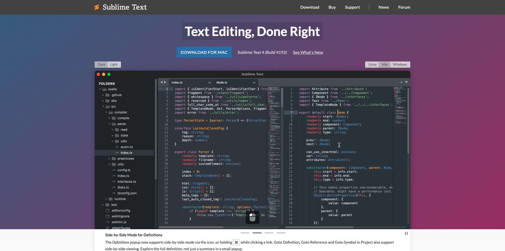
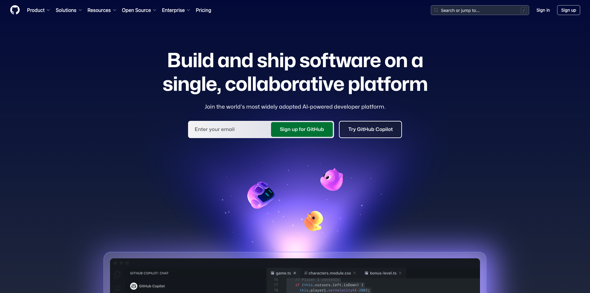

# インストールするアプリケーション

以下は、チュートリアルを開始する前にコンピューターにインストールする必要があるアプリケーションの概要です。

## Adobe Creative Cloud

[https://creativecloud.adobe.com/apps/download/creative-cloud](https://creativecloud.adobe.com/apps/download/creative-cloud){target="_blank"}に移動し、**Creative Cloudのダウンロード**&#x200B;をクリックします。

## Adobe Photoshop

**Adobe Creative Cloud** アプリを開き、**アプリ**&#x200B;に移動します。 コンピューターにPhotoshopをインストールします。

## Visual Studio Code

[https://code.visualstudio.com/](https://code.visualstudio.com/){target="_blank"}に移動し、**Visual Studio Code**&#x200B;をダウンロードしてインストールします。

## テキストエディター

テキストエディターアプリをお持ちでない場合は、[https://www.sublimetext.com/](https://www.sublimetext.com/){target="_blank"}にアクセスして、このテキストエディターをダウンロードしてインストールできます。

## GitHub アカウント

まだGitHub アカウントをお持ちでない場合は、[https://github.com/](https://github.com/){target="_blank"}に移動し、**新規登録**&#x200B;をクリックしてください。 個人のメールアドレスを使用し、アカウントを作成します。

## GitHub Desktop

[https://desktop.github.com/download/](https://desktop.github.com/download/){target="_blank"}に移動し、**Github Desktop**&#x200B;をダウンロードしてインストールします。

これで、「はじめに」モジュールが終了しました。

## 次の手順

[AEM Web サイトとAEP サンドボックスを使用](./ex3.md){target="_blank"}に移動します

[はじめに – エージェンティック AI](./getting-started-agentic-ai.md){target="_blank"}に戻る

[すべてのモジュール &#x200B;](./../../../overview.md){target="_blank"}./imagesに戻る
