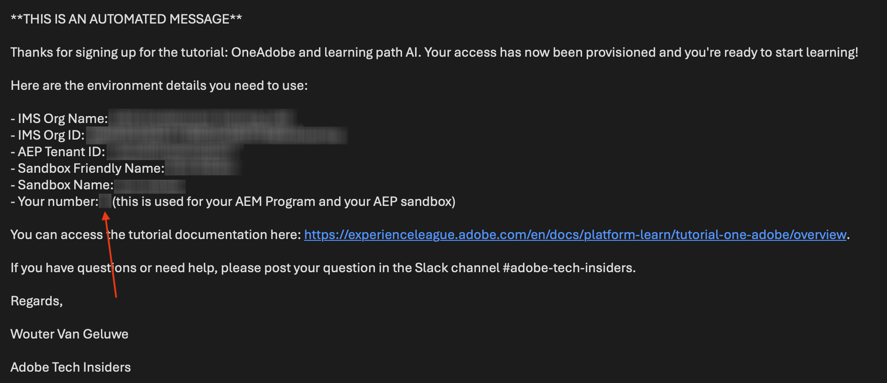
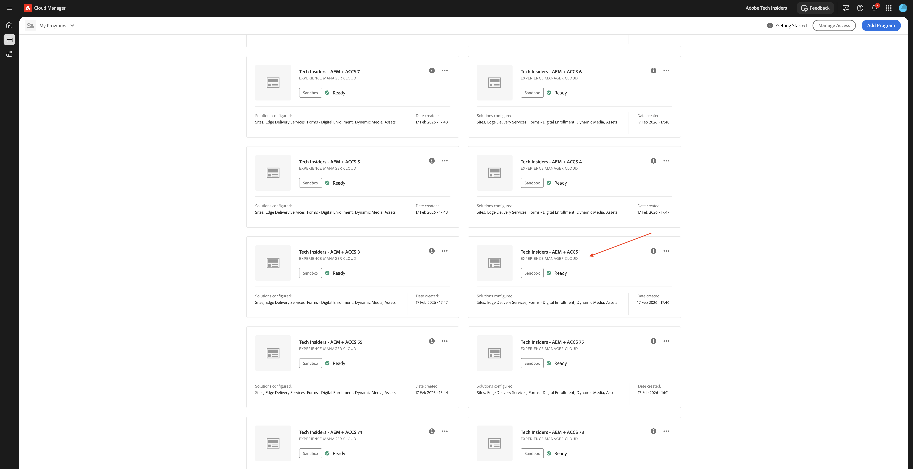
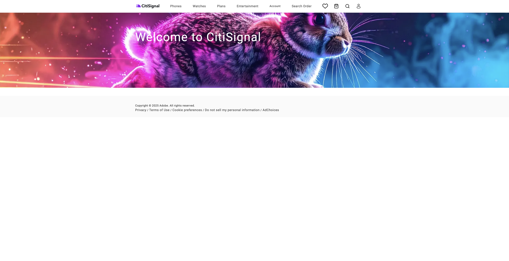

# AEMのweb サイトとAEPサンドボックスの使用

Agentic AI Tech Labsを利用する場合は、Edge Delivery Servicesを使用した既存のAEM as a Cloud Service プログラムを利用することになります。 このEdge Delivery Servicesを使用したAEM as a Cloud Service プログラムは作成されており、Tech Labsの開始時に既に利用できます。

## あなたの番号

イネーブルメント環境にアクセスすると、番号が割り当てられました。 この数値は、使用する必要があるAEM as a Cloud Service プログラムを示し、Brand Concierge Tech Labに使用する必要があるAEP サンドボックスも示します。

>[!IMPORTANT]
>
>このメールをまだ受信していない場合、以下の手順はまだ実行できません。 以下のAdobe アプリケーションにアクセスする前に、以下のメールが届くまで待つ必要があります。

## AEM プログラム

>[!NOTE]
>
>以下のスクリーンショットはすべて、図1のみを使用しています。 以下の手順を実行する際に、受信したメールの一部として割り当てられた番号を使用する必要があります。

AEM プログラムでは、名前で割り当てられた番号が使用されます。 AEM プログラムの名前は次のとおりです。

- **Tech Insiders - AEM + ACCS X** （Xは、割り当てられた番号を表します）。

[https://experience.adobe.com/cloud-manager/landing.html](https://experience.adobe.com/cloud-manager/landing.html)にアクセスして、AEM プログラムを検索できます。 選択した環境が&#x200B;**`--aepImsOrgName--`**&#x200B;であることを確認してください。画面の右上隅で確認できます。

### AEM プログラムの休止解除

使用されるAEM プログラムは「サンドボックス」プログラムです。 AEM サンドボックスは、数時間使用されないと自動的に休止状態になります。つまり、サンドボックスを使用する前に、休止状態を解除する必要があります。 プログラムの休止を解除するには、[https://experience.adobe.com/cloud-manager/landing.html](https://experience.adobe.com/cloud-manager/landing.html)に移動します。 クリックしてプログラムを開きます。

そうすると、これが表示されます。 3つのドット **...**&#x200B;をクリックし、**休止解除**&#x200B;を選択します。

「**送信**」をクリックします。 休止解除には10～15分かかります。

### AEMプログラムのGitHub リポジトリ

各AEM プログラムは、Edge Delivery Servicesを使用してweb サイトをデプロイします。 つまり、web サイトのコードはGitHub リポジトリでホストされています。 GitHub リポジトリが作成され、次の場所にアクセスできます。

**https://github.com/woutervangeluwe/techinsidersX-citisignal-aem-accs**。Xを自分の番号で置き換える必要があります。

GitHubのリポジトリは次のようになります。

Tech Lab セッションを開始する前のオンボーディングプロセスの一環として、GitHub ユーザー名を入力するよう求められます。 GitHub ユーザー名を指定すると、Web サイトに添付されているGitHub リポジトリに共同作業者として追加され、変更を加えることができます。

### web サイトへのアクセス

Web サイトにアクセスするには、次のデフォルト URLを使用できます。

- **https://main--techinsidersX-citisignal-aem-accs--woutervangeluwe.aem.page/**
- **https://main--techinsidersX-citisignal-aem-accs--woutervangeluwe.aem.live/**

これらのURLのXを、割り当てられた番号で置き換える必要があります。

さらに、web サイトごとにカスタムドメイン名が作成され、次のURLを使用してアクセスできます。

- **https://techinsidersX.adobedemosystem.com/**

これらのURLのXを、割り当てられた番号で置き換える必要があります。

これで、次のようなweb サイトが表示されます。

## AEP サンドボックス

>[!NOTE]
>
>以下のスクリーンショットはすべて、図1のみを使用しています。 以下の手順を実行する際に、受信したメールの一部として割り当てられた番号を使用する必要があります。

Brand Concierge Tech Labの場合は、AEP サンドボックスを使用する必要があります。 このAEP サンドボックスには&#x200B;**techinsidersX**&#x200B;という名前が付けられているため、Xを割り当てられた番号に置き換える必要があります。

[https://platform.adobe.com](https://platform.adobe.com)に移動します。 画面の右上隅にあるドロップダウンを開いて、サンドボックスを選択します。

このサンドボックスは、Brand Concierge Tech Labでのみ使用できます。

## 次の手順

[はじめに – エージェンティック AI](./getting-started-agentic-ai.md){target="_blank"}に戻る

[すべてのモジュール ](./../../../overview.md){target="_blank"}./imagesに戻る
