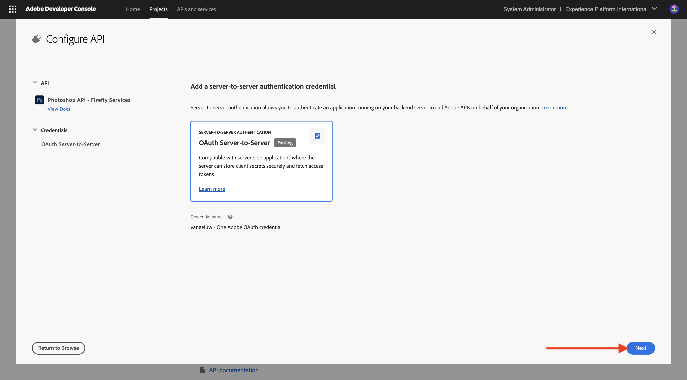
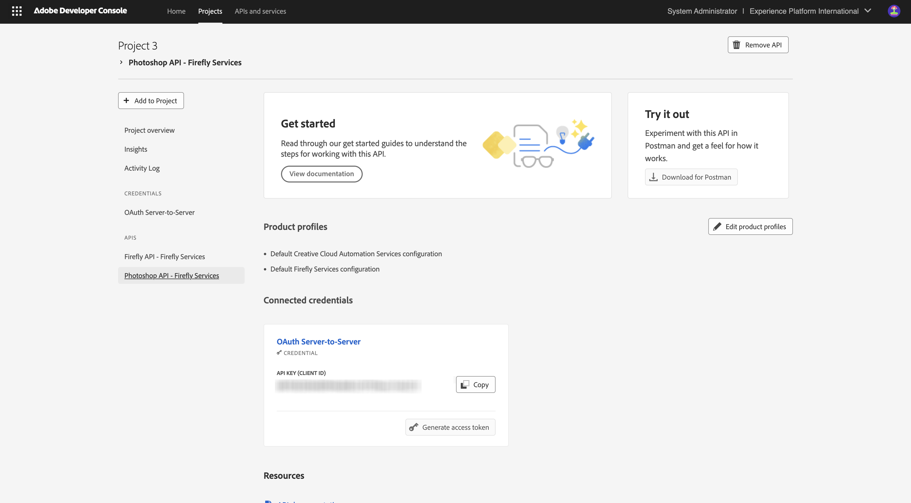
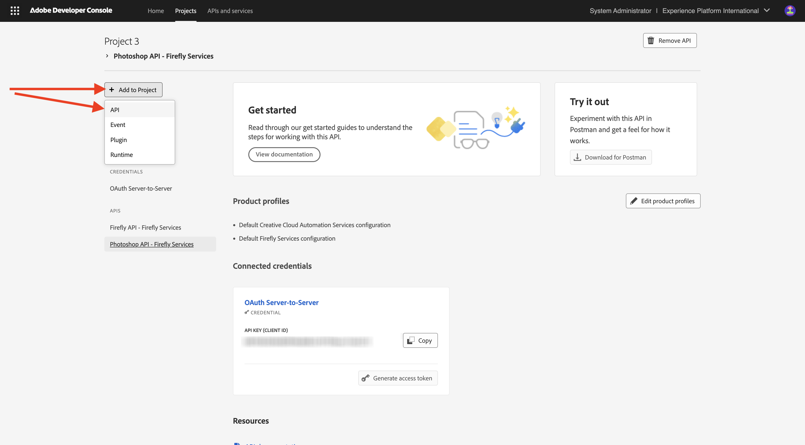
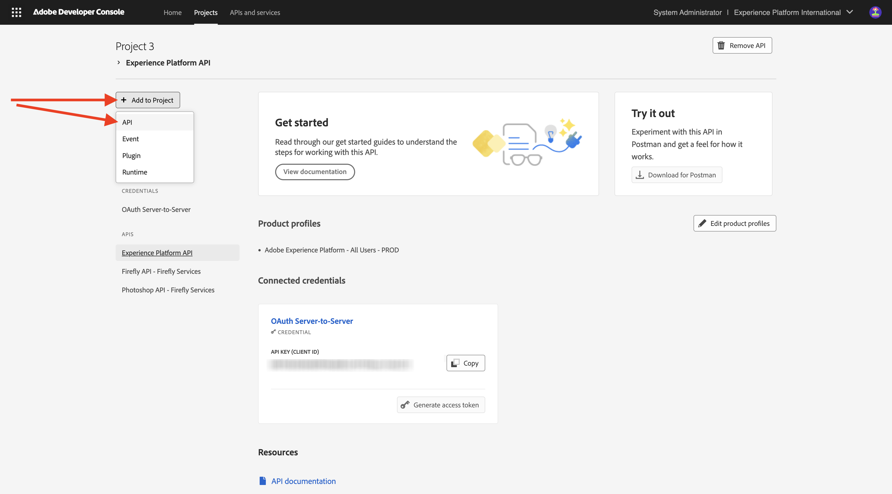
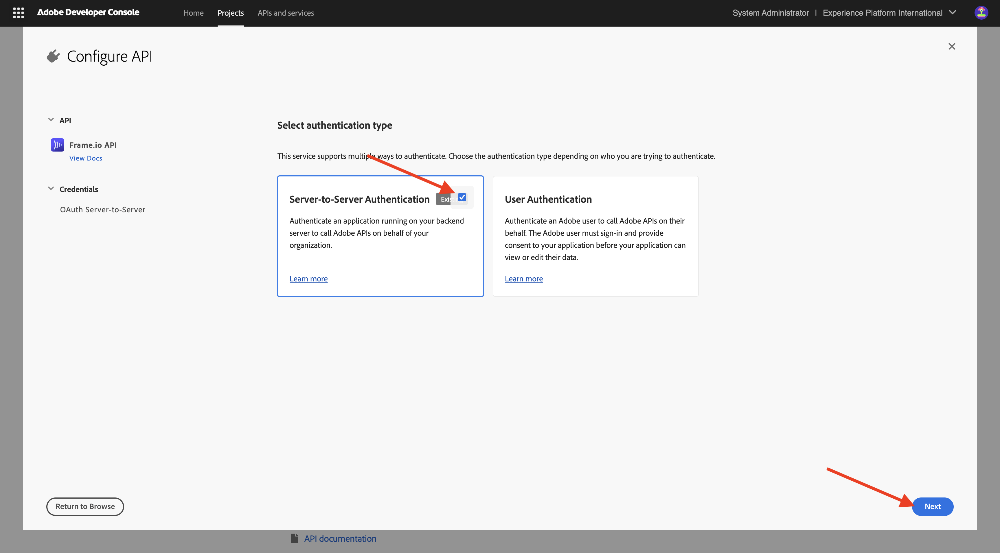
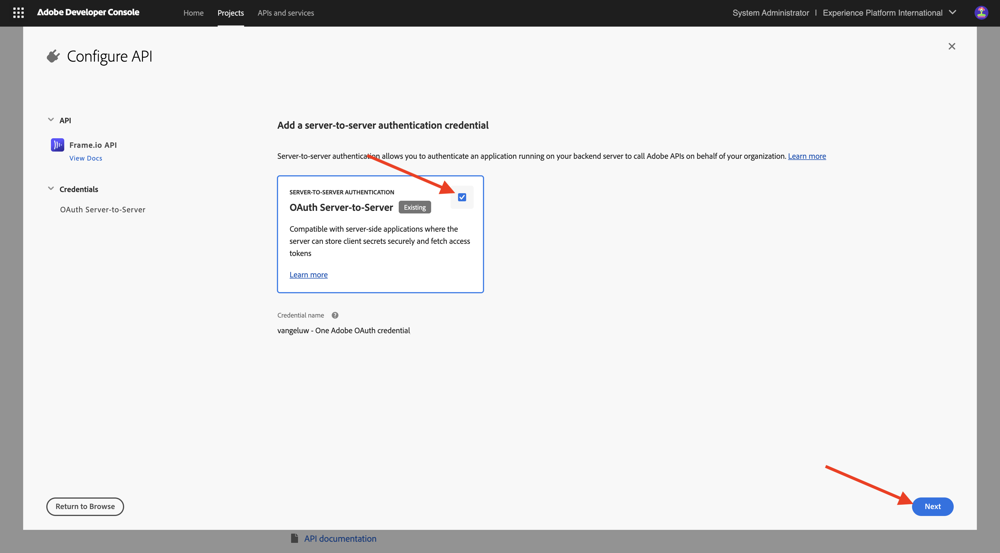
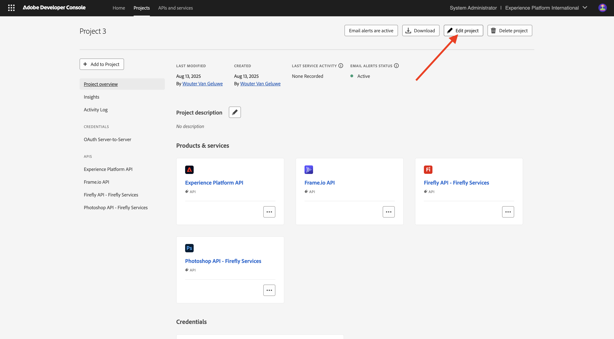
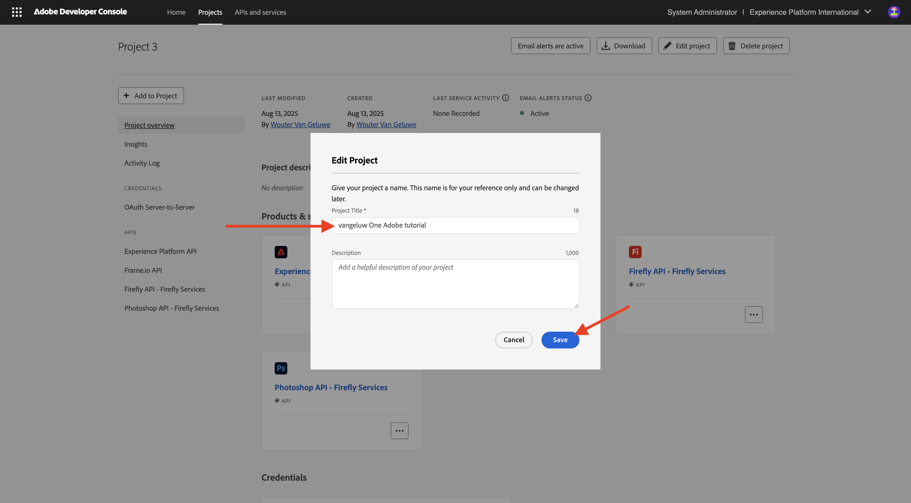

# Adobe I/O プロジェクトの設定

## ビデオ

このビデオでは、この演習に関連するすべての手順の説明とデモを行います。

>[!VIDEO](https://video.tv.adobe.com/v/3476494?quality=12&learn=on)

## Adobe I/O プロジェクトの作成

この演習では、Adobe I/Oを使用して、さまざまなAdobe エンドポイントをクエリします。 Adobe I/Oを設定するには、次の手順に従います。

[https://developer.adobe.com/console/home](https://developer.adobe.com/console/home){target="_blank"}に移動します。

画面の右上隅にある正しいインスタンスを選択してください。 インスタンスは`--aepImsOrgName--`です。

>[!NOTE]
>
> 以下のスクリーンショットは、特定の組織が選択されていることを示しています。 このチュートリアルを進める場合、組織の名前が異なる可能性が非常に高くなります。 このチュートリアルにサインアップすると、使用する環境の詳細が表示されるので、その手順に従ってください。

次に、**新しいプロジェクトを作成**&#x200B;を選択します。

### FIREFLY SERVICES API

>[!IMPORTANT]
>
>選択した学習パスによっては、Firefly Services APIにアクセスできない場合があります。 Firefly Services APIにアクセスできるのは、学習パス **Firefly**、**Workfront Fusion**、**ALL**&#x200B;に参加している場合、または&#x200B;**ライブの対面ワークショップ**&#x200B;に参加している場合のみです。 これらの学習パスに参加していない場合は、このステップをスキップしてください。

そうすると、これが表示されます。 「**+ プロジェクトに追加**」、「**API**」の順に選択します。

**Adobe Firefly Services**&#x200B;を選択し、**Firefly - Firefly Services**&#x200B;を選択してから、**次へ**&#x200B;を選択します。

資格情報の名前を指定します：`--aepUserLdap-- - One Adobe OAuth credential`。**次へ**&#x200B;を選択します。

既定のプロファイル **既定のFirefly Services Configuration**&#x200B;を選択し、**設定されたAPIを保存**&#x200B;を選択します。

そうすると、これが表示されます。

### PHOTOSHOP SERVICES API

>[!IMPORTANT]
>
>選択した学習パスによっては、Photoshop Services APIにアクセスできない場合があります。 Photoshop Services APIにアクセスできるのは、学習パス **Firefly**、**Workfront Fusion**、**ALL**&#x200B;に参加している場合、または&#x200B;**ライブの対面ワークショップ**&#x200B;に参加している場合のみです。 これらの学習パスに参加していない場合は、このステップをスキップしてください。
>
>「**+ プロジェクトに追加**」を選択し、「**API**」を選択します。

**Adobe Firefly Services**&#x200B;を選択し、**Photoshop - Firefly Services**&#x200B;を選択します。 「**次へ**」を選択します。

「**次へ**」を選択します。

次に、この統合で使用できる権限を定義する製品プロファイルを選択する必要があります。

**デフォルトのFirefly Services設定**&#x200B;と&#x200B;**デフォルトのCreative Cloud Automation Services設定**&#x200B;を選択します。

**設定したAPIを保存**&#x200B;を選択します。

そうすると、これが表示されます。

### ADOBE EXPERIENCE PLATFORM API

>[!IMPORTANT]
>
>選択した学習パスによっては、Adobe Experience Platform APIにアクセスできない場合があります。 Adobe Experience Platform APIにアクセスできるのは、学習パス **AEP + Apps**、**ALL**&#x200B;に参加している場合、または&#x200B;**ライブの対面ワークショップ**&#x200B;に参加している場合のみです。 これらの学習パスに参加していない場合は、このステップをスキップしてください。

「**+ プロジェクトに追加**」を選択し、「**API**」を選択します。

**Adobe Experience Platform**&#x200B;を選択し、**Experience Platform API**&#x200B;を選択します。 「**次へ**」を選択します。

「**次へ**」を選択します。

次に、この統合で使用できる権限を定義する製品プロファイルを選択する必要があります。

**Adobe Experience Platform - All Users - PROD**&#x200B;を選択します。

>[!NOTE]
>
>AEPの製品プロファイルの名前は、環境の設定方法によって異なります。 上記の製品プロファイルが表示されない場合は、**Default Production All Access**&#x200B;という製品プロファイルがある可能性があります。 どちらを選べばよいかわからない場合は、AEPのシステム管理者にお問い合わせください。

**設定したAPIを保存**&#x200B;を選択します。

そうすると、これが表示されます。

### Frame.io API

>[!IMPORTANT]
>
>選択した学習パスによっては、Frame.io APIにアクセスできない場合があります。 学習パス **Workfront Fusion**、**ALL**&#x200B;に参加している場合、または&#x200B;**ライブの対面ワークショップ**&#x200B;に参加している場合にのみ、Frame.io APIにアクセスできます。 これらの学習パスに参加していない場合は、このステップをスキップしてください。

「**+ プロジェクトに追加**」を選択し、「**API**」を選択します。

**Creative Cloud**&#x200B;を選択し、**Frame.io API**&#x200B;を選択します。 「**次へ**」を選択します。

**サーバー間の認証**&#x200B;を選択し、**次へ**&#x200B;をクリックします。

**OAuth サーバー間**&#x200B;を選択し、**次へ**&#x200B;をクリックします。

次に、この統合で使用できる権限を定義する製品プロファイルを選択する必要があります。

**Default Frame.io Enterprise - Prime Configuration**&#x200B;を選択し、**Save Configured API**&#x200B;をクリックします。

そうすると、これが表示されます。

### プロジェクト名

プロジェクト名をクリックします。

{zoomable="yes"}

「**プロジェクトを編集**」を選択します。

{zoomable="yes"}

統合のわかりやすい名前を入力します：`--aepUserLdap-- One Adobe tutorial`、**保存**&#x200B;を選択します。

{zoomable="yes"}

これで、Adobe I/O プロジェクトの設定が完了しました。

{zoomable="yes"}

## 次の手順

[&#x200B; オプション 1: Postmanの設定](./ex3.md){target="_blank"}に移動

[&#x200B; オプション 2: PostBuster セットアップ &#x200B;](./ex4.md){target="_blank"}に移動

[はじめに – GenStudio](./getting-started-genstudio.md){target="_blank"}に戻ります

[すべてのモジュール &#x200B;](./../../../overview.md){target="_blank"}に戻る
