# 選択肢1:Postmanの使用

>[!IMPORTANT]
>
>Adobeのスタッフの方は、[PostBusterのインストール &#x200B;](./ex4.md){target="_blank"}の手順に従ってください。

## ビデオ

このビデオでは、この演習に関連するすべての手順の説明とデモを行います。

>[!VIDEO](https://video.tv.adobe.com/v/3476495?quality=12&learn=on)

## Postman環境のダウンロード

[https://developer.adobe.com/console/home](https://developer.adobe.com/console/home){target="_blank"}に移動し、プロジェクトを開きます。

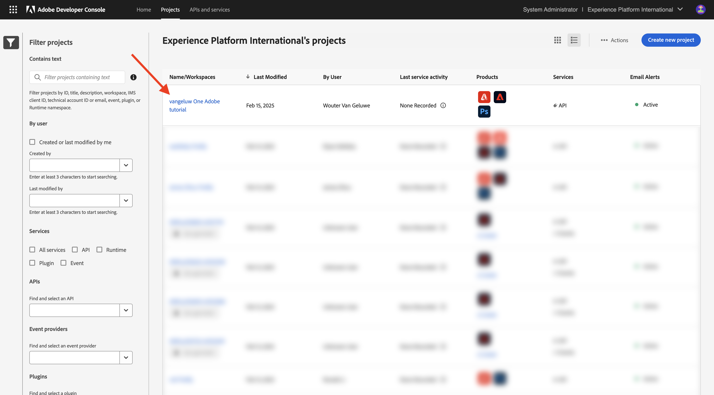

**Firefly - Firefly Services** APIをクリックします。 次に、「**Postman用にダウンロード**」をクリックし、**OAuth Server-to-Server**」を選択して、Postman環境をダウンロードします。

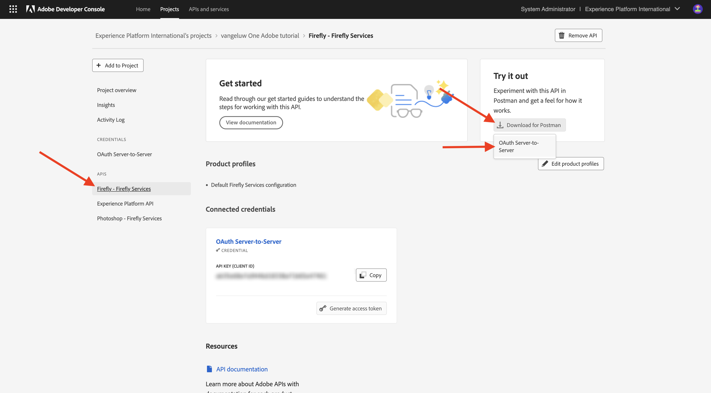

## Adobe I/OへのPostman認証

お使いのOSに対応するバージョンのPostmanを[Postman Downloads](https://www.postman.com/downloads/){target="_blank"}でダウンロードしてインストールします。

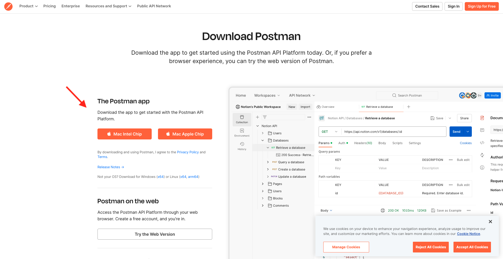

アプリケーションを起動します。

Postmanには、環境とコレクションという2つのコンセプトがあります。

環境ファイルには、多かれ少なかれ一貫性のある環境変数がすべて含まれています。 Adobe環境のIMSOrgや、クライアント IDなどのセキュリティ資格情報が表示されます。 以前にAdobe I/Oのセットアップ中に環境ファイルをダウンロードしました。そのファイルの名前は&#x200B;**`oauth_server_to_server.postman_environment.json`**&#x200B;です。

コレクションには、使用できる多数のAPI リクエストが含まれています。 以下のコレクションを使用します。

- Adobe I/Oへの認証のための1つのコレクション
- 1このモジュールのAdobe Firefly サービス演習のコレクション
- 1このモジュールのAdobe Frame.io V4演習のコレクション

[postman-ff.zip](./../../../assets/postman/postman-ff.zip){target="_blank"}をローカルデスクトップにダウンロードします。

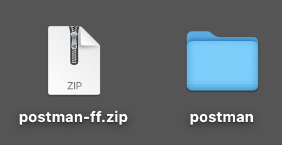

**postman-ff.zip** ファイルには、次のファイルがあります。

- `Adobe IO - OAuth.postman_collection.json`
- `FF - Firefly Services Tech Insiders.postman_collection.json`
- `Frame.io V4 - Tech Insiders.postman_collection.json`

**postman-ff.zip**&#x200B;を解凍し、デスクトップ上のフォルダーに次のファイルを保存します。

- `Adobe IO - OAuth.postman_collection.json`
- `FF - Firefly Services Tech Insiders.postman_collection.json`
- `Frame.io V4 - Tech Insiders.postman_collection.json`
- `oauth_server_to_server.postman_environment.json`

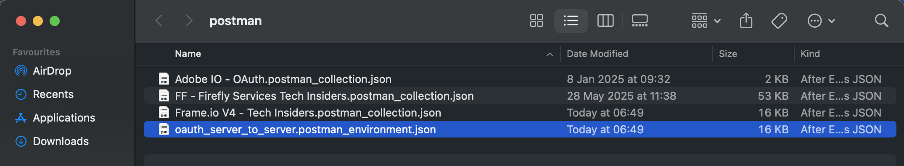

Postmanで、**読み込み**&#x200B;を選択します。

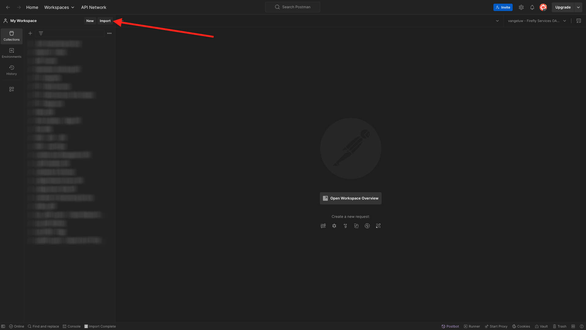

**ファイル**&#x200B;を選択します。

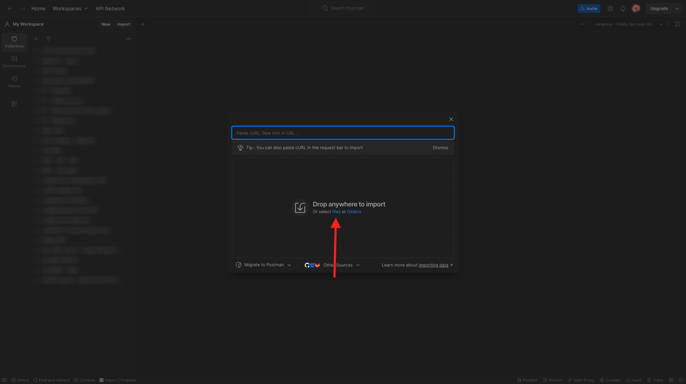

フォルダーからすべてのファイルを選択し、**開く**&#x200B;および&#x200B;**読み込み**&#x200B;を選択します。

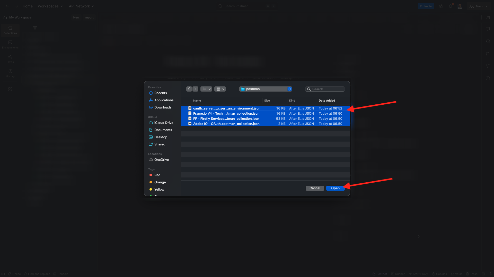

「**インポート**」をクリックします。

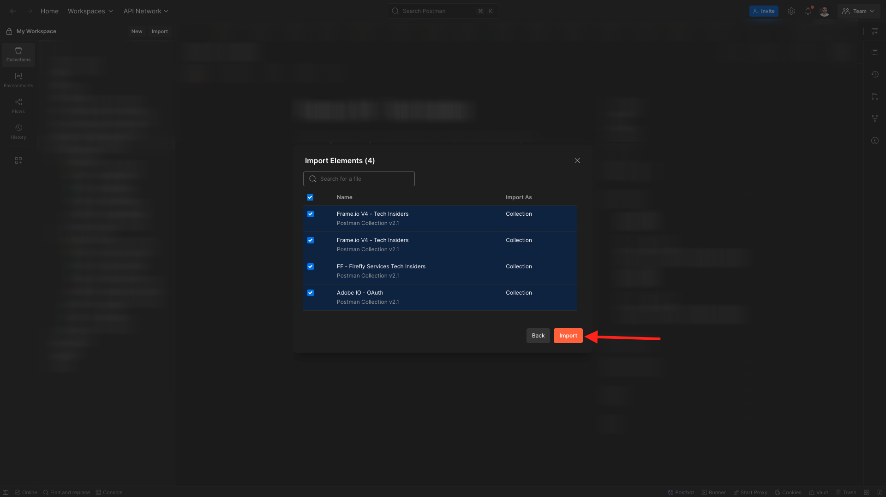

これで、APIを通じてFirefly Servicesとのやり取りを開始するために必要なすべての情報がPostmanに揃いました。

## アクセストークンをリクエスト

次に、適切に認証されていることを確認するには、アクセストークンをリクエストする必要があります。

リクエストを実行する前に、右上隅の環境ドロップダウンリストを確認して、適切な環境が選択されていることを確認します。 選択した環境には、この環境と同様の名前（`--aepUserLdap-- One Adobe OAuth Credential`）を付ける必要があります。

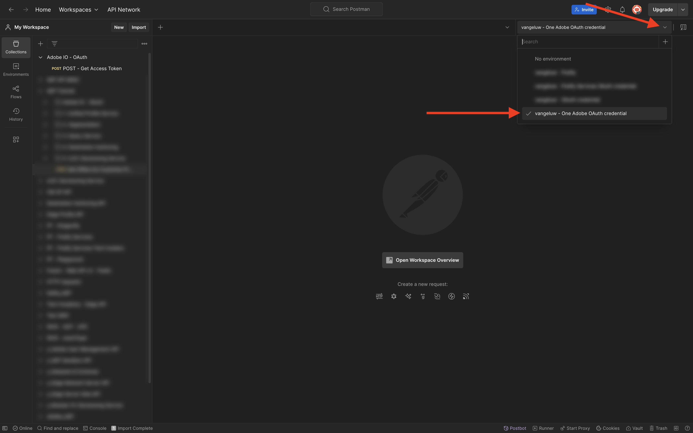

選択した環境には、この環境と同様の名前（`--aepUserLdap-- One Adobe OAuth Credential`）を付ける必要があります。

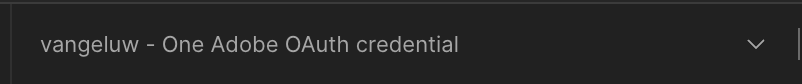

これで、Postman環境とコレクションが設定され、動作するようになったので、PostmanからAdobe I/Oへの認証を行うことができます。

**Adobe IO - OAuth** コレクションで、**POST - Get Access Token**&#x200B;という名前のリクエストを選択し、**Send**&#x200B;を選択します。

**クエリパラメーター**&#x200B;に関するお知らせ。2つの変数（`API_KEY`と`CLIENT_SECRET`）が参照されています。 これらの変数は、選択した環境`--aepUserLdap-- One Adobe OAuth Credential`から取得されます。

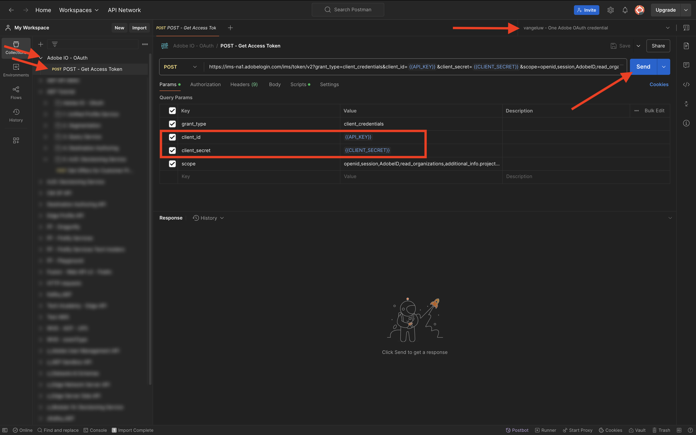

If successful, a response containing a bearer token, an access token, and an expiration window appears in the **Body** section of Postman.

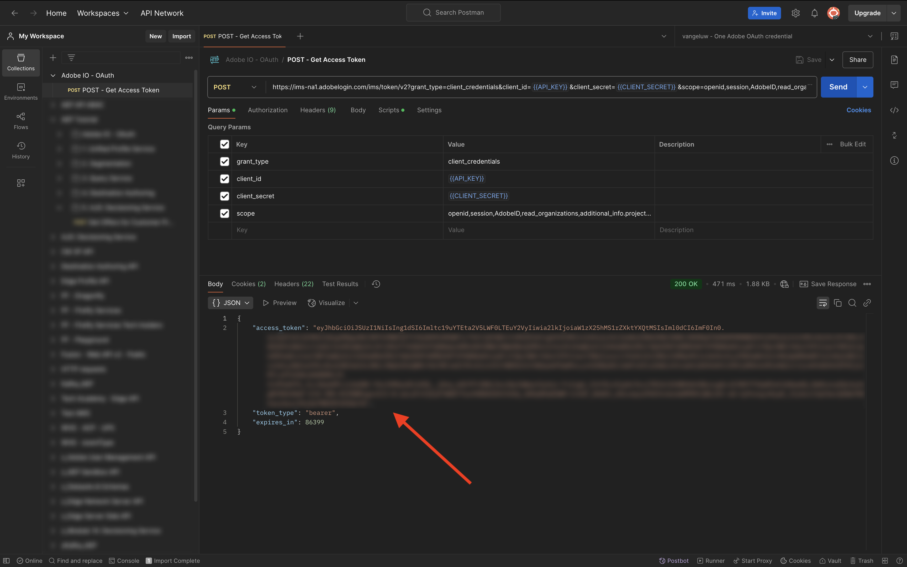

次の情報を含む同様の応答が表示されます。

| キー | 値 |
|:-------------:| :---------------:|
| token_type | **ベアラー** |
| access_token | **eyJhbGciOiJSUz...** |
| expires_in | **86399** |

Adobe I/O **bearer-token**&#x200B;には、特定の値（非常に長いaccess_token）と有効期限が設定されており、24時間有効になっています。 つまり、24時間後にPostmanを使用してAdobe APIを操作する場合は、このリクエストを再度実行して新しいトークンを生成する必要があります。

Your Postman environment is now configured and working.

## 次の手順

[&#x200B; インストールするアプリケーション &#x200B;](./ex5.md){target="_blank"}に移動

[はじめに – GenStudio](./getting-started-genstudio.md){target="_blank"}に戻ります

[すべてのモジュール &#x200B;](./../../../overview.md){target="_blank"}に戻る
