# オプション 2: PostBusterの設定

>[!IMPORTANT]
>
>Adobeの社員でない場合は、[Postmanのインストール ](./ex3.md){target="_blank"}の手順に従ってください。 以下の手順は、Adobeの従業員のみを対象としています。

## ビデオ

このビデオでは、この演習に関連するすべての手順の説明とデモを行います。

>[!VIDEO](https://video.tv.adobe.com/v/3476496?quality=12&learn=on)

## PostBusterのインストール

[https://adobe.service-now.com/esc?id=adb_esc_kb_article&amp;sysparm_article=KB0020542](https://adobe.service-now.com/esc?id=adb_esc_kb_article&sysparm_article=KB0020542){target="_blank"}に移動します。

クリックして、**PostBuster**&#x200B;の最新リリースをダウンロードします。

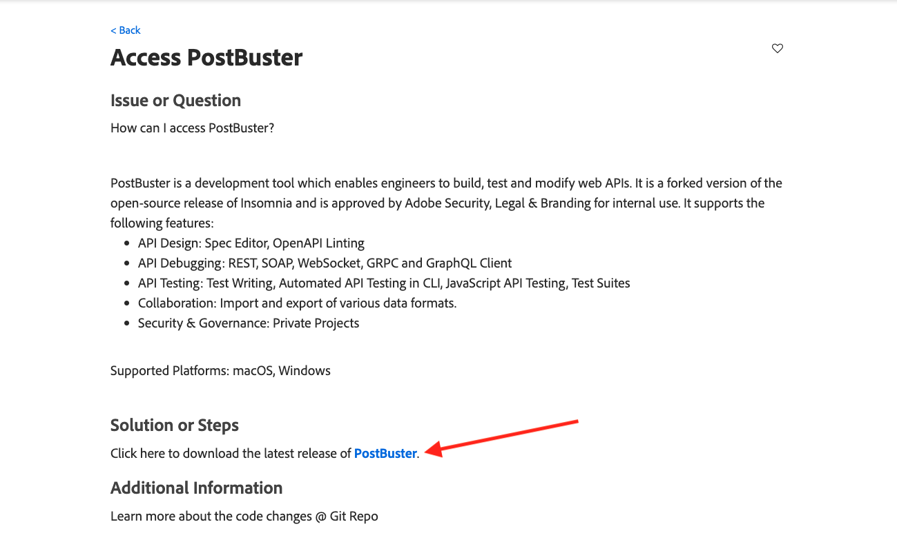

OSの正しいバージョンをクリックします。

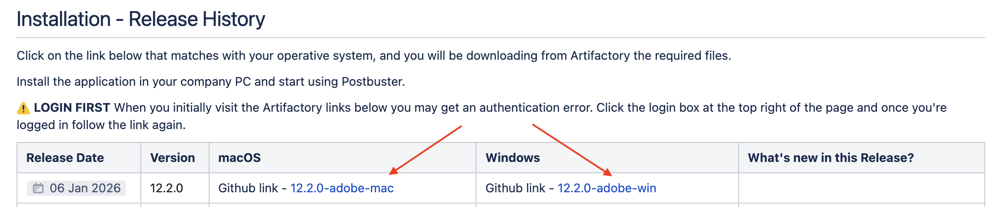

ファイルをダウンロードします。

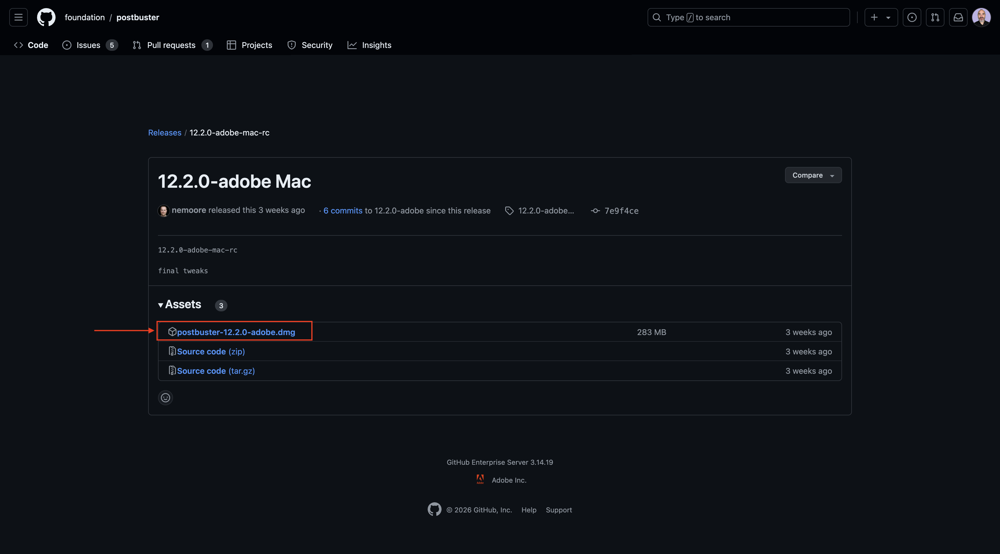

ダウンロードが完了し、インストールが完了したら、PostBusterを開きます。 そうすると、これが表示されます。 「**インポート**」をクリックします。

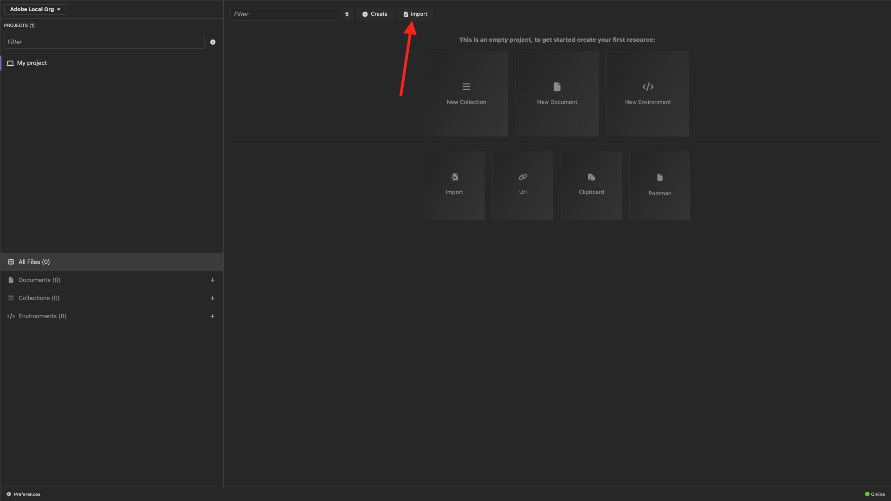

[postbuster.json.zip](./../../../assets/postman/postbuster.json.zip){target="_blank"}をダウンロードし、デスクトップに展開します。

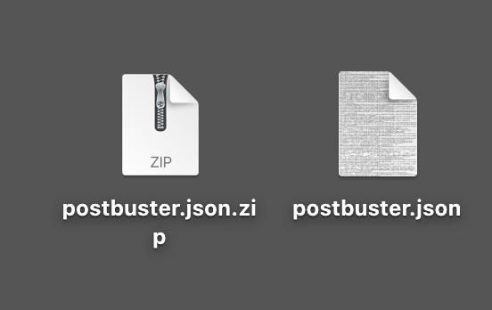

「**ファイルを選択**」をクリックします。

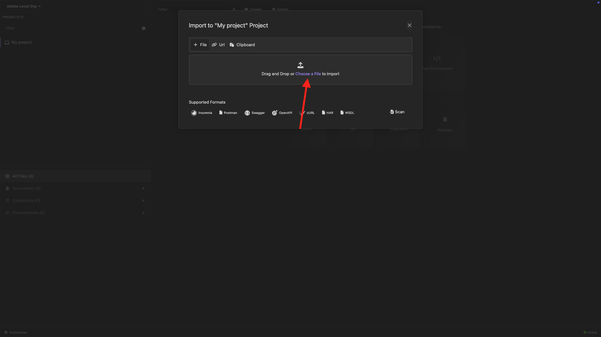

ファイル **postbuster.json**&#x200B;を選択します。 「**開く**」をクリックします。

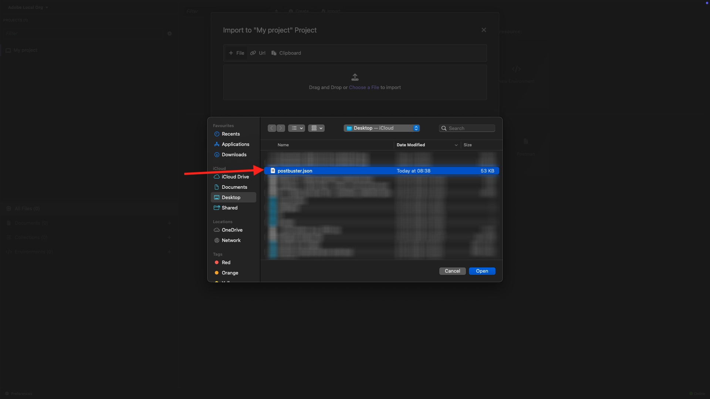

そうすると、これが表示されます。 「**スキャン**」をクリックします。

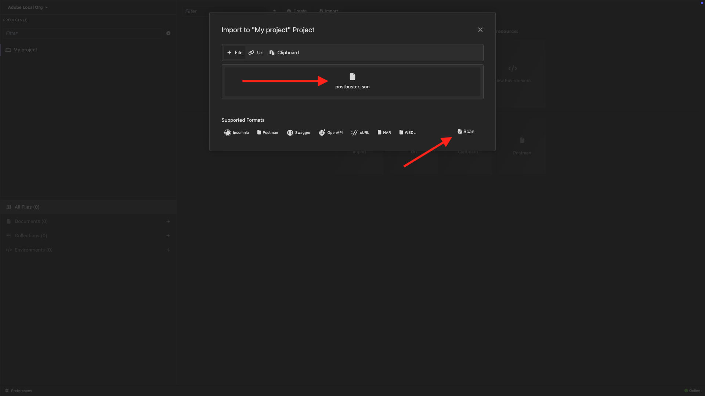

「**インポート**」をクリックします。

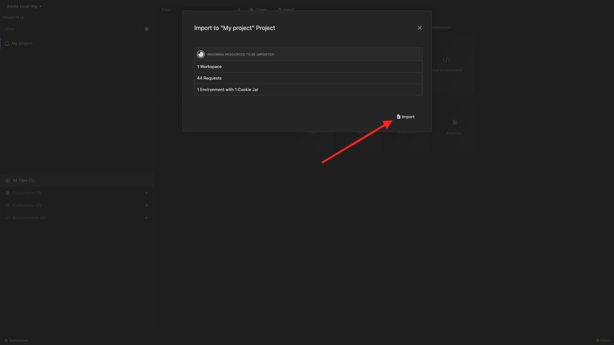

そうすると、これが表示されます。 クリックして、読み込んだコレクションを開きます。

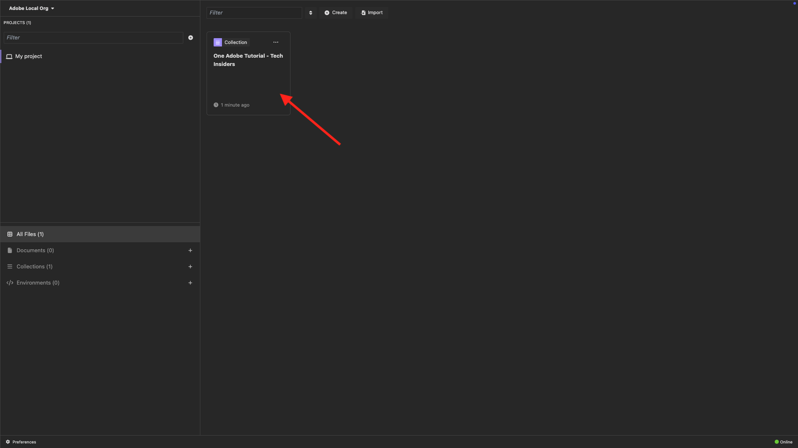

あなたのコレクションが見えてきます。 一部の環境変数を保持するように環境を設定する必要があります。

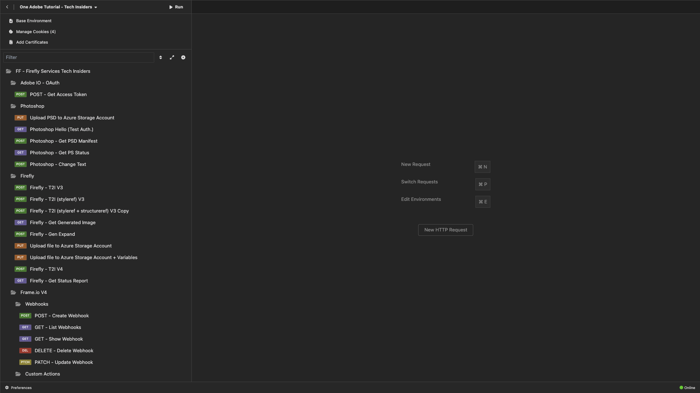

**Base Environment**&#x200B;をクリックし、**edit** アイコンをクリックします。

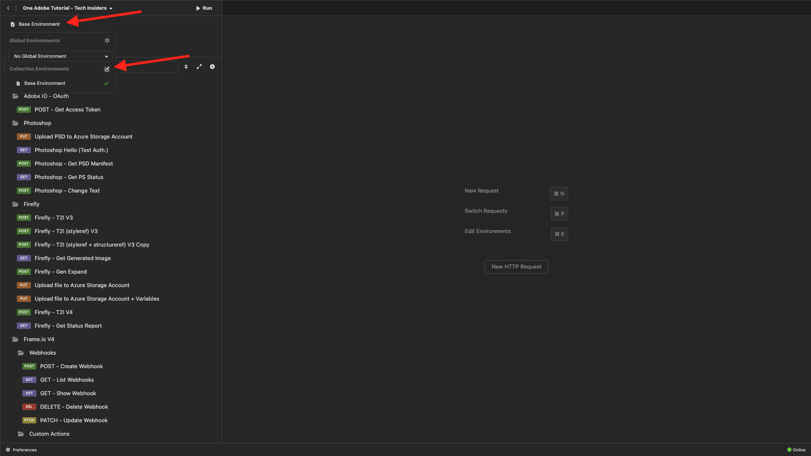

そうすると、これが表示されます。

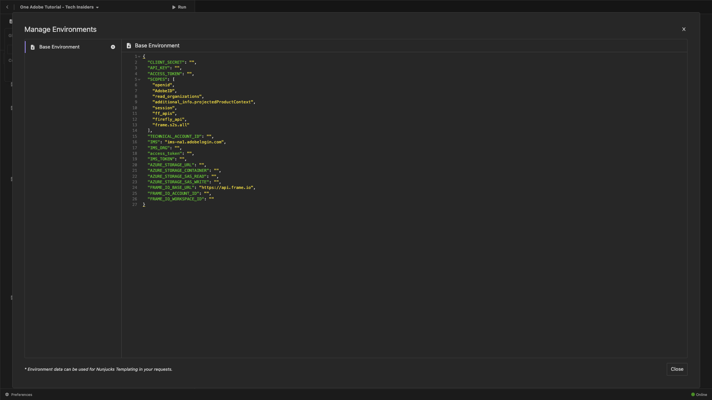

次の環境プレースホルダーをコピーし、その場所にあるものを置き換えて&#x200B;**Base Environment**&#x200B;に貼り付けます。

```json
{
    "CLIENT_SECRET": "",
    "API_KEY": "",
    "ACCESS_TOKEN": "",
    "SCOPES": [
        "openid",
        "AdobeID",
        "read_organizations", 
        "additional_info.projectedProductContext", 
        "session",
        "ff_apis",
        "firefly_api",
        "frame.s2s.all"
    ],
    "TECHNICAL_ACCOUNT_ID": "",
    "IMS": "ims-na1.adobelogin.com",
    "IMS_ORG": "",
    "access_token": "",
    "IMS_TOKEN": "",
    "AZURE_STORAGE_URL": "",
    "AZURE_STORAGE_CONTAINER": "",
    "AZURE_STORAGE_SAS_READ": "",
    "AZURE_STORAGE_SAS_WRITE": "",
    "FRAME_IO_BASE_URL": "https://api.frame.io",
    "FRAME_IO_ACCOUNT_ID": "",
    "FRAME_IO_WORKSPACE_ID": ""
}
```

では、これを使ってください。

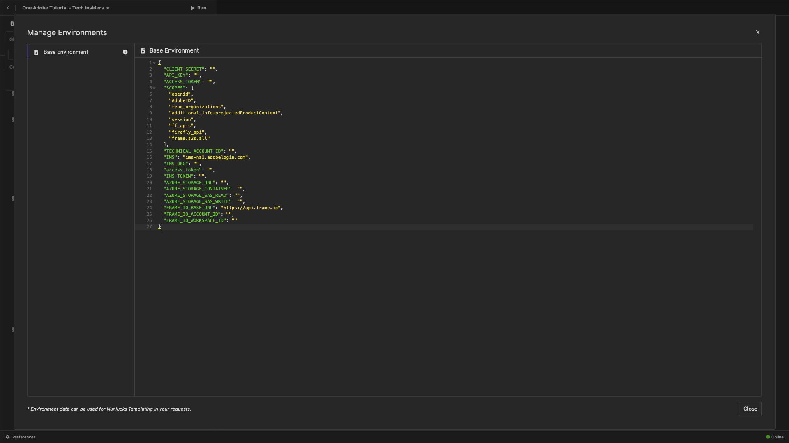

## Adobe I/Oの変数を入力すると

[https://developer.adobe.com/console/home](https://developer.adobe.com/console/home){target="_blank"}に移動し、プロジェクトを開きます。


**OAuth サーバー間**&#x200B;に移動します。

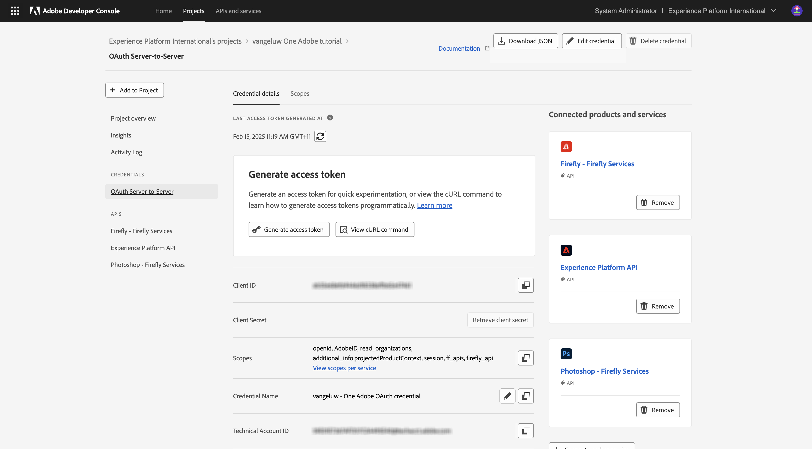

次の値をAdobe I/O プロジェクトからコピーし、PostBuster Base Environmentに貼り付ける必要があります。

- クライアント ID
- クライアントシークレット （**クライアントシークレットの取得**&#x200B;をクリック）
- テクニカルアカウント ID
- 組織ID （下にスクロールして組織IDを検索します）

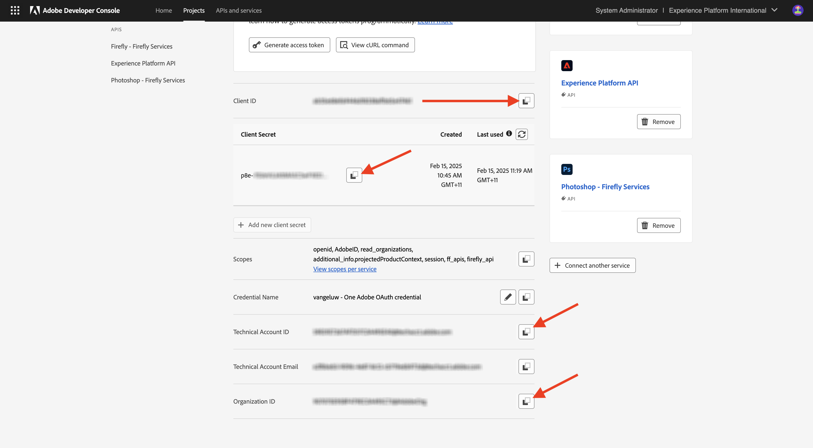

上記の変数を1つずつコピーし、PostBusterの&#x200B;**Base Environment**&#x200B;に貼り付けます。

| Adobe I/Oの変数名 | PostBuster ベース環境の変数名 |
|:-------------:| :---------------:|
| クライアント ID | `API_KEY` |
| クライアント秘密鍵 | `CLIENT_SECRET` |
| テクニカルアカウント ID | `TECHNICAL_ACCOUNT_ID` |
| 組織 ID | `IMS_ORG` |

これらの変数を1つずつコピーした後、PostBuster ベース環境は次のようになります。

「**閉じる**」をクリックします。

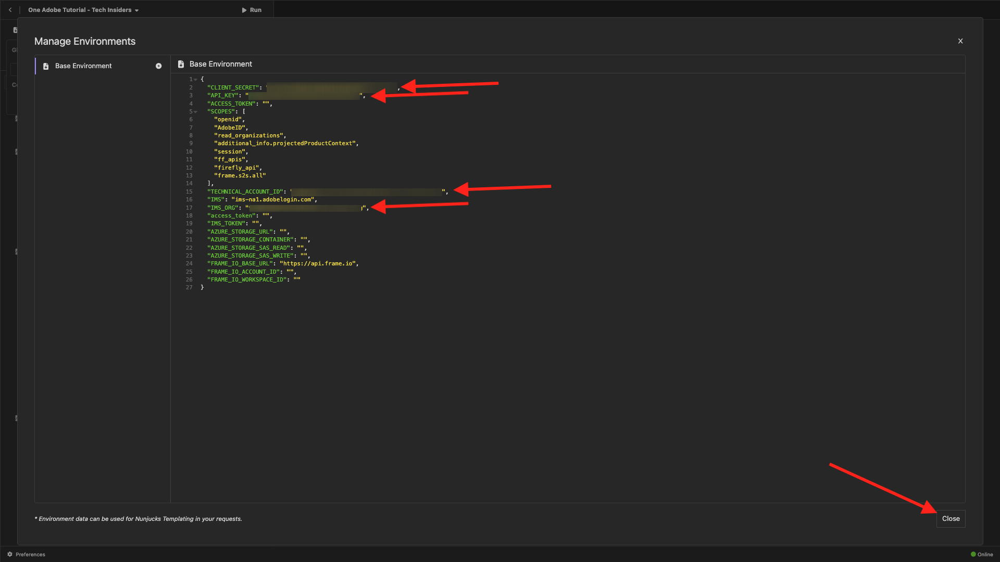

**Adobe IO - OAuth** コレクションで、**POST - Get Access Token**&#x200B;という名前のリクエストを選択し、**Send**&#x200B;を選択します。

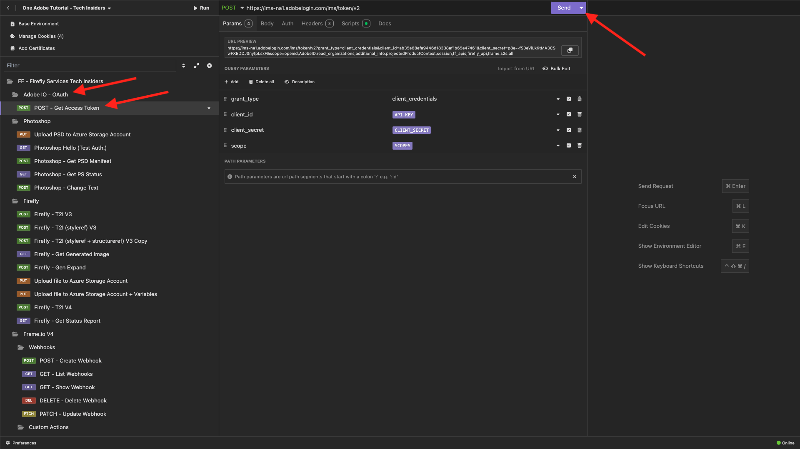

次の情報を含む同様の応答が表示されます。

| キー | 値 |
|:-------------:| :---------------:|
| token_type | **ベアラー** |
| access_token | **eyJhbGciOiJS...** |
| expires_in | **86399** |

Adobe I/O **bearer-token**&#x200B;には、特定の値（非常に長いaccess_token）と有効期限が設定されており、24時間有効になっています。 つまり、24時間後にPostmanを使用してAdobe APIを操作する場合は、このリクエストを再度実行して新しいトークンを生成する必要があります。

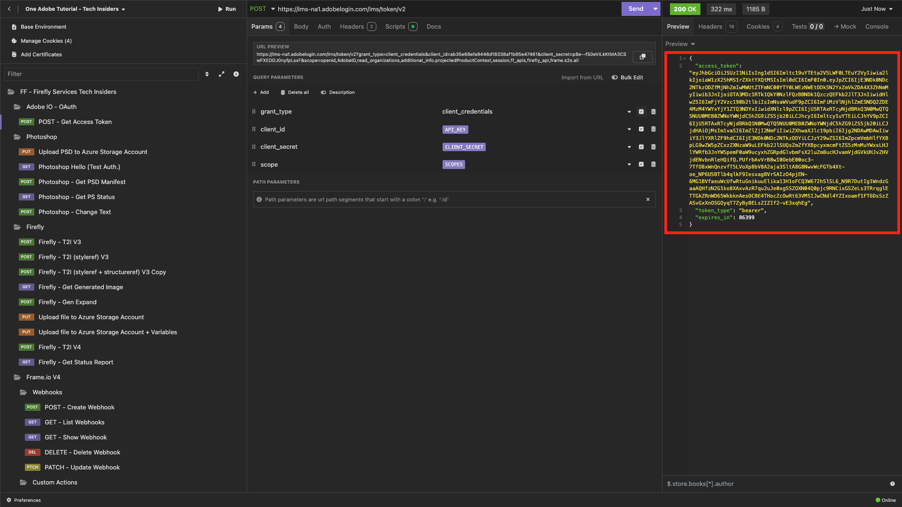

これで、PostBuster環境が設定され、動作するようになりました。 これで、この演習は完了しました。

## 次の手順

[ インストールするアプリケーション ](./ex5.md){target="_blank"}に移動

[はじめに – GenStudio](./getting-started-genstudio.md){target="_blank"}に戻ります

[すべてのモジュール ](./../../../overview.md){target="_blank"}に戻る
