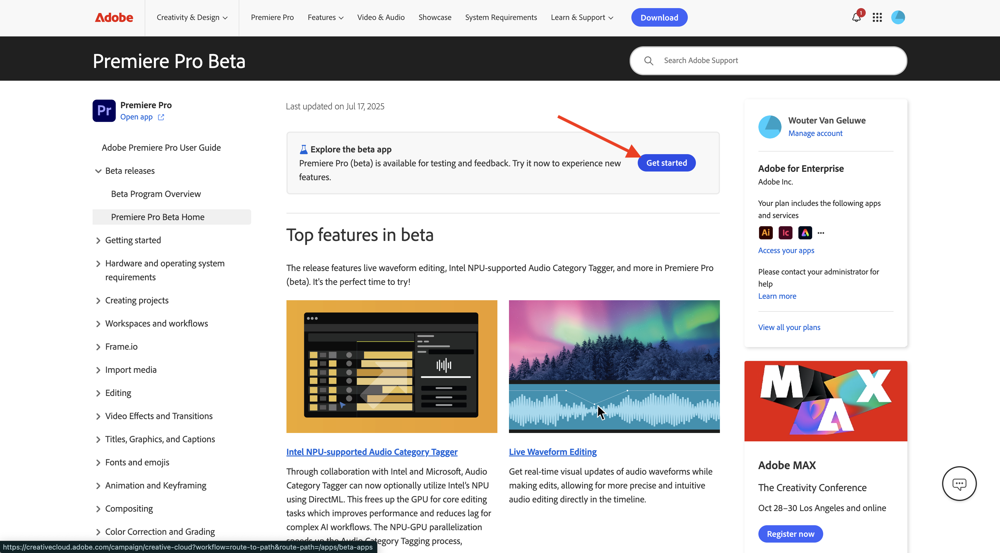
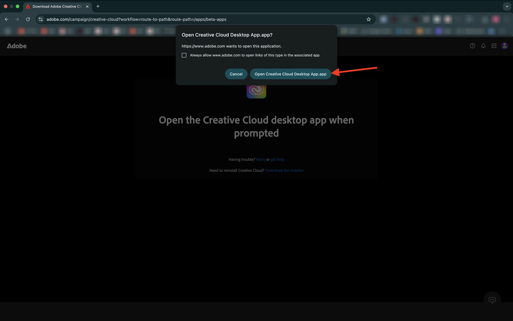
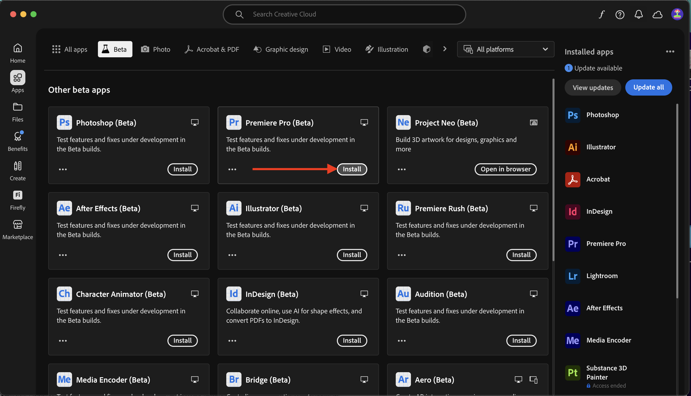
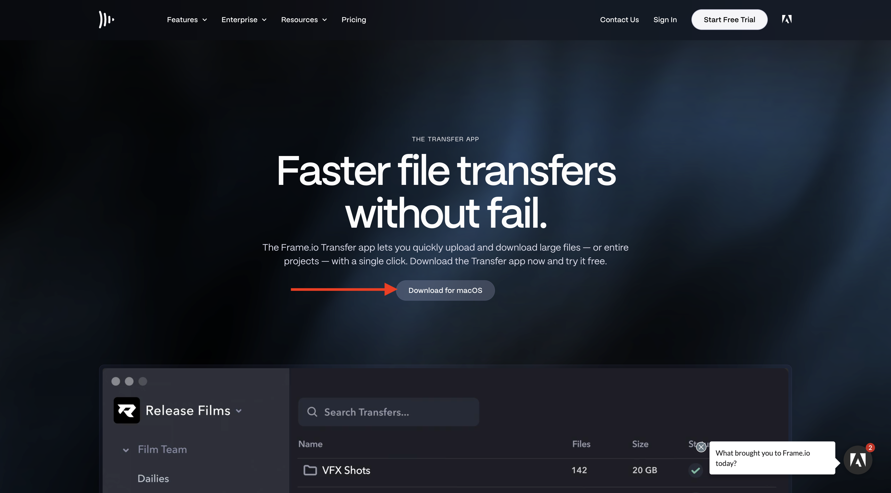
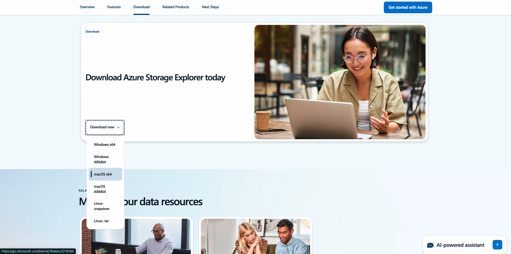

# インストールするアプリケーション

以下は、チュートリアルを開始する前にコンピューターにインストールする必要があるアプリケーションの概要です。

## Adobe Creative Cloud

[https://creativecloud.adobe.com/apps/download/creative-cloud](https://creativecloud.adobe.com/apps/download/creative-cloud){target="_blank"}に移動します。

## Adobe Photoshop

**Adobe Creative Cloud** アプリを開き、**アプリ**&#x200B;に移動します。 コンピューターにPhotoshopをインストールします。

## Adobe Illustrator

**Adobe Creative Cloud** アプリを開き、**アプリ**&#x200B;に移動します。 コンピューターにIllustratorをインストールします。

## Adobe Premiere Pro

[https://helpx.adobe.com/jp/premiere-pro/using/premiere-pro-beta.html](https://helpx.adobe.com/jp/premiere-pro/using/premiere-pro-beta.html)からコンピューターにAdobe Premiere Pro Beta バージョンをインストールします

「**Creative Cloud デスクトップアプリを開く**」をクリックします。

**Premiere Pro（Beta）** アプリのカードで「**Install**」をクリックします。

## Frame.io Transfer アプリ

[https://frame.io/transfer](https://frame.io/transfer)に移動し、コンピューターのバージョンをダウンロードします。

## Visual Studio Code

[https://code.visualstudio.com/](https://code.visualstudio.com/){target="_blank"}に移動し、**Visual Studio Code**&#x200B;をダウンロードしてインストールします。

## テキストエディター

テキストエディターアプリをお持ちでない場合は、[https://www.sublimetext.com/](https://www.sublimetext.com/){target="_blank"}にアクセスして、このテキストエディターをダウンロードしてインストールできます。

## GitHub アカウント

まだGitHub アカウントをお持ちでない場合は、[https://github.com/](https://github.com/){target="_blank"}に移動し、**新規登録**&#x200B;をクリックしてください。 個人のメールアドレスを使用し、アカウントを作成します。

## GitHub Desktop

[https://desktop.github.com/download/](https://desktop.github.com/download/){target="_blank"}に移動し、**Github Desktop**&#x200B;をダウンロードしてインストールします。

## Azure Storage Explorer

[Microsoft Azure Storage Explorerをダウンロードしてファイルを管理します](https://azure.microsoft.com/en-us/products/storage/storage-explorer#Download-4){target="_blank"}。 特定のOSに適したバージョンを選択し、ダウンロードしてインストールします。

{zoomable="yes"}

これで、「はじめに」モジュールが終了しました。

## 次の手順

[はじめに – GenStudio](./getting-started-genstudio.md){target="_blank"}に戻ります

[すべてのモジュール &#x200B;](./../../../overview.md){target="_blank"}./imagesに戻る
