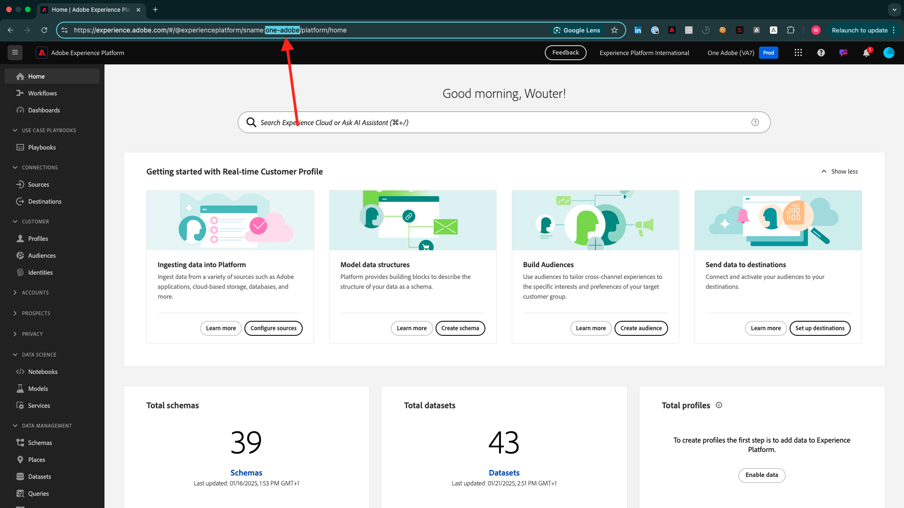

# Experience League ドキュメント用のChrome拡張機能のインストール

## Chrome拡張機能について

このチュートリアルは汎用化され、任意のAdobe Experience Cloud インスタンスを使用して誰でも簡単に再利用できます。

ドキュメントを再利用可能にするために、**環境変数** がチュートリアルに導入されました。つまり、ドキュメント内に以下の **プレースホルダー** があります。 すべてのプレースホルダーは、固有の環境用の固有の変数です。Chrome拡張機能はその変数を変更し、チュートリアルページからコードとテキストを簡単にコピーして、チュートリアルの一部として使用する様々なユーザーインターフェイスに貼り付けられるようにします。

このような値の例については、以下を参照してください。 現在、これらの値はまだ使用できませんが、Chrome拡張機能をインストールして有効にすると、これらの変数が通常のテキストに変わり、コピーして再利用できるようになります。

| 名前 | キー | 例 |
|:-------------:| :---------------:| :---------------:|
| IMS Org ID | `--aepImsOrgId--` | `907075E95BF479EC0A495C73@AdobeOrg` |
| IMS 組織名 | `--aepImsOrgName--` | `Experience Platform International` |
| AEP テナント ID | `--aepTenantId--` | `_experienceplatform` |
| AEP サンドボックス名 | `--aepSandboxName--` | `one-adobe` |
| Learner Profile LDAP | `--aepUserLdap--` | `vangeluw` |

例として、以下のスクリーンショットでは、`aepSandboxName` への参照を確認できます。

拡張機能がインストールされると、同じテキストがインスタンス固有の値を反映して自動的に変更されます。

## Chrome拡張機能のインストール

Chrome拡張機能をインストールするには、Chrome ブラウザーを開き、[https://chromewebstore.google.com/detail/tech-insiders-learning-fo/hhnbkfgioecmhimdhooigajdajplinfi](https://chromewebstore.google.com/detail/tech-insiders-learning-fo/hhnbkfgioecmhimdhooigajdajplinfi){target="_blank"} に移動します。 その後、これが表示されます。

**Chromeに追加** をクリックします。

その後、これが表示されます。 **拡張機能を追加** をクリックします。

拡張機能がインストールされ、同様の通知が表示されます。

**拡張機能** メニューで「**パズルピース**」アイコンをクリックし、**Platform Learn – 設定** 拡張機能を拡張機能メニューにピン留めします。

## Chrome拡張機能の設定

[https://experienceleague.adobe.com/ja/docs/platform-learn/tutorial-comprehensive-technical/overviewに移動し ](https://experienceleague.adobe.com/ja/docs/platform-learn/tutorial-comprehensive-technical/overview){target="_blank"} 拡張機能アイコンをクリックして開きます。

このポップアップが表示されます。 **+** アイコンをクリックします。

Adobe Experience Platform インスタンスに関連する値を以下のように入力します。

これらのフィールドにどの値を入力すればよいかわからない場合は、次のガイダンスに従ってください。

**AEP IMS 組織名**

[https://platform.adobe.com/](https://platform.adobe.com/){target="_blank"} でAdobe Experience Platform インスタンスにログインすると、画面の右上隅にインスタンスの名前が表示されます。

**AEP IMS 組織 ID**

IMS 組織 ID はAdobe Experience Cloud インスタンスの一意の ID で、このチュートリアル全体で複数の場所で参照されます。

IMS 組織 ID の検索は、複数の方法で実行できます。 不明な場合は、インスタンスのシステム管理者の 1 人に ID を確認してください。

[Admin Console](https://adminconsole.adobe.com/){target="_blank"} に移動すると見つかることがあります。この場合、URL の一部として見つけることができます。

また、AEP メニューの **Data Management/クエリ** に移動すると見つかることがあります。この場合、「**ユーザー名**」の下に表示されています。

必ず **@AdobeOrg** 部分と ID をコピー&amp;ペーストしてください。

**AEP テナント ID**

テナント ID は、組織のAEP インスタンスの一意の ID です。 [https://platform.adobe.com/](https://platform.adobe.com/){target="_blank"} でAdobe Experience Platform インスタンスにログインすると、その URL にテナント ID が含まれています。

Chrome拡張機能に入力する場合は、アンダースコアがプレフィックスとして追加されていることを確認する必要があります。この例では **experienceplatform** が **_experienceplatform** になります。

**AEP サンドボックス名**

サンドボックス名は、AEP インスタンスで使用する環境の名前です。 [https://platform.adobe.com/](https://platform.adobe.com/){target="_blank"} でAdobe Experience Platform インスタンスにログインすると、その URL にテナント ID が含まれています。

URL からサンドボックス名を取得する前に、このチュートリアルで使用するサンドボックスに属していることを確認してください。 画面の右上隅にあるサンドボックス切り替えメニューをクリックすると、右側のサンドボックスに切り替えることができます。

この例では、AEP サンドボックス名は **one-adobe** です。

**LDAP**

これは、チュートリアルの一部として使用されるユーザー名です。 この例では、LDAP はこのユーザーのメールアドレスに基づいています。 メールアドレスは **vangeluw@adobe.com** なので、LDAP は **vangeluw** になります。

LDAP は、実行する設定がユーザーにリンクされ、使用しているインスタンスとサンドボックスと同じインスタンスを使用している他のユーザーと競合しないようにするために使用されます。

値は次のようになります。
最後に、「**新規作成** をクリックします。

拡張機能の左側のメニューに、環境のイニシャルを含む新しいアイコンが表示されます。 クリックします。 次に、**環境変数** と特定のAdobe Experience Platform インスタンス値のマッピングを確認します。 **設定をアクティベート** をクリックします。

設定をアクティベートすると、環境のイニシャルの横に緑の点が表示されます。 これは、環境がアクティブになったことを意味します。

## チュートリアルコンテンツの検証

テストとして、[ このページ ](https://experienceleague.adobe.com/ja/docs/platform-learn/tutorial-one-adobe/activation/dc/dc13/ex2){target="_blank"} に移動します。

Chrome 拡張機能でアクティブ化された環境に基づいて、このページのすべての **環境変数** が実際の値に置き換えられました。

これで、以下と同様のビューになります。環境変数 `aepSandboxName` は、実際のAEP サンドボックス名（この場合は **one-adobe** に置き換えられました。

## 次の手順

[Adobe Experience Platform Data Collection クライアントプロパティを設定する次に、デモシステムを使用 ](./ex2.md){target="_blank"} に移動します。

[ はじめに ](./getting-started.md){target="_blank"} に戻る

[ すべてのモジュール ](./../../../overview.md){target="_blank"} に戻る
