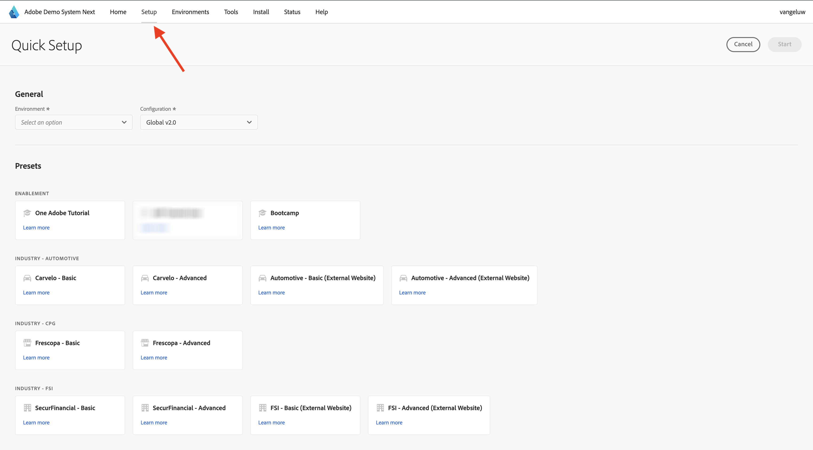

# Adobe Experience Platform Data Collection クライアントプロパティを設定する場合は、次にデモシステムを使用してください

このチュートリアルでは、学習内容を視覚化し、安全な環境で設定をテストできるようにするため、Adobeのデモシステムの次のツールを使用します。 このチュートリアルを最大限に活用するには、次にデモシステムと統合するように AEP インスタンスを設定する必要があります。

デモシステムにアクセスできるようになったら、次の手順に進みます。

[https://dsn.adobe.com/](https://dsn.adobe.com/) に移動し、**設定** に移動します。

**環境** ドロップダウンで、AEP インスタンスとサンドボックスを選択します。

次に、プリセット **AEP チュートリアルユーザー** を選択します。

次に、「**開始** をクリックします。

ポップアップで、データ収集プロパティと Experience Builder プロジェクトの名前を入力します。 次の命名規則を使用してください：**1 つのAdobe（DD/MM/YYYY）**。 ヒント：LDAP は自動的に追加されます。自分で追加する必要はありません。

「**開始**」をクリックします。

次に、このポップアップが表示され、web サイトおよびモバイルアプリプロジェクトの作成中の進行状況と、データ収集プロパティが表示されます。

クイックセットアッププロセスが完了すると、次のことができるようになります。

- 通信事業者のデモブランドでデモ web サイトを使用できる 1 つの web プロジェクト
- 1 つのモバイルアプリプロジェクト（通信デモブランドでデモモバイルアプリを使用できます）。
- 1 CX App プロジェクト。電話会社のデモブランドでコールセンターアプリを使用できます。
- Web サイトからデータを収集するために使用する Web 用の 1 データ収集プロパティ
- モバイル用の 1 データ収集プロパティ。モバイルアプリからデータを収集するために使用します。

この画面は次の手順で必要になるので、開いたままにしてください。

## 次の手順

[ データストリームの作成 ](./ex3.md) に移動します。

[ はじめに ](./getting-started.md){target="_blank"} に戻る

[ すべてのモジュール ](./../../../overview.md){target="_blank"} に戻る