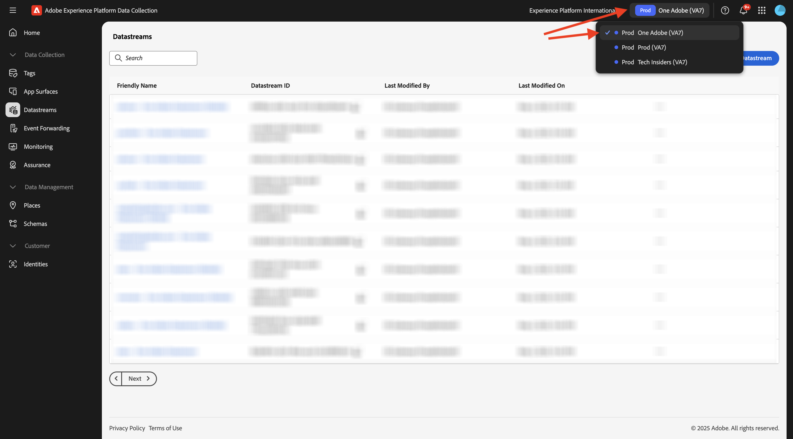
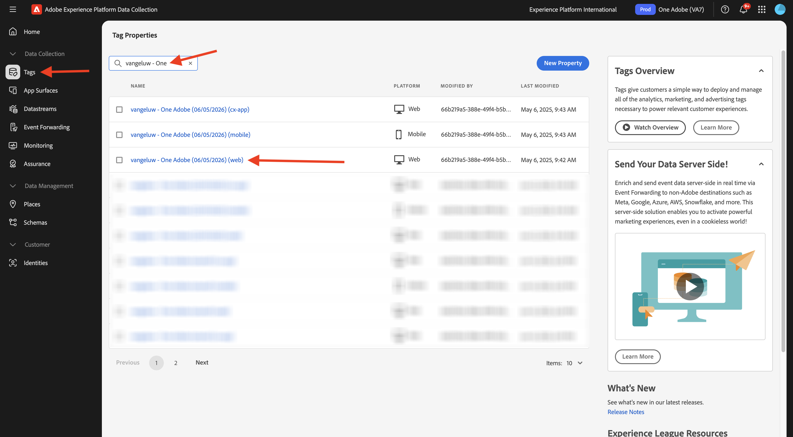
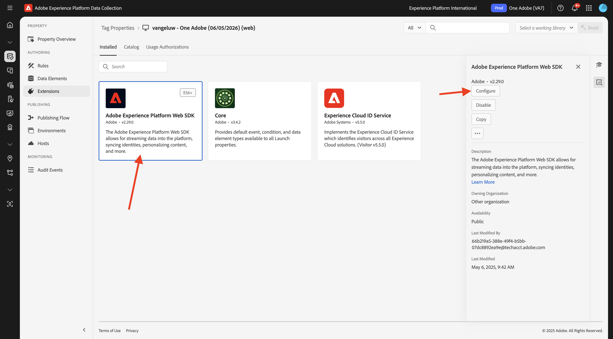
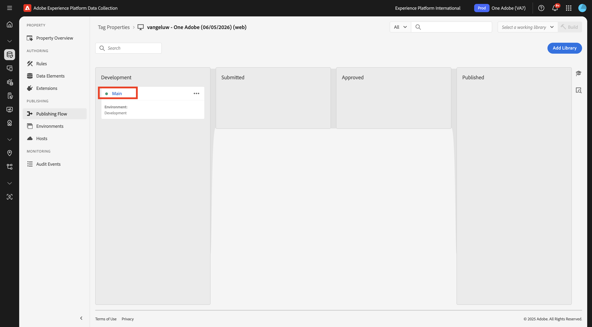
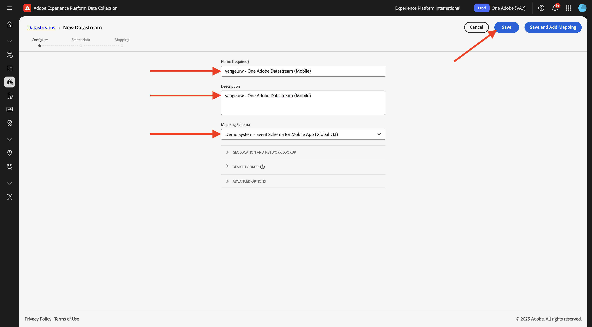
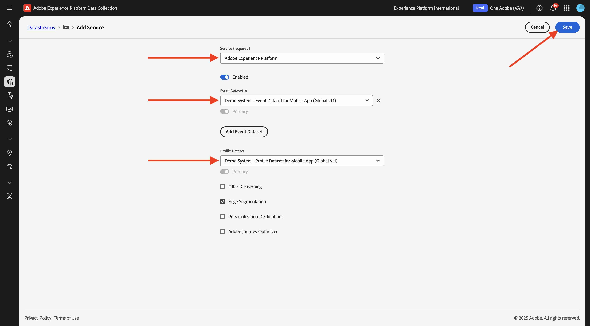
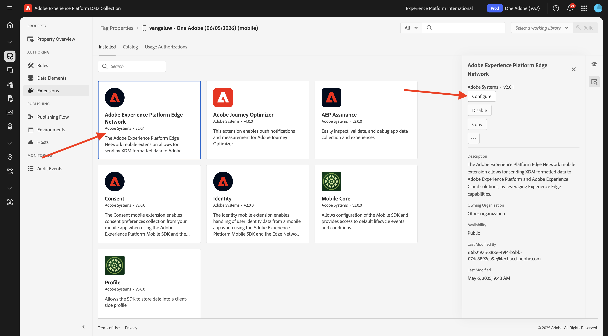

# データストリームの作成

[https://experience.adobe.com/#/data-collection/](https://experience.adobe.com/#/data-collection/) に移動します。

左側のメニューで、「**[!UICONTROL タグ]**」をクリックします。 前の演習の後、3 つのデータ収集プロパティが得られました。1 つは web 用、1 つはモバイル用、もう 1 つは CX アプリ用です。

これらのプロパティは、ほとんど使用する準備ができていますが、これらのプロパティを使用してデータの収集を開始する前に、データストリームを設定する必要があります。 データストリームとは何か、およびその意味に関する概念については、後のデータ収集モジュールの演習で詳しく説明します。

今のところ、次の手順に従ってください。

## Web 用データストリームの作成

**[!UICONTROL データストリーム]** をクリックします。

画面の右上隅にあるサンドボックス名を選択します（`--aepSandboxName--` にする必要があります）。

**[!UICONTROL 新規データストリーム]** をクリックします。

**[!UICONTROL 名前]** には、オプションの説明には、`--aepUserLdap-- - One Adobe Datastream` と入力します。 **マッピングスキーマ** については、**デモシステム - Web サイトのイベントスキーマ（グローバル v1.1）** を選択してください。 「**保存**」をクリックします。

その後、これが表示されます。 **サービスを追加** をクリックします。

サービス **[!UICONTROL Adobe Experience Platform]** を選択すると、追加のフィールドが表示されます。 その後、これが表示されます。

「イベントデータセット」で **「Demo System - Event Dataset for Website （Global v1.1）」を選択し** 「プロファイルデータセット」で **「Demo System - Profile Dataset for Website （Global v1.1）**」を選択します。 「**保存**」をクリックします。

この画面が表示されます。

左側のメニューで、「**[!UICONTROL タグ]**」をクリックします。

検索結果をフィルタリングして、データ収集プロパティを表示します。 **Web** プロパティをクリックして開きます。

その後、これが表示されます。 **拡張機能** をクリックします。

最初に、Adobe Experience Platform Web SDK拡張機能をクリックしてから、**設定** をクリックします。

その後、これが表示されます。 **データストリーム** メニューを確認し、適切なサンドボックスが選択されていることを確認します。この場合、`--aepSandboxName--` にする必要があります。

**データストリーム** ドロップダウンを開き、前に作成したデータストリームを選択します。

3 つの異なる環境すべてで、**データストリーム** が選択されていることを確認します。 次に、「**保存**」をクリックします。

**公開フロー** に移動します。

**メイン** の「**...**」をクリックし、「**編集**」をクリックします。

「**変更されたリソースをすべて追加**」をクリックし、「**開発用に保存してビルド**」をクリックします。

変更を公開中です。数分後に準備が整い、その後 **メイン** の横に緑の点が表示されます。

## モバイル用データストリームの作成

[https://experience.adobe.com/#/data-collection/](https://experience.adobe.com/#/data-collection/) に移動します。

**[!UICONTROL データストリーム]** をクリックします。

画面の右上隅にあるサンドボックス名を選択します（`--aepSandboxName--` にする必要があります）。

**[!UICONTROL 新規データストリーム]** をクリックします。

**[!UICONTROL わかりやすい名前]** と、オプションの説明に `--aepUserLdap-- - One Adobe Datastream (Mobile)` と入力します。 **マッピングスキーマ** については、**デモシステム – モバイルアプリのイベントスキーマ（グローバル v1.1）** を選択してください。 「**保存**」をクリックします。

「**[!UICONTROL 保存]**」をクリックします。

その後、これが表示されます。 **サービスを追加** をクリックします。

サービス **[!UICONTROL Adobe Experience Platform]** を選択すると、追加のフィールドが表示されます。 その後、これが表示されます。

「イベントデータセット」で **「デモシステム – モバイルアプリのイベントデータセット （グローバル v1.1）**」を選択し、「プロファイルデータセット」で **「デモシステム – モバイルアプリのプロファイルデータセット （グローバル v1.1）**」を選択します。 「**保存**」をクリックします。

その後、これが表示されます。

これで、モバイル用Adobe Experience Platform データ収集クライアントプロパティでデータストリームを使用する準備が整いました。

**タグ** に移動し、検索結果をフィルタリングして、2 つのデータ収集プロパティを表示します。 **モバイル** のプロパティをクリックして開きます。

その後、これが表示されます。 **拡張機能** をクリックします。

**Adobe Experience Platform Edge Network** 拡張機能をクリックしてから、「**設定** をクリックします。

その後、これが表示されます。 ここで、設定した正しいサンドボックスとデータストリームを選択する必要があります。 使用するサンドボックスは `--aepSandboxName--` で、データストリームは `--aepUserLdap-- - Demo System Datastream (Mobile)` と呼ばれます。

**Edge Network ドメイン** の場合は、デフォルトのドメインを使用してください。

「**保存**」をクリックして変更を保存します。

**公開フロー** に移動します。

**メイン** の横にある「**...**」をクリックし、「**編集**」をクリックします。

「**変更されたリソースをすべて追加**」をクリックし、「**開発用に保存してビルド**」をクリックします。

変更を公開中です。数分後に準備が整い、その後 **メイン** の横に緑の点が表示されます。

## 次の手順

[Web サイトを使用 ](./ex4.md) に移動します。

[ はじめに ](./getting-started.md){target="_blank"} に戻る

[ すべてのモジュール ](./../../../overview.md){target="_blank"} に戻る