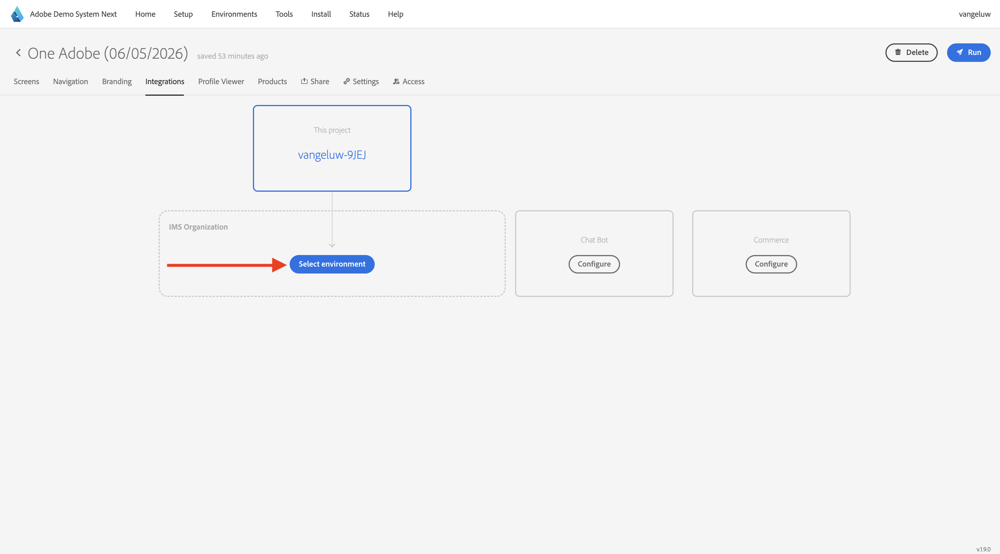

# Web サイトの使用

## オプション 1：前の演習から続行する

>[!NOTE]
>
>下の画面が開かなくなった場合は、代わりにオプション 2 に移動します。

前の演習の後、この結果が得られました。 クリックすると、作成された **Web Telco プロジェクト** が開きます。

その後、これが表示されます。 **統合** をクリックします。

**統合** ページで、前の演習で作成したデータ収集プロパティを選択する必要があります。 それには、「**環境を選択**」をクリックします。

前の手順で作成した `--aepUserLdap-- - One Adobe (DD/MM/YYYY) (web)` という名前のデータ収集プロパティで、「**選択**」をクリックします。 「**保存**」をクリックします。

その後、これが表示されます。 **実行** をクリックして、デモ Web サイトを開きます。

その後、デモ Web サイトが開きます。 URL を選択してクリップボードにコピーします。

新しい匿名ブラウザーウィンドウを開きます。

前の手順でコピーしたデモ Web サイトの URL を貼り付けます。 その後、Adobe IDを使用してログインするように求められます。

アカウントタイプを選択し、ログインプロセスを完了します。

次に、匿名ブラウザーウィンドウに web サイトが読み込まれます。 デモごとに、新しい匿名ブラウザーウィンドウを使用して、デモ Web サイトの URL を読み込む必要があります。

## オプション 2：新しい匿名ブラウザーウィンドウから開始

誤ってブラウザーウィンドウを閉じてしまった場合や、今後のセッションのために、[https://dsn.adobe.com/](https://dsn.adobe.com/) に移動して web サイトプロジェクトにアクセスすることもできます。 Adobe IDでログインすると、このが表示されます。 Web サイトプロジェクトで「。..**」** 3 つのドットをクリックし、「**編集**」をクリックします。

次のフローに従って、web サイトにアクセスできるようになりました。 **統合** をクリックします。

**統合** ページで、前の演習で作成したデータ収集プロパティを選択する必要があります。 それには、「**環境を選択**」をクリックします。

前の手順で作成した `--aepUserLdap - One Adobe (DD/MM/YYYY) (web)` という名前のデータ収集プロパティで、「**選択**」をクリックします。

その後、これが表示されます。 **実行** をクリックして、デモ Web サイトを開きます。

その後、デモ Web サイトが開きます。 URL を選択してクリップボードにコピーします。

新しい匿名ブラウザーウィンドウを開きます。

前の手順でコピーしたデモ Web サイトの URL を貼り付けます。 その後、Adobe IDを使用してログインするように求められます。

アカウントタイプを選択し、ログインプロセスを完了します。

次に、匿名ブラウザーウィンドウに web サイトが読み込まれます。 デモごとに、新しい匿名ブラウザーウィンドウを使用して、デモ Web サイトの URL を読み込む必要があります。

## 次の手順

[ モバイルアプリを使用 ](./ex5.md) に移動します。

[ はじめに ](./getting-started.md){target="_blank"} に戻る

[ すべてのモジュール ](./../../../overview.md){target="_blank"} に戻る