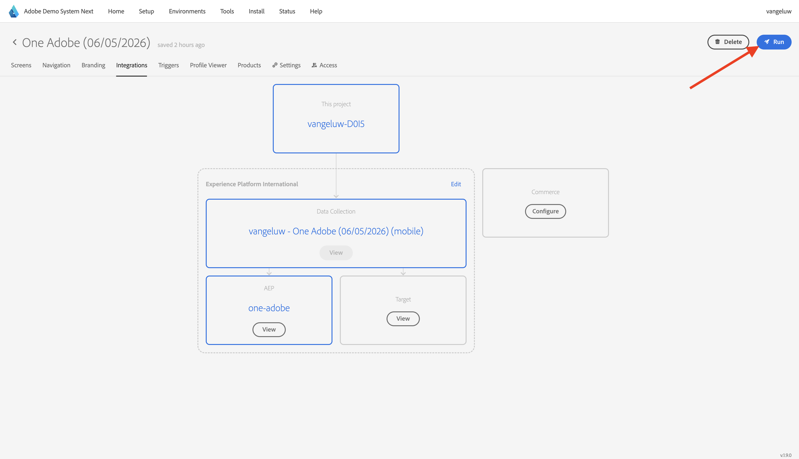

# モバイルアプリの使用

## アプリのダウンロード

コンピューターの ](https://dsn.adobe.com/install){target="_blank"}0}https://dsn.adobe.com/install} に移動します。 [Adobe IDを使用してログインすると、これが表示されます。

スマートフォンの **カメラ** アプリを使って、デバイスの OS に対応したモバイルアプリをインストールします。 このイネーブルメントでは、Adobe Experience Platform Mobile SDKを使用する **バージョン 2.x** をインストールする必要があります。

>[!NOTE]
>
>iOS デバイスにアプリを初めてインストールした後、アプリを開こうとすると、「**信頼できないエンタープライズデベロッパー**」というエラーメッセージが表示される場合があります。 これを修正するには、**設定/一般/VPN とデバイスの管理/Adobe Systems Inc.** に移動し、**Trust Adobe Systems Inc.** をクリックする必要があります。

アプリがインストールされると、デバイスのホーム画面に表示されます。 アイコンをクリックして、アプリを開きます。

アプリを初めて使用する場合は、Adobe IDを使用してログインするように求められます。 ログインプロセスを完了します。

ログインすると、通知を送信する権限を要求する通知が表示されます。 チュートリアルの一部として通知を送信するので、「**許可**」をクリックします。

その後、アプリのホームページが表示されます。 **設定** に移動します。

設定では、現在 **公開プロジェクト** がアプリに読み込まれていることがわかります。 **カスタムプロジェクト** をクリックします。

これで、カスタムプロジェクトを読み込めるようになりました。 QR コードをクリックして、プロジェクトを簡単に読み込みます。

前の演習の後、この結果が得られました。 クリックして、作成済みの **モバイル Edge Telco プロジェクト** を開きます。

誤ってブラウザーウィンドウを閉じてしまった場合や、今後のデモまたはイネーブルメントセッションの際には、[https://dsn.adobe.com](https://dsn.adobe.com){target="_blank"} にアクセスして web サイトプロジェクトにアクセスすることもできます。 Adobe IDでログインすると、このが表示されます。 モバイルアプリプロジェクトで「。..**」という 3 つのドット** をクリックし、「**編集**」をクリックします。

**統合** ページで、前の演習で作成したデータ収集プロパティを選択する必要があります。 それには、「**環境を選択**」をクリックします。

前の手順で作成した `--aepUserLdap - One Adobe (DD/MM/YYYY) (mobile)` という名前のデータ収集プロパティで、「**選択**」をクリックします。 次に、「**保存**」をクリックします。

その後、これが表示されます。 次に、「**実行** をクリックします。

QR コードを含むこのポップアップが表示されます。 モバイルアプリ内からこの QR コードをスキャンします。

プロジェクト ID がアプリに表示されたら、「**保存**」をクリックします。

次に、アプリで **ホーム** に戻ります。 これで、アプリを使用する準備が整いました。

## 次の手順

[Adobe I/O プロジェクトの設定 ](./ex6.md){target="_blank"} に移動します。

[ はじめに ](./getting-started.md){target="_blank"} に戻る

[ すべてのモジュール ](./../../../overview.md){target="_blank"} に戻る