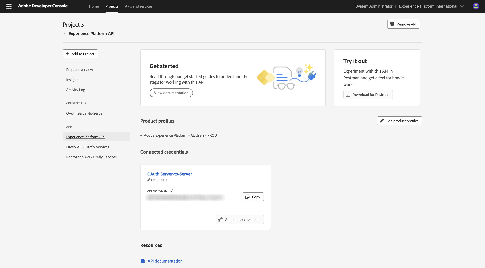

# Adobe I/O プロジェクトの設定

## ビデオ

このビデオでは、この演習に関係するすべての手順の説明とデモを行います。

>[!VIDEO](https://video.tv.adobe.com/v/3476494?quality=12&learn=on)

## Adobe I/O プロジェクトの作成

この演習では、Adobe I/Oを使用して、様々なAdobe エンドポイントに対してクエリを実行します。 Adobe I/Oを設定するには、次の手順に従います。

[https://developer.adobe.com/console/home](https://developer.adobe.com/console/home){target="_blank"} に移動します。

画面の右上隅で正しいインスタンスを選択してください。 インスタンスは `--aepImsOrgName--` です。

>[!NOTE]
>
> 次のスクリーンショットは、特定の組織が選択されていることを示しています。 このチュートリアルを進めていくと、組織の名前が異なる可能性が非常に高くなります。 このチュートリアルに登録したときに、使用する環境の詳細が提供されました。これらの手順に従ってください。

次に、「**新規プロジェクトを作成**」を選択します。

### FIREFLY SERVICES API

>[!IMPORTANT]
>
>選択したラーニングパスによっては、Firefly Services API にアクセスできない場合があります。 Firefly Services API へのアクセスは、ラーニングパス **Firefly**、**Workfront Fusion**、&lbrace;ALL **を使用している場合、または** 対面ライブワークショップ **に参加している場合のみ** 利用できます。 これらの学習パスに参加していない場合は、この手順をスキップできます。

この画像が表示されます。 「**+ プロジェクトに追加**」、「**API**」の順に選択します。

「**Adobe Firefly Services**」、「**Firefly - Firefly Services**」の順に選択して、「**次へ**」を選択します。

資格情報の名前を指定：`--aepUserLdap-- - One Adobe OAuth credential` を入力し、「**次へ**」を選択します。

デフォルトプロファイル **デフォルトのFirefly Services設定** を選択し、「**設定済み API を保存**」を選択します。

この画像が表示されます。

### PHOTOSHOP SERVICES API

>[!IMPORTANT]
>
>選択したラーニングパスによっては、Photoshop Services API にアクセスできない場合があります。 Photoshop Services API へのアクセスは、ラーニングパス **Firefly**、**Workfront Fusion**、&lbrace;ALL **を使用している場合、または** 対面ライブワークショップ **に参加している場合のみ** 利用できます。 これらの学習パスに参加していない場合は、この手順をスキップできます。
>
>「**+ プロジェクトに追加」を選択し** 「**API**」を選択します。

**Adobe Firefly Services** を選択してから、**Photoshop - Firefly Services** を選択してください。 「**次へ**」を選択します。

「**次へ**」を選択します。

次に、この統合で使用できる権限を定義する製品プロファイルを選択する必要があります。

**デフォルトのFirefly Services設定** および **デフォルトのCreative Cloud Automation Services 設定** を選択します。

**設定済み API を保存** を選択します。

この画像が表示されます。

### ADOBE EXPERIENCE PLATFORM API

>[!IMPORTANT]
>
>選択したラーニングパスによっては、Adobe Experience Platform API にアクセスできない場合があります。 Adobe Experience Platform API へのアクセスは、ラーニングパス **AEP + アプリ**、（すべて **を使用している場合、または** 対面式ライブワークショップ **に参加している場合** のみです。 これらの学習パスに参加していない場合は、この手順をスキップできます。

「**+ プロジェクトに追加」を選択し** 「**API**」を選択します。

**Adobe Experience Platform を選択し**&#x200B;**Experience Platform API** を選択します。 「**次へ**」を選択します。

「**次へ**」を選択します。

次に、この統合で使用できる権限を定義する製品プロファイルを選択する必要があります。

「**Adobe Experience Platform – すべてのユーザー – PROD**」を選択します。

>[!NOTE]
>
>AEPの製品プロファイルの名前は、環境の設定方法によって異なります。 上記の製品プロファイルが表示されない場合は、「**デフォルトの実稼動環境へのすべてのアクセス**」という製品プロファイルがある可能性があります。 どちらを選択すればよいかわからない場合は、AEP システム管理者にお問い合わせください。

**設定済み API を保存** を選択します。

この画像が表示されます。

### Frame.io API

>[!IMPORTANT]
>
>選択した学習パスによっては、Frame.io API にアクセスできない場合があります。 Frame.io API へのアクセスは、ラーニングパス **Workfront Fusion**、**すべて** を使用している場合、または **対面式ライブワークショップ** に参加している場合のみです。 これらの学習パスに参加していない場合は、この手順をスキップできます。

「**+ プロジェクトに追加」を選択し** 「**API**」を選択します。

「**Creative Cloud**」、「**Frame.io API**」の順に選択します。 「**次へ**」を選択します。

**サーバー間認証** を選択し、「**次へ**」をクリックします。

**OAuth サーバー間** を選択して、「**次へ**」をクリックします。

次に、この統合で使用できる権限を定義する製品プロファイルを選択する必要があります。

**Default Frame.io Enterprise - Prime Configuration** を選択し、「**Save Configured API**」をクリックします。

この画像が表示されます。

### プロジェクト名

プロジェクト名をクリックします。

{zoomable="yes"}

**プロジェクトを編集** を選択します。

{zoomable="yes"}

統合のわかりやすい名前 `--aepUserLdap-- One Adobe tutorial` を入力し、「**保存**」を選択します。

{zoomable="yes"}

これで、Adobe I/O プロジェクトの設定が完了しました。

{zoomable="yes"}

## 次の手順

[&#x200B; オプション 1:Postman設定 &#x200B;](./ex7.md){target="_blank"} に移動します。

[&#x200B; オプション 2:PostBuster 設定 &#x200B;](./ex8.md){target="_blank"} に移動します。

[&#x200B; はじめに &#x200B;](./getting-started.md){target="_blank"} に戻る

[&#x200B; すべてのモジュール &#x200B;](./../../../overview.md){target="_blank"} に戻る
