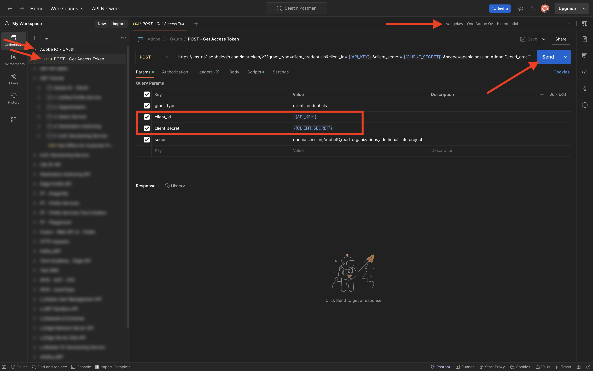

# 方法 1:Postmanの使用

>[!IMPORTANT]
>
>Adobeの社員の場合は、手順に従って [PostBuster のインストール &#x200B;](./ex8.md){target="_blank"} を行ってください。

## ビデオ

このビデオでは、この演習に関係するすべての手順の説明とデモを行います。

>[!VIDEO](https://video.tv.adobe.com/v/3476495?quality=12&learn=on)

## Postman環境のダウンロード

[https://developer.adobe.com/console/home](https://developer.adobe.com/console/home){target="_blank"} に移動し、プロジェクトを開きます。

**Firefly - Firefly Services** API をクリックします。 次に、「**Postman用にダウンロード**」をクリックし、「**OAuth サーバー間**」を選択してPostman環境をダウンロードします。

## Adobe I/Oに対するPostman認証

[Postman Downloads](https://www.postman.com/downloads/){target="_blank"} で、OS に関連するバージョンのPostmanをダウンロードしてインストールします。

アプリケーションを起動します。

Postmanには、環境とコレクションという 2 つのコンセプトがあります。

環境ファイルには、多かれ少なかれ一貫性のあるすべての環境変数が含まれています。 環境内には、クライアント ID などのセキュリティ認証情報と共に、Adobe環境の IMSOrg などが表示されます。 この環境ファイルは、以前にAdobe I/Oを設定する際にダウンロードしたもので、**`oauth_server_to_server.postman_environment.json`** という名前です。

コレクションには、使用可能な多数の API リクエストが含まれています。 以下のコレクションを使用します。

- Adobe I/Oに対する認証用の 1 つのコレクション
- このモジュールのAdobe Firefly サービスの演習のための 1 つのコレクション
- このモジュールのAdobe Frame.io V4 演習用の 1 コレクション

[postman-ff.zip](./../../../assets/postman/postman-ff.zip){target="_blank"} をローカルデスクトップにダウンロードします。

**postman-ff.zip** ファイルには次のファイルがあります。

- `Adobe IO - OAuth.postman_collection.json`
- `FF - Firefly Services Tech Insiders.postman_collection.json`
- `Frame.io V4 - Tech Insiders.postman_collection.json`

**postman-ff.zip** を解凍し、次のファイルをデスクトップ上のフォルダーに保存します。

- `Adobe IO - OAuth.postman_collection.json`
- `FF - Firefly Services Tech Insiders.postman_collection.json`
- `Frame.io V4 - Tech Insiders.postman_collection.json`
- `oauth_server_to_server.postman_environment.json`

Postmanで、「**読み込み**」を選択します。

**ファイル** を選択します。

フォルダーからすべてのファイルを選択し、「**開く**」および「**読み込み** を選択します。

**インポート** をクリックします。

これで、API を使用してFirefly Servicesとの対話を開始するためにPostmanで必要なすべてが揃いました。

## アクセストークンのリクエスト

次に、正しく認証されていることを確認するには、アクセストークンをリクエストする必要があります。

右上隅の「環境」ドロップダウンリストを確認して、リクエストを実行する前に適切な環境が選択されていることを確認します。 選択した環境の名前は、`--aepUserLdap-- One Adobe OAuth Credential` のようになります。

選択した環境の名前は、`--aepUserLdap-- One Adobe OAuth Credential` のようになります。

これで、Postman環境とコレクションが設定され、機能するようになったので、PostmanからAdobe I/Oへの認証を行うことができます。

**Adobe I/O - OAuth** コレクションで、「**POST - アクセストークンを取得**」という名前のリクエストを選択し、「**送信**」を選択します。

**クエリパラメーター** の下で、`API_KEY` と `CLIENT_SECRET` の 2 つの変数が参照されていることに注意してください。 これらの変数は、選択した環境 `--aepUserLdap-- One Adobe OAuth Credential` から取得されます。

成功した場合、ベアラートークン、アクセストークンおよび有効期限を含む応答がPostmanの **本文** セクションに表示されます。

次の情報を含む同様の応答が表示されます。

| キー | 値 |
|:-------------:| :---------------:| 
| token_type | **ベアラー** |
| access_token | **eyJhbGciOiJSUz...** |
| expires_in | **86399** |

Adobe I/O **bearer-token** には、特定の値（非常に長い access_token）と有効期限があり、24 時間有効になりました。 つまり、24 時間後にPostmanを使用してAdobe API とやり取りする場合は、このリクエストを再度実行して新しいトークンを生成する必要があります。

これで、Postman環境が設定され、機能するようになりました。

## 次の手順

[&#x200B; インストールするアプリケーション &#x200B;](./ex9.md){target="_blank"} に移動します

[&#x200B; はじめに &#x200B;](./getting-started.md){target="_blank"} に戻る

[&#x200B; すべてのモジュール &#x200B;](./../../../overview.md){target="_blank"} に戻る
