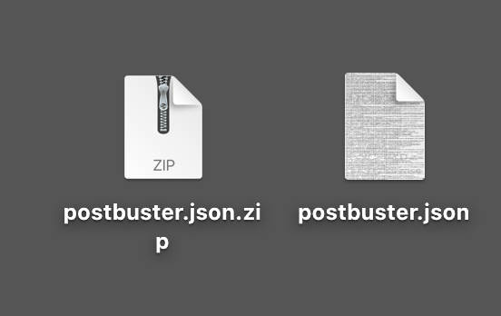

# オプション 2:PostBuster セットアップ

>[!IMPORTANT]
>
>Adobeの従業員でない場合は、手順に従って [Postmanをインストール ](./ex7.md){target="_blank"} してください。 以下の手順は、Adobeのユーザーのみを対象としています。

## ビデオ

このビデオでは、この演習に関係するすべての手順の説明とデモを行います。

>[!VIDEO](https://video.tv.adobe.com/v/3476496?quality=12&learn=on)

## PostBuster のインストール

[https://adobe.service-now.com/esc?id=adb_esc_kb_article&amp;sysparm_article=KB0020542](https://adobe.service-now.com/esc?id=adb_esc_kb_article&sysparm_article=KB0020542){target="_blank"} に移動します。

**PostBuster** の最新リリースをダウンロードします。


お使いの OS に適したバージョンをダウンロードします。


ダウンロードが完了し、インストールしたら、PostBuster を開きます。 この画像が表示されます。 **インポート** をクリックします。


[postbuster.json.zip](./../../../assets/postman/postbuster.json.zip){target="_blank"} をダウンロードし、デスクトップに抽出します。



**ファイルを選択** をクリックします。


ファイル **postbuster.json** を選択します。 「**開く**」をクリックします。


この画像が表示されます。 **スキャン** をクリックします。


**インポート** をクリックします。


この画像が表示されます。 クリックして、読み込んだコレクションを開きます。


これで、コレクションが表示されます。 環境変数を保持するには、引き続き環境を設定する必要があります。


**ベース環境** をクリックしてから、**編集** アイコンをクリックします。


この画像が表示されます。


以下の環境プレースホルダーをコピーし、**ベース環境** に貼り付けます。内容を置き換えます。

```json
{
	"CLIENT_SECRET": "",
	"API_KEY": "",
	"ACCESS_TOKEN": "",
	"SCOPES": [
		"openid",
		"AdobeID",
		"read_organizations", 
		"additional_info.projectedProductContext", 
		"session",
		"ff_apis",
		"firefly_api",
		"frame.s2s.all"
	],
	"TECHNICAL_ACCOUNT_ID": "",
	"IMS": "ims-na1.adobelogin.com",
	"IMS_ORG": "",
	"access_token": "",
	"IMS_TOKEN": "",
	"AZURE_STORAGE_URL": "",
	"AZURE_STORAGE_CONTAINER": "",
	"AZURE_STORAGE_SAS_READ": "",
	"AZURE_STORAGE_SAS_WRITE": "",
	"FRAME_IO_BASE_URL": "https://api.frame.io",
	"FRAME_IO_ACCOUNT_ID": "",
	"FRAME_IO_WORKSPACE_ID": ""
}
```

これで完了です。


## Adobe I/O変数を入力

[https://developer.adobe.com/console/home](https://developer.adobe.com/console/home){target="_blank"} に移動し、プロジェクトを開きます。


**OAuth サーバー間** に移動します。


次に、Adobe I/O プロジェクトから次の値をコピーして、PostBuster のベース環境に貼り付ける必要があります。

- クライアント ID
- クライアント秘密鍵（「**クライアント秘密鍵を取得**」をクリック）
- テクニカルアカウント ID
- 組織 ID （下にスクロールして組織 ID を探します）


上記の変数を 1 つずつコピーして、PostBuster の **ベース環境** に貼り付けます。

| Adobe I/Oの変数名 | PostBuster ベース環境の変数名 |
|:-------------:| :---------------:| 
| クライアント ID | `API_KEY` |
| クライアント秘密鍵 | `CLIENT_SECRET` |
| テクニカルアカウント ID | `TECHNICAL_ACCOUNT_ID` |
| 組織 ID | `IMS_ORG` |

これらの変数をひとつずつコピーした後、PostBuster ベース環境は次のようになります。

「**閉じる**」をクリックします。


**Adobe I/O - OAuth** コレクションで、「**POST - アクセストークンを取得**」という名前のリクエストを選択し、「**送信**」を選択します。


次の情報を含む同様の応答が表示されます。

| キー | 値 |
|:-------------:| :---------------:| 
| token_type | **ベアラー** |
| access_token | **eyJhbGciOiJS...** |
| expires_in | **86399** |

Adobe I/O **bearer-token** には、特定の値（非常に長い access_token）と有効期限があり、24 時間有効になりました。 つまり、24 時間後にPostmanを使用してAdobe API とやり取りする場合は、このリクエストを再度実行して新しいトークンを生成する必要があります。


これで、PostBuster 環境が設定され、機能するようになりました。 これで、この演習が完了しました。

## 次の手順

[ インストールするアプリケーション ](./ex9.md){target="_blank"} に移動します

[ はじめに ](./getting-started.md){target="_blank"} に戻る

[ すべてのモジュール ](./../../../overview.md){target="_blank"} に戻る
