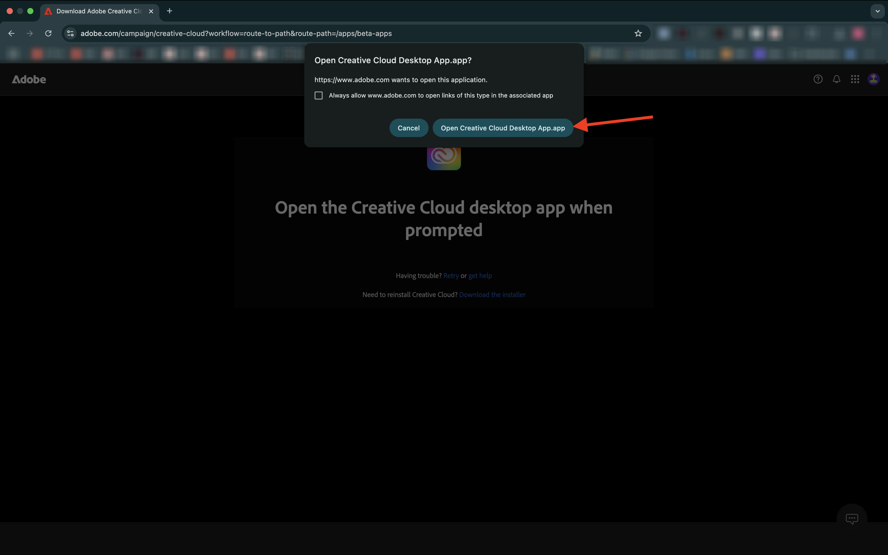

# インストールするアプリケーション

チュートリアルを開始する前に、コンピューターにインストールする必要があるアプリケーションの概要を以下に示します。

## Adobe Creative Cloud

[https://creativecloud.adobe.com/apps/download/creative-cloud](https://creativecloud.adobe.com/apps/download/creative-cloud){target="_blank"} に移動します。

## Adobe Photoshop

**Adobe Creative Cloud** アプリを開き、**アプリ** に移動します。 お使いのコンピューターにPhotoshopをインストールします。

## Adobe Illustrator

**Adobe Creative Cloud** アプリを開き、**アプリ** に移動します。 お使いのコンピューターにIllustratorをインストールします。

## Adobe Premiere Pro

[https://helpx.adobe.com/premiere-pro/using/premiere-pro-beta.html](https://helpx.adobe.com/premiere-pro/using/premiere-pro-beta.html) からAdobe Premiere Pro Beta版をコンピューターにインストールします

**Creative Cloud デスクトップアプリを開く** をクリックします。

**2}Premiere Pro（Beta）** アプリ用のカードで「**インストール」をクリックします。**

## Frame.io 転送アプリ

[https://frame.io/transfer](https://frame.io/transfer) に移動し、お使いのコンピューターのバージョンをダウンロードします。

## Visual Studio Code

[https://code.visualstudio.com/](https://code.visualstudio.com/){target="_blank"} に移動し、**Visual Studio Code** をダウンロードしてインストールします。

## テキストエディター

テキスト エディターアプリがない場合は、[https://www.sublimetext.com/](https://www.sublimetext.com/){target="_blank"} にアクセスして、このテキスト エディターをダウンロードしてインストールしてください。

## GitHub アカウント

GitHub アカウントをまだお持ちでない場合は、[https://github.com/](https://github.com/){target="_blank"} にアクセスし、「**新規登録**」をクリックします。 あなたの個人の電子メールアドレスを使用して、アカウントを作成します。

## GitHub デスクトップ

[https://desktop.github.com/download/](https://desktop.github.com/download/){target="_blank"} に移動し、**Github デスクトップ** をダウンロードしてインストールします。

## Azure ストレージエクスプローラー

[Microsoft Azure ストレージエクスプローラーをダウンロードしてファイルを管理 ](https://azure.microsoft.com/en-us/products/storage/storage-explorer#Download-4){target="_blank"} ます。 特定の OS に適したバージョンを選択し、ダウンロードしてインストールします。

{zoomable="yes"}

これで、はじめる前にモジュールが完了しました。

## 次の手順

[ はじめに ](./getting-started.md){target="_blank"} に戻る

[ すべてのモジュール ](./../../../overview.md){target="_blank"} に戻ります。/images
