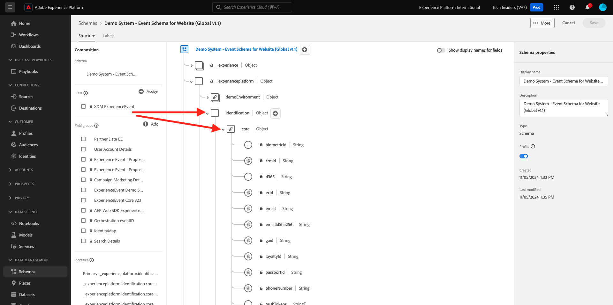

# 1.1.1 Customer Journey Analytics 101

## 目標

- CJA アプリケーションサービスについて
- CJA のポジショニング方法を学ぶ
- データ接続からインサイトまで、CJA のワークフローを理解します

## 1.1.1.1 Customer Journey Analyticsとは

Customer Journey Analytics（CJA）は、クロスチャネルデータ（オンラインとオフライン）のステッチと分析のために、ビジネスインテリジェンスおよびデータサイエンスチーム用のツールキットを提供します。 CJA の機能は、複雑なマルチチャネルカスタマージャーニーにコンテキストと明確さを提供します。 提供されるコンテキストにより、顧客コンバージョンプロセスの問題点を取り除き、最も重要な瞬間に優れたエクスペリエンスを設計し提供するための実用的なインサイトが得られます。

CJA はAnalysis WorkspaceをAdobe Experience Platformに追加します。 Adobe Experience Platformは、コミュニケーションとオーケストレーションの頭脳です。CJA を使用すると、企業はすべてのデータをコンテキスト化し、視覚化できるので、ビジネスチームやインサイトチームは、オンラインからオフラインへの完全なカスタマージャーニーを分析することで、そこから学ぶことができます。

ビジネスチームやインサイトチームは、Analysis Workspaceのドラッグアンドドロップ、ポイントアンドクリック、使いやすい UI を使用して、CJA と話し、質問し、その場で回答を得ることができます。

## 1.1.1.2 主なメリット

お客様にとっての主なメリットは次の 3 つです。

- 誰でもインサイトを利用可能にする機能（データアクセスの民主化など）
- 顧客をコンテキストジャーニーで表示する機能（オンラインとオフラインの両方の複数のチャネルにまたがるデータを順番に視覚化できます）
- を必要とせずにデータの力を活用する機能（つまり、通常の人間がデータを使用して、マーケティングアクティベーションのための深いインサイトと分析を解き放つ）

## 1.1.1.3 Customer Journey Analyticsを選ぶ理由

CJA は、現在の BI アプリケーション（Power BI、マイクロストラテジー、Locker、Tableau など）の代わりとなるつもりはありません。 これらの BI アプリケーションは、データを視覚化して企業ダッシュボードを作成し、組織内の全員が重要な指標をすばやく確認できるようにします。\
CJA の目標は、マーケティングチームとビジネスチームに分析力をもたらし、それらのペルソナにとって「必須」の分析ツールにすることです。

従来、BI アプリケーションは真の顧客インテリジェンスを実現することはできませんでした。

- アトリビューションを行うことも、カスタマージャーニー分析を行うこともできません。
- BI アプリケーションは、事前に質問を把握する必要があります
- インタラクティブクエリは、データベースの構造によって制限されます
- SQL スキルが必要です。
- BI アプリケーションには、何が起こったのかを尋ねる機能はありません。
- BI アプリケーションには、顧客タッチポイントへの直接接続はありません。

上記の理由から、ビジネスユーザーやアナリストはほぼ即座に行き詰まり、分析が高価で、遅く、柔軟性に欠け、行動システムから切り離されています。

CJA を使用すると、適切なツールを使用してオフラインとオンラインのデータを使用し、カスタマージャーニーを 360 度にわたって把握し、インサイトを得るまでの時間を短縮し、発生した理由と対応方法をビジネスユーザーが把握するのを独立させることができます。

## 1.1.1.4 Customer Journey Analytics ワークフローについて

次の演習を始める前に、Adobe Experience Platformから CJA にデータを取り込んで視覚化し、深いインサイトを得るために必要な手順を理解することが重要です。 これを CJA ワークフローと呼びます。 見てみましょう。

上記の手順を始める前に、手順 0 を忘れないでください。手順 0 は、Adobe Experience Platformで使用可能なデータを理解することです。

**ゴミを入れたら、ゴミが出てくる。覚えてる**? 使用可能なデータとAdobe Experience Platformのスキーマの設定方法について、明確に理解している必要があります。 Adobe Experience Platform内のデータを理解することで、データ接続の部分だけでなく、ビジュアライゼーションを作成したり分析を行ったりする際にも作業が容易になります。

## 1.1.1.5 手順 0:Adobe Experience Platform スキーマとデータセットについて

URL:[https://experience.adobe.com/platform](https://experience.adobe.com/platform) に移動して、Adobe Experience Platformにログインします。

ログインすると、Adobe Experience Platformのホームページが表示されます。

続行する前に、**サンドボックス** を選択する必要があります。 選択するサンドボックスの名前は ``--aepSandboxName--`` です。 適切なサンドボックスを選択すると、画面が変更され、専用のサンドボックスが表示されます。

Adobe Experience Platformのこれらのスキーマとデータセットを確認してください。

| データセット | スキーマ |
| ----------------- |-------------| 
| デモシステム - Web サイトのイベントデータセット（グローバル v1.1） | デモシステム - Web サイトのイベントスキーマ（グローバル v1.1） |
| デモシステム – コールセンターのイベントデータセット（グローバル v1.1） | デモシステム – コールセンターのイベントスキーマ（グローバル v1.1） |
| デモシステム – 音声アシスタントのイベントデータセット（グローバル v1.1） | デモシステム – 音声アシスタントのイベントスキーマ（グローバル v1.1） |

次の項目を少なくともオンにしていることを確認します。

- ID:CRMID、phoneNumber、ECID、メール。 プライマリ識別子は ID、セカンダリ識別子は ID
スキーマを開き、オブジェクト `--aepTenantId--.identification.core` を確認することで、識別子を見つけることができます。 スキーマ [&#x200B; デモシステム - Web サイトのイベントスキーマ（グローバル v1.1） &#x200B;](https://experience.adobe.com/platform/schema) を確認します。

- スキーマ内のコマースオブジェクトを探索します [&#x200B; デモシステム - Web サイトのイベントスキーマ（グローバル v1.1） &#x200B;](https://experience.adobe.com/platform/schema)。

- すべての [&#x200B; データセット &#x200B;](https://experience.adobe.com/platform/dataset/browse?limit=50&page=1&sortDescending=1&sortField=created) をプレビューし、データを確認します

これで、Customer Journey Analytics UI の使用を開始する準備が整いました。

## 次の手順

[1.1.2 Customer Journey AnalyticsのAdobe Experience Platform データセットに接続する &#x200B;](./ex2.md){target="_blank"}

[Customer Journey Analytics](./customer-journey-analytics-build-a-dashboard.md){target="_blank"} に戻る

[&#x200B; すべてのモジュール &#x200B;](./../../../../overview.md){target="_blank"} に戻る
