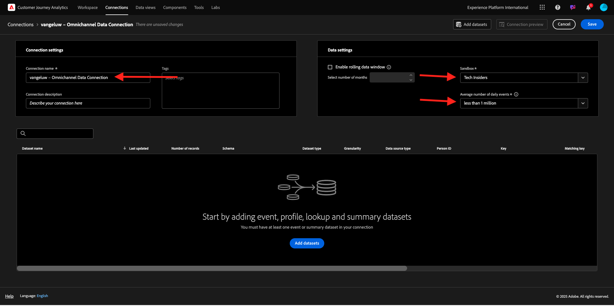
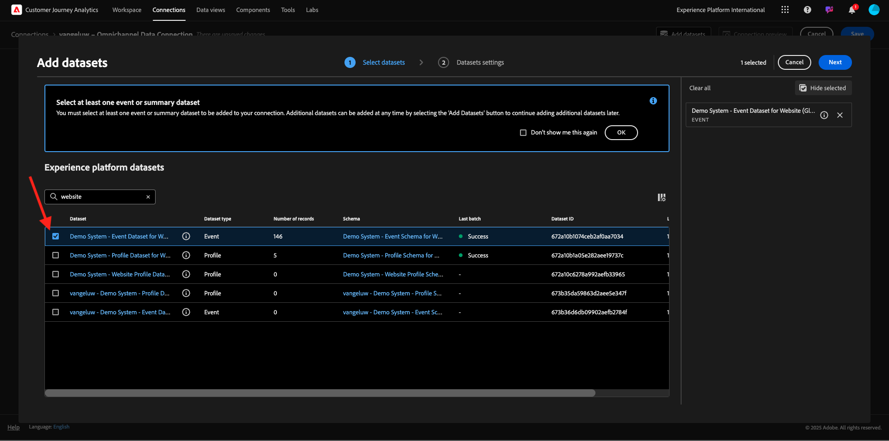

# 1.1.2 Customer Journey AnalyticsでのAdobe Experience Platform データセットの接続

## 目標

- データ接続 UI について
- Adobe Experience Platform データをCJAに取り込む
- 人物 ID とデータステッチについて
- Customer Journey Analyticsでのデータストリーミングの概念について説明します

## 1.1.2.1 Connection

[analytics.adobe.com](https://analytics.adobe.com) に移動して、Customer Journey Analyticsにアクセスします。

Customer Journey Analytics ホームページで、「**接続**」に移動します。

ここでは、CJAと Platform 間で行われたすべての異なる接続を確認できます。 これらの接続の目標は、Adobe Analyticsのレポートスイートと同じです。 ただし、データの収集は完全に異なります。 すべてのデータは、Adobe Experience Platform データセットから取得されます。

最初の接続を作成しましょう。 **新しい接続を作成** をクリックします。

その後、**接続を作成** UI が表示されます。

接続に名前を付けられるようになりました。

命名規則 `--aepUserLdap-- – Omnichannel Data Connection` を使用してください。

また、使用する正しいサンドボックスを選択する必要があります。 サンドボックスメニューで、`--aepSandboxName--` すサンドボックスを選択します。 この例では、サンドボックスは **テクニカルインサイダー** です。 また、**毎日のイベントの平均数** を **100 万未満** に設定する必要があります。

サンドボックスを選択したら、データセットの追加を開始できます。 「**データセットを追加**」をクリックします。

## Adobe Experience Platform データセットを選択してくださ 1.1.2.2

データセット `Demo System - Event Dataset for Website (Global v1.1)` を検索します。 このデータセットのボックスを有効にして、この接続に追加します。

同じ画面にとどまり、`Demo System - Event Dataset for Call Center (Global v1.1)` のチェックボックスを検索して確認します。

これで完了です。 「**次へ**」をクリックします。

## 1.1.2.3 人物 ID とデータのステッチ

### ユーザー ID

現在の目標は、これらのデータセットを結合することです。 選択した各データセットに、「ユーザー ID **というフィールドが表示され** す。 各データセットには、独自のユーザー ID フィールドがあります。

ご覧のように、ほとんどの場合、ユーザー ID が自動的に選択されます。 これは、Adobe Experience Platformのすべてのスキーマでプライマリ ID が選択されているからです。 例えば、`Demo System - Event Schema for Website (Global v1.1)` のスキーマで、プライマリ ID が `ecid` に設定されていることがわかります。

ただし、接続のためにデータセットをつなぎ合わせるために使用する識別子には、引き続き影響を与えることができます。 データセットにリンクされたスキーマに設定されている任意の識別子を使用できます。 ドロップダウンをクリックして、各データセットで使用できる ID を調べます。

前述のように、データセットごとに異なるユーザー ID を設定できます。 これにより、CJAで複数のオリジンの異なるデータセットを統合できます。 NPS や調査データを取り込むと、コンテキストや何かが起きた理由を理解するのに非常に興味深く役立つだろうと想像してください。

ユーザー ID フィールドの値が対応している限り、ユーザー ID フィールドの名前は重要ではありません。 あるデータセットに `email` が含まれ、別のデータセットに `emailAddress` が含まれ、これがユーザー ID として定義されているとします。 両方のデータセットで人物 ID フィールドの値が同じ `delaigle@adobe.com` 合、CJAはデータをステッチできます。

CJAに関する FAQ をここで確認すると、ID のステッチに関するニュアンスを把握できます。[FAQ](https://experienceleague.adobe.com/docs/analytics-platform/using/cja-overview/cja-faq.html)。

### ユーザー ID を使用したデータのステッチ

これで、ユーザー ID を使用してデータセットをステッチするという概念を理解できたので、各データセットのユーザー ID として `email` を選択します。

各データセットに移動して、ユーザー ID を更新します。 次に、ドロップダウンリストで `email` を選択して、「ユーザー ID」フィールドに入力します。

2 つのデータセットをステッチしたら、続行する準備が整います。

| データセット | ユーザー ID |
| ----------------- |-------------| 
| デモシステム - Web サイトのイベントデータセット（グローバル v1.1） | メール |
| デモシステム – コールセンターのイベントデータセット（グローバル v1.1） | メール |

また、両方のデータセットで、次のオプションが有効になっていることを確認する必要があります。

- すべての新しいデータをインポート
- 既存のすべてのデータをバックフィル

（2 番目のデータセットでは、これらのオプションを両方とも有効にすることを忘れないでください）

また、データセットごとに **データソースタイプ** を選択する必要があります。

以下は、データセットの設定です **デモシステム - Web サイトのイベントデータセット（グローバル v1.1）**。

以下は、データセットの設定です **デモシステム - Web サイトのイベントデータセット（グローバル v1.1）**。

「**データセットを追加**」をクリックします。

「**保存**」をクリックして、次の演習に進みます。

**接続** を作成した後、CJAでデータを使用できるようになるまで数時間かかる場合があります。

## 次の手順

[1.1.3 データビューの作成 ](./ex3.md){target="_blank"} に移動します。

[Customer Journey Analytics](./customer-journey-analytics-build-a-dashboard.md){target="_blank"} に戻る

[ すべてのモジュール ](./../../../../overview.md){target="_blank"} に戻る
