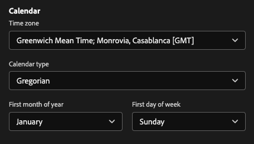
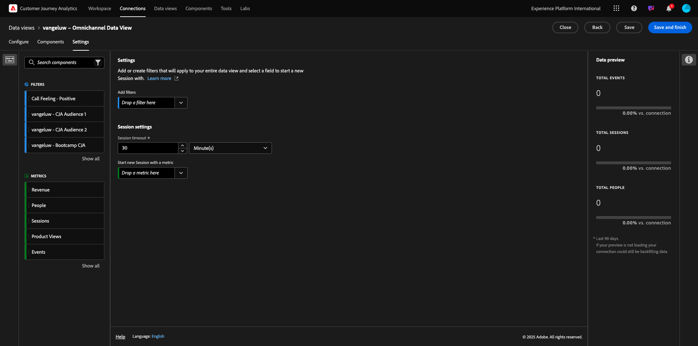

# 1.1.3 データビューの作成

## 目標

- データビュー UI について
- 訪問定義の基本設定を理解する
- データビュー内のアトリビューションと永続性について

## 1.1.3.1 データビュー

接続が完了したら、影響を与えるビジュアライゼーションに進むことができます。 Adobe Analyticsと CJA の違いは、ビジュアライゼーションの前にデータを消去して準備するために CJA にデータビューが必要である点です。

データビューは、Adobe Analyticsの仮想レポートスイートの概念に似ています。コンテキスト対応の訪問の定義、フィルタリングおよびコンポーネントの呼び出し方法を定義します。

接続ごとに少なくとも 1 つのデータビューが必要です。 ただし、一部のユースケースでは、異なるチームに異なるインサイトを与えるために、同じ接続に対して複数のデータビューを持つことが素晴らしいことです。
会社をデータ駆動型にしたい場合は、各チームでのデータの表示方法を調整する必要があります。 次に例を示します。

- UX デザインチーム専用の UX 指標
- Google Analyticsの KPI と指標には、Customer Journey Analyticsと同じ名前を使用します。これにより、デジタル分析チームが 1 か国語しか話せなくなります。
- データビューがフィルタリングされ、1 つのマーケットのみ、1 つのブランド、モバイルデバイスのみのインスタンスデータが表示されるようになりました。

**接続** 画面で、作成した接続の前にあるチェックボックスをオンにします。 **データビューを作成** をクリックします。

**データビューを作成** ワークフローにリダイレクトされます。

## 1.1.3.2 データビューの定義

データビューの基本的な定義を設定できるようになりました。

前の演習で作成した **接続** が既に選択されています。 接続名は `--aepUserLdap-- – Omnichannel Data Connection` です。

次に、データビューに次の命名規則に従った名前を付けます：`--aepUserLdap-- – Omnichannel Data View`。

説明に同じ値を入力します：`--aepUserLdap-- – Omnichannel Data View`。

| 名前 | 説明 | 外部 ID |
| ----------------- |-------------|-------------| 
| `--aepUserLdap-- – Omnichannel Data View` | `--aepUserLdap-- – Omnichannel Data View` | `--aepUserLdap--123` |

**タイムゾーン** には、タイムゾーン **グリニッジ標準時；モンロビア、カサブランカ [GMT]** を選択します。 これは、一部の企業が異なる国や地域で事業を行っているので、非常に興味深い状況です。 各国に適切なタイムゾーンを割り当てることで、例えばペルーでは大多数の人が午前 4 時に T シャツを購入すると信じているなどの、典型的なデータの誤りを避けることができます。

また、メインの指標の命名（「ユーザー」、「セッション」および「イベント」）を変更することもできます。 これは必須ではありませんが、一部のお客様は、ユーザー、セッションおよびイベントの代わりに、ユーザー、訪問およびヒットを使用することを好みます（Customer Journey Analyticsのデフォルトの命名規則）。

これで、次の設定があるはずです。

**保存して続行** をクリックします。

「**保存**」をクリックします。

## 1.1.3.3 データビューコンポーネント

この演習では、データを分析し、Analysis Workspaceを使用して視覚化するために必要なコンポーネントを設定します。 この UI には、主な領域が次の 3 つあります。

- 左側：選択したデータセットから使用可能なコンポーネント
- 中央：データビューにコンポーネントを追加しました
- 右側：コンポーネント設定

次に、分析に必要なコンポーネントを **追加されたコンポーネント** にドラッグ&amp;ドロップする必要があります。 それには、左側のメニューでコンポーネントを選択し、中央のキャンバスにドラッグ&amp;ドロップする必要があります。

最初のコンポーネントから始めましょう。**Name （web.webPageDetails.name）**。 このコンポーネントを検索して、キャンバスにドラッグ&amp;ドロップします。

このコンポーネントは、スキーマフィールド `(web.webPageDetails.name)` の読み取りから派生できるページ名です。

ただし、ビジネスユーザーがこのディメンションをすばやく理解するには、名前として **Name** を使用するのが最適な命名規則ではありません。

名前を **ページ名** に変更します。 コンポーネントをクリックして **コンポーネント設定** 領域で名前を変更します。

本当に重要なのは、「永続性の設定 **です。** eVar と prop の概念は CJA には存在しませんが、永続性設定を使用することで、同様の動作が可能になります。

これらの設定を変更しない場合、CJA はディメンションを **Prop** （ヒットレベル）として解釈します。 また、永続性を変更して、ディメンションを **eVar** にすることができます（ジャーニー全体で値を保持します）。

eVar と Prop に詳しくない場合は、[&#x200B; 詳しくは、ドキュメントを参照 &#x200B;](https://experienceleague.adobe.com/docs/analytics/landing/an-key-concepts.html?lang=ja) してください。

ページ名は小道具のままにしておきます。 そのため、「永続性設定 **を変更する必要はあり** せん。

| 検索するコンポーネント名 | 新しい名前 | 永続性の設定 |
| ----------------- |-------------| --------------------| 
| 名前（web.webPageDetails.name） | ページ名 |          |

次に、**phoneNumber** ディメンションを選択して、キャンバスにドロップします。 新しい名前は **電話番号** にする必要があります。

最後に、携帯電話番号はユーザーレベルで保持される必要があるので、永続性設定を変更します。

永続性を変更するには、右側のメニューで下にスクロールし、「**永続性**」タブを開きます。

チェックボックスをオンにして、永続性設定を変更します。 **最新** と **ユーザー（レポートウィンドウ）** 範囲を選択します。そのユーザーの最後の携帯電話番号のみが対象となるからです。 顧客が今後の訪問でモバイルに入力しない場合でも、この値は生成されます。

| 検索するコンポーネント名 | 新しい名前 | 永続性の設定 |
| ----------------- |-------------| --------------------| 
| phoneNumber | 電話番号 | 最新の人物レポートウィンドウ |

次のコンポーネントは `web.webPageDetails.pageViews.value` です。

左側のメニューで、「`web.webPageDetails.pageViews.value`」を検索します。 この指標をキャンバスにドラッグ&amp;ドロップします。

**コンポーネント設定** の下で、名前を **ページビュー** に変更します。

| 検索するコンポーネント名 | 新しい名前 | アトリビューション設定 |
| ----------------- |-------------| --------------------| 
| web.webPageDetails.pageViews.value | ページビュー数 |         |

アトリビューション設定の場合は、何も変更する必要はありません。

注意：指標の永続性設定は、Analysis Workspaceで変更することもできます。 場合によっては、ビジネスユーザーがどちらが最適な永続性モデルかを考える必要をなくすために、ここに設定することを選択できます。

次に、以下の表に示すように、多くのディメンションと指標を設定する必要があります。

### 寸法

| 検索するコンポーネント名 | 新しい名前 | 永続性の設定 |
| ----------------- |-------------| --------------------| 
| brandName | ブランド名 | 最新、セッション |
| 冷感 | 呼び出し感 |          |
| 呼び出し ID | 呼び出しインタラクションタイプ |          |
| callTopic | トピックの呼び出し | 最新、セッション |
| ecid | ECID | 最新の人物レポートウィンドウ |
| メール | メール ID | 最新の人物レポートウィンドウ |
| 支払タイプ | 支払タイプ |          |
| 商品追加方法 | 商品追加方法 | 最新、セッション |
| イベントタイプ | イベントタイプ |         |
| 名前（productListItems.name） | 製品名 |         |
| SKU | SKU （セッション） | 最新、セッション |
| トランザクション ID | トランザクション ID |         |
| URL （web.webPageDetails.URL） | URL |         |
| ユーザーエージェント | ユーザーエージェント | 最新、セッション |

### 指標

| 検索するコンポーネント名 | 新しい名前 | アトリビューション設定 |
| ----------------- |-------------| --------------------| 
| 数量 | 数量 |          |
| commerce.order.priceTotal | 収益 |         |

設定は次のようになります。 データビューを **保存** することを忘れないでください。 「**保存**」をクリックします。

## 1.1.3.4 計算指標

データビューのすべてのコンポーネントは整理していますが、ビジネスユーザーが分析を開始する準備を整えるために、一部のコンポーネントを調整する必要があります。

以前は、買い物かごに追加、製品表示、購入などの指標をデータビューに明確に取り込んでいませんでした。
ただし、**イベントタイプ** というディメンションは存在します。 したがって、3 つの計算指標を作成して、これらのインタラクションタイプを導き出すことができます。

最初の指標 **製品表示回数** から始めましょう。

左側で **イベントタイプ** を検索し、ディメンションを選択します。 次に、**含まれるコンポーネント** キャンバスにドラッグ&amp;ドロップします。
新しい指標 **イベントタイプ** をクリックして選択します。

コンポーネント名と説明を次の値に変更します。

| コンポーネント名 | コンポーネントの説明 |
| ----------------- |-------------| 
| 製品表示 | 製品表示 |

では、**製品表示** イベントのみをカウントできるようになりました。 それには、**除外値を含める** が表示されるまで **コンポーネント設定** を下にスクロールします。 必ず「値を含める/除外 **オプションを有効に** ます。

**製品表示** のみをカウントする場合は、条件の下で **commerce.productViews** を指定してください。

これで、計算指標の準備が整いました。

次に、**買い物かごに追加** イベントと **購入** イベントに対して同じプロセスを繰り返します。

### カートに追加

まず、同じディメンション **イベントタイプ** をドラッグ&amp;ドロップします。

同じ変数を使用しているので、重複したフィールドがポップアップで警告されます。 「**とにかく追加する** をクリックしてください：

ここで、指標「製品表示回数」と同じプロセスに従います。
- まず、名前と説明を変更します。
- 最後に、カウントする条件として **commerce.productListAdds** を追加します買い物かごに追加

| 名前 | 説明 | 条件 |
| ----------------- |-------------| -------------|
| カートに追加 | カートに追加 | commerce.productListAdds |

### 購入

まず、以前の両方の指標の場合と同じように、同じディメンション **イベントタイプ** をドラッグ&amp;ドロップします。

同じ変数を使用しているので、重複したフィールドがポップアップで警告されます。 「**とにかく追加する** をクリックしてください：

ここで、指標「製品表示」と「買い物かごに追加」と同じプロセスに従います。
- まず、名前と説明を変更します。
- 最後に、買い物かごにのみ追加をカウントする条件として **commerce.purchases** を追加します

| 名前 | 説明 | 条件 |
| ----------------- |-------------| -------------|
| 購入 | 購入 | commerce.purchases |

最終的な設定は次のようになります。 **保存して続行** をクリックします。

## 1.1.3.5 データビュー設定

この画面にリダイレクトされます。

このタブでは、重要な設定を変更して、データの処理方法を変更できます。 まず、**セッションタイムアウト** を 30 分に設定します。 すべてのエクスペリエンスイベントのタイムスタンプにより、セッションの概念をすべてのチャネルにわたって拡張できます。 例えば、顧客が web サイトにアクセスした後にコールセンターに電話するとどうなりますか？ カスタムセッションタイムアウトを使用すると、セッションの内容や、そのセッションでデータをどのように結合するかを柔軟に決定できます。

このタブでは、セグメント/フィルターを使用したデータのフィルタリングなど、他の操作を変更できます。 この演習ではそれをする必要はありません。

完了したら、「保存して終了 **をクリックし** ください。

>[!NOTE]
>
>後でこのデータビューに戻って、いつでも設定やコンポーネントを変更できます。 変更は、履歴データの表示方法に影響します。

これで、ビジュアライゼーションと分析のパーツを続行できます。

## 次の手順

Customer Journey Analyticsの [1.1.4 データ準備 &#x200B;](./ex4.md){target="_blank"} （/ex2.md） 

[Customer Journey Analytics](./customer-journey-analytics-build-a-dashboard.md){target="_blank"} に戻る

[&#x200B; すべてのモジュール &#x200B;](./../../../../overview.md){target="_blank"} に戻る
