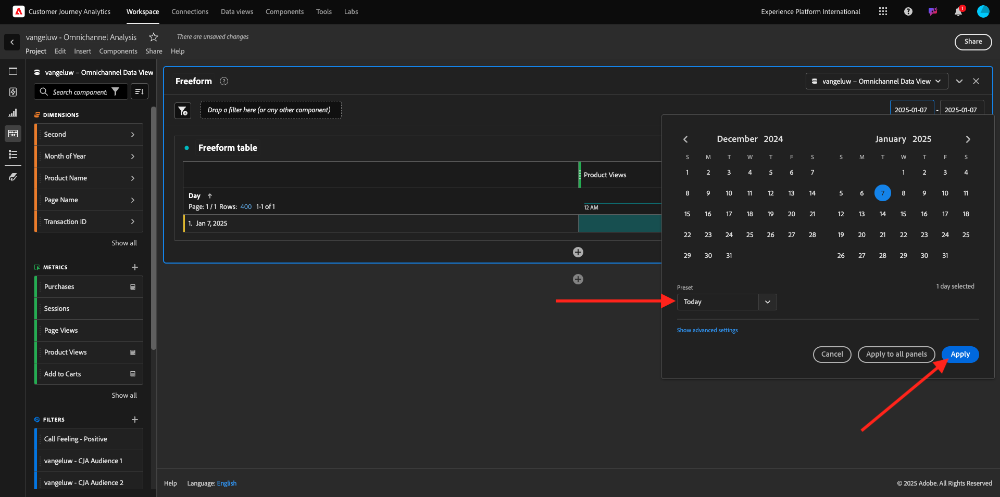
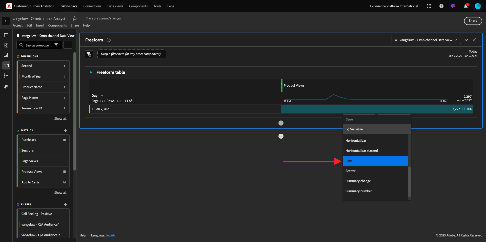
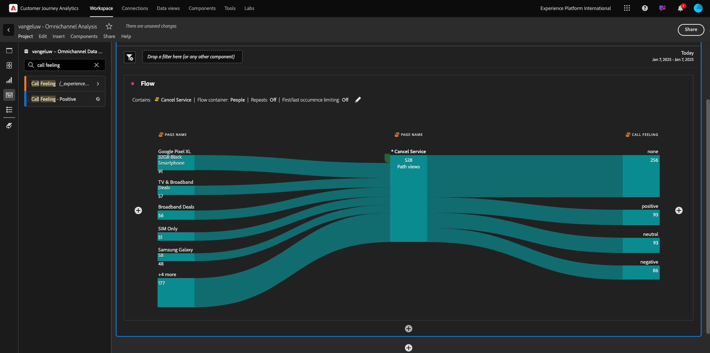

# 1.1.5 Customer Journey Analyticsを使用したビジュアライゼーション

## 目標

- Analysis Workspace UI について
- Analysis Workspaceを非常に異ならせる機能について説明します。
- Analysis Workspaceを使用して CJA で分析する方法を説明します

## コンテキスト

この演習では、CJA 内でAnalysis Workspaceを使用して、商品ビュー、商品ファネル、チャーンなどを分析します。

モジュール 7 - クエリサービスで行われるクエリの一部を取り上げ、SQL を使用したり、Analysis Workspaceのドラッグ&amp;ドロップ哲学にのみ依存したりすることなく、同じクエリなどを簡単に実行できることを確認します。

[1.1.4 Analysis Workspaceのデータ準備 ](./ex4.md) で作成したプロジェクトを使用するので、[https://analytics.adobe.com](https://analytics.adobe.com) に移動します。

クリックして、プロジェクト `--aepUserLdap-- - Omnichannel Analysis` を開きます。

プロジェクトを開き、データビューを選択し `--aepUserLdap-- - Omnichannel Analysis`、最初のビジュアライゼーションの作成を開始する準備が整います。

## 1 日あたりの製品表示数

まず第一に、データを分析するために適切な日付を選択する必要があります。 キャンバスの右側にあるカレンダードロップダウンに移動します。 クリックして、該当する日付範囲を選択します。

左側のメニュー（コンポーネント領域）で、計算指標 **製品表示** を見つけます。 選択して、キャンバスのフリーフォームテーブル内の右上にドラッグ&amp;ドロップします。

自動的にディメンション **日** が追加され、最初のテーブルが作成されます。 今、あなたはあなたの質問がその場で答えられるのを見ることができます。

次に、指標の概要を右クリックします。 **視覚化** をクリックします。

**線** をクリックします。

製品ビューが時間別に表示されます。

ビジュアライゼーション内の **設定** をクリックして、時間範囲を日に変更できます。

**折れ線グラフ** の横にある点をクリックして、**データSourceを管理** します。

次に、「**選択をロック**」をクリックし、「**選択された項目** を選択してこのビジュアライゼーションをロックし、常に製品表示のタイムラインを表示します。

## 閲覧された上位 5 製品

閲覧された上位 5 製品は何ですか？

ときどきプロジェクトを保存することを忘れないでください。

| OS | ショートカット |
| ----------------- |-------------| 
| Windows | コントロール + S |
| Mac | Command + S |

表示された上位 5 つの製品の検索を開始します。 左側のメニューで、**製品名** - Dimensionを見つけます。

**製品名** をドラッグ&amp;ドロップして、**日** ディメンションを置き換えます。

これは結果になります。 4 つの製品名を選択すると、ビジュアライゼーションの更新が表示されます。

次に、いずれかの製品をブランド名で分類してみてください。 **brandName** を検索して、最初の製品名の下にドラッグします。

次に、ユーザーエージェントを使用して分類を実行します。 **ユーザーエージェント** を検索し、ブランド名の下にドラッグします。

次の画面が表示されます。

最後に、ビジュアライゼーションをさらに追加できます。 左側のビジュアライゼーションで、`Donut` を検索します。 `Donut` れを実行し、**折れ線グラフ** ビジュアライゼーションの下のキャンバスにドラッグ&amp;ドロップします。

次に、テーブルで、**Google Pixel XL 32GB Black Smartphone** > **Citi Signal** の分類から最初の 5 つの **User Agent** 行を選択します。 3 つの行を選択する際は、**Ctrl** ボタン（Windows の場合）または **Command** ボタン（Macの場合）を押したままにします。 ドーナツグラフが更新されます。

**折れ線グラフと** ドーナツ **グラフの両方を少し小さくして、隣り合わせに収まるようにデザインを調整することで、読みやすいようにデザインを調整することもでき** す。

**ドーナツ** の横の点をクリックして、**データSourceを管理** します。
次に、**選択をロック** をクリックして、このビジュアライゼーションをロックし、常に製品表示のタイムラインを表示します。

Analysis Workspaceを使用したビジュアライゼーションの詳細については、次を参照してください。

- [https://experienceleague.adobe.com/docs/analytics/analyze/analysis-workspace/visualizations/freeform-analysis-visualizations.html?lang=ja](https://experienceleague.adobe.com/docs/analytics/analyze/analysis-workspace/visualizations/freeform-analysis-visualizations.html?lang=ja)
- [https://experienceleague.adobe.com/docs/analytics/analyze/analysis-workspace/visualizations/t-sync-visualization.html?lang=ja](https://experienceleague.adobe.com/docs/analytics/analyze/analysis-workspace/visualizations/t-sync-visualization.html?lang=ja)

## 製品インタラクションファネル、表示から購入まで

この問題を解く方法はたくさんある。 その 1 つは、製品インタラクションタイプを使用して、フリーフォームテーブルで使用することです。 もう 1 つの方法は、**フォールアウトビジュアライゼーション** を使用することです。 最後のものを使用して、視覚化と分析を同時に行いましょう。

ここをクリックして、現在のパネルを閉じます。

次に、「**+空のパネルを追加**」をクリックして新しい空のパネルを追加します。

ビジュアライゼーション **フォールアウト** をクリックします。

前の演習と同じ日付範囲を選択します。

その後、これが表示されます。

左側のコンポーネントの下で、ディメンション **イベントタイプ** を見つけます。 矢印をクリックして寸法を開きます。

利用可能なすべてのイベントタイプが表示されます。

項目 **commerce.productViews** を選択し、「**フォールアウトビジュアライゼーション**」内の **タッチポイントを追加** フィールドにドラッグ&amp;ドロップします。

**commerce.productListAdds** と **commerce.purchases** で同じことを行い、**フォールアウトビジュアライゼーション** 内の **タッチポイントを追加** フィールドにドロップします。 ビジュアライゼーションは次のようになります。

ここでは多くの作業を行うことができます。 例：時間の経過と共に比較したり、デバイス別に各ステップを比較したり、ロイヤルティ別に比較したりできます。 ただし、買い物かごに商品を追加した後に顧客が購入しない理由などの興味深い点を分析したい場合は、CJA の最適なツールを使用できます。右クリックします。

タッチポイント **commerce.productListAdds** を右クリックします。 次に、「このタッチポイントでのフォールアウトを分類 **をクリックし** す。

新しいフリーフォームテーブルが作成され、購入しなかった場合の行動を分析します。

新しいフリーフォームテーブルで **ページ名** を使用して **イベントタイプ** を変更し、購入確認ページの代わりに表示するページを確認します。

## 「サービスをキャンセル」ページに到達する前に、サイトではどのような作業を行いますか？

繰り返しますが、この分析を実行する方法はたくさんあります。 フロー分析を使用して、検出部分を開始します。

ここをクリックして現在のパネルを閉じ、「**+空のパネルを追加**」をクリックして新しい空のパネルを追加します。

ビジュアライゼーション **フロー** をクリックします。

その後、これが表示されます。 前の演習と同じ日付範囲を選択します。 「**適用**」をクリックします。

左側のコンポーネントの下にあるディメンション **ページ名** を見つけ、矢印をクリックしてディメンションを開きます。

すべてのページが表示されます。 「**サービスをキャンセル**」というページ名を見つけます。
**サービスをキャンセル** を中央のフィールドのフロービジュアライゼーションにドラッグ&amp;ドロップします。 **ビルド** をクリックします。

次の画面が表示されます。

次に、Web サイトの **サービスをキャンセル** ページを訪問した顧客がコールセンターを呼び出したかどうか、および結果が何であるかを分析します。

ディメンションの下に戻り、**通話インタラクションタイプ** を見つけます。
**コールインタラクションタイプ** をドラッグ&amp;ドロップして、**フロービジュアライゼーション** 内の右側にある最初のインタラクションを置き換えます。

**サービスをキャンセル** ページにアクセスすると、コールセンターに電話したお客様のサポートチケットが表示されます。

次に、ディメンションの下で、**通話感** を検索します。  **フロービジュアライゼーション** 内の右側にある最初のインタラクションを置き換えるには、ドラッグ&amp;ドロップします。

次の画面が表示されます。

ご覧のように、フロービジュアライゼーションを使用してオムニチャネル分析を実行しました。 そのおかげでサービスをキャンセルしようと思っていたお客様には、コールセンターに電話した後の気持ちが良かったようです。 昇進によって考えが変わったのでしょうか？

## Callcenter に肯定的なコンタクトを持つお客様は、メイン KPI に対してどのようにパフォーマンスを示していますか。

最初に、**ポジティブ** 呼び出しを持つユーザーのみを取得するデータをセグメント化します。 CJA では、セグメントはフィルターと呼ばれます。 コンポーネント領域内（左側）のフィルターに移動し、「**+**」をクリックします。

フィルタービルダーで、フィルターに名前を付けます

| 名前 | 説明 |
| ----------------- |-------------| 
| 呼び出し時の操作性 – ポジティブ | 呼び出し時の操作性 – ポジティブ |

（フィルタービルダー内の）コンポーネントの下で、「コールフィーリング **を見つけ** フィルタービルダー定義にドラッグ&amp;ドロップします。

次に、フィルターの値として **正** を選択します。

範囲を **ユーザー** レベルに変更します。 「**保存**」をクリックします。

その後、ここに戻ります。 まだ完了していない場合は、前のパネルを閉じ、「**+空のパネルを追加**」をクリックして新しい空のパネルを追加します。

前の演習と同じ日付範囲を選択します。 「**適用**」をクリックします。

**フリーフォームテーブル** をクリックします。

次に、作成したフィルターをドラッグ&amp;ドロップします。

指標を追加する時間。 **製品表示** から開始します。 フリーフォームテーブルにドラッグ&amp;ドロップします。 **イベント** 指標を削除することもできます。

**人物**、**買い物かごに追加** および **購入** についても、同じ操作を行います。 こんなテーブルになるよ。

最初のフロー分析のおかげで、新しい問題が頭に浮かびました。 そこで、このテーブルを作成し、セグメントに対するいくつかの KPI を確認して、その質問に答えることにしました。 ご覧のように、インサイトを得るまでの時間は、SQL や他の BI ソリューションを使用するよりもはるかに高速です。

## Customer Journey AnalyticsとAnalysis Workspaceのまとめ

このラボで学んだように、Analysis Workspaceは、すべてのチャネルのデータをステッチして、カスタマージャーニー全体を分析します。 また、ジャーニーにステッチされていない同じワークスペースにデータを取り込むこともできます。
切断されたデータを分析に取り込んで、ジャーニーにコンテキストを提供すると非常に便利です。 例えば、NPS データ、調査、Facebook 広告イベント、オフラインインタラクション（未識別）などがあります。

## 次の手順

[ 概要とメリット ](./summary.md){target="_blank"} に移動します。

[Customer Journey Analytics](./customer-journey-analytics-build-a-dashboard.md){target="_blank"} に戻る

[ すべてのモジュール ](./../../../../overview.md){target="_blank"} に戻る
