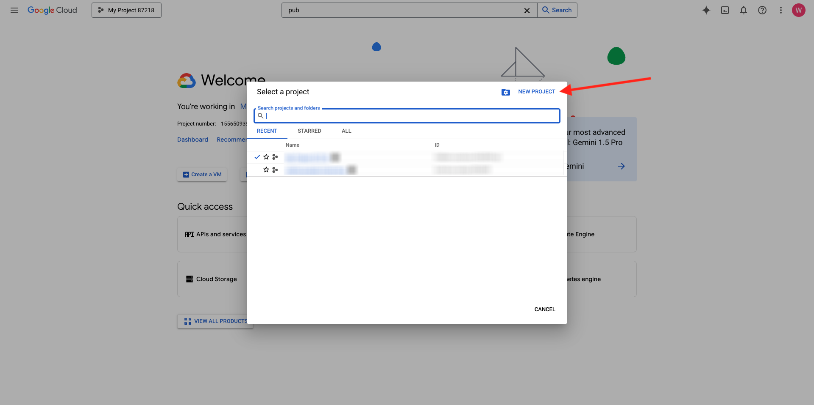

# 1.2.1 Google Cloud Platform の使用を開始する

>[!NOTE]
>
>この演習では、Google Cloud Platform 環境にアクセスする必要があります。 まだ GCP へのアクセス権がない場合は、個人のメールアドレスを使用して新しいアカウントを作成します。

## 1.2.1.1 Google BigQuery をAdobe Experience Platformに接続してGoogle Analytics データを取得する理由

Google Cloud Platform （GCP）は、Googleが提供するパブリッククラウドコンピューティングサービスのスイートです。 Google Cloud Platform には、Google ハードウェア上で実行される、コンピューティング、ストレージ、アプリケーション開発用のホストされたサービスが幅広く含まれています。

BigQuery は、これらのサービスの 1 つであり、常にGoogle Analytics 360 に含まれています。 Google Analytics データは、データを直接取得しようとする場合に、頻繁にサンプリングされます（API など）。 そのため、Googleには BigQuery が含まれており、サンプルされていないデータを取得できるため、企業は SQL を使用してアドバンス分析を実行でき、GCP の機能を活用できます。

Google Analyticsのデータは、バッチメカニズムを使用して BigQuery に毎日読み込まれます。 したがって、この GCP/BigQuery 統合をリアルタイムパーソナライゼーションおよびアクティベーションのユースケースに使用することは意味がありません。

ブランドがGoogle Analytics データに基づいてリアルタイムパーソナライゼーションのユースケースを提供したい場合、Google Tag Manager を使用して web サイト上でそのデータを収集し、リアルタイムでAdobe Experience Platformにストリーミングできます。

GCP/BigQuery Source コネクタは、以下の目的で使用する必要があります。

- web サイト上のすべての顧客行動を追跡し、そのデータをAdobe Experience Platformに読み込むことで、リアルタイムのアクティベーションを必要としない分析、データサイエンス、パーソナライゼーションのユースケースを実現します。
- Google Analyticsの履歴データをAdobe Experience Platformに読み込み、分析やデータサイエンスのユースケースにも使用する

## 1.2.1.2 Google アカウント

>[!NOTE]
>
>この演習では、Google Cloud Platform 環境にアクセスする必要があります。 まだ GCP へのアクセス権がない場合は、個人のメールアドレスを使用して新しいアカウントを作成します。

## 1.2.1.3 プロジェクトの選択または作成

[https://console.cloud.google.com/](https://console.cloud.google.com/) に移動します。

次に、「**プロジェクトを選択** または既存のプロジェクトをクリックします。

まだプロジェクトがない場合は、「**新規プロジェクト**」をクリックします。 既にプロジェクトがある場合は、そのプロジェクトを選択して次の手順に進むことができます。

この命名規則に従ってプロジェクトに名前を付けます。 **作成** をクリックします。

| 条約 |
| ----------------- |
| `--aepUserLdap---googlecloud` |

画面の右上に表示される通知で、作成が完了したことが示されるまで待ちます。 次に、「**プロジェクトを選択**」をクリックします。

次に、画面上部の検索バーに移動し、「**BigQuery**」と入力します。 最初の結果を選択します。

このモジュールの目標は、Google Analytics データをAdobe Experience Platformに取り込むことです。 そのためには、最初にGoogle Analytics データセットにダミーデータが必要です。

「**+追加**」をクリックし、右側のメニューで **公開データセット** をクリックします。

次のウィンドウが表示されます。

検索バーに検索語句「**Google Analytics サンプル**」を入力し、最初の検索結果をクリックします。

次の画面に、データセットの説明が表示されます。 **データセットを表示** をクリックします。

その後、BigQuery にリダイレクトされ、この **bigquery-public-data** データセットが **エクスプローラー** に表示されます。

**エクスプローラー** には、多数のテーブルが表示されます。 自由に探索してください。 `google_analytics_sample` に移動します。

クリックしてテーブル `ga_sessions` を開きます。

次の演習に進む前に、次の内容をコンピュータ上の別のテキスト ファイルに書き留めてください。

| 資格情報 | 名前付け | 例 |
| ----------------- |-------------| -------------|
| プロジェクト名 | `--aepUserLdap---googlecloud` | vangeluw-googlecloud |
| プロジェクト ID | random | possible-bee-447102-h3 |

上部のメニューバーで **プロジェクト名** をクリックすると、プロジェクト名とプロジェクト ID を確認できます。

プロジェクト ID が右側に表示されます。

次の演習に進むには、Google Analytics データにクエリを実行して手を汚します。

## 次の手順

[1.2.2 BigQuery で最初のクエリを作成する ](./ex2.md){target="_blank"} に移動します。

[BigQuery Source コネクタを使用した、Adobe Experience PlatformでのGoogle Analytics データの取り込みと分析 ](./customer-journey-analytics-bigquery-gcp.md){target="_blank"} に戻る

[ すべてのモジュール ](./../../../../overview.md){target="_blank"} に戻る
