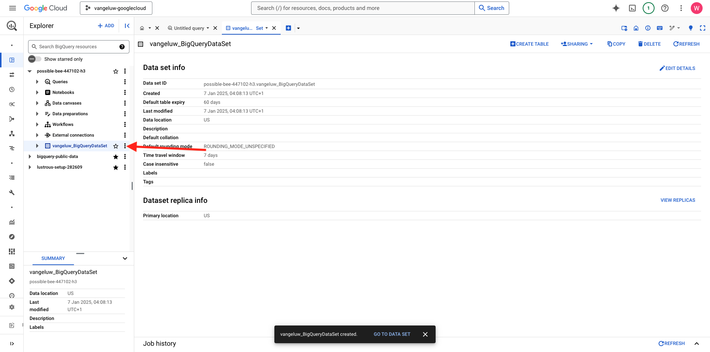
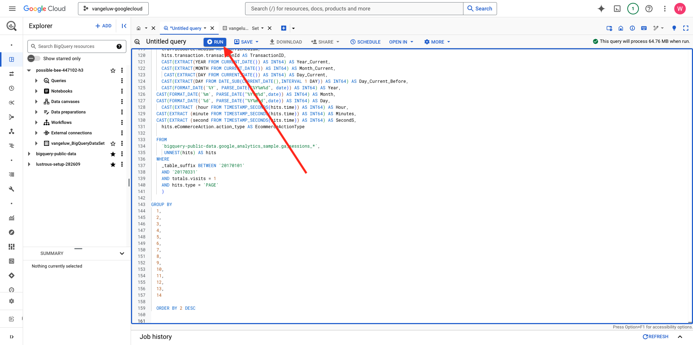
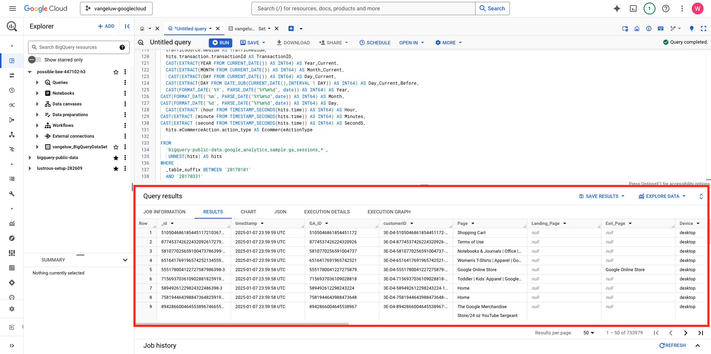
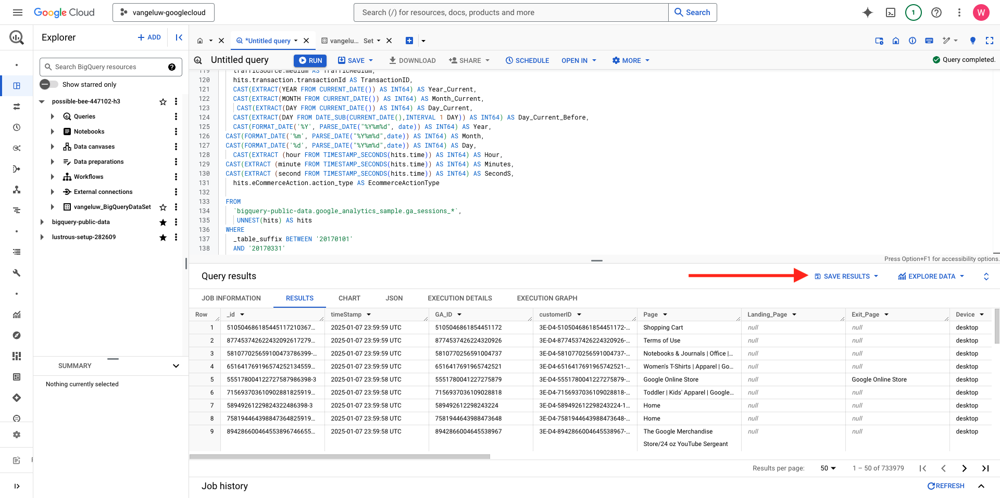
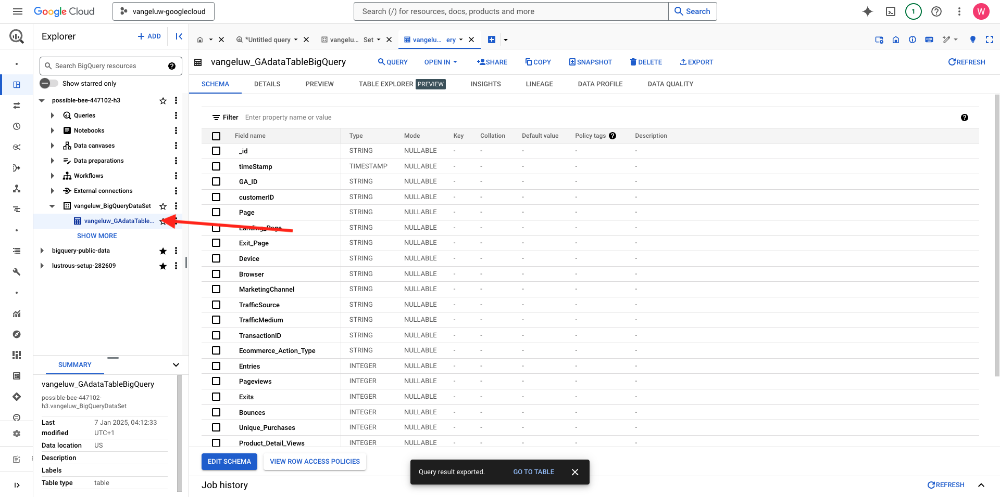

# 1.2.2 BigQuery で最初のクエリを作成する

## 目標

- BigQuery UI の探索
- BigQuery 内での SQL クエリの作成
- SQL クエリの結果を BigQuery 内のデータセットに保存する

## コンテキスト

Google Analytics データが BigQuery の場合、ディメンション、指標、その他の変数はすべてネストされます。 また、Google Analytics データは毎日異なるテーブルに読み込まれます。 つまり、BigQuery 内のGoogle Analytics テーブルをAdobe Experience Platformに直接接続しようとするのは非常に困難であり、良い考えではありません。

この問題の解決策は、Google Analytics データを読み取り可能な形式に変換して、Adobe Experience Platformへの取り込みを容易にすることです。

## 1.2.2.1 新しい BigQuery テーブルを保存するデータセットを作成する

[BigQuery コンソール &#x200B;](https://console.cloud.google.com/bigquery) に移動します。


**エクスプローラー** には、プロジェクト ID が表示されます。 プロジェクト ID をクリックします（**bigquery-public-data** データセットをクリックしないでください）。


データセットがまだないことがわかるので、今すぐ作成します。
「3 **...**」をクリックし、「**データセットを作成**」をクリックします。


画面の右側に、**データセットを作成** メニューが表示されます。


**データセット ID** には、次の命名規則を使用します。 その他のフィールドは、デフォルト設定のままにしてください。

| 名前付け | 例 |
| ----------------- | ------------- | 
| `--aepUserLdap--_BigQueryDataSet` | vangeluw_BigQueryDataSet |

**データセットを作成** をクリックします。


データセットが作成された状態で、BigQuery コンソールに戻ります。



## 1.2.2.2 最初の SQL BigQuery を作成する

次に、BigQuery で最初のクエリを作成します。 このクエリの目的は、Google Analyticsのサンプルデータを取得し、Adobe Experience Platformで取り込めるように変換することです。 「**名称未設定クエリ**」タブに移動します。


次の SQL クエリをコピーして、そのクエリエディターに貼り付けます。 このクエリをお読みいただき、Google Analytics BigQuery 構文を理解してください。


```sql
SELECT
  CONCAT(fullVisitorId, CAST(hitTime AS String), '-', hitNumber) AS _id,
  TIMESTAMP(DATETIME(Year_Current, Month_Current, Day_Current, Hour, Minutes, Seconds)) AS timeStamp,
  fullVisitorId as GA_ID,
  -- Fake CUSTOMER ID
  CONCAT('3E-D4-',fullVisitorId, '-1W-93F' ) as customerID,
  Page,
  Landing_Page,
  Exit_Page,
  Device,
  Browser,
  MarketingChannel,
  TrafficSource,
  TrafficMedium,
  -- Enhanced Ecommerce
  TransactionID,
  CASE
      WHEN EcommerceActionType = '2' THEN 'Product_Detail_Views'
      WHEN EcommerceActionType = '3' THEN 'Adds_To_Cart'
      WHEN EcommerceActionType = '4' THEN 'Product_Removes_From_Cart'
      WHEN EcommerceActionType = '5' THEN 'Product_Checkouts'
      WHEN EcommerceActionType = '6' THEN 'Product_Refunds'
    ELSE
    NULL
  END
     AS Ecommerce_Action_Type,
  -- Entrances (metric)
  SUM(CASE
      WHEN isEntrance = TRUE THEN 1
    ELSE
    0
  END
    ) AS Entries,
    
--Pageviews (metric)
    COUNT(*) AS Pageviews,
    
 -- Exits 
    SUM(
    IF
      (isExit IS NOT NULL,
        1,
        0)) AS Exits,
        
 --Bounces
   SUM(CASE
      WHEN isExit = TRUE AND isEntrance = TRUE THEN 1
    ELSE
    0
  END
    ) AS Bounces,
        
  -- Unique Purchases (metric)
  COUNT(DISTINCT TransactionID) AS Unique_Purchases,
  -- Product Detail Views (metric)
  COUNT(CASE
      WHEN EcommerceActionType = '2' THEN fullVisitorId
    ELSE
    NULL
  END
    ) AS Product_Detail_Views,
  -- Product Adds To Cart (metric)
  COUNT(CASE
      WHEN EcommerceActionType = '3' THEN fullVisitorId
    ELSE
    NULL
  END
    ) AS Adds_To_Cart,
  -- Product Removes From Cart (metric)
  COUNT(CASE
      WHEN EcommerceActionType = '4' THEN fullVisitorId
    ELSE
    NULL
  END
    ) AS Product_Removes_From_Cart,
  -- Product Checkouts (metric)
  COUNT(CASE
      WHEN EcommerceActionType = '5' THEN fullVisitorId
    ELSE
    NULL
  END
    ) AS Product_Checkouts,
  -- Product Refunds (metric)
  COUNT(CASE
      WHEN EcommerceActionType = '7' THEN fullVisitorId
    ELSE
    NULL
  END
    ) AS Product_Refunds
  FROM (
  SELECT
    -- Landing Page (dimension)
    CASE
      WHEN hits.isEntrance = TRUE THEN hits.page.pageTitle
    ELSE NULL
  END
    AS Landing_page,
    
        -- Exit Page (dimension)
    CASE
      WHEN hits.isExit = TRUE THEN hits.page.pageTitle
    ELSE
    NULL
  END
    AS Exit_page,
    
    hits.page.pageTitle AS Page,
    hits.isEntrance,
    hits.isExit,
    hits.hitNumber as hitNumber,
    hits.time as hitTime,
    date as Fecha,
    fullVisitorId,
    visitStartTime,
    device.deviceCategory AS Device,
    device.browser AS Browser,
    channelGrouping AS MarketingChannel,
    trafficSource.source AS TrafficSource,
    trafficSource.medium AS TrafficMedium,
    hits.transaction.transactionId AS TransactionID,
    CAST(EXTRACT(YEAR FROM CURRENT_DATE()) AS INT64) AS Year_Current,
    CAST(EXTRACT(MONTH FROM CURRENT_DATE()) AS INT64) AS Month_Current,
     CAST(EXTRACT(DAY FROM CURRENT_DATE()) AS INT64) AS Day_Current,
    CAST(EXTRACT(DAY FROM DATE_SUB(CURRENT_DATE(),INTERVAL 1 DAY)) AS INT64) AS Day_Current_Before,
    CAST(FORMAT_DATE('%Y', PARSE_DATE("%Y%m%d", date)) AS INT64) AS Year,
  CAST(FORMAT_DATE('%m', PARSE_DATE("%Y%m%d",date)) AS INT64) AS Month,
  CAST(FORMAT_DATE('%d', PARSE_DATE("%Y%m%d",date)) AS INT64) AS Day,
    CAST(EXTRACT (hour FROM TIMESTAMP_SECONDS(hits.time)) AS INT64) AS Hour,
  CAST(EXTRACT (minute FROM TIMESTAMP_SECONDS(hits.time)) AS INT64) AS Minutes,
  CAST(EXTRACT (second FROM TIMESTAMP_SECONDS(hits.time)) AS INT64) AS SecondS,
    hits.eCommerceAction.action_type AS EcommerceActionType
  
  FROM
    `bigquery-public-data.google_analytics_sample.ga_sessions_*`,
     UNNEST(hits) AS hits
  WHERE
    _table_suffix BETWEEN '20170101'
    AND '20170331'
    AND totals.visits = 1
    AND hits.type = 'PAGE'
    )
    
GROUP BY
  1,
  2,
  3,
  4,
  5,
  6,
  7,
  8,
  9,
  10,
  11,
  12,
  13,
  14
    
  ORDER BY 2 DESC
```

準備が整ったら、「**実行** をクリックしてクエリを実行します。



クエリの実行には数分かかることがあります。

クエリの実行が完了すると、次の出力が **クエリ結果** に表示されます。



## 1.2.2.3 BigQuery SQL クエリの結果を保存する

次の手順では、「結果を保存 **ボタンをクリックしてクエリの出力を保存し** す。



出力の場所として、「**BigQuery テーブル**」を選択します。


**プロジェクト名** と **データセット名** が事前入力された新しいポップアップが表示されます。 データセット名は、この演習の最初に作成したデータセットである必要があります（命名規則は次のとおりです）。

| 名前付け | 例 |
| ----------------- | ------------- | 
| `--aepUserLdap--_BigQueryDataSet` | `vangeluw_BigQueryDataSet` |

テーブル名を入力する必要があります。 次の命名規則を使用してください。

| 名前付け | 例 |
| ----------------- |------------- | 
| `--aepUserLdap--_GAdataTableBigQuery` | `vangeluw_GAdataTableBigQuery` |

**保存** をクリックします。


作成したテーブルでデータが準備できるようになるまで、時間がかかる場合があります。 数分後、ブラウザーを更新します。 データセット内に、BigQuery プロジェクト内の **エクスプローラー** の下にある `--aepUserLdap--_GAdataTableBigquery` テーブルが表示されます。



次の演習に進みます。ここでは、このテーブルをAdobe Experience Platformに接続します。

## 次の手順

[1.2.3 GCP と BigQuery をAdobe Experience Platformに接続に移動 &#x200B;](./ex3.md){target="_blank"}

[BigQuery Source コネクタを使用した、Adobe Experience PlatformでのGoogle Analytics データの取り込みと分析 &#x200B;](./customer-journey-analytics-bigquery-gcp.md){target="_blank"} に戻る

[&#x200B; すべてのモジュール &#x200B;](./../../../../overview.md){target="_blank"} に戻る
