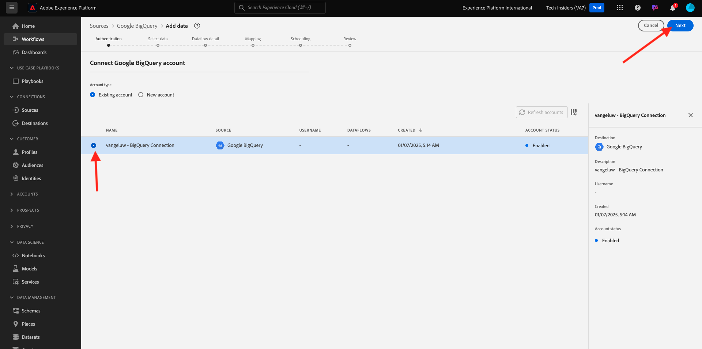

# 1.2.4 BigQuery からAdobe Experience Platformへのデータのロード

## 目標

- BigQuery データの XDM スキーマへのマッピング
- BigQuery データのAdobe Experience Platformへの読み込み
- BigQuery Source コネクタ UI の理解

## 事前準備

前の演習が完了したら、Adobe Experience Platformでこのページを開く必要があります。

**開いている場合は、次の演習に進みます。**

**開いていない場合は、[Adobe Experience Platform](https://experience.adobe.com/platform/home) に移動してください。**

左側のメニューで、「ソース」に移動します。 その後、**Sources** ホームページが表示されます。 **ソース** メニューで、**Google BigQuery** ソースコネクタに移動し、**設定** をクリックします。

Google BigQuery アカウント選択画面が表示されます。 アカウントを選択して、「**次へ**」をクリックします。

次に、**データを選択** 画面が表示されます。

## 1.2.4.1 BigQuery テーブルの選択

**データを選択** 画面で、BigQuery データセットを選択します。 BigQuery でGoogle Analytics データのサンプルデータプレビューを確認できるようになりました。

「**次へ**」をクリックします。

## 1.2.4.2 XDM マッピング

次の項目が表示されます。

次に、新しいデータセットを作成するか、既存のデータセットを選択して、Google Analytics データをに読み込む必要があります。 この演習では、データセットとスキーマは既に作成されています。 新しいスキーマやデータセットを作成する必要はありません。

**既存のデータセット** を選択します。 ドロップダウンメニューを開いて、データセットを選択します。 `Demo System - Event Dataset for BigQuery (Global v1.1)` という名前のデータセットを検索して選択します。 「**次へ**」をクリックします。

下にスクロールします。 次に、すべての **Source フィールド** を、Google Analytics/BigQuery から XDM **ターゲットフィールド** に、フィールドごとにマッピングする必要があります。 多数のエラーが表示される場合があります。これらは、以下のマッピング演習で対処します。

この演習では、以下のマッピングテーブルを使用します。

| ソースフィールド | ターゲットフィールド |
| ----------------- |-------------| 
| `_id` | `_id` |
| `_id` | チャネル。_id |
| `timeStamp` | タイムスタンプ |
| `GA_ID` | ``--aepTenantId--``.identification.core.gaid |
| `customerID` | ``--aepTenantId--``。identification.core.crmId |
| `Page` | web.webPageDetails.name |
| `Device` | device.type |
| `Browser` | environment.browserDetails.vendor |
| `MarketingChannel` | marketing.trackingCode |
| `TrafficSource` | channel.typeAtSource |
| `TrafficMedium` | channel.mediaType |
| `TransactionID` | commerce.order.payments.transactionID |
| `Ecommerce_Action_Type` | eventType |
| `Pageviews` | web.webPageDetails.pageViews.value |

一部のフィールドでは、元のマッピングを削除し、**計算フィールド** 用に新しいマッピングを作成する必要があります。

| 計算済みフィールド | ターゲットフィールド |
| ----------------- |-------------| 
| `iif(Unique_Purchases == null, 0, Unique_Purchases)` | commerce.purchases.value |
| `iif(Product_Detail_Views == null, 0, Product_Detail_Views)` | commerce.productViews.value |
| `iif(Adds_To_Cart == null, 0, Adds_To_Cart)` | commerce.productListAdds.value |
| `iif(Product_Removes_From_Cart == null, 0, Product_Removes_From_Cart), 1, 0)` | commerce.productListRemovals.value |
| `iif(Product_Checkouts == null, 0, Product_Checkouts)` | commerce.checkouts.value |

**計算フィールド** を作成するには、[**+新しいフィールドの種類 ] をクリックし**&#x200B;[**計算フィールド**] をクリックします。

上記のルールを貼り付け、上記のテーブルの各フィールドに対して **保存** をクリックします。

これで、このような **マッピング** が作成されました。

ソースフィールド **GA_ID** および **customerID** は、この XDM スキーマの識別子にマッピングされます。 これにより、ロイヤルティやコールセンターデータなどの他のデータセットを使用して、Google Analytics データ（web/アプリの行動データ）を強化できます。

「**次へ**」をクリックします。

## 1.2.4.3 接続とデータ取得スケジュール

「**スケジュール**」タブが表示されます。

「**スケジュール**」タブでは、この **マッピング** とデータのデータ取り込みプロセスの頻度を定義できます。

Google BigQuery でデモデータを使用していますが、これは更新されないので、この演習でスケジュールを設定する実際の必要はありません。 何かを選択する必要があり、無駄なデータ取り込みプロセスの数が多くなりすぎないようにするには、次のように頻度を設定する必要があります。

- 頻度：**週**
- 間隔：**200**
- 開始時間：**次の 1 時間以内の任意の時間**

**重要**:**バックフィル** スイッチを必ずアクティブにしてください。

最後に、**delta** フィールドを定義する必要があります。

**delta** フィールドは、接続をスケジュールし、BigQuery データセットに取り込まれる新しい行のみをアップロードするために使用されます。 差分フィールドは通常、タイムスタンプ列です。 したがって、今後スケジュールされたデータ取り込みでは、新しい、より新しいタイムスタンプを持つ行のみが取り込まれます。

差分フィールドとして **timeStamp** を選択します。
「**次へ**」をクリックします。

## 1.2.4.4 接続の確認と開始

これで、接続の詳細な概要が表示されます。 続行する前に、すべてが正しいことを確認してください。XDM マッピングなどの一部の設定は、後で変更できなくなりました。

「**完了**」をクリックします。

接続を作成すると、次の画面が表示されます。

次の演習では、Customer Journey Analyticsを使用して、Google Analytics データの上に強力なビジュアライゼーションを作成します。

## 次の手順

[1.2.5 Customer Journey Analyticsを使用したGoogle Analytics データの分析を参照してください ](./ex5.md){target="_blank"}

[BigQuery Source コネクタを使用した、Adobe Experience PlatformでのGoogle Analytics データの取り込みと分析 ](./customer-journey-analytics-bigquery-gcp.md){target="_blank"} に戻る

[ すべてのモジュール ](./../../../../overview.md){target="_blank"} に戻る
