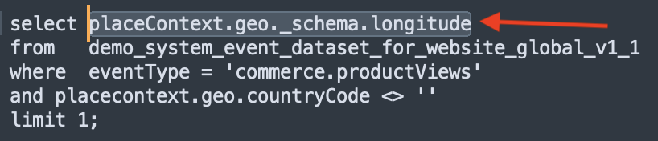

# 2.1.3 クエリサービスの使用

## 目的

- データセットの検索と調査
- クエリでエクスペリエンスデータモデルオブジェクトと属性に対処する方法を説明します

## コンテキスト

このページでは、PSQL を使用して使用可能なデータセットに関する情報を取得する方法、Experience Data Model （XDM）のクエリを記述する方法、およびクエリサービスとシティシグナルデータセットを使用して最初のシンプルなレポートクエリを記述する方法を説明します。

## 基本クエリ

このページでは、使用可能なデータセットに関する情報を取得する方法と、XDM データセットからクエリを使用してデータを適切に取得する方法について説明します。

1 の初めにAdobe Experience Platformで調べたすべてのデータセットは、SQL インターフェイスを使用してテーブルとしてアクセスすることもできます。 これらのテーブルを一覧表示するには、**show tables;** コマンドを使用します。

**PSQL コマンドラインインターフェイス** で `show tables;` を実行します。 （コマンドをセミコロンで終了することを忘れないでください）。

コマンド `show tables;` をコピーし、プロンプトで貼り付けます。


次の結果が表示されます。

```text
tech-insiders:all=> show tables;
                               name                               |                                                  dataSetId                                                   |                                       dataSet                                        | description |        labels        
------------------------------------------------------------------+--------------------------------------------------------------------------------------------------------------+--------------------------------------------------------------------------------------+-------------+----------------------
 ajo_bcc_feedback_event_dataset                                   | 672a07cb7728e82aefa1ec56                                                                                     | AJO BCC Feedback Event Dataset                                                       |             | 
 ajo_classification_dataset                                       | 672a07cab55b0d2aef6f9626                                                                                     | AJO Classification Dataset                                                           |             | 
 ajo_consent_service_dataset                                      | 672a07c80fd5fd2aee4155ca                                                                                     | AJO Consent Service Dataset                                                          |             | 'PROFILE'
 ajo_email_tracking_experience_event_dataset                      | 672a07c926d57d2aef020230                                                                                     | AJO Email Tracking Experience Event Dataset                  :
                               name                               |                                                  dataSetId                                                   |                                       dataSet                                        | description |        labels        
------------------------------------------------------------------+--------------------------------------------------------------------------------------------------------------+--------------------------------------------------------------------------------------+-------------+----------------------
 ajo_bcc_feedback_event_dataset                                   | 672a07cb7728e82aefa1ec56                                                                                     | AJO BCC Feedback Event Dataset                                                       |             | 
 ajo_classification_dataset                                       | 672a07cab55b0d2aef6f9626                                                                                     | AJO Classification Dataset                                                           |             | 
 ajo_consent_service_dataset                                      | 672a07c80fd5fd2aee4155ca                                                                                     | AJO Consent Service Dataset                                                          |             | 'PROFILE'
 ajo_email_tracking_experience_event_dataset                      | 672a07c926d57d2aef020230                                                                                     | AJO Email Tracking Experience Event Dataset   
```

コロンで、スペースバーを押して結果セットの次のページを表示するか、`q` と入力してコマンドプロンプトに戻します。

AEP の各データセットには、対応するクエリサービステーブルがあります。 データセット UI でデータセットのテーブルを見つけることができます。


`demo_system_event_dataset_for_website_global_v1_1` テーブルは、`Demo System - Event Schema for Website (Global v1.1)` データセットに対応するクエリサービス テーブルです。

製品の閲覧場所に関する情報をクエリするには、**geo** 情報を選択します。

以下のクエリをコピーして、**PSQL コマンドラインインターフェイス** のプロンプトで貼り付け、Enter キーを押します。

```sql
select placecontext.geo
from   demo_system_event_dataset_for_website_global_v1_1
where  eventType = 'commerce.productViews'
and placecontext.geo.countryCode <> ''
limit 1;
```

クエリ結果では、エクスペリエンスデータモデル（XDM）の列は、スカラータイプだけでなく、複雑なタイプである可能性があることがわかります。 上記のクエリでは、**commerce.productViews** が発生した地域の場所を特定します。 **commerce.productViews** を識別するには、**を使用して XDM モデルをナビゲートする必要があります。** （ドット）表記。

```text
tech-insiders:all=> select placecontext.geo
from   demo_system_event_dataset_for_website_global_v1_1
where  eventType = 'commerce.productViews'
and placecontext.geo.countryCode <> ''
limit 1;
                 geo                  
--------------------------------------
 ("(51.59119,-1.407848)",Charlton,GB)
(1 row)
```

結果が 1 つの値ではなく、フラットなオブジェクトであることに注目してください。 **placecontext.geo** オブジェクトには、スキーマ、国、市区町村の 4 つの属性が含まれています。 また、オブジェクトが列として宣言されると、オブジェクト全体が文字列として返されます。 XDM スキーマは、使い慣れたものよりも複雑になる場合がありますが、非常に強力で、多くのソリューション、チャネル、ユースケースをサポートするように設計されています。

オブジェクトの個々のプロパティを選択するには、**を使用します。** （ドット）表記。

以下のステートメントをコピーして、**PSQL コマンドラインインターフェイス** のプロンプトで貼り付けます。

```sql
select placecontext.geo._schema.longitude
      ,placecontext.geo._schema.latitude
      ,placecontext.geo.city
      ,placecontext.geo.countryCode
from   demo_system_event_dataset_for_website_global_v1_1
where  eventType = 'commerce.productViews'
and placecontext.geo.countryCode <> ''
limit 1;
```

上記のクエリの結果は、次のようになります。
結果は、設定された単純な値になりました。

```text
tech-insiders:all=> select placecontext.geo._schema.longitude
      ,placecontext.geo._schema.latitude
      ,placecontext.geo.city
      ,placecontext.geo.countryCode
from   demo_system_event_dataset_for_website_global_v1_1
where  eventType = 'commerce.productViews'
and placecontext.geo.countryCode <> ''
limit 1;
 longitude | latitude |   city   | countrycode 
-----------+----------+----------+-------------
 -1.407848 | 51.59119 | Charlton | GB
(1 row)
```

特定のプロパティへのパスを簡単に取得できる方法があるので、心配する必要はありません。 次のパートでは、その方法を説明します。

クエリを編集する必要があるので、まずエディターを開きます。

Windows: **メモ帳** を使用します

Macの場合：任意のテキストエディターアプリをインストールして開きます。

次のステートメントをテキストエディターにコピーします。

```sql
select your_attribute_path_here
from   demo_system_event_dataset_for_website_global_v1_1
where  eventType = 'commerce.productViews'
and placecontext.geo.countryCode <> ''
limit 1;
```

Adobe Experience Platform UI に戻るか（ブラウザーで開く必要があります）、[Adobe Experience Platform](https://experience.adobe.com/platform) に移動します。

「**スキーマ**」を選択し、「**検索**」フィールドに `Demo System - Event Schema for Website` と入力し、クリックしてスキーマ `Demo System - Event Schema for Website (Global v1.1) Schema` を開きます。


オブジェクトをクリックして、**デモシステム - web サイトのイベントスキーマ（グローバル v1.1）** の XDM モデルを調べます。 **placecontext**、**geo**、**schema** のツリーを展開します。 実際の属性 **経度** を選択すると、ハイライトされた赤いボックスに完全なパスが表示されます。 属性のパスをコピーするには、パスをコピーアイコンをクリックします。


メモ帳/角括弧に切り替え、最初の行から **your_attribute_path_here** を削除します。 最初の行の **選択** の後にカーソルを置き、ペーストします（Ctrl-V）。



変更した文をコピーして、**PSQL コマンドラインインターフェイス** のプロンプトで貼り付け、Enter キーを押します。

結果は次のようになります。

```text
tech-insiders:all=> select placeContext.geo._schema.longitude
from   demo_system_event_dataset_for_website_global_v1_1
where  eventType = 'commerce.productViews'
and placecontext.geo.countryCode <> ''
limit 1;
 longitude 
-----------
 -1.407848
(1 row)
```

## 次の手順

[2.1.4 クエリ、クエリ、クエリ…およびチャーン分析に移動 ](./ex4.md){target="_blank"}

[ クエリサービス ](./query-service.md){target="_blank"} に戻る

[ すべてのモジュール ](./../../../../overview.md){target="_blank"} に戻る
