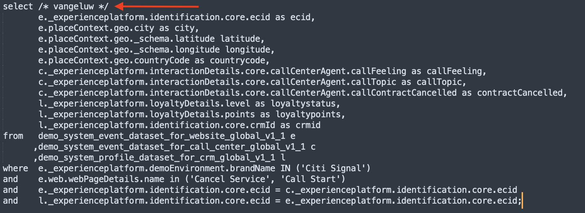

# 2.1.4 クエリ、クエリ、クエリ…およびチャーン分析

## 目的

- データ分析用のクエリの書き込み
- Adobe Experience Platformで利用可能なオンライン、コールセンター、ロイヤルティデータを組み合わせて SQL クエリを記述する
- Adobe定義関数について説明します

## コンテキスト

この演習では、製品ビュー、製品ファネル、チャーンなどを分析するクエリを記述します。

この章で示すすべてのクエリは、**PSQL コマンドラインインターフェイス** で実行されます。 **SQL** で示されたステートメントブロックをコピー（CTRL-C）し、**PSQL コマンドラインインターフェイス** に貼り付ける（CTRL-V）必要があります。 **クエリ結果** ブロックには、貼り付けた SQL ステートメントと、関連するクエリ結果が表示されます。

## データ分析の基本的なクエリの記述

### タイムスタンプ

Adobe Experience Platformで取り込まれたデータには、タイムスタンプが付けられます。 **timestamp** 属性を使用すると、データを経時的に分析できます。

1 日に表示される製品の数

**SQL**

```sql
select date_format( timestamp , 'yyyy-MM-dd') AS Day,
       count(*) AS productViews
from   demo_system_event_dataset_for_website_global_v1_1
where  --aepTenantId--.demoEnvironment.brandName IN ('Citi Signal')
and eventType = 'commerce.productViews'
group by Day
limit 10;
```

上記の文をコピーして、**PSQL コマンドラインインターフェイス** で実行します。

**クエリ結果**

```text
tech-insiders:all=> select date_format( timestamp , 'yyyy-MM-dd') AS Day,
       count(*) AS productViews
from   demo_system_event_dataset_for_website_global_v1_1
where  _experienceplatform.demoEnvironment.brandName IN ('Citi Signal')
and eventType = 'commerce.productViews'
group by Day
limit 10;
    Day     | productViews 
------------+--------------
 2024-12-04 |         2297
(1 row)
```

### 閲覧された上位 5 製品

閲覧された上位 5 製品は何ですか？

#### SQL

```sql
select productListItems.name, count(*)
from   demo_system_event_dataset_for_website_global_v1_1
where  --aepTenantId--.demoEnvironment.brandName IN ('Citi Signal')
and    eventType = 'commerce.productViews'
group  by productListItems.name
order  by 2 desc
limit 5;
```

上記の文をコピーして、**PSQL コマンドラインインターフェイス** で実行します。

**クエリ結果**

```text
tech-insiders:all=> select productListItems.name, count(*)
from   demo_system_event_dataset_for_website_global_v1_1
where  _experienceplatform.demoEnvironment.brandName IN ('Citi Signal')
and    eventType = 'commerce.productViews'
group  by productListItems.name
order  by 2 desc
limit 5;
                  name                   | count(1) 
-----------------------------------------+----------
 {Google Pixel XL 32GB Black Smartphone} |      938
 {SIM Only}                              |      482
 {Samsung Galaxy S8}                     |      456
 {Samsung Galaxy S7 32GB Black}          |      421
(4 rows)
```

### 製品インタラクションファネル、表示から購入まで

**SQL**

```sql
select eventType, count(*)
from   demo_system_event_dataset_for_website_global_v1_1
where  --aepTenantId--.demoEnvironment.brandName IN ('Citi Signal')
and    eventType is not null
and    eventType <> ''
group  by eventType;
```

上記の文をコピーして、**PSQL コマンドラインインターフェイス** で実行します。

**クエリ結果**

```text
tech-insiders:all=> select eventType, count(*)
from   demo_system_event_dataset_for_website_global_v1_1
where  _experienceplatform.demoEnvironment.brandName IN ('Citi Signal')
and    eventType is not null
and    eventType <> ''
group  by eventType;
        eventType         | count(1) 
--------------------------+----------
 commerce.productListAdds |      494
 commerce.purchases       |      246
 commerce.productViews    |     2297
(3 rows)
```

### チャーンに至るリスクのある訪問者を特定します（訪問ページ => サービスのキャンセル）

**SQL**

```sql
select distinct --aepTenantId--.identification.core.ecid
from   demo_system_event_dataset_for_website_global_v1_1
where  --aepTenantId--.demoEnvironment.brandName IN ('Citi Signal')
and    web.webPageDetails.name = 'Cancel Service'
group  by --aepTenantId--.identification.core.ecid
limit 10;
```

上記の文をコピーして、**PSQL コマンドラインインターフェイス** で実行します。

**クエリ結果**

```text
tech-insiders:all=> select distinct _experienceplatform.identification.core.ecid
from   demo_system_event_dataset_for_website_global_v1_1
where  _experienceplatform.demoEnvironment.brandName IN ('Citi Signal')
and    web.webPageDetails.name = 'Cancel Service'
group  by _experienceplatform.identification.core.ecid
limit 10;
               ecid               
----------------------------------
 86069928882940477620713284798772
 75691756152042231410852704832434
 47381264398548915586824480724480
 51294194577949645447313762862726
 95873885060131472480685538836534
 71192995127345419624952514250737
 81469709164961922907426138040032
 53545252726821876244061095202780
 13294750130353985087337266864522
 58843891994459565443501421307174
(10 rows)
```

次のクエリでは、「サービスのキャンセル」ページにアクセスしたお客様とその行動の完全なビューを取得するために、上記のクエリを拡張します。 Adobe定義関数を使用して、情報のセッション化、イベントのシーケンスとタイミングの特定を行う方法を説明します。 また、データセットを結合して、Microsoft Power BIで分析するためのデータをさらに強化および準備します。

## 高度なクエリ

ビジネスロジックの大部分は、顧客のタッチポイントを収集し、時間ごとに並べ替える必要があります。 このサポートは、Spark SQL で窓関数の形式で提供されます。窓関数は標準 SQL の一部で、他の多くの SQL エンジンでサポートされています。

### Adobe定義関数

Adobeでは、標準 SQL 構文に一連の **0&rbrace;Adobe定義関数 &rbrace; が追加され、エクスペリエンスデータをより深く理解できるようになりました。**&#x200B;次のクエリでは、これらの ADF 関数について説明します。 詳細と完全なリストについては、[ ドキュメント ](https://experienceleague.adobe.com/docs/experience-platform/query/sql/adobe-defined-functions.html) を参照してください。

### セッションの 3 番目のページとして「サービスをキャンセル」ページに到達する前に、サイト上でユーザーはどうしますか？

このクエリでは、最初の 2 つのAdobe定義関数 **SESS_TIMEOUT** と **NEXT** を確認します

> **SESS_TIMEOUT （）** は、Adobe Analyticsで見つかった訪問のグループ化を再現します。 時間ベースの同様のグループ化を実行しますが、カスタマイズ可能なパラメーターです。
>
> **NEXT （）** および **PREVIOUS （）** は、顧客がサイトを移動する方法を理解するのに役立ちます。

**SQL**

```sql
SELECT
  webPage,
  webPage_2,
  webPage_3,
  webPage_4,
  count(*) journeys
FROM
  (
      SELECT
        webPage,
        NEXT(webPage, 1, true)
          OVER(PARTITION BY ecid, session.num
                ORDER BY timestamp
                ROWS BETWEEN CURRENT ROW AND UNBOUNDED FOLLOWING).value
          AS webPage_2,
        NEXT(webPage, 2, true)
          OVER(PARTITION BY ecid, session.num
                ORDER BY timestamp
                ROWS BETWEEN CURRENT ROW AND UNBOUNDED FOLLOWING).value
          AS webPage_3,
        NEXT(webPage, 3, true)
           OVER(PARTITION BY ecid, session.num
                ORDER BY timestamp
                ROWS BETWEEN CURRENT ROW AND UNBOUNDED FOLLOWING).value
          AS webPage_4,
        session.depth AS SessionPageDepth
      FROM (
            select a.--aepTenantId--.identification.core.ecid as ecid,
                   a.timestamp,
                   web.webPageDetails.name as webPage,
                    SESS_TIMEOUT(timestamp, 60 * 30) 
                       OVER (PARTITION BY a.--aepTenantId--.identification.core.ecid 
                             ORDER BY timestamp 
                             ROWS BETWEEN UNBOUNDED PRECEDING AND CURRENT ROW) 
                  AS session
            from   demo_system_event_dataset_for_website_global_v1_1 a
            where  a.--aepTenantId--.identification.core.ecid in ( 
                select b.--aepTenantId--.identification.core.ecid
                from   demo_system_event_dataset_for_website_global_v1_1 b
                where  b.--aepTenantId--.demoEnvironment.brandName IN ('Citi Signal')
                and    b.web.webPageDetails.name = 'Cancel Service'
            )
        )
)
WHERE SessionPageDepth=1
and   webpage_3 = 'Cancel Service'
GROUP BY webPage, webPage_2, webPage_3, webPage_4
ORDER BY journeys DESC
LIMIT 10;
```

上記の文をコピーして、**PSQL コマンドラインインターフェイス** で実行します。

**クエリ結果**

```text
                webPage                |               webPage_2               |   webPage_3    | webPage_4  | journeys 
---------------------------------------+---------------------------------------+----------------+------------+----------
 Telco Home                            | Citi Signal Sport                     | Cancel Service | Call Start |        2
 Citi Signal Sport                     | Google Pixel XL 32GB Black Smartphone | Cancel Service | Call Start |        2
 Broadband Deals                       | Samsung Galaxy S7 32GB Black          | Cancel Service |            |        2
 TV & Broadband Deals                  | Samsung Galaxy S7 32GB Black          | Cancel Service |            |        2
 SIM Only                              | Citi Signal Shop                      | Cancel Service |            |        2
 Google Pixel XL 32GB Black Smartphone | Broadband Deals                       | Cancel Service |            |        2
 SIM Only                              | Telco Home                            | Cancel Service |            |        2
 Citi Signal Shop                      | Samsung Galaxy S7 32GB Black          | Cancel Service | Call Start |        1
 Google Pixel XL 32GB Black Smartphone | Citi Signal Sport                     | Cancel Service | Call Start |        1
 Google Pixel XL 32GB Black Smartphone | Citi Signal Shop                      | Cancel Service | Call Start |        1
(10 rows)
```

### 「サービスをキャンセル」ページにアクセスしてから、訪問者がコールセンターに電話するまでの時間はどれくらいですか？

この種の問い合わせに答えるには、Adobe定義の関数 **TIME_BETWEEN_NEXT_MATCH （）** を使用します。

> 前または次の一致関数間の時間は、特定のインシデントからの経過時間を測定する新しいディメンションを提供します。

**SQL**

```sql
select * from (
       select --aepTenantId--.identification.core.ecid as ecid,
              web.webPageDetails.name as webPage,
              TIME_BETWEEN_NEXT_MATCH(timestamp, web.webPageDetails.name='Call Start', 'seconds')
              OVER(PARTITION BY --aepTenantId--.identification.core.ecid
                  ORDER BY timestamp
                  ROWS BETWEEN CURRENT ROW AND UNBOUNDED FOLLOWING)
              AS contact_callcenter_after_seconds
       from   demo_system_event_dataset_for_website_global_v1_1
       where  --aepTenantId--.demoEnvironment.brandName IN ('Citi Signal')
       and    web.webPageDetails.name in ('Cancel Service', 'Call Start')
) r
where r.webPage = 'Cancel Service'
limit 15;
```

上記の文をコピーして、**PSQL コマンドラインインターフェイス** で実行します。

**クエリ結果**

```text
               ecid               |    webPage     | contact_callcenter_after_seconds 
----------------------------------+----------------+----------------------------------
 00331886620679939148047665693117 | Cancel Service |                                 
 00626561600197295782131349716866 | Cancel Service |                                 
 00630470663554417679969244202779 | Cancel Service |                             -797
 00720875344152796154458668700428 | Cancel Service |                             -519
 00746064605049656090779523644276 | Cancel Service |                              -62
 00762093837616944422322357210965 | Cancel Service |                                 
 00767875779073091876070699689209 | Cancel Service |                                 
 00798691264980137616449378075855 | Cancel Service |                                 
 00869613691740150556826953447162 | Cancel Service |                             -129
 00943638725078228957873279219207 | Cancel Service |                             -750
 01167540466536077846425644389346 | Cancel Service |                                 
 01412448537869549016063764484810 | Cancel Service |                                 
 01419076946514450291741574452702 | Cancel Service |                             -482
 01533124771963987423015507880755 | Cancel Service |                                 
 01710651086750904478559809475925 | Cancel Service |                                 
(15 rows)
```

### そして、その連絡の結果は何ですか？

このクエリでは、データセットを結合します。 この場合、データセット `demo_system_event_dataset_for_website_global_v1_1` をデータセット `demo_system_event_dataset_for_call_center_global_v1_1` と結合します。 これは、コールセンターインタラクションの結果を理解するために行われます。

**SQL**

```sql
select distinct r.*,
       c.--aepTenantId--.interactionDetails.core.callCenterAgent.callFeeling,
       c.--aepTenantId--.interactionDetails.core.callCenterAgent.callTopic,
       c.--aepTenantId--.interactionDetails.core.callCenterAgent.callContractCancelled
from (
       select --aepTenantId--.identification.core.ecid ecid,
              web.webPageDetails.name as webPage,
              TIME_BETWEEN_NEXT_MATCH(timestamp, web.webPageDetails.name='Call Start', 'seconds')
              OVER(PARTITION BY --aepTenantId--.identification.core.ecid
                  ORDER BY timestamp
                  ROWS BETWEEN CURRENT ROW AND UNBOUNDED FOLLOWING)
              AS contact_callcenter_after_seconds
       from   demo_system_event_dataset_for_website_global_v1_1
       where  --aepTenantId--.demoEnvironment.brandName IN ('Citi Signal')
       and    web.webPageDetails.name in ('Cancel Service', 'Call Start')
) r
, demo_system_event_dataset_for_call_center_global_v1_1 c
where r.ecid = c.--aepTenantId--.identification.core.ecid
and r.webPage = 'Cancel Service'
and c.--aepTenantId--.interactionDetails.core.callCenterAgent.callContractCancelled IN (true,false)
and c.--aepTenantId--.interactionDetails.core.callCenterAgent.callTopic IN ('contract', 'invoice','complaint','wifi')
limit 15;
```

上記の文をコピーして、**PSQL コマンドラインインターフェイス** で実行します。

**クエリ結果**

```text
               ecid               |    webPage     | contact_callcenter_after_seconds | callfeeling | calltopic | callcontractcancelled 
----------------------------------+----------------+----------------------------------+-------------+-----------+-----------------------
 00630470663554417679969244202779 | Cancel Service |                             -797 | negative    | contract  | f
 00720875344152796154458668700428 | Cancel Service |                             -519 | positive    | contract  | f
 00746064605049656090779523644276 | Cancel Service |                              -62 | positive    | contract  | t
 00869613691740150556826953447162 | Cancel Service |                             -129 | negative    | contract  | t
 00943638725078228957873279219207 | Cancel Service |                             -750 | positive    | contract  | f
 01419076946514450291741574452702 | Cancel Service |                             -482 | neutral     | contract  | f
 01738842540109643781526526573341 | Cancel Service |                             -562 | neutral     | contract  | f
 02052460258994877317679083617975 | Cancel Service |                             -545 | neutral     | contract  | f
 02156496759733199802585567179589 | Cancel Service |                              -83 | neutral     | contract  | t
 02666934104296797891818818456669 | Cancel Service |                             -297 | positive    | contract  | t
 03059764265715537001416957172652 | Cancel Service |                             -243 | negative    | contract  | t
 03347899869945278660479273416679 | Cancel Service |                             -229 | positive    | contract  | t
 04258863338643046907489131372300 | Cancel Service |                             -588 | positive    | contract  | f
 04733864373954008966920919247566 | Cancel Service |                             -795 | neutral     | contract  | f
 05199871096822598772351169572451 | Cancel Service |                             -236 | positive    | contract  | t
(15 rows)
```

### これらの顧客のロイヤルティプロファイルとは何ですか？

このクエリでは、Adobe Experience Platformでオンボードされた CRM データを結合します。 これにより、CRM データを使用してチャーン分析を強化できます。

**SQL**

```sql
select r.*,
       c.--aepTenantId--.interactionDetails.core.callCenterAgent.callFeeling,
       c.--aepTenantId--.interactionDetails.core.callCenterAgent.callTopic,
       l.--aepTenantId--.loyaltyDetails.level,
       l.--aepTenantId--.identification.core.crmId
from (
       select --aepTenantId--.identification.core.ecid ecid,
              web.webPageDetails.name as webPage,
              TIME_BETWEEN_NEXT_MATCH(timestamp, web.webPageDetails.name='Call Start', 'seconds')
              OVER(PARTITION BY --aepTenantId--.identification.core.ecid
                  ORDER BY timestamp
                  ROWS BETWEEN CURRENT ROW AND UNBOUNDED FOLLOWING)
              AS contact_callcenter_after_seconds
       from   demo_system_event_dataset_for_website_global_v1_1
       where  --aepTenantId--.demoEnvironment.brandName IN ('Citi Signal')
       and    web.webPageDetails.name in ('Cancel Service', 'Call Start')
) r
, demo_system_event_dataset_for_call_center_global_v1_1 c
, demo_system_profile_dataset_for_crm_global_v1_1 l
where r.ecid = c.--aepTenantId--.identification.core.ecid
and r.webPage = 'Cancel Service'
and l.--aepTenantId--.identification.core.ecid = r.ecid
and c.--aepTenantId--.interactionDetails.core.callCenterAgent.callTopic IN ('contract', 'invoice','complaint','wifi','promo')
limit 15;
```

上記の文をコピーして、**PSQL コマンドラインインターフェイス** で実行します。

**クエリ結果**

```text
               ecid               |    webPage     | contact_callcenter_after_seconds | callfeeling | calltopic | level  |   crmid   
----------------------------------+----------------+----------------------------------+-------------+-----------+--------+-----------
 00630470663554417679969244202779 | Cancel Service |                             -797 | negative    | contract  | Bronze | 524483285
 00720875344152796154458668700428 | Cancel Service |                             -519 | positive    | contract  | Silver | 860696333
 00746064605049656090779523644276 | Cancel Service |                              -62 | positive    | contract  | Bronze | 072387270
 00869613691740150556826953447162 | Cancel Service |                             -129 | negative    | contract  | Bronze | 789347684
 00943638725078228957873279219207 | Cancel Service |                             -750 | positive    | contract  | Gold   | 033926162
 01419076946514450291741574452702 | Cancel Service |                             -482 | neutral     | contract  | Bronze | 105063634
 01738842540109643781526526573341 | Cancel Service |                             -562 | neutral     | contract  | Gold   | 791324509
 02052460258994877317679083617975 | Cancel Service |                             -545 | neutral     | contract  | Gold   | 443477555
 02156496759733199802585567179589 | Cancel Service |                              -83 | neutral     | contract  | Silver | 305085589
 02666934104296797891818818456669 | Cancel Service |                             -297 | positive    | contract  | Silver | 104266570
 03059764265715537001416957172652 | Cancel Service |                             -243 | negative    | contract  | Silver | 814175245
 03347899869945278660479273416679 | Cancel Service |                             -229 | positive    | contract  | Gold   | 377699708
 04258863338643046907489131372300 | Cancel Service |                             -588 | positive    | contract  | Silver | 298321657
 04733864373954008966920919247566 | Cancel Service |                             -795 | neutral     | contract  | Gold   | 655070958
 05199871096822598772351169572451 | Cancel Service |                             -236 | positive    | contract  | Gold   | 425688874
(15 rows)
```

### 彼らはどの地域から私たちを訪れますか。

顧客のチャーンに関する地理的インサイトを得るためにAdobe Experience Platformが取得した、経度、態度、市区町村、国コードなどの地理的情報を含めることができます。

**SQL**

```sql
       select distinct r.ecid,
              r.city,
              r.countrycode,
              r.lat as latitude,
              r.lon as longitude,
              r.contact_callcenter_after_seconds as seconds_to_contact_callcenter,
              c.--aepTenantId--.interactionDetails.core.callCenterAgent.callFeeling,
              c.--aepTenantId--.interactionDetails.core.callCenterAgent.callTopic,
              c.--aepTenantId--.interactionDetails.core.callCenterAgent.callContractCancelled,
              l.--aepTenantId--.loyaltyDetails.level,
              l.--aepTenantId--.identification.core.crmId
       from (
              select --aepTenantId--.identification.core.ecid ecid,
                     placeContext.geo._schema.latitude lat,
                     placeContext.geo._schema.longitude lon,
                     placeContext.geo.city,
                     placeContext.geo.countryCode,
                     web.webPageDetails.name as webPage,
                     TIME_BETWEEN_NEXT_MATCH(timestamp, web.webPageDetails.name='Call Start', 'seconds')
                     OVER(PARTITION BY --aepTenantId--.identification.core.ecid
                         ORDER BY timestamp
                         ROWS BETWEEN CURRENT ROW AND UNBOUNDED FOLLOWING)
                     AS contact_callcenter_after_seconds
              from   demo_system_event_dataset_for_website_global_v1_1
              where  --aepTenantId--.demoEnvironment.brandName IN ('Citi Signal')
              and    web.webPageDetails.name in ('Cancel Service', 'Call Start')
       ) r
       , demo_system_event_dataset_for_call_center_global_v1_1 c
       , demo_system_profile_dataset_for_crm_global_v1_1 l
       where r.ecid = c.--aepTenantId--.identification.core.ecid
       and r.webPage = 'Cancel Service'
       and l.--aepTenantId--.identification.core.ecid = r.ecid
       and c.--aepTenantId--.interactionDetails.core.callCenterAgent.callTopic IN ('contract', 'invoice','complaint','wifi','promo')
       limit 15;
```

上記の文をコピーして、**PSQL コマンドラインインターフェイス** で実行します。

**クエリ結果**

```text
               ecid               |    city    | countrycode |  latitude  | longitude  | seconds_to_contact_callcenter | callfeeling | calltopic | callcontractcancelled | level  |   crmid   
----------------------------------+------------+-------------+------------+------------+-------------------------------+-------------+-----------+-----------------------+--------+-----------
 00630470663554417679969244202779 | Charlton   | GB          |   51.59119 |  -1.407848 |                          -797 | negative    | contract  | f                     | Bronze | 524483285
 00720875344152796154458668700428 | Ashley     | GB          | 51.4139633 | -2.2685462 |                          -519 | positive    | contract  | f                     | Silver | 860696333
 00746064605049656090779523644276 | Liverpool  | GB          | 53.4913801 |  -2.867264 |                           -62 | positive    | contract  | t                     | Bronze | 072387270
 00869613691740150556826953447162 | Langley    | GB          |  51.888151 |   -0.23924 |                          -129 | negative    | contract  | t                     | Bronze | 789347684
 00943638725078228957873279219207 | Eaton      | GB          | 53.2945961 | -0.9335791 |                          -750 | positive    | contract  | f                     | Gold   | 033926162
 01419076946514450291741574452702 | Tullich    | GB          | 57.4694803 | -3.1269422 |                          -482 | neutral     | contract  | f                     | Bronze | 105063634
 01738842540109643781526526573341 | Whitwell   | GB          | 54.3886617 |  -1.555363 |                          -562 | neutral     | contract  | f                     | Gold   | 791324509
 02052460258994877317679083617975 | Edinburgh  | GB          | 55.9309486 | -3.1859102 |                          -545 | neutral     | contract  | f                     | Gold   | 443477555
 02156496759733199802585567179589 | West End   | GB          |   53.46464 |    0.04134 |                           -83 | neutral     | contract  | t                     | Silver | 305085589
 02666934104296797891818818456669 | Newtown    | GB          | 51.3684218 | -1.3218754 |                          -297 | positive    | contract  | t                     | Silver | 104266570
 03059764265715537001416957172652 | Edinburgh  | GB          | 55.9309486 | -3.1859102 |                          -243 | negative    | contract  | t                     | Silver | 814175245
 03347899869945278660479273416679 | Liverpool  | GB          | 53.4913801 |  -2.867264 |                          -229 | positive    | contract  | t                     | Gold   | 377699708
 04258863338643046907489131372300 | Norton     | GB          | 52.2679288 | -1.1202549 |                          -588 | positive    | contract  | f                     | Silver | 298321657
 04733864373954008966920919247566 | Whitchurch | GB          | 51.4057505 | -2.5573746 |                          -795 | neutral     | contract  | f                     | Gold   | 655070958
 05199871096822598772351169572451 | Stapleford | GB          |   53.10672 |  -0.687802 |                          -236 | positive    | contract  | t                     | Gold   | 425688874
(15 rows)
```

## コールセンターインタラクション分析

上記のクエリでは、サービスキャンセルの場合にコールセンターに連絡することになった訪問者のみを調べました。 これをもう少し広く捉え、Wi-Fi、プロモ、請求書、苦情、契約など、コールセンターとのすべてのインタラクションを考慮に入れたいと考えています。

クエリを編集する必要があるので、最初にメモ帳や角括弧を開きましょう。

Windows の場合、Windows ツールバーの「search」 – icon （1）をクリックし、「search」フィールドに **notepad** と入力し（2）、「notepad」の結果を（3）クリックします。


Macについて


次のステートメントをメモ帳/角括弧にコピーします。

```sql
select /* enter your name */
       e.--aepTenantId--.identification.core.ecid as ecid,
       e.placeContext.geo.city as city,
       e.placeContext.geo._schema.latitude latitude,
       e.placeContext.geo._schema.longitude longitude,
       e.placeContext.geo.countryCode as countrycode,
       c.--aepTenantId--.interactionDetails.core.callCenterAgent.callFeeling as callFeeling,
       c.--aepTenantId--.interactionDetails.core.callCenterAgent.callTopic as callTopic,
       c.--aepTenantId--.interactionDetails.core.callCenterAgent.callContractCancelled as contractCancelled,
       l.--aepTenantId--.loyaltyDetails.level as loyaltystatus,
       l.--aepTenantId--.loyaltyDetails.points as loyaltypoints,
       l.--aepTenantId--.identification.core.crmId as crmid
from   demo_system_event_dataset_for_website_global_v1_1 e
      ,demo_system_event_dataset_for_call_center_global_v1_1 c
      ,demo_system_profile_dataset_for_crm_global_v1_1 l
where  e.--aepTenantId--.demoEnvironment.brandName IN ('Citi Signal')
and    e.web.webPageDetails.name in ('Cancel Service', 'Call Start')
and    e.--aepTenantId--.identification.core.ecid = c.--aepTenantId--.identification.core.ecid
and    l.--aepTenantId--.identification.core.ecid = e.--aepTenantId--.identification.core.ecid;
```

および置換

```text
enter your name
```

`/\*` と `\*/` は削除しないでください。 メモ帳で変更した文は次のようになります。



変更した文を **メモ帳** から **PSQL コマンドラインウィンドウにコピーし** Enter キーを押します。 PSQL コマンドラインウィンドウに次の結果が表示されます。

```text
tech-insiders:all=> select /* vangeluw */
       e._experienceplatform.identification.core.ecid as ecid,
       e.placeContext.geo.city as city,
       e.placeContext.geo._schema.latitude latitude,
       e.placeContext.geo._schema.longitude longitude,
       e.placeContext.geo.countryCode as countrycode,
       c._experienceplatform.interactionDetails.core.callCenterAgent.callFeeling as callFeeling,
       c._experienceplatform.interactionDetails.core.callCenterAgent.callTopic as callTopic,
       c._experienceplatform.interactionDetails.core.callCenterAgent.callContractCancelled as contractCancelled,
       l._experienceplatform.loyaltyDetails.level as loyaltystatus,
       l._experienceplatform.loyaltyDetails.points as loyaltypoints,
       l._experienceplatform.identification.core.crmId as crmid
from   demo_system_event_dataset_for_website_global_v1_1 e
      ,demo_system_event_dataset_for_call_center_global_v1_1 c
      ,demo_system_profile_dataset_for_crm_global_v1_1 l
where  e._experienceplatform.demoEnvironment.brandName IN ('Citi Signal')
and    e.web.webPageDetails.name in ('Cancel Service', 'Call Start')
and    e._experienceplatform.identification.core.ecid = c._experienceplatform.identification.core.ecid
and    l._experienceplatform.identification.core.ecid = e._experienceplatform.identification.core.ecid;
               ecid               |    city    |  latitude  | longitude  | countrycode | callFeeling | callTopic | contractCancelled | loyaltystatus | loyaltypoints |   crmid   
----------------------------------+------------+------------+------------+-------------+-------------+-----------+-------------------+---------------+---------------+-----------
 60082543727227001177187726544992 | Normanton  |  52.643749 |  -0.622129 | GB          | neutral     | contract  | f                 | Bronze        |         430.0 | 117969439
 03250145103029549687906576330844 | Charlton   |   51.59119 |  -1.407848 | GB          | none        | none      | f                 | Silver        |         585.0 | 271570836
 87322786414150971711720565798532 | Whitwell   | 54.3886617 |  -1.555363 | GB          | none        | none      | f                 | Bronze        |         872.0 | 570762160
 46736059905281823751180777497223 | Edinburgh  | 55.9309486 | -3.1859102 | GB          | none        | none      | f                 | Gold          |         482.0 | 980678773
 81958524709959359235057647680790 | Linton     | 54.0542238 | -2.0215836 | GB          | none        | none      | f                 | Bronze        |         666.0 | 341873673
 24854602977644353049269284436324 | Tullich    | 57.4694803 | -3.1269422 | GB          | negative    | contract  | f                 | Bronze        |         418.0 | 831581327
 24854602977644353049269284436324 | Tullich    | 57.4694803 | -3.1269422 | GB          | negative    | contract  | f                 | Bronze        |         418.0 | 831581327
```

次に、クエリ（**create table as select** または **CTAS** とも呼ばれます）を、Microsoft Power BIで使用する新しいデータセットとして永続化します。

## 次の手順

[2.1.5 クエリからデータセットを生成に移動する ](./ex5.md){target="_blank"}

[ クエリサービス ](./query-service.md){target="_blank"} に戻る

[ すべてのモジュール ](./../../../../overview.md){target="_blank"} に戻る
