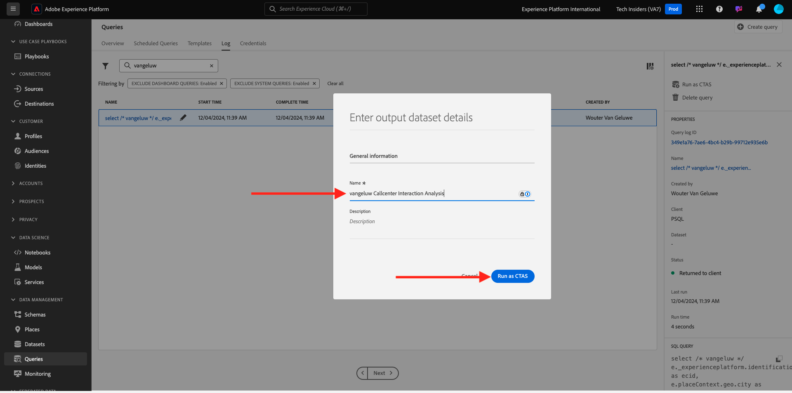

# 2.1.5 クエリからのデータセットの生成

## 目的

クエリ結果からデータセットを生成する方法を説明します
Microsoft Power BI Desktop/Tableau のクエリサービスへの直接接続
Microsoft Power BI Desktop/Tableau Desktop でのレポートの作成

## コンテキスト

データを照会するコマンドラインインターフェイスは魅力的ですが、適切に表示されません。 このレッスンでは、Microsoft Power BI Desktop/Tableau をクエリサービスに直接使用して、関係者に視覚的なレポートを作成する方法について、推奨されるワークフローを説明します。

## SQL クエリからのデータセットの作成

クエリの複雑さは、クエリサービスが結果を返すまでの時間に影響を与えます。 また、コマンドラインやMicrosoft Power BI/Tableau などの他のソリューションから直接クエリを実行する場合、クエリサービスは 5 分のタイムアウト（600 秒）で設定されます。 また、場合によっては、これらのソリューションの設定には短いタイムアウトが使用されます。 より大きなクエリを実行し、結果を返すのにかかる時間を前面に読み込むには、クエリ結果からデータセットを生成する機能を提供します。 この機能は、テーブルを選択として作成（CTAS）と呼ばれる標準の SQL 機能を利用します。 Platform UI のクエリリストから使用でき、PSQL を使用してコマンドラインから直接実行することもできます。

前では、PSQL で実行する前に、**名前を入力** を独自の LDAP に置き換えました。

```sql
select /* enter your name */
       e.--aepTenantId--.identification.core.ecid as ecid,
       e.placeContext.geo.city as city,
       e.placeContext.geo._schema.latitude latitude,
       e.placeContext.geo._schema.longitude longitude,
       e.placeContext.geo.countryCode as countrycode,
       c.--aepTenantId--.interactionDetails.core.callCenterAgent.callFeeling as callFeeling,
       c.--aepTenantId--.interactionDetails.core.callCenterAgent.callTopic as callTopic,
       c.--aepTenantId--.interactionDetails.core.callCenterAgent.callContractCancelled as contractCancelled,
       l.--aepTenantId--.loyaltyDetails.level as loyaltystatus,
       l.--aepTenantId--.loyaltyDetails.points as loyaltypoints,
       l.--aepTenantId--.identification.core.crmId as crmid
from   demo_system_event_dataset_for_website_global_v1_1 e
      ,demo_system_event_dataset_for_call_center_global_v1_1 c
      ,demo_system_profile_dataset_for_crm_global_v1_1 l
where  e.--aepTenantId--.demoEnvironment.brandName IN ('Citi Signal')
and    e.web.webPageDetails.name in ('Cancel Service', 'Call Start')
and    e.--aepTenantId--.identification.core.ecid = c.--aepTenantId--.identification.core.ecid
and    l.--aepTenantId--.identification.core.ecid = e.--aepTenantId--.identification.core.ecid;
```

Adobe Experience Platform UI に移動します – [https://experience.adobe.com/platform](https://experience.adobe.com/platform)

Adobe Experience Platform Query UI の検索フィールドに ldap を入力して、実行済みのステートメントを検索します。

「**クエリ**」を選択し、「**ログ**」に移動して、検索フィールドに LDAP を入力します。


クエリを選択し、「**CTAS として実行**」をクリックします。


データセットの名前および説明として「`--aepUserLdap-- Callcenter Interaction Analysis`」と入力し、「**CTAS として実行**」をクリックします。



その結果、「送信済み **ステータスの新しいクエリが表示され** す。


完了すると、「**データセットが作成されました** の新しいエントリが表示されます（ページの更新が必要になる場合があります）。


データセットが作成されたら（5～10 分かかる場合があります）、すぐに演習を続行できます。

## 次の手順

オプション A （[2.1.6 クエリサービスとPower BI](./ex6.md){target="_blank"} に移動します。

オプション B （[2.1.7 クエリサービスと Tableau](./ex7.md){target="_blank"}）に移動します。

[&#x200B; クエリサービス &#x200B;](./query-service.md){target="_blank"} に戻る

[&#x200B; すべてのモジュール &#x200B;](./../../../../overview.md){target="_blank"} に戻る
