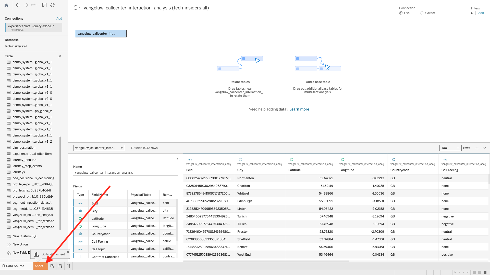

# 2.1.7 クエリサービスと Tableau

Tableau を開きます。

**サーバーへの接続** で、&lbrack; その他 **をクリックしてから** PostgreSQL **をクリックし** す。

まだ Tableau で PostgeSQL を使用していない場合は、次のように表示される場合があります。 **ドライバのダウンロード** をクリックします。

手順に従って、PostgreSQL ドライバーをダウンロードしてインストールします。

ドライバーのインストールが完了したら、Tableau Desktop を終了して再起動します。 再起動が完了したら、もう一度 **Connect To a Server** に移動して **More** をクリックし、もう一度 **PostgreSQL** をクリックします。

その後、これが表示されます。

Adobe Experience Platform、**クエリ**、**資格情報** に移動します。

Adobe Experience Platformの **資格情報** ページから **Host** をコピーし、**Server** フィールドに貼り付け、**Database** をコピーして、Tableau の **Database** フィールドに貼り付け、**Port** をコピーして、Tableau の **Port** フィールドに貼り付けます。**Username** と **Password** に対しても同じ操作を行います。 次に、「**ログイン**」をクリックします。

使用可能なテーブルのリストで、前の演習で作成したテーブル（`--aepUserLdap--_callcenter_interaction_analysis`）を見つけます。 キャンバスにドラッグします。

その後、これが表示されます。 **今すぐ更新** をクリックします。

その後、AEP のデータが Tableau で使用できるようになります。 **シート 1** をクリックして、データの操作を開始します。

マップ上のデータを視覚化するには、経度と緯度を寸法に変換する必要があります。 **メジャー** で **緯度** を右クリックし、メニューで **Dimensionに変換** を選択します。 「経度 **の測定に対しても同じ操作を行** ます。

**経度** メジャーを **列** にドラッグし、**緯度** メジャーを **行** にドラッグします。 自動的に **ベルギー** の地図が表示され、データセット内の都市を表す小さなドットが表示されます。

**メジャー名** を選択し、「**シートに追加**」をクリックします。

さまざまなサイズのドットを含むマップが表示されます。 このサイズは、その特定の都市のコールセンターインタラクションの数を示します。 ドットのサイズを変更するには、右側のパネルに移動して **値を測定** を開きます（ドロップダウンアイコンを使用）。 ドロップダウンリストから **サイズを編集** を選択します。 さまざまなサイズで遊び回ります。

**通話トピック** ごとのデータをさらに表示するには、**通話トピック** ディメンションを **ページ** にドラッグします。 画面の右側にある **通話トピック** を使用して、様々な **通話トピック** を移動します。

これで、この演習が完了しました。

## 次の手順

[2.1.8 Query Service API](./ex8.md){target="_blank"} に移動します。

[ クエリサービス ](./query-service.md){target="_blank"} に戻る

[ すべてのモジュール ](./../../../../overview.md){target="_blank"} に戻る
