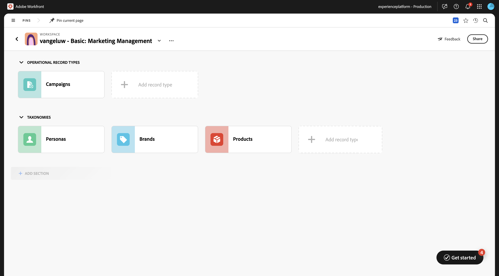
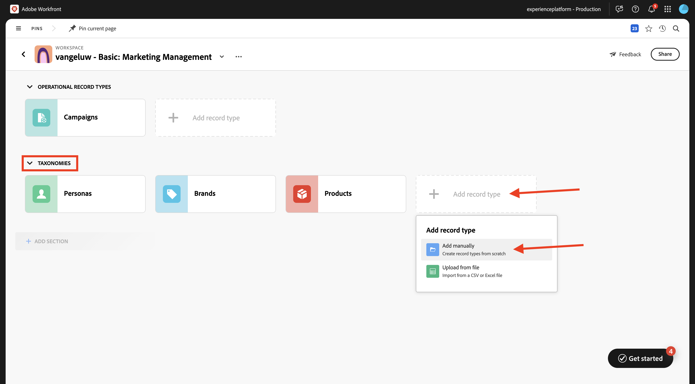
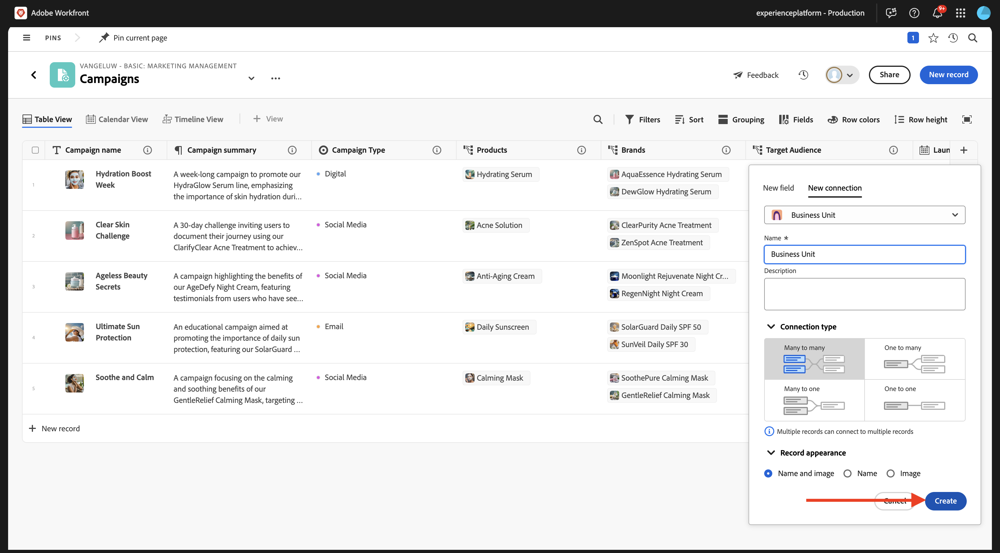
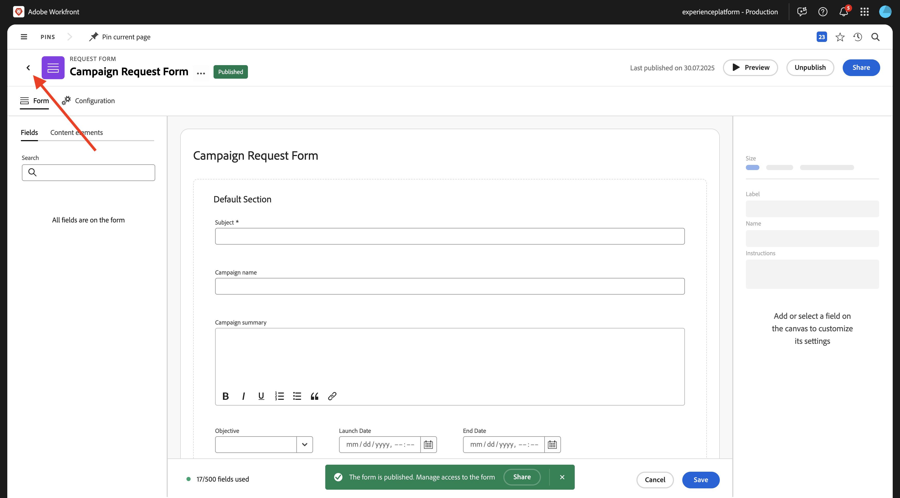
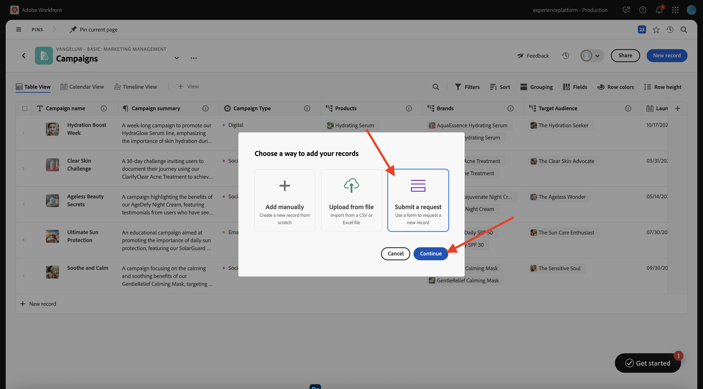
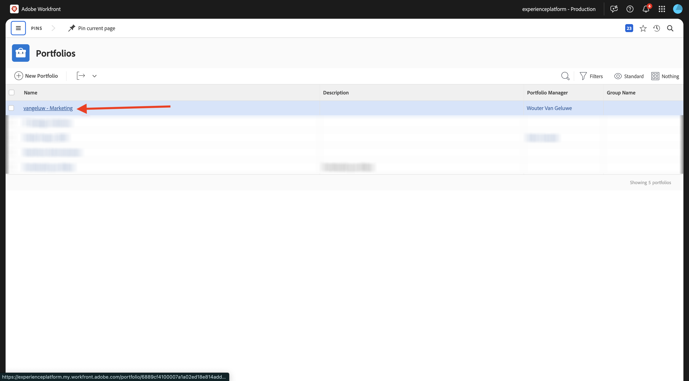

# 1.1.1 Workfrontの計画の概要

## 1.1.1.1 Workfront Planning の用語

Workfront Planning の主なオブジェクトと概念を次に示します。

| 用語 | 説明 |
| --- | ---|
| **Workspace** | 特定の組織の運用ライフサイクルを定義するレコードタイプのコレクション。 ワークスペースは、組織単位の作業フレームです。 |
| **レコードタイプ** | Workfront Planning のオブジェクト・タイプの名前。 レコードタイプがワークスペースに入力します。 オブジェクトタイプが事前定義されているWorkfront Workflow とは異なり、Workfront Planning では独自のオブジェクトタイプを作成できます。 |
| **レコード** | レコードタイプのインスタンス。 |
| **Workspace テンプレート** | 定義済みのテンプレートを使用してワークスペースを作成できます。 テンプレートに含まれる事前定義済みのレコードタイプとフィールドを使用することも、独自のレコードタイプとフィールドを追加することもできます。 |
| **フィールド** | フィールドは、レコードタイプに追加できる属性です。 フィールドには、レコードタイプに関する情報が含まれます。 |

>[!NOTE]
>
>作成できるWorkfront Planning オブジェクトの数には制限があります。 詳しくは、Adobe Workfront Planning オブジェクトの制限事項の概要を参照してください。

次に、実践的に、これらのオブジェクトのいくつかを自分で作成し始めます。

## Workspace1.1.1.2、レコードタイプ、フィールド

[https://experience.adobe.com/](https://experience.adobe.com/){target="_blank"} に移動します。 クリックして **Workfront** を開きます。


Workfrontで、をクリックしてメニューを開き、「**計画**」を選択します。


この画像が表示されます。 **Workspaceを作成** をクリックします。


**基本マーケティング管理** テンプレートの「**tempmate を使用**」をクリックします。


これで、新しいワークスペースが作成されました。 続行する前に、ワークスペースの名前を変更する必要があります。 3 つのドット **...** をクリックし、「**編集**」を選択します。


名前を `--aepUserLdap-- - Basic: Marketing Management` に変更します。 「**保存**」をクリックします。


これで完了です。



## 1.1.1.3 分類：レコードタイプとフィールド

「**分類**」で、「**+ レコードタイプを追加」をクリックし** 「**手動で追加**」を選択します。



**レコードタイプを追加** ポップアップが表示されます。


「**外観** タブの次の情報を更新します。

- **名称未設定のレコードタイプ** を `Business Unit` に置き換えます。
- 説明：`Defines which BU is leading campaign planning.`。
- 選択したアイコンの色と形状を選択します

「**保存**」をクリックします。


クリックして、新しく作成した **事業部門** レコードタイプを開きます。


新しく作成されたレコードタイプにはフィールドがまだ定義されていないので、空のテーブルビューが表示されます。


フィールド **開始日** のドロップダウンボタンをクリックし、「**削除** を選択します。


「**削除**」を選択します。


フィールド **終了日** のドロップダウンボタンをクリックし、「**削除** を選択します。


「**削除**」を選択します。


次に、**+** アイコンをクリックして、新しいフィールドを追加します。 使用可能なフィールドタイプのリストを下にスクロールし、「**人物**」を選択します。


フィールドの **名前** を `Business Unit Lead` に、フィールドの説明を `Business Unit Lead responsible for budget and resources (VP, Head).` に設定します

「**保存**」をクリックします。


新しいレコードタイプを作成し、フィールドを削除および作成しました。 左上隅の矢印をクリックして、Workspaceの概要画面に戻ります。


この画像が表示されます。


## 1.1.1.4 運用中のレコードタイプ：フィールド

クリックして **キャンペーン** を開きます。


**+** アイコンをクリックして、新しいフィールドを作成します。 **新しい接続** を選択してから、「**ペルソナ** を選択します。


デフォルト設定はそのままにしておきます。 「**作成**」をクリックします。



**スキップ** を選択します。


新しいフィールドがテーブル表示に表示されます。


## リクエストフォームを作成 1.1.1.5 るには

Campaigns の概要画面で、「。..**」の 3 つのドット** クリックし、「**リクエストフォームを作成**」を選択します。


名前を `Campaign Request Form` に変更します。 「**保存**」をクリックします。


現時点では、フォームに変更を加える必要はありません。 あなたはそれを変更せずに使うでしょう。 最初に **保存** をクリックしてから、**公開** をクリックします。


左上隅の矢印をクリックして、Formsをリクエストの概要画面に戻ります。



左上隅の矢印をクリックして、キャンペーンの概要画面に戻ります。


## リクエストフォームを使用して新しいレコードを送信で 1.1.1.6 ない

キャンペーンの概要画面で、「**+新しいレコード**」をクリックします。


**リクエストを送信** を選択し、「**続行**」をクリックします。



**件名** を `--aepUserLdap-- - New Campaign Creation Request` に設定します。

**キャンペーン名** を `--aepUserLdap-- - CitiSignal Fiber Launch` に設定します。

**キャンペーンの概要** を次のように設定します。

```
The CitiSignal Fiber Launch campaign introduces CitiSignal’s flagship fiber internet service—CitiSignal Fiber Max—to key residential markets. This campaign is designed to build awareness, drive sign-ups, and establish CitiSignal as the go-to provider for ultra-fast, reliable, and future-ready internet. The campaign will highlight the product’s benefits for remote professionals, online gamers, and smart home families, using persona-driven messaging across digital and physical channels.
```

**リクエストを送信** をクリックします。


**X** をクリックして、ポップアップを閉じます。


すると、新しく作成されたキャンペーンが概要に表示されます。


## 1.1.1.7 Portfolioとカスタムフォームの作成

次の手順では、Workfront Planning で作成したキャンペーンから情報を取得し、その情報をWorkfrontで使用してプログラムを作成する自動処理を作成します。 自動処理を作成する前に、Workfrontでまず設定すべき 2 つの事項、すなわちポートフォリオとカスタムフォームがあります。

ポートフォリオを作成するには、メニューを開いて「**ポートフォリオ**」をクリックします。


「**+ New Portfolio**」をクリックします。


ポートフォリオの名前を `--aepUserLdap-- - Marketing` に設定します。


次に、メニューを開いて **設定** をクリックし、カスタムフォームを作成します。


左側のメニューで、**カスタムForms**/**Forms** に移動し、「**+新規カスタムフォーム**」をクリックします。


**プログラム** を選択し、「**続行**」をクリックします。


フォームの名前を `--aepUserLdap-- - Program Information` に変更します。


次に、**フィールドライブラリ** に移動し、`budget` を検索します。 既存のフィールド **予算** をフォームにドラッグ&amp;ドロップします。

「**適用**」をクリックします。


これで、カスタムフォーム設定が保存されました。


## 自動処理 1.1.1.8 作成するには

ポートフォリオとカスタムフォームを作成したら、自動処理を作成できます。

クリックしてメニューを開き、「**計画**」を選択します。


クリックすると、前に作成したワークスペース（`--aepUserLdap-- - Basic: Marketing Management`）が開きます。


クリックして **キャンペーン** を開きます。


Campaigns の概要画面で、「。..**」の 3 つのドットをクリックし**、「**自動化を管理**」を選択します。


**新しい自動処理** をクリックします。


オートメーションの名前を `Campaign to Program` に設定します。

説明を `This automation will convert a Planning Campaign record to a Workfront Program.` に設定

「**保存**」をクリックします。


**アクション** を **プログラムを作成** に設定します。 「**+接続フィールドを追加**」をクリックします。


**プログラムポートフォリオ**: `--aepUserLdap-- - Marketing` を選択します。

**カスタムフォーム**: `--aepUserLdap-- Program information` を選択します。

「**保存**」をクリックします。


この画像が表示されます。 矢印をクリックして、キャンペーンの概要画面に戻ります。


前に作成したキャンペーンの前にあるチェックボックスをオンにします。 次に、「**プログラムにキャンペーン**」自動処理をクリックします。


数秒後、自動化が正常に終了したことを示す確認が表示されます。 つまり、Workfront計画のキャンペーンオブジェクトに基づいて、Workfrontでプログラムが作成されました。


Workfrontでプログラムを確認するには、メニューを開いて **ポートフォリオ** をクリックします。


`--aepUserLdap-- - Marketing` という名前のポートフォリオを開きます。



**プログラム** に移動すると、設定した自動化によって作成されたプログラムが表示されます。


次の手順：[1.2.2 未定 ](./ex1.md){target="_blank"}

[Workfront計画の概要 ](./wfplanning.md){target="_blank"} に戻る

[ すべてのモジュールに戻る ](./../../../overview.md){target="_blank"}
