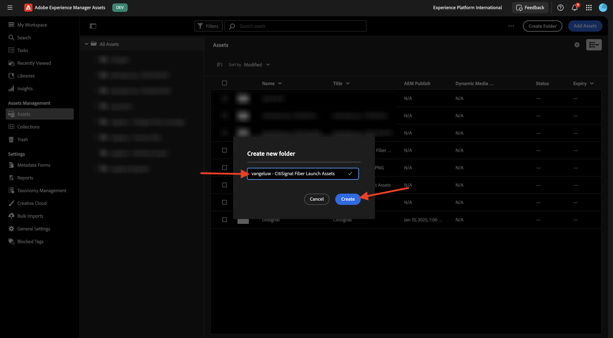
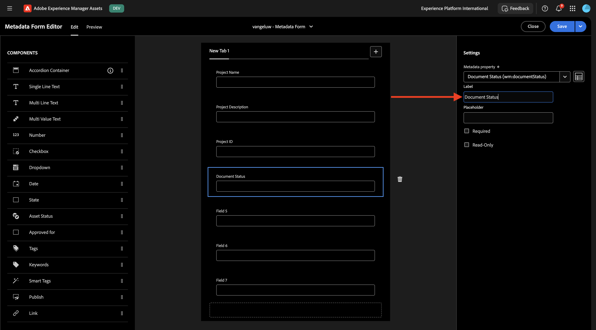
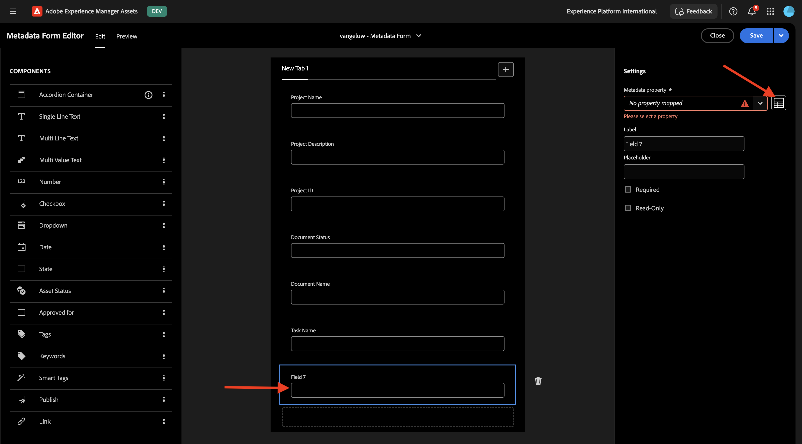
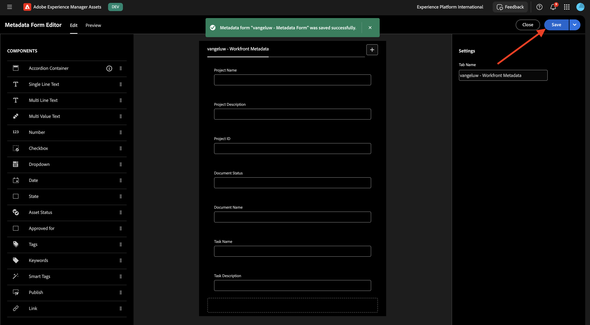

# 1.2.1 WorkfrontとAEM Assets CS メタデータの統合

>[!IMPORTANT]
>
>この演習を完了するには、動作しているAEM Assets CS オーサー環境にアクセスできる必要があります。
>
>考慮すべき 2 つのオプションがあります。
>
>- GenStudio for CSC テクニカルイネーブルメントワークショップに参加している場合、インストラクターがAEM Assets CS オーサー環境を作成します。 名前と進め方をチェックしてください。
>
>- One Adobeのチュートリアルパスをすべて使用している場合は、[Adobe Experience Manager Cloud ServiceとEdge Delivery Services](./../../../modules/asset-mgmt/module2.1/aemcs.md){target="_blank"} の演習にアクセスしてください。 指示に従うと、そのような環境にアクセスできます。

>[!IMPORTANT]
>
>以前にAEM CS プログラムをAEM Assets CS 環境で設定している場合は、AEM CS サンドボックスが休止状態になっている可能性があります。 このようなサンドボックスの休止解除には 10～15 分かかるので、後で待つ必要がないように、今すぐ休止解除プロセスを開始することをお勧めします。

## 1.2.1.1 Workfront Workflow の用語

Workfrontの主なオブジェクトと概念を次に示します。

| 名前 | 最終更新日 |
| ---------------------- | ------------ | 
| ポートフォリオ | 統一された特徴を持つプロジェクトのコレクション。 これらのプロジェクトは通常、同じリソース、予算、時間枠で競合します。 |
| プログラム | ポートフォリオ内のサブセット。明確に定義されたメリットを達成するために、類似のプロジェクトをグループ化できます。 |
| プロジェクト | 特定の期間内に完了する必要があり、特定の予算とリソース数を使用する必要がある大量の作業。 管理しやすくするために、プロジェクトを一連のタスクに分割します。 すべてのタスクを完了すると、プロジェクトは完了します。 |
| プロジェクト テンプレート | プロジェクトテンプレートを使用して、組織内のプロジェクトに関連する繰り返し可能なプロセス、情報、および設定のほとんどを取り込むことができます。 テンプレートを作成したら、既存のプロジェクトに添付したり、新しいプロジェクトを作成するために使用したりできます。 |
| タスク | 最終目標の達成（プロジェクトを完了）に向けた手順として実行する必要があるアクティビティです。 タスクは独立して存在することはできません。 これらは常にプロジェクトの一部です。 |
| 割り当て | イシューまたはタスクに割り当てられているユーザー、担当業務、チーム。 プロジェクト、ポートフォリオまたはプログラムには割り当てを含めることはできません。 |
| ドキュメント/バージョン | Workfront内のオブジェクトに添付されているファイル。 同じドキュメントが同じオブジェクトにアップロードされるたびに、バージョン番号が割り当てられます。 ユーザーは、以前のバージョンのドキュメントに対する複数のオプションを表示および変更できます。 |
| 承認 | タスク、ドキュメント、タイムシートなどの特定の作業項目に対して、その作業項目をスーパーバイザーまたは他のユーザーがサインオフする必要がある場合があります。 このサインオフのプロセスを承認と呼びます。 |

[https://experience.adobe.com/](https://experience.adobe.com/){target="_blank"} に移動します。 クリックして **Workfront** を開きます。

その後、これが表示されます。

## AEM Assets統合を設定 1.2.1.1 るには

**メニュー** アイコンをクリックし、「**設定**」を選択します。

左側のメニューで、下にスクロールして **ドキュメント** を表示し、**Experience Manager Assets** をクリックします。 「**+ Experience Manager統合を追加**」をクリックします。

統合の名前には、`--aepUserLdap-- - CitiSignal AEM` を使用します。

**Experience Manager リポジトリ** ドロップダウンを開き、AEM CS インスタンス（`--aepUserLdap-- - CitiSignal`）を選択します。

**メタデータ** で、次のマッピングを設定します。

| Workfront フィールド | Experience Manager Assets フィールド |
| --------------- | ------------------------------ | 
| **ドキュメント** > **名前** | **wm:documentName** |
| **プロジェクト** > **名前** | **wm:projectName** |
| **プロジェクト** > **説明** | **wm:projectDescription** |
| **ドキュメント要求** > **ステータス** | **wm:wm:documentStatus** |
| **タスク** > **名前** | **wm:taskName** |
| **タスク** > **説明** | **wm:taskDescription** |
| **プロジェクト** > **ID** | **wm:projectId** |

**オブジェクトメタデータを同期** のスイッチを有効にします。

「**保存**」をクリックします。

これで、WorkfrontからAEM Assets CS への統合が設定されました。

## AEM Assets1.2.1.2 のメタデータ統合の設定

次に、AEM Assets CS を設定して、WorkfrontのアセットのメタデータフィールドがAEM Assets CS と共有されるようにする必要があります。

その場合は、[https://experience.adobe.com/](https://experience.adobe.com/) にアクセスしてください。 **Experience Manager Assets** をクリックします。

「」をクリックしてAEM Assets環境を選択します。これは、`--aepUserLdap-- - CitiSignal dev` という名前にする必要があります。

この画像が表示されます。 左側のメニューで、**Assets** に移動します。

次に、「**フォルダーを作成**」をクリックします。

フォルダーに `--aepUserLdap-- - CitiSignal Fiber Campaign` という名前を付け、「作成 **をクリック** ます。

次に、左側のメニューで **メタデータForms** に移動し、「作成 **をクリックし** す。

`--aepUserLdap-- - Metadata Form` という名前を使用して、「作成 **をクリックし** す。

フォームに 7 つの新しい **1 行のテキスト** フィールドを追加し、最初のフィールドを選択します。 次に、最初のフィールドの **メタデータプロパティ** フィールドの横にある **スキーマ** アイコンをクリックします。

このポップアップが表示されます。 検索フィールドに「`wm:project`」と入力し、「**プロジェクト名**」フィールドを選択します。 「**選択**」をクリックします。

フィールドのラベルを `Project Name` に変更します。 「**保存**」をクリックします。

2 番目のフィールドに移動し、「**メタデータプロパティ** フィールドの横にある **スキーマ** アイコンをクリックします。

検索フィールドに「`wm:project`」と入力し、「**プロジェクト説明**」フィールドを選択します。 「**選択**」をクリックします。

フィールドのラベルを `Project Description` に変更します。

次に、3 番目のフィールドを選択し、「**メタデータプロパティ** フィールドの横にある **スキーマ** アイコンを再度クリックします。

その後、このポップアップが再び表示されます。 検索フィールドに「`wm:project`」と入力し、「**プロジェクト ID**」フィールドを選択します。 「**選択**」をクリックします。

フィールドのラベルを `Project ID` に変更します。

次に、4 番目のフィールドを選択し、**メタデータプロパティ** フィールドの横にある **スキーマ** アイコンをもう一度クリックします。

その後、このポップアップが再び表示されます。 検索フィールドに「`wm:document`」と入力し、「**ドキュメントステータス**」フィールドを選択します。 「**選択**」をクリックします。

フィールドのラベルを `Document Status` に変更します。

次に、5 番目のフィールドを選択し、「**メタデータプロパティ** フィールドの横にある **スキーマ** アイコンをもう一度クリックします。

その後、このポップアップが再び表示されます。 検索フィールドに「`wm:document`」と入力し、「ドキュメント名 **フィールドを選択** ます。 「**選択**」をクリックします。

フィールドのラベルを `Document Name` に変更します。

次に、6 番目のフィールドを選択し、「**メタデータプロパティ** フィールドの横にある **スキーマ** アイコンをもう一度クリックします。

その後、このポップアップが再び表示されます。 検索フィールドに「`wm:task`」と入力し、「**タスク名**」フィールドを選択します。 「**選択**」をクリックします。

フィールドのラベルを `Task Name` に変更します。

次に、7 番目のフィールドを選択し、「**メタデータプロパティ** フィールドの横にある **スキーマ** アイコンをもう一度クリックします。

その後、このポップアップが再び表示されます。 検索フィールドに「`wm:task`」と入力し、「**タスクの説明**」フィールドを選択します。 「**選択**」をクリックします。

フィールドのラベルを `Task Description` に変更します。

フォームの **タブ名** を `--aepUserLdap-- - Workfront Metadata` に変更します。

**保存** および **閉じる** をクリックします。

これで **メタデータフォーム** が設定されました。

次に、メタデータフォームを作成済みのフォルダーに割り当てる必要があります。 メタデータフォームのチェックボックスをオンにして、「**フォルダーに割り当て**」をクリックします。

`--aepUserLdap-- - CitiSignal Fiber Campaign` という名前のフォルダーを選択します。 **割り当て** をクリックします。

メタデータフォームがフォルダーに正常に割り当てられました。

次の手順：Workfrontで [1.2.2 を校正する &#x200B;](./ex2.md){target="_blank"}

[Adobe Workfrontによるワークフロー管理 &#x200B;](./workfront.md){target="_blank"} に戻る

[&#x200B; すべてのモジュールに戻る &#x200B;](./../../../overview.md){target="_blank"}
