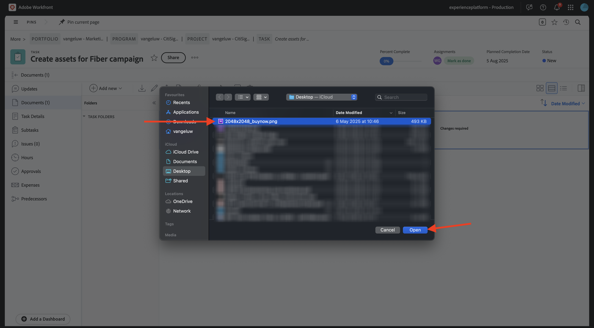
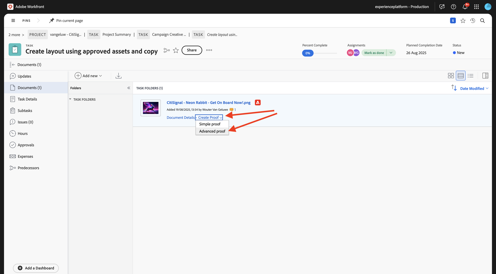

# 1.2.2 Workfrontでのプルーフ

>[!IMPORTANT]
>
>以前にAEM CS プログラムをAEM Assets CS 環境で設定している場合は、AEM CS サンドボックスが休止状態になっている可能性があります。 このようなサンドボックスの休止解除には 10～15 分かかるので、後で待つ必要がないように、今すぐ休止解除プロセスを開始することをお勧めします。

## 新 1.2.2.1 い承認フローを作成するには

**Adobe Workfront** に戻ります。 **メニュー** アイコンをクリックし、「**プルーフ**」を選択します。

**ワークフロー** に移動し、「**+新規」をクリックしてから** 「新規テンプレート **を選択し** す。

**テンプレート名** を `--aepUserLdap-- - Approval Workflow` に設定し、**テンプレート所有者** を自分に設定します。

下にスクロールして、**ステージ**/**ステージ 1** の下で、**レビュアーと承認者** の **役割** を自分に追加します。

「**作成**」をクリックします。

これで、基本承認ワークフローを使用する準備が整いました。

## 新 1.2.2.2 いプロジェクトを作成するには

**メニュー** を開き、**プログラム** に移動します。

前に作成したプログラムをクリックします。名前は `--aepUserLdap-- CitiSignal Fiber Launch` です。

>[!NOTE]
>
>作成および実行した自動処理を使用して、[Workfront計画 ](./../module1.1/ex1.md) の演習の一部としてプログラムを作成しました。 まだその手順を実行していない場合は、手順を参照してください。

プログラムで、「**プロジェクト**」に移動します。 「**+新規プロジェクト**」をクリックし、「**新規プロジェクト**」を選択します。

この画像が表示されます。 名前を `--aepUserLdap-- - CitiSignal Fiber Launch` に変更します。

**プロジェクト詳細** に移動します。 **説明** の下の「**+追加**」をクリックします。

説明を `The CitiSignal Fiber Launch project is used to plan the upcoming launch of CitiSignal Fiber.` に設定

「**変更を保存**」をクリックします。

これで、プロジェクトが作成されました。

## 新規タスクを作成 1.2.2.3 るには

**タスク** に移動し、「**+新規タスク**」をクリックします。

タスクの名前 `Create assets for Fiber campaign` を入力します。

フィールド **説明** を `This task is used to track the progress of the creation of the assets for the CitiSignal Fiber Launch Campaign.` に設定します。

**タスクを作成** をクリックします。

この画像が表示されます。

列 **割り当て** に、独自の名前を追加します。

その後、タスクが割り当てられます。

## タスク 1.2.2.4 新規ドキュメントを追加するには、承認フローを実行します

**Workfront** のロゴをクリックして、概要ページに戻ります。 作成したプロジェクトが概要に表示されます。 プロジェクトをクリックして開きます。

**タスク** で、をクリックしてタスクを開きます。

**ドキュメント** に移動します。 「**+新規追加」をクリックし** 「**ドキュメント**」を選択します。

[ このファイル ](./images/2048x2048.png) をデスクトップにダウンロードします。

{width="50px" align="left"}

ファイル **2048 x 2048.png** を選択し、「**開く**」をクリックします。

これで完了です。 アップロードしたドキュメントにポインタを合わせます。 「**プルーフを作成**」をクリックして、「**詳細プルーフ**」を選択します。

**新しいプルーフ** ウィンドウで、「**自動** を選択したあと、以前に作成したワークフローテンプレートを選択します。このテンプレートには、`--aepUserLdap-- - Approval Workflow` という名前を付ける必要があります。 **プルーフを作成** をクリックします。

**作業** をクリックします。

**プルーフを開く**」をクリックします

これで、プルーフを確認できます。 「**コメントを追加**」を選択して、ドキュメントの変更を必要とするコメントを追加します。

コメントを入力し、「**投稿**」をクリックします。 「**閉じる**」をクリックします。

次に、役割を **レビュアー** から **レビュアーおよび承認者** に変更する必要があります。 これをおこなうには、タスクに戻り、「**プルーフワークフロー**」をクリックします。

役割を **レビュアー** から **レビュアーおよび承認者** に変更します。

タスクに戻り、プルーフを再度開きます。 これで、「決定する **という新しいボタンが表示され** す。 クリックします。

「**変更が必要です**」を選択し、「**決定を下す**」をクリックします。

**タスク** と **ドキュメント** に戻ります。 ここで、提供されたコメントを考慮した 2 つ目の画像をアップロードする必要があります。

[ このファイル ](./images/2048x2048_buynow.png) をデスクトップにダウンロードします。

{width="50px" align="left"}

タスクビューで、承認されなかった古い画像ファイルを選択します。 次に、「**+新規追加**」をクリックし、「**バージョン**」を選択してから、「**ドキュメント**」を選択します。

ファイル「**2048x2048_buynow.png**」を選択し、「**開く**」をクリックします。

これで完了です。 **プルーフを作成** をクリックし、もう一度 **詳細プルーフ** を選択します。

その後、これが表示されます。 Workfrontが以前の承認ワークフローがまだ有効であると想定するので、**ワークフローテンプレート** が事前に選択されるようになりました。 **プルーフを作成** をクリックします。

**プルーフを開く** を選択します。

ファイルの 2 つのバージョンが各ホストの横に表示されるようになりました。

「**決定する**」をクリックし、「**承認済み** を選択して「**決定する**」を再度クリックします。

**タスク名** をクリックして、タスクの概要に戻ります。

その後、承認済みアセットを使用して、タスクビューに戻ります。 次に、このアセットをAEM Assetsに対して共有する必要があります。

承認済みドキュメントを選択します。 **矢印を共有** アイコンをクリックし、AEM Assets統合を選択します。これは、`--aepUserLdap-- - CitiSignal AEM` という名前にする必要があります。

前に作成したフォルダーをダブルクリックします。フォルダーの名前は `--aepUserLdap-- - CitiSignal Fiber Launch Assets` にする必要があります。

**フォルダーを選択** をクリックします。

1～2 分後に、ドキュメントがAEM Assetsに公開されます。 ドキュメント名の横に「AEM」アイコンが表示されます。

「**完了としてマーク**」をクリックして、このタスクを終了します。

この画像が表示されます。

## 1.2.2.5 AEM Assetsでファイルを表示

AEM Assets CS の `--aepUserLdap-- - CitiSignal Fiber Launch Assets` という名前のフォルダーに移動します。

画像を選択し、「**詳細**」を選択します。

その後、WorkfrontとAEM Assetsの統合によって値が自動的に入力された、前に作成したメタデータフォームが表示されます。

[Adobe Workfrontによるワークフロー管理 ](./workfront.md){target="_blank"} に戻る

[ すべてのモジュールに戻る ](./../../../overview.md){target="_blank"}
