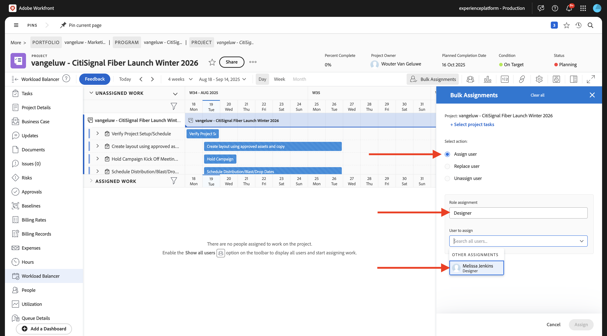
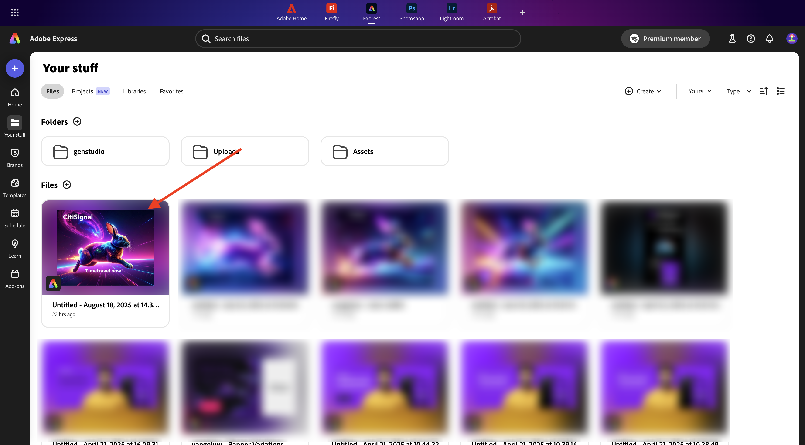
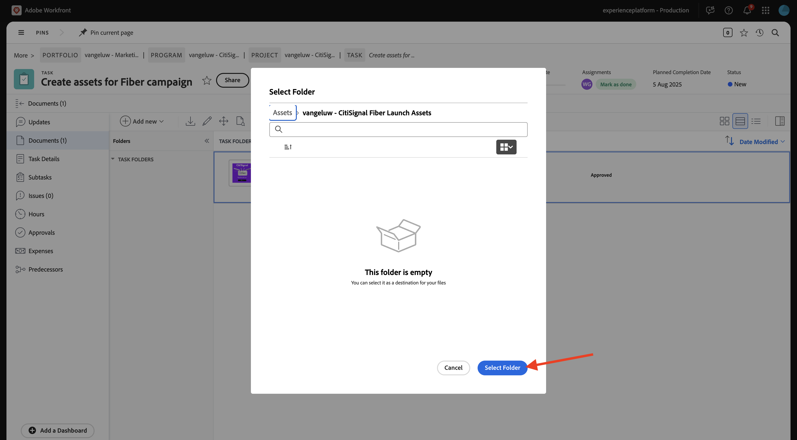

# 1.2.2 Workfrontでのプルーフ

>[!IMPORTANT]
>
>以前にAEM CS プログラムをAEM Assets CS 環境で設定している場合は、AEM CS サンドボックスが休止状態になっている可能性があります。 このようなサンドボックスの休止解除には 10～15 分かかるので、後で待つ必要がないように、今すぐ休止解除プロセスを開始することをお勧めします。

## 新 1.2.2.1 い承認フローを作成するには

**Adobe Workfront** に戻ります。 **メニュー** アイコンをクリックし、「**プルーフ**」を選択します。

**ワークフロー** に移動し、「**+新規」をクリックしてから** 「新規テンプレート **を選択し** す。

**テンプレート名** を `--aepUserLdap-- - Approval Workflow` に設定し、**テンプレート所有者** を自分に設定します。

下にスクロールして、**ステージ**/**ステージ 1** で、**プルーフ作成者** の役割を **レビュアーおよび承認者** に変更します。 他のユーザーを追加することもできます。例えば、ユーザーを選択して自分を追加し、**レビュアーおよび承認者** の **役割** を設定します。

「**作成**」をクリックします。

これで、基本承認ワークフローを使用する準備が整いました。

## 1.2.2.2 Workfront ブループリントを有効にする

次の手順では、テンプレートを使用して新しいプロジェクトを作成します。 Adobe Workfrontには、アクティブ化するだけの使用可能なブループリントが多数用意されています。

CitiSignal のユースケースでは、ブループリント **統合されたキャンペーン実行** を使用する必要があります。

そのブループリントをインストールするには、メニューを開いて **ブループリント** を選択します。

フィルター **マーケティング** を選択し、下にスクロールしてブループリント **統合キャンペーン実行** を見つけます。 **インストール** をクリックします。

「**続行**」をクリックします。

「**現状のままインストール…**」をクリックします。

この画像が表示されます。 インストールには数分かかることがあります。

数分後、ブループリントがインストールされます。

## 新 1.2.2.3 いプロジェクトを作成するには

**メニュー** を開き、**プログラム** に移動します。

前に作成したプログラムをクリックします。名前は `--aepUserLdap-- CitiSignal Fiber Launch` です。

>[!NOTE]
>
>作成および実行した自動処理を使用して、[Workfront計画 ](./../module1.1/ex1.md) の演習の一部としてプログラムを作成しました。 まだその手順を実行していない場合は、手順を参照してください。

プログラムで、「**プロジェクト**」に移動します。 「**+新規プロジェクト**」をクリックし、「**テンプレートから新規プロジェクト**」を選択します。

テンプレート **統合キャンペーン実行** を選択し、「**テンプレートを使用**」をクリックします。

この画像が表示されます。 名前を `--aepUserLdap-- - CitiSignal Fiber Launch Winter 2026` に変更し、「**プロジェクトを作成** をクリックします。

これで、プロジェクトが作成されました。 **プロジェクト詳細** に移動します。

**プロジェクト詳細** に移動します。 **説明** の下の現在のテキストをクリックして選択します。

説明を `The CitiSignal Fiber Launch project is used to plan the upcoming launch of CitiSignal Fiber.` に設定

「**変更を保存**」をクリックします。

これで、プロジェクトを使用する準備が整いました。

選択し、として設定したテンプレートに基づいて、プロジェクトのタスクと依存関係が作成されます。 プロジェクトの所有者。 プロジェクトのステータスが「**計画中** に設定されました。 リストで別の値を選択して、プロジェクトのステータスを変更できます。

## 新規タスクを作成 1.2.2.4 るには

タスク **デザインテンプレートの作成を開始** の上にマウスポインターを置き、3 つのドット **...** をクリックしてください。

オプション **下にタスクを挿入** を選択します。

タスクの名前 `Create layout using approved assets and copy` を入力します。

フィールド **Assignments** をロール **Designer** に設定します。
フィールド **期間** を **5 日** に設定します。
フィールドの先行タスクを **9** に設定します。
フィールドに「開始日 **および「期限** を入力 **し** す。

画面内の別の場所をクリックして、新しいタスクを保存します。

この画像が表示されます。 タスクをクリックして開きます。

**タスクの詳細** に移動し、フィールド **説明** を `This task is used to track the progress of the creation of the assets for the CitiSignal Fiber Launch Campaign.` に設定します。

「**変更を保存**」をクリックします。

この画像が表示されます。 「**プロジェクト**」フィールドをクリックして、プロジェクトに戻ります。

**プロジェクト** ビューで、「**ワークロードバランサー**」に移動します。

**一括割り当て** をクリックします。

**2&rbrace;Designer** の「役割の割り当て **を選択し、フィールド** 割り当てるユーザー **をクリックします。** Workfront インスタンスで **0&rbrace;Designer&rbrace; のロールを持つすべてのユーザーが表示されます。**&#x200B;この場合は、架空のユーザー **Melissa Jenkins** を選択します。

**割り当て** をクリックします。 選択したユーザーは、**Designer** の役割にリンクされているプロジェクト内のタスクに割り当てられます。

これでタスクが割り当てられました。 「**タスク**」をクリックして、**タスク** の概要ページに戻ります。

作成したタスク（という名前）をクリックします
**承認済みアセットを使用してレイアウトを作成し、コピー** します。

次に、この演習の一部として、このタスクの作業を開始します。 現在、このタスクに Melissa Jenkins が割り当てられていることがわかります。 これを自分用に変更するには、「**割り当て**」フィールドをクリックし、「**自分に割り当て**」を選択します。

「**保存**」をクリックします。

**作業** をクリックします。

この画像が表示されます。

このタスクの一環として、新しい画像を作成し、Workfrontにドキュメントとしてアップロードする必要があります。 次に、Adobe Expressを使用して自分でそのアセットを作成します。

## Adobe Firefly Services1.2.2.5Adobe Expressを使用したアセットの作成

[https://firefly.adobe.com/](https://firefly.adobe.com/){target="_blank"} に移動します。 プロンプト `a neon rabbit running very fast through space` を入力し、「**生成**」をクリックします。

その後、複数の画像が生成されます。 最も気に入った画像を選択し、画像上の **共有** アイコンをクリックして、「**Adobe Expressで開く**」を選択します。

生成した画像がAdobe Expressで編集できるようになります。 次に、画像に CitiSignal ロゴを追加する必要があります。 それには、**Brands** に移動します。

CitiSignal ブランドテンプレートが表示されます。 GenStudio for Performance Marketingで作成されたものがAdobe Expressに表示されます。 名前に `CitiSignal` が含まれるブランドテンプレートをクリックして選択します。

**ロゴ** に移動し、**白** Citignal ロゴをクリックして画像にドロップします。

CitiSignal ロゴは、画像の中央からそれほど遠くない位置に配置します。

**テキスト** に移動します。

「**テキストを追加**」をクリックします。

テキスト `Timetravel now!` を入力し、フォントカラーとフォントサイズを変更し、テキストを **太字** に設定して、これに類似した画像が表示されるようにします。

次に、「**共有**」をクリックします。

「**AEM Assets**」を選択します。

ファイル名を `CitiSignal - Neon Rabbit - Timetravel now!` に変更します。
**フォルダーを選択** をクリックします。

AEM Assets CS リポジトリ（`--aepUserLdap-- - CitiSignal` という名前）を選択し、フォルダー `--aepUserLdap-- - CitiSignal Fiber Campaign` を選択します。 「**選択**」をクリックします。

この画像が表示されます。 **1 個のアセットをアップロード** をクリックします。 これで、画像がAEM Assets CS にアップロードされます。

## タスク 1.2.2.6 新規ドキュメントを追加し、承認フローを開始するには

**タスクの詳細** 画面に戻ります。 **ドキュメント** に移動します。 「**+新規追加」をクリックし** AEM Assets CS リポジトリを選択します。このリポジトリには `--aepUserLdap-- - CitiSignal` という名前を付ける必要があります。

ダブルクリックして、フォルダー `--aepUserLdap-- CitiSignal Fiber Campaign` を開きます。

前の手順で作成したファイル（「CitiSignal - Neon rabbit - Timetravel Now **という名前）を選択します。png**. 「**選択**」をクリックします。

{width="50px" align="left"}

これで完了です。 アップロードしたドキュメントにポインタを合わせます。 「**プルーフを作成**」をクリックして、「**詳細プルーフ**」を選択します。

**新しいプルーフ** ウィンドウで、「**自動** を選択したあと、以前に作成したワークフローテンプレートを選択します。このテンプレートには、`--aepUserLdap-- - Approval Workflow` という名前を付ける必要があります。 **プルーフを作成** をクリックします。

**プルーフを開く**」をクリックします

これで、プルーフを確認できます。 「**コメントを追加**」を選択して、ドキュメントの変更を必要とするコメントを追加します。

コメントを入力し、「**投稿**」をクリックします。 次に、「**決定する** をクリックします。

「**変更が必要です**」を選択し、「**決定を下す**」をクリックします。

**タスク** と **ドキュメント** に戻ります。 「**変更が必要**」というテキストも表示されます。

次に、Adobe Expressで行うデザインの変更を行う必要があります。

## 1.2.2.7 Adobe Expressでデザインを変更する

[https://new.express.adobe.com/your-stuff/files](https://new.express.adobe.com/your-stuff/files) に移動し、前に作成した画像を再度開きます。

CTAのテキストを `Get On Board Now!` に変更します。

「**共有**」をクリックし、「**AEM Assets**」を選択します。

`CitiSignal - Neon Rabbit - Get On Board Now!` という名前を入力し、**フォルダーを選択** をクリックして宛先フォルダーを選択します。

AEM Assets CS リポジトリ（`--aepUserLdap-- - CitiSignal` という名前）を選択し、フォルダー `--aepUserLdap-- - CitiSignal Fiber Campaign` を選択します。 「**選択**」をクリックします。

**1 個のアセットをアップロード** をクリックします。

これで、新しいアセットが作成され、AEM Assetsに保存されました。

## 1.2.2.8 ドキュメントの新しいバージョンをタスクに追加

Adobe Workfrontのタスクビューで、承認されなかった古い画像ファイルを選択します。 次に、「**+新規追加**」をクリックし、「**バージョン**」を選択してから、`--aepUserLdap-- - CitiSignal` という名前が付くAEM Assets CS リポジトリを選択します。

フォルダー `--aepUserLdap-- CitiSignal Fiber Campaign` に移動し、ファイル `CitiSignal - Neon Rabit - Get On Board Now!.png` を選択します。 「**選択**」をクリックします。

これで完了です。 **プルーフを作成** をクリックし、もう一度 **詳細プルーフ** を選択します。

その後、これが表示されます。 Workfrontが以前の承認ワークフローがまだ有効であると想定するので、**ワークフローテンプレート** が事前に選択されるようになりました。 **プルーフを作成** をクリックします。

**プルーフを開く** を選択します。

ファイルの 2 つのバージョンが各ホストの横に表示されるようになりました。 「**配達確認を比較** ボタンをクリックします。

その後、それぞれの横に両方のバージョンの画像が表示されます。 **決定する** をクリックします。

**承認済み** を選択し、もう一度 **決定する** をクリックします。

左側のバージョンの画像を閉じて、**プルーフを比較** ビューを閉じます。 **タスク名** をクリックして、タスクの概要に戻ります。

その後、承認済みアセットを使用して、タスクビューに戻ります。 次に、このアセットをAEM Assetsに対して共有する必要があります。

承認済みドキュメントを選択します。 **矢印を共有** アイコンをクリックし、AEM Assets統合を選択します。これは、`--aepUserLdap-- - CitiSignal AEM` という名前にする必要があります。

前に作成したフォルダーをダブルクリックします。フォルダーの名前は `--aepUserLdap-- - CitiSignal Fiber Launch Assets` にする必要があります。

**フォルダーを選択** をクリックします。

1～2 分後に、ドキュメントがAEM Assetsに公開されます。 ドキュメント名の横に「AEM」アイコンが表示されます。

「**完了としてマーク**」をクリックして、このタスクを終了します。

この画像が表示されます。

## 1.2.2.9 AEM Assetsでファイルを表示

AEM Assets CS の `--aepUserLdap-- - CitiSignal Fiber Launch Assets` という名前のフォルダーに移動します。

画像を選択し、「**詳細**」を選択します。

その後、WorkfrontとAEM Assetsの統合によって値が自動的に入力された、前に作成したメタデータフォームが表示されます。

[Adobe Workfrontによるワークフロー管理 ](./workfront.md){target="_blank"} に戻る

[ すべてのモジュールに戻る ](./../../../overview.md){target="_blank"}
