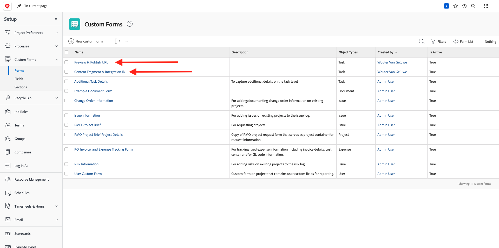

# 1.2.4 Workfront + AEM Sites

[https://experienceplatform.my.workfront.com/](https://experienceplatform.my.workfront.com/){target="_blank"} に移動して、Adobe Workfrontにログインします。

次に、これを確認します。

## AEM Sites統合を設定 1.2.4.1 るには

>[!NOTE]
>
>このプラグインは現在 **アーリーアクセス** モードであり、まだ一般公開されていません。
>
>このプラグインは、を使用しているWorkfront インスタンスに既にインストールされている場合があります。 既にインストールされている場合は、以下の手順を確認できますが、設定を変更する必要はありません。

[https://experience.adobe.com/#/@experienceplatform/aem/extension-manager/universal-editor](https://experience.adobe.com/#/@experienceplatform/aem/extension-manager/universal-editor){target="_blank"} に移動します。

このプラグインの **toggle** が **有効** に設定されていることを確認します。 次に、「**歯車** アイコンをクリックします。

**拡張機能設定** ポップアップが表示されます。 このプラグインを使用するために、以下のフィールドを設定します。

| キー | 値 |
| --------------- | ------------------------------ | 
| **`IMS_ENV`** | **PROD** |
| **`WORKFRONT_INSTANCE_URL`** | **https://experienceplatform.my.workfront.com** |
| **`SHOW_CUSTOM_FORMS`** | **&#39;{&quot;previewUrl&quot;: true, &quot;publishUrl&quot;: true}&#39;** |

「**保存**」をクリックします。

Workfront UI に戻り、9 つのドット **ハンバーガー** アイコンをクリックします。 **設定** を選択します。

左側のメニューで **カスタムForms** に移動し、「**フォーム**」を選択します。 「**+新規カスタムフォーム**」をクリックします。

**タスク** を選択し、「**続行**」をクリックします。

空のカスタムフォームが表示されます。 フォーム名 `Content Fragment & Integration ID` を入力します。

新しい **1 行のテキスト** フィールドをキャンバスにドラッグ&amp;ドロップします。

新しいフィールドを次のように設定します。

- **ラベル**:**コンテンツフラグメント**
- **名前**: **`aem_workfront_integration_content_fragment`**

キャンバスに新しい **1 行のテキスト** フィールドを追加し、次のように新しいフィールドを設定します。

- **ラベル**: **統合 ID**
- **名前**: **`aem_workfront_integration_id`**

「**適用**」をクリックします。

次に、2 番目のカスタムフォームを設定する必要があります。 「**+新規カスタムフォーム**」をクリックします。

**タスク** を選択し、「**続行**」をクリックします。

空のカスタムフォームが表示されます。 フォーム名 `Preview & Publish URL` を入力します。

新しい **1 行のテキスト** フィールドをキャンバスにドラッグ&amp;ドロップします。

新しいフィールドを次のように設定します。

- **ラベル**: **プレビュー URL**
- **名前**: **`aem_workfront_integration_preview_url`**

キャンバスに新しい **1 行のテキスト** フィールドを追加し、次のように新しいフィールドを設定します。

- **ラベル**: **パブリッシュ URL**
- **名前**: **`aem_workfront_integration_publish_url`**

「**適用**」をクリックします。

その後、2 つのカスタムフォームを使用できるようになります。

次の手順：Workfrontで [1.2.2 を校正する &#x200B;](./ex2.md){target="_blank"}

[Adobe Workfrontによるワークフロー管理 &#x200B;](./workfront.md){target="_blank"} に戻る

[&#x200B; すべてのモジュールに戻る &#x200B;](./../../../overview.md){target="_blank"}
