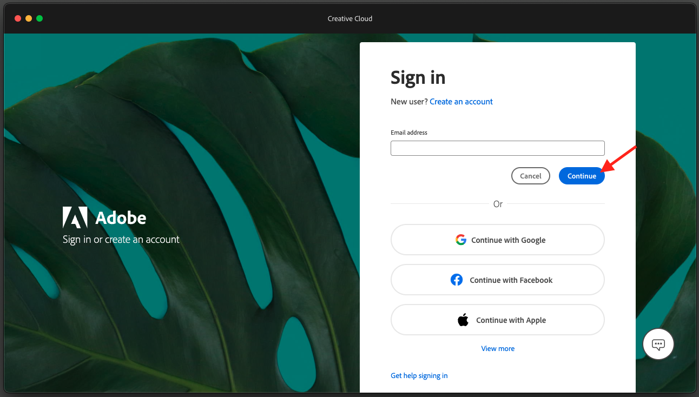
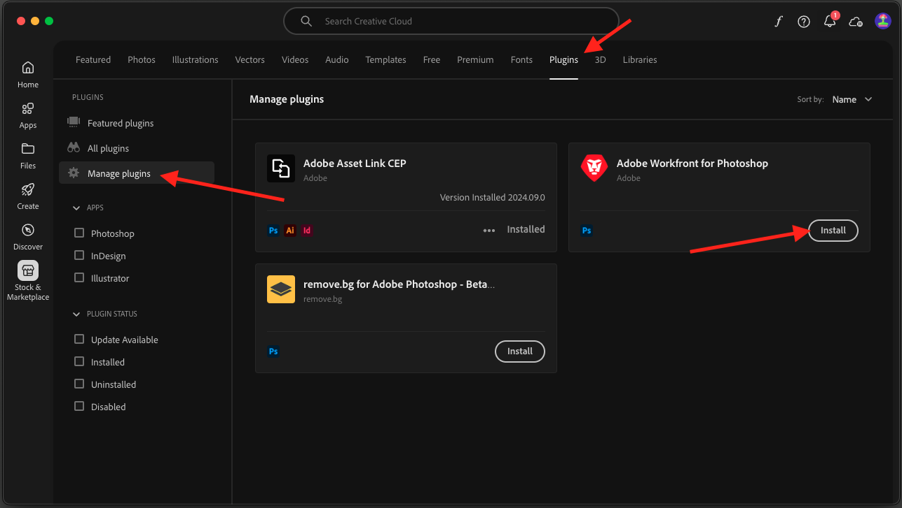
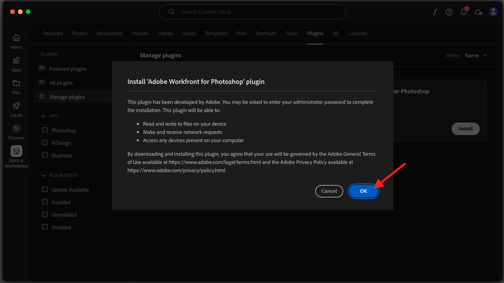
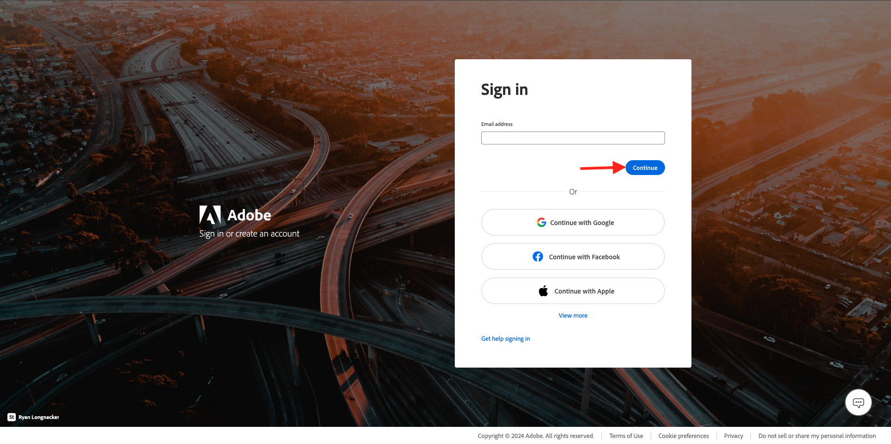

# 1.2.5 PhotoshopとWorkfront プラグインのセットアップ

## 1.2.5.1 Photoshop用Workfront プラグインのインストール

WorkfrontとPhotoshopの統合を設定するには、お使いのコンピューターにCreative Cloud アプリケーションをインストールします。 Adobe IDを使用してログインします。

**会社または学校アカウント** を選択し、認証します。

ログインするプロファイルを選択します。

君はここにいるよ。 **Stock &amp; Marketplace** に移動します。

**プラグイン** をクリックし、「**プラグインを管理**」をクリックします。 **2}Photoshop用Adobe Workfront** カードの「インストール **」をクリックします。**

「**OK**」をクリックします。

その後、これが表示されます。

## 1.2.5.2 Photoshopでのプラグインの設定

Photoshopを開きます。 タスクバーで、**プラグイン**/**Adobe PhotoshopのWorkfront**/**Adobe Workfront** をクリックします。

その後、これが表示されます。

Adobe Workfront インスタンスのドメインを入力します。 **ログイン** をクリックします。

**許可** をクリックします。

**Adobe ID** でサインインします。

**会社または学校アカウント** を選択します。

**アクセスを許可** をクリックします。

この確認が表示されます。

Photoshopに戻ると、プラグインを使用する準備が整い、アクティブなタスクが表示されています。

[Adobe Workfrontによるワークフロー管理 ](./workfront.md){target="_blank"} に戻る

[ すべてのモジュールに戻る ](./../../../overview.md){target="_blank"}
