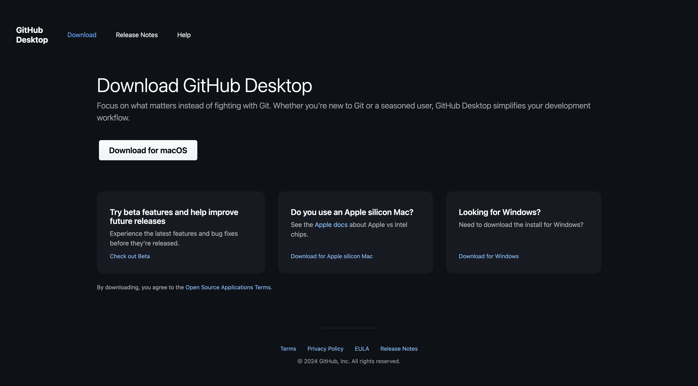

# 前作業

ライブワークショップに参加する前に必要な事前作業の概要を以下に示します。

## 1. Adobe Creative Cloudのインストール

[https://creativecloud.adobe.com/apps/download/creative-cloud](https://creativecloud.adobe.com/apps/download/creative-cloud) に移動します。

## 2.Photoshop

**Adobe Creative Cloud** アプリを開き、**アプリ** に移動します。 お使いのコンピューターにPhotoshopをインストールします。

## 3.Postman

[https://www.postman.com/downloads/](https://www.postman.com/downloads/) に移動します。

お使いの OS に関連するバージョンのPostmanをダウンロードしてインストールします。

個人用アカウントを使用してPostmanにログインします。

## 4. Visual Studio Code

[https://code.visualstudio.com/](https://code.visualstudio.com/){target="_blank"} に移動し、**Visual Studio Code** をダウンロードしてインストールします。

## 5.任意のテキストエディター

テキスト エディターアプリがない場合は、[https://www.sublimetext.com/](https://www.sublimetext.com/){target="_blank"} にアクセスして、このテキスト エディターをダウンロードしてインストールしてください。

## 6. GitHub アカウント

GitHub アカウントをまだお持ちでない場合は、[https://github.com/](https://github.com/){target="_blank"} にアクセスし、「**新規登録**」をクリックします。 あなたの個人の電子メールアドレスを使用して、アカウントを作成します。

## 7. GitHub デスクトップ

[https://desktop.github.com/download/](https://desktop.github.com/download/){target="_blank"} に移動し、**Github デスクトップ** をダウンロードしてインストールします。

>[!NOTE]
>
>{width="50px" align="left"}
>
>ご不明な点がある場合は、have suggestions on future content の一般的なフィードバックをお知らせください。**techinsiders@adobe.com** に電子メールを送信して、技術インサイダーに直接問い合わせてください。

[すべてのモジュールに戻る](./overview.md)
