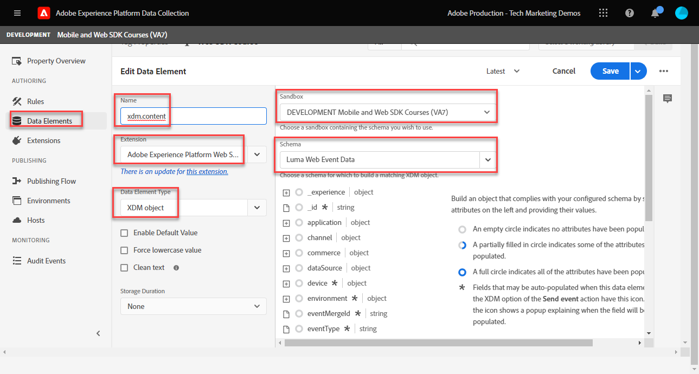

# データ要素の作成

Experience PlatformWeb SDK を使用して、データを取得するために必要な基本的なデータ要素を作成する方法について説明します。 でのコンテンツと ID データの両方をキャプチャします。 [Luma デモサイト](https://luma.enablementadobe.com/content/luma/us/en.html). 先ほど作成した XDM スキーマを、変数と呼ばれる Platform Web SDK データ要素タイプを使用してデータを収集するために使用する方法について説明します。

>[!NOTE]
>
> デモの目的で、このレッスンの演習は、 [スキーマの設定](configure-schemas.md) 手順：表示されたコンテンツと、 [Luma デモサイト](https://luma.enablementadobe.com/content/luma/us/en.html).

>[!IMPORTANT]
>
>このレッスンのデータは、 `[!UICONTROL digitalData]` Luma サイトのデータレイヤー。 データレイヤーを表示するには、デベロッパーコンソールを開き、「 」と入力します。 `[!UICONTROL digitalData]` をクリックして、使用可能なデータレイヤー全体を確認します。


Platform Web SDK に関係なく、Web サイトのデータ収集変数 ( データレイヤー、HTML属性など ) にマッピングするデータ要素を、tags プロパティ内で引き続き作成する必要があります。 これらのデータ要素を作成したら、それらを、 [スキーマの設定](configure-schemas.md) レッスン。 したがって、データ要素の作成は、次の 2 つのアクションで構成されます。

1. Web サイト変数のデータ要素へのマッピングおよび
1. これらのデータ要素の XDM オブジェクトへのマッピング

手順 1 では、コアタグ拡張機能のデータ要素タイプのいずれかを使用して、現在の方法でデータレイヤーをデータ要素に引き続きマッピングします。 手順 2 では、Platform Web SDK 拡張機能では、次のデータ要素タイプを使用できます。

* イベント結合 ID
* ID マップ
* Variable
* XDM オブジェクト

このレッスンでは、変数データ要素タイプに焦点を当てます。 Luma サイト上の使用可能なデータレイヤーに基づいて、Luma の訪問者のアクティビティをキャプチャするためのデータ要素を作成します。 次のレッスンでは、ID マップについて学びます。

>[!NOTE]
>
> イベント結合 ID と XDM オブジェクトデータ要素タイプは、エッジケースではほとんど使用されません。

## 学習内容

このレッスンを最後まで学習すると、次のことが可能になります。

* データレイヤーを XDM にマッピングするための様々なアプローチについて理解する
* コンテンツデータをキャプチャするためのデータ要素を作成する
* データ要素を XDM オブジェクトデータ要素にマッピングする


## 前提条件

データレイヤーとは何かを把握し、 [Luma デモサイト](https://luma.enablementadobe.com/content/luma/us/en.html){target="_blank"} データレイヤーを参照し、タグ内のデータ要素を参照する方法を理解している必要があります。 このチュートリアルの前の手順を完了している。

* [XDM スキーマの設定](configure-schemas.md)
* [ID 名前空間の設定](configure-identities.md)
* [データストリームの設定](configure-datastream.md)
* [タグプロパティにインストールされる Web SDK 拡張機能](install-web-sdk.md)

>[!IMPORTANT]
>
>The [Experience CloudID サービス拡張機能](https://exchange.adobe.com/experiencecloud.details.100160.adobe-experience-cloud-id-launch-extension.html) は、Adobe Experience Platform Web SDK を実装する際には必要ありません。ID サービス機能は、Platform Web SDK に組み込まれているからです。

## データレイヤーのアプローチ

Adobe Experience Platformのタグ機能を使用してデータレイヤーから XDM にデータをマッピングする方法は複数あります。 次に、3 つの異なるアプローチの長所と短所をいくつか示します。

* [データレイヤーでの XDM の実装](create-data-elements.md#implement-xdm-in-the-data-layer)
* [データストリーム内の XDM にマッピング](create-data-elements.md#map-to-xdm-in-the-datastream)
* [タグで XDM にマッピング](create-data-elements.md#map-data-layer-in-tags)

>[!NOTE]
>
>このチュートリアルの例では、タグアプローチの「 XDM にマッピング」に従います。


### データレイヤーでの XDM の実装

この方法では、完全に定義された XDM オブジェクトをデータレイヤーの構造として使用する必要があります。 次に、データレイヤー全体をタグで XDM オブジェクトデータ要素にAdobeします。 タグマネージャーを使用しない実装の場合、この方法は理想的です。これは、を使用して、アプリケーションから直接 XDM にデータを送信できるからです。 [XDM sendEvent コマンド](https://experienceleague.adobe.com/docs/experience-platform/edge/fundamentals/tracking-events.html?lang=en#sending-xdm-data). Adobeタグを使用する場合、データレイヤー全体をパススルー JSON オブジェクトとして XDM にキャプチャするカスタムコードデータ要素を作成できます。 次に、「イベントを送信」アクションの「XDM オブジェクト」フィールドにパススルー JSON をマッピングします。

データレイヤーがAdobeクライアントデータレイヤー形式を使用した場合の例を以下に示します。

+++データレイヤーでの XDM の例

```JSON
window.adobeDataLayer.push({
"eventType": "web.webPageDetails.pageViews",
"web":{
         "webInteraction":{
            "linkClicks":{
               "id":"",
               "value":""
            },
            "URL":"",
            "name":"",
            "region":"",
            "type":""
         },
         "webPageDetails":{
            "pageViews":{
               "id":"",
               "value":"1"
            },
            "URL":"https://luma.enablementadobe.com/",
            "isErrorPage":"",
            "isHomePage":"",
            "name":"luma:home",
            "server":"enablementadobe.com",
            "siteSection":"home",
            "viewName":""
         },
         "webReferrer":{
            "URL":"",
            "type":""
         }
      }
});
```

+++

長所

* 個々のデータレイヤー変数を XDM にマッピングする手順をスキップします。
* 開発チームがタグ付けのデジタル動作を所有している場合は、デプロイが迅速におこなえます。

短所

* XDM に送信するデータを更新するための開発チームと開発サイクルに完全に依存
* XDM がデータレイヤーから正確なペイロードを受け取るので、柔軟性は限られています
* 迅速なデプロイメントのために、スクレーピング、永続性、機能などの組み込み機能は使用できません
* サードパーティのピクセルに対してデータレイヤーを使用できません
* データレイヤーと XDM の間でデータを変換できない

### データストリーム内の XDM にマッピング

このアプローチは、データストリーム設定に組み込まれている機能を使用します。 [データ収集用のデータ準備](https://experienceleague.adobe.com/docs/experience-platform/datastreams/data-prep.html) とは、データレイヤー変数の XDM へのマッピングをタグ内でスキップします。

長所

* 個々の変数を XDM にマッピングできる柔軟性
* 次の機能を持つ [新しい値を計算](https://experienceleague.adobe.com/docs/experience-platform/data-prep/functions.html?lang=ja) または [データタイプを変換](https://experienceleague.adobe.com/docs/experience-platform/data-prep/data-handling.html) XDM に送られる前にデータレイヤーから
* 以下を実現するには、 [マッピング UI](https://experienceleague.adobe.com/docs/experience-platform/datastreams/data-prep.html#create-mapping) ポイント&amp;クリック UI を使用してソースデータ内のフィールドを XDM にマッピングするには

短所

* データレイヤー変数をクライアントサイドのサードパーティピクセルのデータ要素として使用することはできませんが、Adobeタグのイベント転送で使用することはできます
* Adobe Experience Platformのタグ機能の削除機能を使用できません
* タグとデータストリームの両方でデータレイヤーをマッピングすると、メンテナンスの複雑さが増します

### タグ内のデータレイヤーをマッピングする

この方法では、個々のデータレイヤー変数（またはデータレイヤーオブジェクト）をタグ内のデータ要素にマッピングし、最終的には XDM にマッピングします。 これは、タグ管理システムを使用した従来の実装アプローチです。

長所

* 個々の変数を制御し、XDM に到達する前にデータを変換できる、最も柔軟なアプローチです
* Adobeタグのトリガーとスクレーピング機能を使用して、データを XDM に渡すことができます。
* データ要素をクライアントサイドでサードパーティピクセルにマッピングできる

短所

* の実装に時間がかかる場合があります

>[!TIP]
>
> Google Data Layer
> 
> 組織が既にGoogle Analyticsを使用しており、Web サイトに従来のGoogle dataLayer オブジェクトがある場合、 [Google Data Layer 拡張機能](https://experienceleague.adobe.com/docs/experience-platform/tags/extensions/client/google-data-layer/overview.html?lang=en) Adobeタグ。 これにより、IT チームにサポートを依頼することなく、Adobeテクノロジーを迅速に導入できます。 Googleデータレイヤーを XDM にマッピングする場合は、上記と同じ手順に従います。

>[!IMPORTANT]
>
>前述したように、このチュートリアルの例では、タグのアプローチで XDM にマッピングする方法に従います。

## データレイヤーを取り込むためのデータ要素の作成

XDM オブジェクトを作成する前に、に対して次の一連のデータ要素を作成します。 [Luma デモサイト](https://luma.enablementadobe.com/content/luma/us/en.html){target="_blank"} データレイヤー：

1. に移動します。 **[!UICONTROL データ要素]** を選択し、 **[!UICONTROL データ要素を追加]** ( または **[!UICONTROL 新しいデータ要素を作成]** （タグプロパティに既存のデータ要素がない場合）

   

1. データ要素に「`page.pageInfo.pageName`」と名前を付けます。
1. 以下を使用します。 **[!UICONTROL JavaScript 変数]** **[!UICONTROL データ要素のタイプ]** を指定して、Luma のデータレイヤーの値を指定します。 `digitalData.page.pageInfo.pageName`

1. 次のチェックボックスをオンにします。 **[!UICONTROL 強制的に小文字に変換値]** および **[!UICONTROL クリーンテキスト]** 大文字と小文字を標準化し、余分なスペースを削除するには

1. 終了 `None` として **[!UICONTROL ストレージ期間]** の設定は、ページごとにこの値が異なるので、

1. 「**[!UICONTROL 保存]**」を選択します

   

同じ手順に従って、次の 4 つの追加データ要素を作成します。

* **`page.pageInfo.server`**  マッピング先：
  `digitalData.page.pageInfo.server`

* **`page.pageInfo.hierarchie1`**  マッピング先：
  `digitalData.page.pageInfo.hierarchie1`

* **`user.profile.attributes.username`**  マッピング先：
  `digitalData.user.0.profile.0.attributes.username`

* **`user.profile.attributes.loggedIn`** マッピング先：
  `digitalData.user.0.profile.0.attributes.loggedIn`

* **`cart.orderId`** マッピング先： `digitalData.cart.orderId` ( この [Analytics を設定](setup-analytics.md) レッスン )


>[!CAUTION]
>
>The [!UICONTROL JavaScript 変数] データ要素タイプは、配列参照を括弧ではなくドットとして扱うので、ユーザー名データ要素を `digitalData.user[0].profile[0].attributes.username` **動作しない**.

## 変数データ要素を作成する

データ要素を作成した後、 **[!UICONTROL 変数]** XDM オブジェクトに使用するスキーマを定義するデータ要素です。 このオブジェクトは、 [スキーマの設定](configure-schemas.md) レッスン。

変数データ要素を作成するには、次の手順に従います。

1. 選択 **[!UICONTROL データ要素を追加]**
1. データ要素に名前を付ける `xdm.variable.content`. タグプロパティをより整理するために、XDM 固有のデータ要素の前に「xdm」を付けることをお勧めします
1. を選択します。 **[!UICONTROL Adobe Experience Platform Web SDK]** として **[!UICONTROL 拡張]**
1. を選択します。 **[!UICONTROL 変数]** として **[!UICONTROL データ要素タイプ]**
1. 適切なExperience Platform **[!UICONTROL サンドボックス]**
1. 適切な **[!UICONTROL スキーマ]**（この場合） `Luma Web Event Data`
1. 「**[!UICONTROL 保存]**」を選択します

   

<!-- There are different ways to map data elements to XDM object fields. You can map individual data elements to individual XDM fields or map data elements to entire XDM objects as long as your data element matches the exact key-value pair schema present in the XDM object. In this lesson, you will capture content data by mapping to individual fields. You will learn how to [map a data element to an entire XDM object](setup-analytics.md#Map-an-entire-array-to-an-XDM-Object) in the [Setup Analytics](setup-analytics.md) lesson. 

Create an XDM object to capture content data:

1. In the left navigation, select **[!UICONTROL Data Elements]**
1. Select **[!UICONTROL Add Data Element]**
1. **[!UICONTROL Name]** the data element **`xdm.content`**
1. As the **[!UICONTROL Extension]** select `Adobe Experience Platform Web SDK`
1. As the **[!UICONTROL Data Element Type]** select `XDM object`
1. Select the Platform **[!UICONTROL Sandbox]** in which you created the XDM schema in during the [Configure an XDM Schema](configure-schemas.md) lesson, in this example `DEVELOPMENT Mobile and Web SDK Courses`
1. As the **[!UICONTROL Schema]**, select your `Luma Web Event Data` schema:

    

    >[!NOTE]
    >
    >The sandbox corresponds to the Experience Platform sandbox in which you created the schema. There can be multiple sandboxes available in your Experience Platform instance, so make sure to select the right one. Always work in development first, then production.

1. Scroll down until you reach the **`web`** object
1. Select to open it

    


1. Map the following web XDM variables to data elements

    * **`web.webPageDetials.name`** to `%page.pageInfo.pageName%`
    * **`web.webPageDetials.server`** to `%page.pageInfo.server%`
    * **`web.webPageDetials.siteSection`** to `%page.pageInfo.hierarchie1%`

    

1. Next, find the `identityMap` object in the schema and select it
 
1. Map to the `identityMap.loginID` data element

1. Select **[!UICONTROL Save]**

   

-->

これらの手順の最後に、次のデータ要素を作成する必要があります。

| CORE 拡張機能のデータ要素 | Platform Web SDK のデータ要素 |
-----------------------------|-------------------------------
| `cart.orderId` | `xdm.variable.content` |
| `page.pageInfo.hierarchie1` | |
| `page.pageInfo.pageName` | |
| `page.pageInfo.server` | |
| `user.profile.attributes.loggedIn` | |
| `user.profile.attributes.username` | |


>[!TIP]
>
>将来 [タグルールの作成](create-tag-rule.md) レッスンを学ぶには、 **[!UICONTROL 変数]** データ要素を使用すると、タグ内で複数のルールを積み重ねることができます。 **[!UICONTROL 変数アクションタイプを更新]**. その後、別の **[!UICONTROL イベント送信アクションタイプ]**.

これらのデータ要素が配置されたら、タグルールを使用して Platform Edge Network へのデータ送信を開始する準備が整いました。 まず、Web SDK を使用して ID を収集する方法について説明します。

[次へ： ](create-identities.md)

>[!NOTE]
>
>Adobe Experience Platform Web SDK の学習に時間を割いていただき、ありがとうございます。 ご質問がある場合、一般的なフィードバックを共有したい場合、または今後のコンテンツに関する提案がある場合は、こちらで共有してください [Experience Leagueコミュニティディスカッション投稿](https://experienceleaguecommunities.adobe.com/t5/adobe-experience-platform-launch/tutorial-discussion-implement-adobe-experience-cloud-with-web/td-p/444996)
