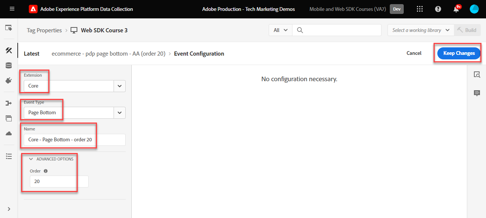

# タグルールの作成

タグルールを使用して、XDM オブジェクトを使用して Platform Edge Network にイベントを送信する方法を説明します。 タグルールは、タグプロパティに何らかの処理を指示するイベント、条件およびアクションを組み合わせたものです。

>[!NOTE]
>
> デモの目的で、このレッスンの演習は、 [ID の作成](create-identities.md) 手順： [Luma デモサイト](https://luma.enablementadobe.com/content/luma/us/en.html).

## 学習内容

このレッスンを最後まで学習すると、次のことが可能になります。

* タグ内のルールを管理するための命名規則を使用する
* タグルールで「Update Variable」アクションタイプと「Send Event」アクションタイプを使用して XDM イベントを送信します
* 開発ライブラリへのタグルールの公開

## 前提条件

データ収集タグと [Luma デモサイト](https://luma.enablementadobe.com/content/luma/us/en.html)で、このチュートリアルの前のレッスンで、以下の作業を完了している必要があります。

* [XDM スキーマの設定](configure-schemas.md)
* [ID 名前空間の設定](configure-identities.md)
* [データストリームの設定](configure-datastream.md)
* [タグプロパティにインストールされる Web SDK 拡張機能](install-web-sdk.md)
* [データ要素の作成](create-data-elements.md)
* [ID の作成](create-identities.md)

## 命名規則

タグ内のルールの管理を強化するには、標準の命名規則に従うことをお勧めします。 このチュートリアルでは、次の 3 つの部分で構成される命名規則を使用します。

* [**場所**] - [**イベント**] - [**ツール**] (**シーケンス**)

そこで

1. **場所** は、ルールが実行されるサイトのページです
1. **イベント** は、ルールのトリガーです
1. **ツール** は、そのルールのアクションステップで使用される特定のアプリケーションまたはアプリケーションです
1. **シーケンス** は、他のルールとの関連でルールを実行する順序です
<!-- minor update -->

## タグルールの作成

タグでは、ルールは、様々な条件でアクション（呼び出しの実行）を実行するために使用されます。 Platform Web SDK Tags 拡張機能には、このレッスンで使用する 2 つのアクションが含まれています。

* **[!UICONTROL 変数を更新]** データ要素を XDM フィールドにマッピングします。
* **[!UICONTROL イベントの送信]** は XDM オブジェクトを Network EdgeExperience Platformに送信します。

まず、 **[!UICONTROL 変数を更新]** アクション。サイトのすべてのページ（ページ名など）で送信する XDM フィールドの「グローバル設定」を定義します。

その後、 **[!UICONTROL 変数を更新]** 特定の条件でのみ使用可能な追加のフィールド（例えば、製品ページに製品の詳細を追加する）でグローバル XDM フィールドを補完するアクション。

最後に、 **[!UICONTROL イベントの送信]** 完全な XDM オブジェクトをAdobe Experience Platform Edge Network に送信するアクション。

### 変数ルールの更新

#### グローバルフィールド

グローバル XDM フィールドのタグルールを作成するには：

1. このチュートリアルで使用するタグプロパティを開きます。

1. に移動します。 **[!UICONTROL ルール]** 左のナビゲーションで

1. を選択します。 **[!UICONTROL 新規ルールの作成]** ボタン

   

1. ルール名を設定します。`all pages global content variables - library loaded - AA (order 1)`

1. Adobe Analytics の **[!UICONTROL イベント]** セクション、選択 **[!UICONTROL 追加]**

   

1. 以下を使用します。 **[!UICONTROL Core 拡張機能]** を選択し、 `Page Bottom` として **[!UICONTROL イベントタイプ]**

1. の下 **[!UICONTROL 名前]** フィールドに名前を付けます。 `Core - Page Bottom - order 1`. これは、意味のある名前でトリガーを説明するのに役立ちます。

1. 選択 **[!UICONTROL 詳細]** ドロップダウンと入力 `1` in **[!UICONTROL 注文]**

   >[!NOTE]
   >
   > 入力する数が多いほど、後でトリガーする操作の全体的な順序になります。

1. 選択 **[!UICONTROL 変更を保持]** メインのルール画面に戻るには
   

1. Adobe Analytics の **[!UICONTROL アクション]** セクション、選択 **[!UICONTROL 追加]**

1. を **[!UICONTROL 拡張]**&#x200B;を選択します。 **[!UICONTROL Adobe Experience Platform Web SDK]**

1. を **[!UICONTROL アクションタイプ]**&#x200B;を選択します。 **[!UICONTROL 変数を更新]**

1. を **[!UICONTROL データ要素]**&#x200B;を選択し、 `xdm.variable.content` 次の場所で作成した [データ要素の作成](create-data-elements.md) レッスン

   

次に、 [!UICONTROL データ要素] から [!UICONTROL スキーマ] XDM オブジェクトで使用されます。

>[!NOTE]
> 
> 個々のプロパティまたはオブジェクト全体にマップできます。 この例では、個々のプロパティにマッピングします。

1. 下にスクロールして、 **`web`** object

1. 選択して開きます。

1. 次のデータ要素を、対応する `web` XDM 変数

   * **`web.webPageDetials.name`**&#x200B;コピー先：`%page.pageInfo.pageName%`
   * **`web.webPageDetials.server`**&#x200B;コピー先：`%page.pageInfo.server%`
   * **`web.webPageDetials.siteSection`**&#x200B;コピー先：`%page.pageInfo.hierarchie1%`

1. `web.webPageDetials.pageViews.value` を `1` に設定します。

   

1. 次に、 `identityMap` オブジェクトを選択して選択します。

1. にマッピング `identityMap.loginID` データ要素

   

1. 次に、「 eventType 」フィールドを見つけて選択します。

1. 値を入力 `web.webpagedetails.pageViews`

   >[!WARNING]
   >
   > このドロップダウンには、 **`xdm.eventType`** 変数を使用して、XDM オブジェクトに格納します。 このフィールドには自由形式のラベルを入力することもできますが、 **しない** プラットフォームに悪影響を及ぼすので

   >[!TIP]
   >
   > に入力する値を理解するには、以下を実行します。 `eventType` 」フィールドに値を入力するには、スキーマページに移動して、 `eventType` 「 」フィールドを使用して、右側のパネルに推奨値を表示します。

   >[!TIP]
   >
   > 一方でも `web.webPageDetials.pageViews.value` nor `eventType` に設定 `web.webpagedetails.pageViews` は、Adobe Analyticsでビーコンをページビューとして処理するために必要です。他のダウンストリームアプリケーションのページビューを示す標準的な方法が役立ちます。

   

1. 選択 **[!UICONTROL 変更を保持]** その後 **[!UICONTROL 保存]** ルールの作成を終了するための次の画面のルール

#### 「Update variable」アクションで追加のルールを使用した XDM オブジェクトのエンリッチメント

以下を使用できます。 **[!UICONTROL 変数を更新]**  に送信する前に XDM オブジェクトをエンリッチメントするための複数の順番付きルール [!UICONTROL Platform Edge Network].

>[!TIP]
>
>ルールの順序は、イベントがトリガーされたときに最初に実行されるルールを決定します。 2 つのルールのイベントタイプが同じ場合、一番小さい数のルールが最初に実行されます。
> 
>

##### 製品ページのフィールド

まず、Luma の製品の詳細ページで製品表示を追跡します。

1. 選択 **[!UICONTROL ルールを追加]**
1. 名前を付ける  [!UICONTROL `ecommerce - pdp library loaded - AA (order 20)`]
1. を選択します。  イベントの下で新しいトリガーを追加
1. の下 **[!UICONTROL 拡張]**&#x200B;を選択します。 **[!UICONTROL コア]**
1. の下 **[!UICONTROL イベントタイプ]**&#x200B;を選択します。 **[!UICONTROL Page Bottom]**
1. 名前を付ける `Core - Page Bottom - order 20`
1. 選択して開く **[!UICONTROL 詳細オプション]**，入力 `20`. これにより、ルールが `all pages global content variables - library loaded - AA (order 1)` グローバルコンテンツ変数を設定しますが、 `all pages send event - library loaded - AA (order 50)` XDM イベントを送信する

   

1. の下 **[!UICONTROL 条件]**&#x200B;を選択して、 **[!UICONTROL 追加]**
1. 終了 **[!UICONTROL 論理タイプ]** as **[!UICONTROL 標準]**
1. 終了 **[!UICONTROL 拡張機能]** as **[!UICONTROL コア]**
1. 選択 **[!UICONTROL 条件タイプ]** as **[!UICONTROL Path Without Query String]**
1. 右側で、 **[!UICONTROL Regex]** トグル
1. の下 **[!UICONTROL パスが次と等しい]** 設定 `/products/`. Luma デモサイトの場合、ルールは製品ページ上のトリガーのみを確認します。
1. 選択 **[!UICONTROL 変更を保持]**

   

1. の下 **[!UICONTROL アクション]** 選択 **[!UICONTROL 追加]**
1. 選択 **[!UICONTROL Adobe Experience Platform Web SDK]** 拡張
1. 選択 **[!UICONTROL アクションタイプ]** as **[!UICONTROL 変数を更新]**
1. 下にスクロールして、 `commerce` オブジェクトを選択して開きます。
1. を開きます。 **[!UICONTROL productViews]** オブジェクトとセット **[!UICONTROL 値]** から `1`

   

   >[!TIP]
   >
   >XDM で commerce.productViews.value=1 を設定すると、 `prodView` Analytics のイベント

1. 下にスクロールして、「 」を選択します。 `productListItems` 配列
1. 選択 **[!UICONTROL 個々の項目を指定]**
1. 選択 **[!UICONTROL 項目を追加]**

   

   >[!CAUTION]
   >
   >The **`productListItems`** は `array` データ型を使用することをお勧めします。 Luma デモサイトのデータレイヤー構造と、Luma サイトでは一度に 1 つの製品のみ表示できるので、項目を個別に追加します。 独自の Web サイトにを実装する場合、データレイヤーの構造に応じて、配列全体を提供できる場合があります。

1. 選択して開く **[!UICONTROL 項目 1]**
1. **`productListItems.item1.SKU`** を `%product.productInfo.sku%` にマッピングします

   

1. 検索文字列 `eventType` を設定し、 `commerce.productViews`

1. 選択 **[!UICONTROL 変更を保持]**

1. 選択 **[!UICONTROL 保存]** ルールを保存するには

### 買い物かごのフィールド

配列が XDM スキーマの形式と一致する場合は、配列全体を XDM オブジェクトにマッピングできます。 カスタムコードデータ要素 `cart.productInfo` 以前のループを作成した場合は、 `digitalData.cart.cartEntries` Luma 上のデータレイヤーオブジェクトを作成し、 `productListItems` XDM スキーマのオブジェクト。

例として、Luma サイトのデータレイヤー（左）と翻訳済みのデータ要素（右）の比較を参照してください。

データ要素との比較 `productListItems` 構造（ヒント、一致する必要があります）。

>[!IMPORTANT]
>
>数値変数の変換方法に注意してください。データレイヤーには次のような文字列値があります。 `price` および `qty` データ要素の数値の形式に戻しました。 これらの形式の要件は、Platform のデータの整合性に重要で、 [スキーマの設定](configure-schemas.md) 手順 この例では、 **[!UICONTROL 量]** は **[!UICONTROL 整数]** データタイプ。
> 

次に、配列を XDM オブジェクトにマッピングしましょう」

1. という名前の新しいルールを作成します。 `ecommerce - cart library loaded - AA (order 20)`
1. を選択します。  イベントの下で新しいトリガーを追加
1. の下 **[!UICONTROL 拡張]**&#x200B;を選択します。 **[!UICONTROL コア]**
1. の下 **[!UICONTROL イベントタイプ]**&#x200B;を選択します。 **[!UICONTROL Page Bottom]**
1. 名前を付ける `Core - Page Bottom - order 20`
1. 選択して開く **[!UICONTROL 詳細オプション]**，入力 `20`
1. 選択 **[!UICONTROL 変更を保持]**

   

1. の下 **[!UICONTROL 条件]**&#x200B;を選択して、 **[!UICONTROL 追加]**
1. 終了 **[!UICONTROL 論理タイプ]** as **[!UICONTROL 標準]**
1. 終了 **[!UICONTROL 拡張機能]** as **[!UICONTROL コア]**
1. 選択 **[!UICONTROL 条件タイプ]** as **[!UICONTROL Path Without Query String]**
1. 右側に **しない** 有効にする **[!UICONTROL Regex]** トグル
1. の下 **[!UICONTROL パスが次と等しい]** 設定 `/content/luma/us/en/user/cart.html`. Luma デモサイトの場合、ルールは買い物かごページ上のトリガーのみを確認します。
1. 選択 **[!UICONTROL 変更を保持]**

   

1. の下 **[!UICONTROL アクション]** 選択 **[!UICONTROL 追加]**
1. 選択 **[!UICONTROL Adobe Experience Platform Web SDK]** 拡張
1. 選択 **[!UICONTROL アクションタイプ]** as **[!UICONTROL 変数を更新]**
1. 下にスクロールして、 `commerce` オブジェクトを選択して開きます。
1. を開きます。 **[!UICONTROL productListViews]** オブジェクトとセット **[!UICONTROL 値]** から `1`

   

   >[!TIP]
   >
   >XDM で commerce.productListViews.value=1 を設定すると、 `scView` Analytics のイベント

1. 下にスクロールして、「 」を選択します。 **[!UICONTROL productListItems]** 配列

1. 選択 **[!UICONTROL アレイ全体を提供]**

1. マッピング先 **`cart.productInfo`** データ要素

1. 選択 `eventType` に設定し、 `commerce.productListViews`

1. 選択 **[!UICONTROL 変更を保持]**

1. 選択 **[!UICONTROL 保存]** ルールを保存するには

以下の違いを持つ同じパターンに従って、他の 2 つのチェックアウトと購入のルールを作成します。

**ルール名**: `ecommerce - checkout library loaded - AA (order 20)`

* **[!UICONTROL 条件]**: /content/luma/us/en/user/checkout.html
* `eventType` を `commerce.checkouts` に設定します。
* 設定 **XDM コマースイベント**: commerce.checkout.value をに設定します。 `1`

  >[!TIP]
  >
  >これは、 `scCheckout` Analytics のイベント

**ルール名**: `ecommerce - purchase library loaded - AA (order 20)`

* **[!UICONTROL 条件]**: /content/luma/us/en/user/checkout/order/thank-you.html
* `eventType` を `commerce.purchases` に設定します。
* 設定 **XDM コマースイベント**: commerce.purchases.value をに設定します。 `1`

  >[!TIP]
  >
  >これは、 `purchase` Analytics のイベント

必要なすべての `purchase` イベント変数：

1. 開く **[!UICONTROL commerce]** object
1. を開きます。 **[!UICONTROL 注文]** object
1. マップ **[!UICONTROL purchaseID]** から `cart.orderId` データ要素
1. 設定 **[!UICONTROL currencyCode]** をハードコードされた値に `USD`

   

   >[!TIP]
   >
   >これは、 `s.purchaseID` および `s.currencyCode` Analytics の変数

1. 下にスクロールして、「 」を選択します。 **[!UICONTROL productListItems]** 配列
1. 選択 **[!UICONTROL アレイ全体を提供]**
1. マッピング先 **`cart.productInfo.purchase`** データ要素
1. 「**[!UICONTROL 保存]**」を選択します

完了したら、次のルールが作成されます。

### イベントを送信

これで変数を設定したので、2 つ目のルールを作成して、 **[!UICONTROL イベントを送信]** アクションタイプ。

1. 右側で、「 」を選択して、 **[!UICONTROL ルールを追加]** 別の規則を作成するには

1. ルール名を設定します。`all pages send event - library loaded - AA (order 50)`

1. Adobe Analytics の **[!UICONTROL イベント]** セクション、選択 **[!UICONTROL 追加]**

1. 以下を使用します。 **[!UICONTROL Core 拡張機能]** を選択し、 `Page Bottom` として **[!UICONTROL イベントタイプ]**

1. の下 **[!UICONTROL 名前]** フィールドに名前を付けます。 `Core - Page Bottom - order 50`. これは、意味のある名前でトリガーを説明するのに役立ちます。

1. 選択 **[!UICONTROL 詳細]** ドロップダウンと入力 `50` in **[!UICONTROL 注文]**. これにより、最初に「トリガー」に設定したルールの後に、2 番目のルールトリガーが確実に適用されます。 `1`.

1. 選択 **[!UICONTROL 変更を保持]** メインのルール画面に戻るには
   

1. Adobe Analytics の **[!UICONTROL アクション]** セクション、選択 **[!UICONTROL 追加]**

1. を **[!UICONTROL 拡張]**&#x200B;を選択します。  **[!UICONTROL Adobe Experience Platform Web SDK]**

1. を  **[!UICONTROL アクションタイプ]**&#x200B;を選択します。  **[!UICONTROL イベントを送信]**

1. を **[!UICONTROL XDM]**&#x200B;を選択し、 `xdm.variable.content` 前のレッスンで作成したデータ要素

1. 選択 **[!UICONTROL 変更を保持]** メインのルール画面に戻るには

   
1. 選択 **[!UICONTROL 保存]** ルールを保存するには

   

## ライブラリでのルールの公開

次に、ルールを開発環境に公開して、機能することを確認できます。

ライブラリを作成するには：

1. に移動します。 **[!UICONTROL 公開フロー]** 左のナビゲーションで

1. 選択 **[!UICONTROL ライブラリを追加]**

   
1. の **[!UICONTROL 名前]**，と入力します。 `Luma Web SDK Tutorial`
1. の **[!UICONTROL 環境]**&#x200B;を選択します。 `Development`
1. 選択  **[!UICONTROL 変更されたリソースをすべて追加]**

   >[!NOTE]
   >
   >    Adobe Experience Platform Web SDK 拡張機能および `all pages global content variables - library loaded - AA (order 50)` ルールには、前のレッスンで作成したタグコンポーネントが表示されます。 Core 拡張機能には、すべての Web タグプロパティで必要となる基本 JavaScript が含まれています。

1. 選択 **[!UICONTROL 開発用に保存およびビルド]**

   

ライブラリのビルドには数分かかる場合があり、完了すると、ライブラリ名の左側に緑の点が表示されます。

ご覧のように [!UICONTROL 公開フロー] 画面、公開プロセスには、このチュートリアルの範囲外の多くの点があります。 このチュートリアルでは、開発環境で 1 つのライブラリを使用するだけです。

これで、Adobe Experience Platform Debuggerを使用して、リクエスト内のデータを検証する準備が整いました。

[次へ ](validate-with-debugger.md)

>[!NOTE]
>
>Adobe Experience Platform Web SDK の学習に時間を割いていただき、ありがとうございます。 ご質問がある場合、一般的なフィードバックを共有したい場合、または今後のコンテンツに関する提案がある場合は、こちらで共有してください [Experience Leagueコミュニティディスカッション投稿](https://experienceleaguecommunities.adobe.com/t5/adobe-experience-platform-launch/tutorial-discussion-implement-adobe-experience-cloud-with-web/td-p/444996)
