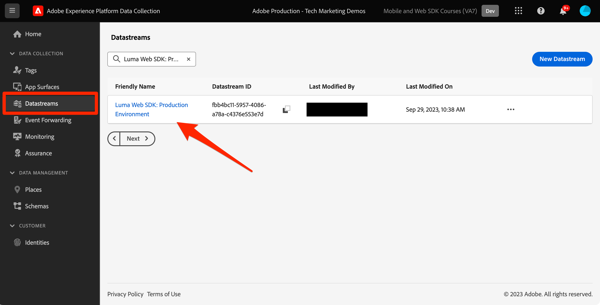
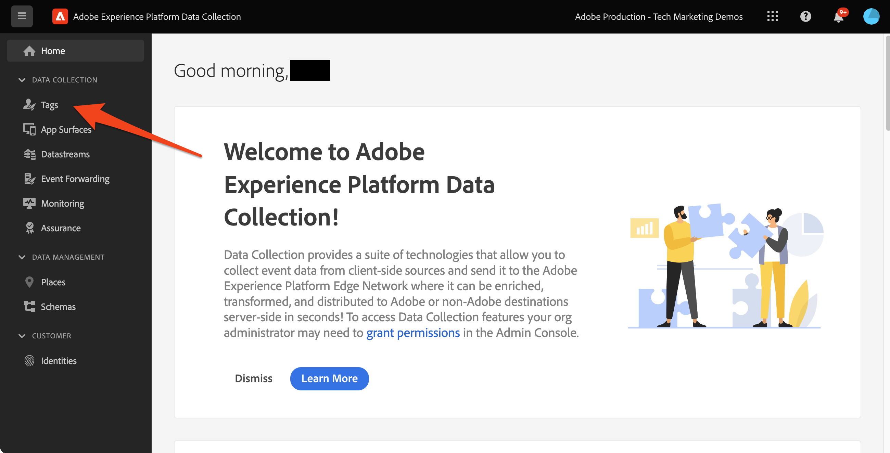
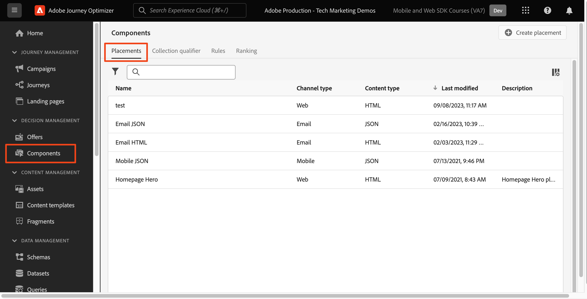

# Platform Web SDK を使用した決定管理の設定

Platform Web SDK を使用して決定管理を実装する方法について説明します。 このガイドでは、基本的な決定管理の前提条件、設定の詳細な手順、ロイヤルティステータスを中心とした使用例の詳細について説明します。

このドキュメントに従うことで、Journey Optimizerのユーザーは、offer decisioning機能を効果的に適用し、顧客インタラクションのパーソナライゼーションと関連性を強化する機能を備えています。

## 学習内容

このレッスンを最後まで学習すると、次のことが可能になります。

* Adobe Journey Optimizer内での決定管理の中心概念と、Adobe Experience Platform Web SDK との統合を把握します。

* Web SDK をOffer decisioning用に設定し、AJO とのシームレスな統合を確実におこなう手順を説明します。

* ロイヤリティステータスオファーを中心とした詳細な使用例を参照し、オファー、決定、配置の効果的な作成と管理に関するインサイトを得ます。

* 重要な用語と、意思決定管理フレームワーク内でのその意味を理解します。

* 適切なオファーを適切なユーザーに提供する際の、決定ルール、コレクション修飾子およびフォールバックオファーの重要性を理解します。

* シミュレーションやカスタムイベントデータ収集などの高度なトピックを掘り下げ、オファー配信メカニズムをテスト、検証、拡張できます。

## 前提条件

この節のレッスンを完了するには、まず以下をおこなう必要があります。

* 組織がAdobe Journey Optimizer Ultimate(AJO およびOffer decisioning) またはAdobe Experience PlatformとOffer decisioningアプリケーションサービスのアドオンにアクセスできることを確認します。

* Platform Web SDK の初期設定に関するすべてのレッスンを完了していること。

* 組織で Edge Decisioning を有効にします。

* データストリームを公開します。

* 配置を設定し、決定スコープ JSON 内で配置とアクティビティ ID をインスタンス化する方法を説明します。

## 制限事項

次の制限事項に注意してください。

* イベントベースのオファーは、現在、Adobe Journey Optimizerではサポートされていません。 イベントに基づいて決定ルールを作成した場合、その決定ルールをオファーに適用することはできません。

## 意思決定管理へのアクセスの許可

決定管理機能へのアクセス権を付与するには、 **製品プロファイル** をクリックし、対応する権限をユーザーに割り当てます。 [Journey Optimizerのユーザーと権限の管理について詳しくは、この節を参照してください。](https://experienceleague.adobe.com/docs/journey-optimizer/using/access-control/privacy/high-low-permissions.html?lang=en#decisions-permissions).

## データストリームの設定

Offer decisioningは、 **datastream** Platform Web SDK によって判定管理アクティビティを配信できるようにする前の設定。

データストリーム内のOffer decisioningを構成する手順は、次のとおりです。

1. に移動します。 [データ収集](https://experience.adobe.com/#/data-collection) インターフェイス。

1. 左側のナビゲーションで、「 **データストリーム**.

1. 前に作成した Luma Web SDK データストリームを選択します。

   

1. 選択 **編集** 内 **Adobe Experience Platform Service**.

   

1. 次を確認します。 **Offer decisioning** ボックス。

   

1. 「**保存**」を選択します。

これにより、Journey Optimizerのインバウンドイベントが **Adobe Experience Platform Edge**.

## 決定管理用の SDK の設定

決定管理には、Web SDK の実装タイプに応じて、追加の SDK 手順が必要です。 決定管理用の SDK を設定する方法は 2 つあります。

* SDK スタンドアロンインストール
   1. を設定します。 `sendEvent` のアクションを `decisionScopes`.

      ```javascript
      alloy("sendEvent", {
         ...
         "decisionScopes": [
            "[DECISION SCOPE 1]",
            "[DECISION SCOPE 2]"
         ]
      })
      ```

* SDK タグのインストール
   1. データ収集インターフェイスに移動します。

   1. 左側のナビゲーションで、「 **タグ**.

      

   1. を選択します。 **タグのプロパティ**.

   1. を作成します。 **ルール**.
      * Platform Web SDK の追加 **イベント送信アクション** 関連する `decisionScopes` を設定します。

   1. の作成と公開 **ライブラリ** すべての関連する **ルール**, **データ要素**、および **拡張機能** 設定済みです。

## 用語

まず、決定管理インターフェイスで使用される用語を理解する必要があります。

* **キャッピング**：オファーが表示される頻度を示す制約。 次の 2 つのタイプがあります。
   * 合計上限：ターゲットオーディエンス全体でオファーが表示できる最大回数。
   * プロファイル上限：特定のユーザーに対してオファーが表示される回数。
* **コレクション**：マーケターが設定した特定の条件（オファーカテゴリなど）別にグループ化されたオファーのサブセット。
* **決定**：オファーの選択を指示するロジックです。
* **決定ルール**：ユーザーの実施要件を調べるためのオファーの制約。
* **適格なオファー**：事前設定の制約に一致し、ユーザーに表示できるオファー。
* **決定管理**：ビジネスロジックと決定ルールを使用してパーソナライズされたオファーを作成および配布するシステム。
* **フォールバックオファー**：ユーザーがコレクションのオファーを受け入れない場合に表示されるデフォルトオファー。
* **オファー**：閲覧者を決定する実施要件ルールの候補を含むマーケティングメッセージです。
* **オファーライブラリ**：オファー、決定および関連ルールを管理する中央リポジトリ。
* **パーソナライズされたオファー**：実施要件の制約に基づいてカスタマイズされたカスタムマーケティングメッセージ。
* **配置**：オファーがユーザーに表示される設定またはシナリオ。
* **優先度**：実施要件や制限などの様々な制約を考慮したオファーのランキング指標。
* **表示域**：オファーの表示をガイドする、場所や言語など、チャネル固有の情報。

## ユースケースの概要 — ロイヤルティ報酬

このレッスンでは、Web SDK を使用して意思決定管理を理解するために、サンプルの Loyalty Rewards ユースケースを実装します。

この使用例では、一元化されたオファーライブラリとオファー決定エンジンを利用して、Journey Optimizerが顧客に最適なオファーを提供する方法をより深く理解できます。

>[!NOTE]
>
> このチュートリアルは実装者を対象としているので、このレッスンでは AJO での大幅な UI 作業を含むことに注意する必要があります。 このような UI タスクは通常マーケターが処理しますが、長期的に意思決定管理キャンペーンの作成に責任がない場合でも、実装者がプロセスに関するインサイトを得ると便利です。

## コンポーネント

オファーの作成を開始する前に、いくつかの前提条件のコンポーネントを定義する必要があります。

### Loyalty Offers 用配置の作成

**配置** は、オファーの表示に使用されるコンテナです。 この例では、Luma サイトの上部に配置を作成します。

プレースメントのリストには&#x200B;**コンポーネント**&#x200B;メニューからアクセスできます。フィルターは、特定のチャネルやコンテンツに従ってプレースメントを取得するのに役立ちます。



配置を作成するには、次の手順に従います。

1. 「**プレースメントを作成**」をクリックします。

   

1. プレースメントのプロパティを定義します。
   * **名前**：プレースメントの名前。例のプレースメントを呼び出します。 *&#39;ホームページバナー&#39;*.
   * **チャネルタイプ**：プレースメントが使用されるチャネル。 次を使用します。 *&#39;Web&#39;* オファーは Luma の Web サイトに表示されるので、
   * **コンテンツタイプ**：配置で表示できるコンテンツのタイプ ( テキスト、HTML、画像リンク、JSON)。 以下を使用できます。 *&#39;HTML&#39;* を設定します。
   * **説明**：プレースメントの説明（オプション）。

   

1. 「**保存**」をクリックします。
1. 配置が作成されると、配置リストに表示されます。
1. 決定範囲内での設定に必要な場合があるので、プレースメント ID を控えておきます。

   

### ロイヤリティステータスの決定ルール

**決定ルール** オファーの表示条件を指定します。 この例では、ユーザーの「ロイヤルティ」ステータスに応じて異なるオファーを提供する決定ルールを作成します。

決定ルールのリストには、 **コンポーネント** メニュー。

決定ルールを作成するには、次の手順に従います。

1. 次に移動： **ルール** タブで、 **ルールを作成**.

   

1. 最初のルールに名前を付けましょう&#39;*ゴールドロイヤリティステータスルール*&#39;. XDM フィールドを使用して、ルールを定義できます。 ザAdobe Experience Platform **セグメントビルダー** は、ルール条件の構築に使用できる直感的な UI です。

   

1. クリック **保存** をクリックして、ルールの条件を確定します。
1. 新しく保存された&#39;*ゴールドロイヤリティステータスルール*&#39;は **ルールリスト**. プロパティを表示するには、対象を選択します。

   

1. 次に、このユースケース用に、残りのロイヤリティオファールール条件を作成します。


### コレクション修飾子

**コレクション修飾子** を使用すると、オファーライブラリ内のオファーを簡単に整理および検索できます。 この例では、Loyalty Rewards オファーにコレクション修飾子を追加して、オファー組織を改善します。

コレクション修飾子のリストには、 **コンポーネント** メニュー。

Loyalty Rewards コレクション修飾子を作成するには、次の手順に従います。

1. 次に移動： **コレクション修飾子** タブで、 **コレクション修飾子の作成**.

   

1. コレクション修飾子に名前を付けましょう&#39;*ロイヤルティ報酬*&#39;

   

1. 新しいコレクション修飾子が **収集修飾子** タブ

## オファー

次に、ロイヤルティ報酬オファーを作成します。

オファーのリストには、 **オファー** メニュー。


### 様々なロイヤルティ層用のオファーの作成

まず、様々な Luma ロイヤリティ層向けにパーソナライズされたオファーを作成します。

最初の **オファー**&#x200B;を使用する場合は、次の手順に従います。

1. 「**オファーを作成**」をクリックし、「**パーソナライズされたオファー**」を選択します。

1. 最初のオファーに「*Luma ロイヤリティ層 — ゴールド*&#39;. このオファーの開始日時と終了日時を指定する必要があります。 また、 **収集修飾子** &#39;*ロイヤルティ報酬*&#39;をオファーに追加し、 **オファーライブラリ**. その後、「 **次へ**.

   

1. 次に、を追加する必要があります。 **表示域** ：オファーを表示する場所を定義します。 次の項目を選択します。 **web チャネル**. また、「*ホームページバナー*&#39; **配置** 以前に設定した内容。 選択した **配置** がHTMLタイプなので、HTML、JSON、TEXT のコンテンツをエディターに直接追加し、 **カスタム** ラジオボタン。

   

1. オファーコンテンツを **式エディター**. この配置には、HTML、JSON、または TEXT コンテンツを追加できます。 正しい **mode** をクリックします。 また、 **validate** をクリックして、エラーが発生しないようにします。

   

1. また、式エディタを使用して、Adobe Experience Platformに保存されている属性を取得することもできます。 1:1 レベルでロイヤルティメンバーをより適切にパーソナライズするために、プロファイルの名をオファーコンテンツに追加します。

   

1. 制約を追加して、「 」に該当するプロファイルにのみオファーを表示します&#x200B;*ゴールドロイヤリティステータスルール*&#39;.

   

1. オファーのレビューが完了したら、「 **完了**. 「**保存して承認**」を選択します。

次に、様々な Luma ロイヤリティ層の残りのオファーを作成します。

### フォールバックオファー

Luma サイトへの Luma 以外のロイヤリティの訪問者に対してもオファーを提供したいとします。 これをおこなうには、 **フォールバックオファー** キャンペーンの。

フォールバックオファーを作成するには、次の手順に従います。

1. 「**オファーの作成**」をクリックし、「**フォールバックオファー**」を選択します。
   <!--
      
   -->
1. フォールバックオファーに「*Luma 以外のロイヤリティ*&#39;. また、以前に作成した **収集修飾子**, &#39;*ロイヤルティ報酬*&#39;をオファー組織を簡単にするためのフォールバックオファーに追加します。
   <!--
      
   -->
1. フォールバックオファーコンテンツを **式エディター**. この配置には、HTML、JSON、または TEXT コンテンツを追加できます。 正しい **mode** をクリックします。 また、 **validate** をクリックして、エラーが発生しないようにします。
   <!--
      
   -->
1. すべてが正しく設定されている場合は、「 **完了** その後 **保存して承認**.
<!--
   
-->

## 決定

**決定** は、ターゲットに応じて、顧客が利用できる最適なオファーを選択するオファーのコンテナです。

決定のリストは、 **決定** タブ **オファー** メニュー。
<!--
   
-->

### ロイヤルティオファーの決定の作成

Luma Loyalty Rewards の使用例に関する決定を作成します。

決定を作成するには、次の手順に従います。

1. クリック **決定を作成**.
   <!--
      
   -->
1. 決定を呼びましょう、*12 月の Luma ロイヤリティオファー*&#39;. オファーは 1 か月間実行する必要があるので、ここで指定します。
   <!--
      
   -->
1. 次に、 **決定範囲**. 最初に配置を選択します。 以前に作成した「*ホームページバナー*&#39;.
   <!--
      
   -->
1. 次に、を追加する必要があります。 **評価基準** （決定範囲用）。 クリック **追加** 以前に作成した「 」を選択します。*ロイヤルティ報酬*&#39; **コレクション** 考慮するすべてのロイヤルティオファーを含む
   <!--
      
   -->
1. &#39;*ロイヤルティ報酬*&#x200B;コレクションでは、実施要件フィールドを使用して、オファーの配信を Luma 訪問者のサブセットに制限できます。 ただし、この使用例では、すべての訪問者に 1 つのオファーを受け取ってもらいたいと考えます。 忘れずに、 **フォールバックオファー** （非ロイヤルティ訪問者のみ） 実施要件を「なし」に設定します。
   <!--
      
   -->
1. また、 **ランキング方法** 複数のオファーがユーザー/プレースメントの組み合わせの実施要件を満たす場合、各 Luma 訪問者に最適なオファーを選択するフィールド。 この使用例では、 **オファーの優先度** メソッド：最適なオファーを提供するために、オファーで定義された値を使用します。
   <!--
      
   -->
1. 次に、 **フォールバックオファー** を決定に送信します。 フォールバックオファーは、Luma 訪問者が Luma ロイヤリティオーディエンスのいずれにも該当しない場合に Luma 訪問者に表示されるデフォルトのオファーであることを忘れないでください。 「 」を選択&#x200B;*Luma 以外のロイヤリティ*&#39; （「 」の使用可能なフォールバックオファーのリストから）*ホームページバナー*&#39;プレースメント。
   <!--
      
   -->
1. 決定をアクティブ化する前に、決定範囲、フォールバックオファー、使用可能なオファーのプレビュー、および絞り込まれたプロファイルを確認しましょう。 すべてが正常に表示されたら、「 **完了** および **保存してアクティブ化**.
<!--
   
-->

## シミュレーション

ベストプラクティスとしては、Luma Loyalty Decisioning ロジックを検証し、適切なオファーが適切なロイヤルティオーディエンスに配信されることを確認する必要があります。 これをおこなうには、 **テストプロファイル**. また、新しいオファーバージョンを実稼動環境にプッシュする前に、テストプロファイルを通じてオファーに対する変更をテストすることもお勧めします。

テストを開始するには、 **シミュレーション** タブを **オファー** メニュー。

### ロイヤリティオファーのテスト

1. シミュレーションに使用するテストプロファイルを選択します。 クリック **プロファイルを管理**. [オファーテスト用の新しいテストプロファイルを作成または指定するには、このガイドに従います](https://experienceleague.adobe.com/docs/journeys/using/building-journeys/about-journey-building/creating-test-profiles.html?lang=en#create-test-profiles-csv).
   <!--
      
   -->
1. 1 つ以上のテストプロファイルをシミュレーションに追加し、選択内容を保存します。 ユースケーステストでは、各 Luma ロイヤリティ報酬オーディエンスに対してテストプロファイルが設定されていることを確認する必要があります。
   <!--
      
   -->
1. テストする決定範囲を選択します。 「**決定範囲を追加**」を選択します。
   <!--
      
   -->
1. 以前に作成した「 」を選択します。*ホームページバナー*&#39;プレースメント。
   <!--
      
   -->
1. 使用可能な決定が表示され、以前に作成した「 」を選択します。*12 月の Luma ロイヤリティオファー*&#39;決定をクリックし、 **追加**.
   <!--
      
   -->
1. テストプロファイルを選択したら、「 **結果を表示**. 利用可能な最適なオファーは、「 」の選択したテストプロファイルに表示されます。*12 月の Luma ロイヤリティオファー*&#39;決定。
   <!--
      
   -->
1. 別のテストプロファイルを選択し、 **結果を表示**. テストプロファイルのロイヤルティ層に対応する別のシミュレーションオファーを表示するのが理想的です。

## Adobe Experience Platform Debuggerを使用した決定管理の検証

The **Adobe Experience Platform Debugger** 拡張機能（Chrome と Firefox の両方で使用可能）は、Web ページを分析して、Adobe Experience Cloudソリューションの実装に関する問題を特定します。

Luma サイトのデバッガーを使用して、実稼動環境で判定ロジックを検証できます。 すべてが正しく設定されていることを確認するには、Loyalty Rewards のユースケースが起動および実行された後に、これをお勧めします。

[こちらのガイドを使用して、ブラウザーでデバッガーを設定する方法を説明します。](https://experienceleague.adobe.com/docs/platform-learn/data-collection/debugger/overview.html?lang=en).

デバッガーを使用して検証を開始するには、次の手順に従います。

1. オファー配置を含む Luma Web ページに移動します。
   <!--
      
   -->
1. Web ページで、 **Adobe Experience Platform debugger**.
   <!--
      
   -->
1. に移動します。 **概要**. 次を確認します。 **Datastream ID** が **datastream** in **Adobeデータ収集** を有効にしたOffer decisioning。
   <!--
      
   -->
1. の下 **ソリューション** に移動します。 **Experience PlatformWeb SDK**.
   <!--
      
   -->
1. 内 **設定** タブ、切り替えオン **デバッグを有効にする**. これにより、 **Adobe Experience Platform Assurance** セッション。
   <!--
      
   -->
1. その後、様々な Luma ロイヤリティーアカウントを使用してサイトにログインし、デバッガーを使用して、 **Adobe Experience Platform Edge ネットワーク**. これらのリクエストはすべて、 **アシュランス** ログ追跡用。
<!--
   
-->