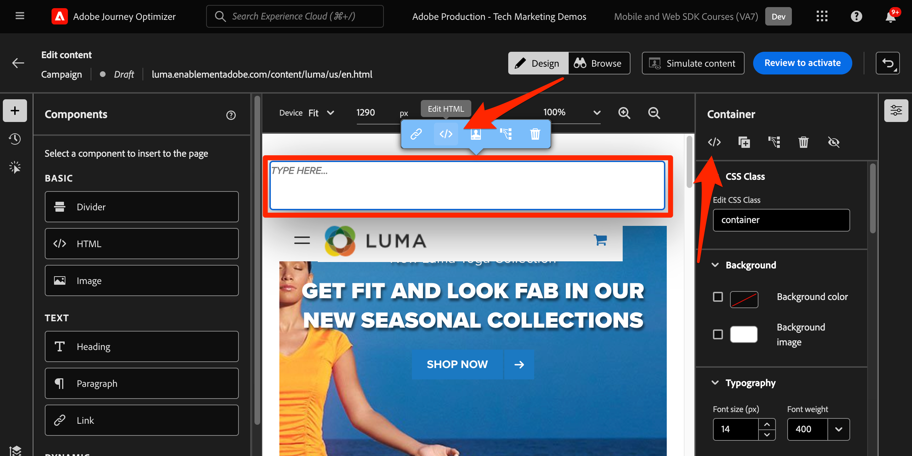

# Journey Optimizer web チャンネルの設定

Platform Web SDK を使用してJourney Optimizer web チャネルを実装する方法について説明します。 このガイドでは、基本的な web チャネルの前提条件、設定の詳細な手順、ロイヤルティステータスに基づくユースケースを詳しく説明します。

このガイドに従うと、Journey Optimizerのユーザーは、Journey Optimizer Web Designer を使用して高度なオンラインパーソナライゼーション用の web チャネルを効果的に適用できます。

## 学習内容

このレッスンを終了すると、次の操作を実行できます。

* Web チャネルエクスペリエンスを配信する際の Web SDK の機能と重要性を理解します。
* サンプルの Luma ロイヤルティ報酬ユースケースを利用して、web チャネルキャンペーンを最初から最後まで作成するプロセスを説明します。
* インターフェイス内でキャンペーンのプロパティ、アクション、スケジュールを設定します。
* Adobe Experience Cloud Visual Editing Helper 拡張機能の機能とメリットを説明します。
* Web デザイナーを使用して、画像、ヘッダー、その他の要素などの web ページコンテンツを編集する方法を説明します。
* オファーの決定コンポーネントを使用して Web ページにオファーを挿入する方法を説明します。
* Web チャネルキャンペーンの品質と成功を確保するためのベストプラクティスを確認します。

## 前提条件

このセクションのレッスンを完了するには、まず次の操作を行う必要があります。

* Adobe Experience Platform Web SDK タグ拡張機能のバージョンが 2.16 以上であることを確認します。
* Journey Optimizer Web Designer を使用して web チャネルエクスペリエンスを作成する場合は、Google Chrome またはMicrosoft® Edge ブラウザーを使用していることを確認してください。
* また、Adobe Experience Cloud Visual Editing Helper ブラウザー拡張機能をダウンロードしていることも確認します。 Web チャネルエクスペリエンスを作成する前に、ブラウザーツールバーで Visual Editing Helper ブラウザー拡張機能を有効にします。
   * Journey Optimizer Web Designer では、次のいずれかの理由により、特定の web サイトが確実に開かない場合があります。
      1. Web サイトには、厳格なセキュリティポリシーがあります。
      1. web サイトは iframe 内に埋め込まれます。
      1. 顧客の QA またはステージサイトは、外部からアクセスできません（内部サイトです）。
* ブラウザーでサードパーティ Cookie が許可されていることを確認します。 ブラウザーで広告ブロッカーを無効にする必要がある場合もあります。
* Web エクスペリエンスを作成し、Adobe Experience Manager Assets Essentials ライブラリのコンテンツを含める場合、このコンテンツを公開するためのサブドメインを設定する必要があります。 [詳細情報](https://experienceleague.adobe.com/docs/journey-optimizer/using/web/web-delegated-subdomains.html?lang=en)。
* コンテンツ実験機能を使用する場合は、web データセットもレポート設定に含まれていることを確認してください。
* 現在、web プロパティで web チャネルキャンペーンのオーサリングと配信を可能にする、次の 2 種類の実装がサポートされています。
   * クライアント側のみ：web サイトを変更するには、Adobe Experience Platform Web SDK を実装する必要があります。
   * ハイブリッドモード：Platform Edge Networkサーバー API を使用して、パーソナライゼーションサーバーサイドをリクエストできます。 API からの応答は次に、Adobe Experience Platform Web SDK に提供され、クライアントサイドで変更をレンダリングします。 詳しくは、Adobe Experience Platform Edge Networkサーバー API ドキュメントを参照してください。 ハイブリッドモードの追加の詳細と実装サンプルについては、このブログ投稿を参照してください。

>[!NOTE]
>
>サーバーサイドのみの実装は、現在、サポートされていません。

## 用語

まず、web チャネルキャンペーンで使用される用語を理解する必要があります。

* **Web チャネル**:web を介したコンテンツの通信または配信の媒体。 このガイドのコンテキストでは、Adobe Journey Optimizer内で Platform Web SDK を使用してパーソナライズされたコンテンツが web サイトの訪問者に配信されるメカニズムを指します。
* **Web サーフェス**：コンテンツが配信される URL で識別される web プロパティを指します。 1 つまたは複数の web ページを含めることができます。
* **Journey Optimizer Web Designer**：ユーザーが web チャネルエクスペリエンスをデザインできる、Journey Optimizer内の特定のツールまたはインターフェイス。
* **Adobe Experience Cloud Visual Editing Helper**:web チャネルエクスペリエンスの視覚的な編集とデザインを支援するブラウザー拡張機能。
* **データストリーム**:web チャネルエクスペリエンスを確実に配信できるようにする、Adobe Experience Platform サービス内の設定です。
* **結合ポリシー**：インバウンドキャンペーンの正確なアクティブ化と公開を確保する設定。
* **対象読者**：特定の条件を満たすユーザーまたはサイト訪問者の特定のセグメント。
* **Web デザイナー**：コードを深く掘り下げることなく、web エクスペリエンスの視覚的な編集や設計を支援するインターフェイスやツール。
* **式エディター**：ユーザーがデータ属性やその他の条件に基づいて、web コンテンツにパーソナライゼーションを追加できる web デザイナー内のツール。
* **オファーの決定コンポーネント**：意思決定管理に基づいて特定の訪問者に表示するのに最適なオファーを決定するのに役立つ、Web デザイナーのコンポーネント。
* **コンテンツ実験**：様々なコンテンツのバリエーションをテストして、インバウンドクリック数など、目的の指標に関して最もパフォーマンスが高いコンテンツを特定する方法。
* **処理**：コンテンツ実験のコンテキストでは、処理とは、別の実験に対してテストされるコンテンツの特定のバリエーションを指します。
* **模擬**：ライブオーディエンスに対してアクティブ化する前に web チャネルエクスペリエンスを視覚化するプレビューメカニズム。

## データストリームの設定

データストリームがAdobe Experience Platform サービス内で定義され、「Adobe Journey Optimizer」オプションが有効になっていることを確認します。 Platform Web SDK で web チャネルエクスペリエンスを配信する前に、これを設定する必要があります。

データストリームでAdobe Journey Optimizerを設定するには：

1. に移動します [データ収集](https://experience.adobe.com/#/data-collection){target="blank"} インターフェイス。
1. 左側のナビゲーションで「」を選択します **[!UICONTROL データストリーム]**.
1. 以前に作成した Luma Web SDK データストリームを選択します。

   

1. を選択 **[!UICONTROL 編集]** Adobe Experience Platform サービス内で使用できます。

   

1. を確認します **[!UICONTROL Adobe Journey Optimizer]** ボックス。

   

1. 「**[!UICONTROL 保存]**」を選択します。

これにより、Journey OptimizerのインバウンドイベントがAdobe Experience Platform Edge で正しく処理されます。

## 結合ポリシーの設定

結合ポリシーがで定義されていることを確認します。 **[!UICONTROL アクティブオンエッジ結合ポリシー]** 有効なオプション。 この結合ポリシーオプションは、Journey Optimizer インバウンドチャネルで使用され、エッジでのインバウンドキャンペーンの正確なアクティブ化と公開を確保します。

結合ポリシーでオプションを設定するには：

1. に移動します **[!UICONTROL 顧客]** > **[!UICONTROL プロファイル]** Experience PlatformまたはJourney Optimizer インターフェイスのページ。
1. 「」を選択します **[!UICONTROL 結合ポリシー]** タブ。
1. ポリシーを選択し、を切り替えます **[!UICONTROL アクティブオンエッジ結合ポリシー]** 内のオプション **[!UICONTROL 設定]** ステップ。

   

## コンテンツ実験用の web データセットの設定

Web チャネルキャンペーン内でコンテンツ実験を使用するには、使用する web データセットがレポート設定にも含まれていることを確認する必要があります。 Journey Optimizer レポートシステムは、データセットを読み取り専用で使用して、標準のコンテンツ実験レポートを生成します。

[コンテンツ実験レポート用のデータセットの追加について詳しくは、この節を参照してください](https://experienceleague.adobe.com/docs/journey-optimizer/using/campaigns/content-experiment/reporting-configuration.html?lang=en#add-datasets).

## ユースケースの概要 – ロイヤルティ報酬

このレッスンでは、サンプルのロイヤルティ報酬のユースケースを使用して、Web SDK を使用した web チャネルエクスペリエンスの実装を詳細に説明します。

この使用例を使用すると、Journey Optimizer キャンペーンと Web デザイナーを活用して、Journey Optimizerが最適なインバウンドエクスペリエンスを顧客に提供するのにどのように役立つかをより深く理解できます。

>[!NOTE]
>
>このチュートリアルは実装者向けなので、このレッスンにはJourney Optimizerでの実質的なインターフェイス作業が含まれていることは注目に値します。 通常、このようなインターフェイスタスクはマーケターが処理しますが、最終的に web チャネルキャンペーンの作成を担当しない場合でも、実装者がプロセスに関するインサイトを得ることは有益です。

### ロイヤルティスキーマの作成とサンプルデータの取り込み

Web SDK データを Platform に取り込むと、Adobe Experience Platformに取り込んだ他のデータソースによってデータを強化できます。 例えば、ユーザーが Luma サイトにログインすると、 `lumaCrmId` は、Luma の CRM システムの ID を表す Platform に送信されます。 ID グラフはExperience Platformで作成され、他のすべてのプロファイル対応データセットを結合してリアルタイム顧客プロファイルを作成できる可能性があります。 Adobe Experience Platformで別のデータセットをすばやく作成し、いくつかのサンプルロイヤルティデータを使用して、Journey Optimizer web キャンペーンでリアルタイム顧客プロファイルをどのように使用できるかを示します。 あなたは既に同様の演習を行ったので、指示は簡単になります。

スキーマを作成するには：

1. 新しいスキーマの作成
1. を選択 **[!UICONTROL 個人プロファイル]** as the [!UICONTROL 基本クラス]
1. スキーマに名前を付ける `Luma Loyalty Schema`
1. 「」を選択します `personID` フィールドとマークはです [!UICONTROL ID] および [!UICONTROL プライマリ ID] の使用 `Luma CRM Id` [!UICONTROL ID 名前空間].
1. を追加 [!UICONTROL ロイヤルティの詳細] フィールドグループ
1. のスキーマを有効にする [!UICONTROL Profile]

スキーマのスクリーンショット

データセットを作成してサンプルデータを取り込むには：

1. から新しいデータセットを作成 `Luma Loyalty Schema`
1. データセットに名前を付ける `Luma Loyalty Dataset`
1. のデータセットを有効にする [!UICONTROL Profile]
1. サンプル LoyaltyWebSDK.json ファイルをダウンロードします
1. ファイルをデータセットにドラッグ&amp;ドロップします
1. データが正常に取り込まれていることを確認します

データセットと確認のスクリーンショット

### ロイヤルティ報酬キャンペーンの作成

サンプルロイヤルティデータを取り込んだので、Adobe Journey Optimizerでロイヤルティ報酬 web チャネルキャンペーンを作成できます。

サンプルキャンペーンを作成するには：

1. に移動します。 **[!UICONTROL ジャーニー管理]** > **[!UICONTROL キャンペーン]** 左側のナビゲーションで
1. クリック **[!UICONTROL キャンペーンを作成]** 右上
1. 「**[!UICONTROL プロパティ]**」セクションで、キャンペーンを実行する方法を指定します。ロイヤルティ報酬のユースケースでは、次のいずれかを選択します **スケジュール済み**.

   

1. が含まれる **[!UICONTROL アクション]** セクションで、 **[!UICONTROL Web チャネル]**. として  **[!UICONTROL Web サーフェス]**&#x200B;を選択 **[!UICONTROL ページ URL]**.

>[!NOTE]
>
>Web サーフェスは、コンテンツが配信される URL で識別される web プロパティを参照します。 単一ページの URL に対応するか、複数のページを含めることができ、1 つまたは複数の web ページに変更を適用できます。

を選択します。 **[!UICONTROL ページ URL]** このキャンペーンで 1 ページにエクスペリエンスをデプロイするための web サーフェスオプション。 Luma ページの URL を入力します。

1. Web サーフェスを定義したら、を選択します。 **[!UICONTROL 作成]**.

   

1. 次に、新しい web チャネルキャンペーンにいくつかの追加の詳細を追加します。 まず、キャンペーンに名前を付けます。 呼び出す `Luma Loyalty Rewards – Gold Status – October 2023`. オプションで、キャンペーンに説明を追加できます。 さらに追加 **[!UICONTROL タグ]** キャンペーン全体の分類を改善する。

   

1. デフォルトでは、キャンペーンはすべてのサイト訪問者に対してアクティブです。 このユースケースでは、ゴールドステータス報酬メンバーにのみエクスペリエンスが表示されます。 有効にするには、 **[!UICONTROL オーディエンスを選択]** を選択し、 `Luma Loyalty Rewards – Gold Status` オーディエンス。

1. が含まれる **[!UICONTROL ID 名前空間]** フィールドで、選択したセグメント内の個人を識別する名前空間を選択します。 Luma サイトにキャンペーンをデプロイするので、ECID 名前空間を選択できます。 内のプロファイル `Luma Loyalty Rewards – Gold Status` 様々な ID の中で ECID 名前空間が欠落しているオーディエンスは、web チャネルキャンペーンのターゲットになりません。

   

1. キャンペーンを 12 月 1 日（PT）に開始するように、 **[!UICONTROL キャンペーン開始]** を選択して、12 月 31 日に終了します（ **[!UICONTROL キャンペーン終了]** オプション。

   

>[!NOTE]
>
>Web チャネルキャンペーンの場合、訪問者がページを開くと、web エクスペリエンスが表示されることに注意してください。 したがって、Adobe Journey Optimizerの他のタイプのキャンペーンとは異なり、 **[!UICONTROL アクショントリガー]** セクションは設定可能ではありません。

### ロイヤルティ報酬コンテンツを試す

が含まれる **[!UICONTROL アクション]** セクションでは、必要に応じて実験を作成し、で効果が高いコンテンツをテストできます `Luma Loyalty Rewards – Gold Status` オーディエンス。 キャンペーン設定のコンポーネントとして、2 つの処理を作成してテストします。

コンテンツ実験を作成するには：

1. クリック **[!UICONTROL 実験を作成]**.

   

1. 最初にを選択 **[!UICONTROL 成功指標]**. これは、コンテンツの有効性を判断するための指標です。 を選択 **[!UICONTROL ユニークインバウンドクリック]**&#x200B;を使用して、web エクスペリエンス CTA でより多くのクリック数を生成するコンテンツ処理を確認できます。

   

1. Web チャネルを使用して実験を設定し、 **[!UICONTROL インバウンドクリック]**, **[!UICONTROL ユニークインバウンドクリック]**, **[!UICONTROL ページビュー]**、または **[!UICONTROL ユニークページビュー数]** 指標、 **[!UICONTROL クリックアクション]** ドロップダウンを使用すると、特定のページに対するクリック数と表示数を正確に追跡および監視できます。

1. オプションで、 **[!UICONTROL 除外]** そのは 2 つの処理のどちらも受け取りません。 今のところ、これをオフのままにします。

1. また、オプションで、次のオプションを選択します **[!UICONTROL 均等に配分]**. このオプションを選択すると、処理の分割が常に均等に分割されます。

[Adobe Journey Optimizer web チャネルでのコンテンツ実験の詳細を学ぶ](https://experienceleague.adobe.com/docs/journey-optimizer/using/campaigns/content-experiment/get-started-experiment.html?lang=en).

### Visual Helper を使用したコンテンツの編集

次に、web チャネルエクスペリエンスを作成します。 それには、Adobe Experience Cloudを使用します **[!UICONTROL Visual Helper]**. これは、Google Chrome およびMicrosoft® Edge と互換性のあるブラウザー拡張機能です。 エクスペリエンスを作成する前に、拡張機能をダウンロードしていることを確認してください。 また、web ページに Web SDK が含まれていることを確認します。

1. 内 **[!UICONTROL アクション]** キャンペーンのタブで、 **[!UICONTROL コンテンツを編集]**. サーフェスとして 1 ページの URL を入力したので、コンポーザーで作業を開始する準備が整っています。

   

1. 次に、 **[!UICONTROL Web ページを編集]** オーサリングを開始します。

   

1. まず、web コンポーザーを使用していくつかの要素を編集します。 コンテキストメニューを使用して、Luma ヒーロー画像ヘッダーを編集します。 右側のコンテキストパネルのスタイルを調整します。

   

1. また、を使用してコンテナにパーソナライゼーションを追加します **[!UICONTROL 式エディター]**.

   

1. クリック数に関してエクスペリエンスが適切に追跡されていることを確認します。 を選択 **[!UICONTROL クリック追跡要素]** コンテキストメニューから。

   

1. の使用 **[!UICONTROL オファーの決定コンポーネント]** をクリックして web ページにオファーを挿入します。 このコンポーネントは **[!UICONTROL 意思決定管理]** luma の訪問者に提供する最適なオファーを選択します。

### HTMLデザインの変更

ロイヤルティ報酬キャンペーンのコンポーネントとしてサイトにさらに高度な変更やカスタム変更を加える場合は、いくつかの方法を使用できます。

の使用 **[!UICONTROL Components]** HTMLまたはその他のコンテンツを Luma サイトに直接追加するためのパネル。

新しいHTMLコンポーネントをページの上部に追加します。 デザインインターフェイスまたはデザインインターフェイスからコンポーネント内のHTMLを編集する **[!UICONTROL コンテキスト]** ペイン。

または、からHTMLの編集を追加します **[!UICONTROL 変更]** ペイン。 このパネルを使用すると、ページ上のコンポーネントを選択し、Designer インターフェイスから編集できます。

エディター内で、のHTMLを `Luma Loyalty Rewards – Gold Status` オーディエンス。 を選択 **[!UICONTROL Validate]**.

次に、新しいカスタムHTMLコンポーネントでフィット感と操作性を確認します。

を使用して特定のコンポーネントを編集する **[!UICONTROL CSS セレクタータイプ]** 変更。

を使用したカスタムコードの追加 **ページ `<head>` タイプ** 変更。

を使用すると、可能性が無限にあります。 **[!UICONTROL Visual Helper]**.

### ロイヤルティ報酬コンテンツのシミュレート

キャンペーンをアクティブ化する前に、変更された web ページのプレビューを確認します。 Web チャネルエクスペリエンスをシミュレートするには、テストプロファイルを設定する必要があります。

エクスペリエンスをシミュレートするには：

1. を選択 **[!UICONTROL コンテンツをシミュレート]** キャンペーン内で。

   

1. シミュレーションを受けるテストプロファイルを選択します。 テストプロファイルはに配置する必要があります。 `Luma Loyalty Rewards – Gold Status` 適切な扱いを受けるためのオーディエンス。

1. テストプロファイルのプレビューが表示されます。

### ロイヤルティ報酬キャンペーンのアクティブ化

最後に、web チャネルキャンペーンをアクティブ化します。

1. を選択 **アクティブ化するレビュー**.

1. 最後に、キャンペーンの詳細を確認するプロンプトが表示されます。 を選択 **[!UICONTROL Activate]**. キャンペーンがサイト上でライブになるまでに最大 15 分かかることがあります。

### ロイヤルティ報酬 QA

ベストプラクティスとして、を監視します **[!UICONTROL Web]** キャンペーン固有の KPI に関するキャンペーンのライブレポートとグローバルレポートのタブ。 このキャンペーンの場合は、エクスペリエンスインプレッション数とクリック率を監視します。

### Adobe Experience Platform Debuggerを使用した web チャネル検証

このAdobe Experience Platform Debugger拡張機能は Chrome と Firefox の両方で使用でき、web ページを分析してAdobe Experience Cloud ソリューションの実装の問題を特定します。

Luma サイトでデバッガーを使用すると、実稼動環境での web チャネルエクスペリエンスを検証できます。 これは、ロイヤルティ報酬のユースケースを立ち上げて実行し、すべてが正しく設定されていることを確認した後のベストプラクティスです。

[こちらのガイドを使用して、ブラウザーでデバッガーを設定する方法を説明します](https://experienceleague.adobe.com/docs/platform-learn/data-collection/debugger/overview.html?lang=en).

デバッガーを使用して検証を開始するには：

1. Web チャネルエクスペリエンスを持つ Luma Web ページに移動します。
   <!--
    
    -->
1. Web ページで、を開きます **[!UICONTROL Adobe Experience Platform Debugger]**.
   <!--
    
    -->
1. に移動します。 **概要**. を確認します **[!UICONTROL データストリーム ID]** 次に一致 **[!UICONTROL データストリーム]** 。対象： **[!UICONTROL Adobeデータ収集]** に対してAdobe Journey Optimizerを有効にしました。
   <!--
    
    -->
1. その後、様々な Luma ロイヤルティアカウントでサイトにログインし、デバッガーを使用して、Adobe Experience Platform Edge Networkに送信されたリクエストを検証できます。
   <!--
    
    -->
1. 次の下 **[!UICONTROL 解決策]** に移動します。 **[!UICONTROL Web SDK のExperience Platform]**.
   <!--
    
    -->
1. 内 **設定** タブ、切り替えオン **[!UICONTROL デバッグの有効化]**. これにより、内のセッションのログが **[!UICONTROL Adobe Experience Platform Assurance]** セッション。
   <!--
    
    -->
1. 様々な Luma ロイヤルティアカウントでサイトにログインし、デバッガーを使用して、に送信されたリクエストを検証します。 **[!UICONTROL Adobe Experience Platform Edge Network]**. これらのリクエストはすべて、次の場所で取得する必要があります。 **[!UICONTROL Assurance]** （ログトラッキング用）。
<!--
   
-->
