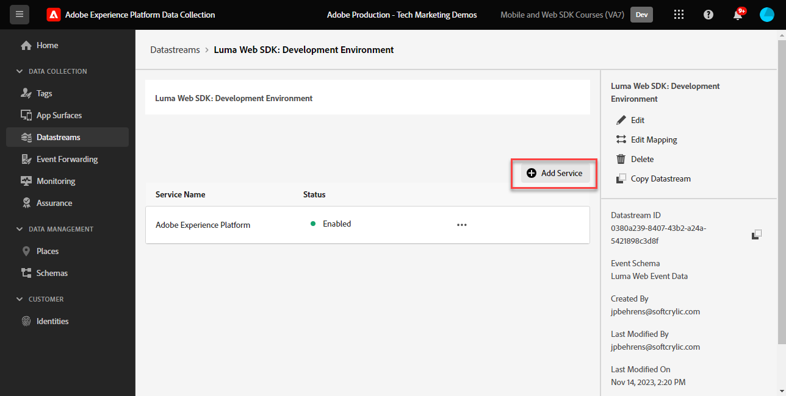
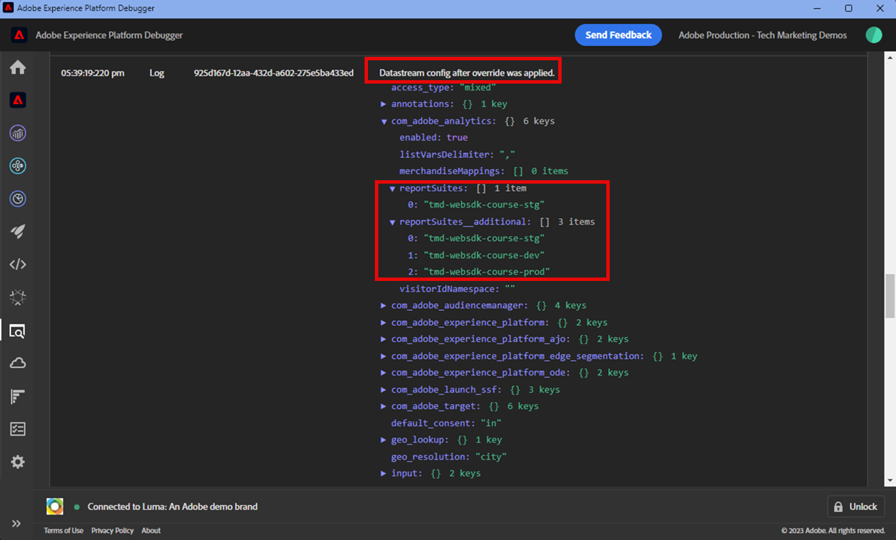

# Platform Web SDK でのAdobe Analyticsの設定

次を使用してAdobe Analyticsを設定する方法を説明します。 [Experience PlatformWeb SDK](https://experienceleague.adobe.com/docs/platform-learn/data-collection/web-sdk/overview.html?lang=ja)では、タグルールを作成してAdobe Analyticsにデータを送信し、Analytics が期待どおりにデータをキャプチャしていることを検証します。

[Adobe Analytics](https://experienceleague.adobe.com/docs/analytics.html?lang=ja) は、顧客像を把握し、顧客インテリジェンスを活用してビジネスを導く力をユーザーに提供する、業界最先端のアプリケーションです。


## 学習内容

このレッスンを最後まで学習すると、以下の内容を習得できます。

* Adobe Analytics用の XDM スキーマの設定
* Analytics での自動マッピングと手動でマッピングされた XDM 変数の違いの理解
* Adobe Analyticsを有効にするためのデータストリームの設定
* 別のAdobe Analyticsレポートスイートにデータを送信するためのデータストリームの上書き
* 個々のデータ要素または配列全体のデータ要素を XDM オブジェクトにマッピングする
* 「Update variable rule」アクションタイプを使用して、複数のルールを 1 つの XDM イベントに積み重ねます。
* XDM オブジェクトを使用してAdobe Analyticsでページビューをキャプチャします
* Adobe Analytics製品文字列の XDM オブジェクトを使用した e コマースデータのキャプチャ
* XDM を使用した製品構文マーチャンダイジングeVarの設定
* Adobe Analytics変数が XDM オブジェクトで設定されていることを検証するには、Experience PlatformDebugger を使用します。
* Adobe Analyticsの処理ルールを使用したカスタム変数の設定
* Adobe Experience Platform Assurance を使用して、Adobe Analyticsがデータを取り込んだことを検証する
* リアルタイムレポートを使用して、Adobe Analyticsがデータを取得したことを検証する

## 前提条件

タグ、Adobe Analytics、および [Luma デモサイト](https://luma.enablementadobe.com/content/luma/us/en.html){target="_blank"} ログイン機能とショッピング機能

テスト/開発レポートスイート ID が少なくとも 1 つ必要です。 このチュートリアルで使用できるテスト/開発用レポートスイートがない場合は、 [1 つを作成してください](https://experienceleague.adobe.com/docs/analytics/admin/manage-report-suites/new-report-suite/t-create-a-report-suite.html?lang=ja).

チュートリアルの前の節のすべての手順を完了している。

* 初期設定
   * [XDM スキーマの設定](configure-schemas.md)
   * [ID 名前空間の設定](configure-identities.md)
   * [データストリームの設定](configure-datastream.md)
* タグ設定
   * [Web SDK 拡張機能のインストール](install-web-sdk.md)
   * [データ要素の作成](create-data-elements.md)
   * [ID の作成](create-identities.md)
   * [タグルールの作成](create-tag-rule.md)
   * [Adobe Experience Platform Debugger を使用した検証](validate-with-debugger.md)

また、 [Adobe Experience Platform Assurance へのユーザーアクセスを有効にする](https://experienceleague.adobe.com/docs/experience-platform/assurance/user-access.html) Adobe Experience Platform Assurance を使用してAdobe Analyticsデータを検証できるようにするため。 （アクセススキーマ、ID 名前空間およびデータストリームを持っている場合、Assurance に対するアクセス権が既にあります）

## XDM スキーマと Analytics 変数

おめでとうございます。のAdobe Analyticsと互換性のあるスキーマを既に設定しています [スキーマの設定](configure-schemas.md) レッスン！ ただし、Adobe Analyticsの場合、Adobe Analyticsの XDM を定義する一般的なアプローチは 2 つあります。

<!-- Implementing Platform Web SDK should be as product-agnostic as possible. For Adobe Analytics, mapping eVars, props, and events doesn't occur during schema creation, nor during the tag rules configuration as it has been done traditionally. Instead, every XDM key-value pair becomes a Context Data Variable that maps to an Analytics variable in one of two ways: 

1. Automatically mapped variables using reserved XDM fields
1. Manually mapped variables using Analytics Processing Rules

To understand what XDM variables are auto-mapped to Adobe Analytics, please see [Variables automatically mapped in Analytics](https://experienceleague.adobe.com/docs/experience-platform/edge/data-collection/adobe-analytics/automatically-mapped-vars.html?lang=en). Any variable that is not auto-mapped must be manually mapped. -->

1. **製品に依存しない XDM**：セマンティックキー値ペア XDM スキーマの維持と使用 [Adobe Analytics Processing Rules](https://experienceleague.adobe.com/docs/analytics/admin/admin-tools/manage-report-suites/edit-report-suite/report-suite-general/c-processing-rules/processing-rules.html) XDM フィールドを eVar や prop などにマッピングするために使用します。 セマンティック XDM スキーマでは、フィールド名自体に意味があるという意味です。 例えば、フィールド名 `web.webPageDetails.pageName` 言うよりも意味がある `prop1` または `evar3`.

   >[!IMPORTANT]
   >
   > XDM スキーマ内のすべてのフィールドは、次のプレフィックスを持つコンテキストデータ変数としてAdobe Analyticsで使用できるようになります `a.x.`. 例：`a.x.web.webinteraction.region`

1. **Analytics 固有の XDM**:XDM スキーマにある、目的に作成されたAdobe Analyticsフィールドグループを使用します。このグループは、 `Adobe Analytics ExperienceEvent Template`

顧客が好むアプローチAdobeは、 **Analytics 固有の XDM**&#x200B;を実行する前にページを離れておき、Adobe Analytics処理ルールインターフェイスのマッピング手順をスキップするので、 このレッスンの手順では、 **Analytics 固有の XDM** アプローチ。

## XDM のAdobe Analyticsへのマッピング

多くの XDM フィールドは、Analytics 変数に自動的にマッピングされます。

で作成されたスキーマ [スキーマの設定](configure-schemas.md) レッスンには、次の表で概要を示すように、Analytics 変数に自動マッピングされるいくつかが含まれます。

| XDM から Analytics への自動マッピングされた変数 | Adobe Analytics変数 |
|-------|---------|
| `identitymap.ecid.[0].id` | mid |
| `web.webPageDetails.name` | s.pageName |
| `web.webPageDetails.server` | s.server |
| `web.webPageDetails.siteSection` | s.channel |
| `commerce.productViews.value` | prodView |
| `commerce.productListViews.value` | scView |
| `commerce.checkouts.value` | scCheckout |
| `commerce.purchases.value` | 購入 |
| `commerce.order.currencyCode` | s.currencyCode |
| `commerce.order.purchaseID` | s.purchaseID |
| `productListItems[].SKU` | s.products=;product name;;;;（primary — 後述の注意を参照） |
| `productListItems[].name` | s.products=;product name;;;;（フォールバック — 後述の注意を参照） |
| `productListItems[].quantity` | s.products=;;product quantity;; |
| `productListItems[].priceTotal` | s.product=;;;product price;; |

>[!NOTE]
>
>Analytics 製品文字列の個々のセクションは、 `productListItems` オブジェクト。
>2022 年 8 月 18 日現在 `productListItems[].SKU` は、s.products 変数内の製品名へのマッピングを優先します。
>に設定された値 `productListItems[].name` は、次の場合にのみ製品名にマッピングされます： `productListItems[].SKU` は存在しません。 それ以外の場合は、マッピングが解除され、コンテキストデータで使用できます。
>空の文字列や null をに設定しないでください。  `productListItems[].SKU`. これにより、s.products 変数内の製品名にマッピングした場合に、望ましくない影響が生じます。

最新のマッピングリストについては、 [Analytics Experience Edge での Analytics 変数のマッピングAdobe](https://experienceleague.adobe.com/docs/experience-platform/edge/data-collection/adobe-analytics/automatically-mapped-vars.html?lang=ja).

自動的にマッピングされない XDM 変数の場合は、 `Adobe Analytics ExperienceEvent Template` 以下の次の節で詳しく説明するフィールドグループ。


## データストリームの設定

Platform Web SDK は、Web サイトから Platform Edge Network にデータを送信します。 その後、データストリームが、Platform Edge Network に対し、どのAdobe Analyticsレポートスイートにデータを転送するかを伝えます。

1. に移動します。 [データ収集](https://experience.adobe.com/#/data-collection){target="blank"} インターフェイス
1. 左側のナビゲーションで、「 **[!UICONTROL データストリーム]**
1. 以前に作成したを選択 `Luma Web SDK: Development Environment` datastream

   

1. 「**[!UICONTROL サービスを追加]**」を選択します。
   
1. 選択 **[!UICONTROL Adobe Analytics]** として **[!UICONTROL サービス]**
1. 次を入力します。  **[!UICONTROL レポートスイート ID]** （開発レポートスイートの）
1. 「**[!UICONTROL 保存]**」を選択します

   

   >[!TIP]
   >
   >「 」を選択してレポートスイートを追加する **[!UICONTROL レポートスイートの追加]** は、複数のスイートタグ付けと同等です。

>[!WARNING]
>
>このチュートリアルでは、開発環境用にAdobe Analyticsレポートスイートのみを設定します。 独自の Web サイトのデータストリームを作成する場合、ステージング環境と実稼動環境用に追加のデータストリームおよびレポートスイートを作成します。

### データストリームレポートスイートの上書きの設定

訪問者が特定のページを閲覧している場合に、どのAdobe Analyticsレポートスイートデータを送信するかを変更することができます。 Adobe Analyticsのデータストリーム上書き設定を構成するには、次の手順に従います。

1. を編集します。 **[!UICONTROL Adobe Analytics]** 設定を行うには、  メニューと選択 **[!UICONTROL 編集]**

   

1. を選択します。 **[!UICONTROL 詳細オプション]** 開く **[!UICONTROL レポートスイートの上書き]**

1. 上書きするレポートスイートを選択します。 この場合、 `Web SDK Course Dev` および `Web SDK Course Stg`

1. 「保存」を選択します。

   

このレッスンの後半で、 [データストリームの上書きを使用してページビューを別のレポートスイートに送信するルールを作成します。](setup-analytics.md###send-a-page-view-to-a-different-report-suite-with-datastream-override).

## 追加の e コマースデータ要素の作成

次に、Luma データレイヤーから追加のデータをキャプチャし、Platform Edge Network に送信します。 このレッスンでは、一般的なAdobe Analytics要件に焦点を当てていますが、取り込んだすべてのデータを、データストリーム設定に基づいて他の宛先に簡単に送信できます。 例えば、 Adobe Experience Platformレッスンを完了した場合、このレッスンでキャプチャした追加データも Platform に送信されます。

「データ要素の作成」レッスンでは、次の操作をおこないます。 [JavaScript データ要素の作成](create-data-elements.md#create-data-elements-to-capture-the-data-layer) がキャプチャしたコンテンツと id の詳細。 次に、e コマースデータをキャプチャするための追加のデータ要素を作成します。 これは、 [Luma デモサイト](https://luma.enablementadobe.com/content/luma/us/en.html){target="_blank"} は、買い物かご内の製品詳細ページと製品に異なるデータレイヤー構造を使用します。各シナリオに対して個別のデータ要素を作成する必要があります。 カスタムコードデータ要素を使用して、Luma データレイヤーから必要なものを取得します。独自のサイトに実装する場合に必要になる場合と不要な場合があります。 この場合、買い物かごの項目の配列をループして、各製品の特定の詳細を取得する必要があります。 以下の提供されているコードスニペットを使用します。

1. チュートリアルに使用するタグプロパティを開きます。

1. に移動します。 **[!UICONTROL データ要素]**

1. 選択 **[!UICONTROL データ要素を追加]**

1. 名前を付ける **`product.productInfo.sku`**

1. 以下を使用します。 **[!UICONTROL カスタムコード]** **[!UICONTROL データ要素タイプ]**

1. 次のチェックボックスをオンにしておきます。 **[!UICONTROL 強制的に小文字に変換値]** および **[!UICONTROL クリーンテキスト]** オフ

1. 終了 `None` として **[!UICONTROL ストレージ期間]** の設定は、ページごとにこの値が異なるので、

1. 選択 **[!UICONTROL 編集画面を開く]**

   

1. 次のコードをコピー&amp;ペーストします。


   ```javascript
   var cart = digitalData.product;
   var cartItem;
   cart.forEach(function(item){
   cartItem = item.productInfo.sku;
   });
   return cartItem;
   ```

1. 選択 **[!UICONTROL 保存]** カスタムコードを保存するには、以下を実行します。

1. 選択 **[!UICONTROL 保存]** データ要素を保存するには、以下を実行します。

同じ手順に従って、これらの追加のデータ要素を作成します。

* **`product.productInfo.title`**

  ```javascript
  var cart = digitalData.product;
  var cartItem;
  cart.forEach(function(item){
  cartItem = item.productInfo.title;
  });
  return cartItem;
  ```

<!--* **`product.productInfo.name`**

    ```javascript
    var cart = digitalData.product;
    var cartItem;
    cart.forEach(function(item){
    cartItem = item.productInfo.name;
    });
    return cartItem;
    ```-->

<!--* **`cart.productInfo`**

    ```javascript
    var cart = digitalData.cart.cartEntries; 
    var cartItem = [];
    cart.forEach(function(item, index, array){
    var qty;
    if(window.location.pathname.includes("thank-you.html")){
    qty = parseInt(item.qty);
    }else{
    qty = "";
    }
    var price = parseInt(item.price);
    cartItem.push({
    "SKU": item.sku,
    "quantity": qty,
    "priceTotal": price
    });
    });
    return cartItem; 
    ```-->

* **`cart.productInfo`**

  ```javascript
  var cart = digitalData.cart.cartEntries; 
  var cartItem = [];
  cart.forEach(function(item, index, array){
  cartItem.push({
  "SKU": item.sku
  });
  });
  return cartItem; 
  ```

* **`cart.productInfo.purchase`**

  ```javascript
  var cart = digitalData.cart.cartEntries; 
  var cartItem = [];
  cart.forEach(function(item, index, array){
  var qty = parseInt(item.qty);
  var price = parseInt(item.price);
  cartItem.push({
  "SKU": item.sku,
  "quantity": qty,
  "priceTotal": price
  });
  });
  return cartItem; 
  ```

  >[!TIP]
  >
  > このコードスニペットには、レッスン「製品マーチャンダイジング eVars 」で使用するカスタムeVar1 設定が含まれています

これらのデータ要素を追加し、 [データ要素の作成](create-data-elements.md) レッスンでは、次のデータ要素が必要になります。

| データ要素 |
-----------------------------|
| `cart.orderId` |
| `cart.productInfo` |
| `cart.productInfo.purchase` |
| `identityMap.loginID` |
| `page.pageInfo.hierarchie1` |
| `page.pageInfo.pageName` |
| `page.pageInfo.server` |
| `product.productInfo.sku` |
| `product.productInfo.title` |
| `user.profile.attributes.loggedIn` |
| `user.profile.attributes.username` |
| `xdm.variable.content` |

<!-- 
>[!IMPORTANT]
>
>In this tutorial, you will create a different XDM object for each event. That means you must remap variables that would be considered to be "globally" available on every hit, such as page name and identityMap. However, you may [Merge Objects](https://experienceleague.adobe.com/docs/experience-platform/tags/extensions/adobe/core/overview.html#merged-objects) or use [Mapping Tables](https://exchange.adobe.com/experiencecloud.details.103136.mapping-table.html) to manage your XDM objects more efficiently in a real-life situation. For this lesson, the global variables are considered as:
>
>* **[!UICONTROL identityMap]** to capture the authenticated ID as per the [Create Identity Map Data Element](create-data-elements.md#create-identity-map-data-element) exercise in the [Create Data Elements](create-data-elements.md) lesson.
>* **[!UICONTROL web]** object to capture content as per the [content XDM object](create-data-elements.md#map-content-data-elements-to-XDM-Schema-individually) exercise in the [Create Data Elements](create-data-elements.md) lesson on every data element above. 
-->

## 追加のルールの作成

Adobe Analytics の [タグルールの作成](create-tag-rule.md) レッスンでは、 `all pages global content variables - library loaded - AA (order 1)` ～を支配する [を使用してベースライン XDM オブジェクトを作成しました。 **[!UICONTROL 変数を更新]** **[!UICONTROL アクションタイプ]**](create-tag-rule.md#create-tag-rule). 次の演習では、XDM オブジェクトを強化して、特定のページに固有の追加データを取り込みます。

### ページビュー数を増分

現在はAdobe Analyticsにデータを送信しているので、ページビューを示すために追加の XDM フィールドをマッピングすることをお勧めします。 技術的には、Analytics がビーコンをページビューとして処理するために必要ではありませんが、他のダウンストリームアプリケーションのページビューを示す標準的な方法が役立ちます。

1. を開きます。 `all pages global content variables - library loaded - AA (order 1)` ルール
1. を開きます。 **[!UICONTROL 変数を更新]** アクション
1. 下にスクロールし、を選択して開くまで待ちます。 `web.webPageDetails`
1. を選択して、 **[!UICONTROL pageViews]** object
1. 設定 **[!UICONTROL 値]** から `1`
1. 選択 **[!UICONTROL 変更を保持]**

   


### データストリームの上書きを使用して、ページビューを別のレポートスイートに送信します

追加のページビュー呼び出しを別のレポートスイートに送信するルールを作成します。 データストリームの上書き機能を使用して、 **[!UICONTROL イベントの送信]** アクション。

1. 新しいルールを作成し、名前を付けます。 `homepage report suite override - library loaded - AA (order 51)`

1. の下のプラス記号を選択します。 **[!UICONTROL イベント]** 新しいトリガー

1. の下 **[!UICONTROL 拡張]**&#x200B;を選択します。 **[!UICONTROL コア]**

1. の下 **[!UICONTROL イベントタイプ]**&#x200B;を選択します。 **[!UICONTROL ライブラリ読み込み済み]**

1. 名前を付ける `Core - library loaded - order 51`

1. 選択して開く **[!UICONTROL 詳細オプション]**，入力 `51`. これにより、ルールが `all pages global content variables - library loaded - AA (order 50)` ベースライン XDM を **[!UICONTROL 変数を更新]** アクションタイプ。

   

1. の下 **[!UICONTROL 条件]**&#x200B;を選択して、 **[!UICONTROL 追加]**

1. 終了 **[!UICONTROL 論理タイプ]** as **[!UICONTROL 標準]**

1. 終了 **[!UICONTROL 拡張機能]** as **[!UICONTROL コア]**

1. 選択 **[!UICONTROL 条件タイプ]** as **[!UICONTROL Path Without Query String]**

1. 右側で、 **[!UICONTROL Regex]** 無効の切り替え

1. の下 **[!UICONTROL パスが次と等しい]** 設定 `/content/luma/us/en.html`. Luma デモサイトの場合、ルールはホームページ上のトリガーのみを確認します。

1. 選択 **[!UICONTROL 変更を保持]**

   

1. の下 **[!UICONTROL アクション]** 選択 **[!UICONTROL 追加]**

1. を **[!UICONTROL 拡張]**&#x200B;を選択します。 **[!UICONTROL Adobe Experience Platform Web SDK]**

1. を **[!UICONTROL アクションタイプ]**&#x200B;を選択します。 **[!UICONTROL イベントの送信]**

1. を **[!UICONTROL タイプ]**&#x200B;を選択します。 `web.webpagedetails.pageViews`

1. を **[!UICONTROL XDM データ]**&#x200B;を選択し、 `xdm.variable.content` 次の場所で作成した [データ要素の作成](create-data-elements.md) レッスン

   

1. 下にスクロールして、 **[!UICONTROL データストリーム設定の上書き]** セクション

1. を残します。 **[!UICONTROL 開発]** 」タブが選択されています。

   >[!TIP]
   >
   >    このタブでは、上書きを行うタグ環境を決定します。 この抜粋では、開発環境のみを指定しますが、これを実稼動環境にデプロイする場合は、でも忘れずに実行してください。 **[!UICONTROL 実稼動]** 環境。


1. を選択します。 **[!UICONTROL Datastream]**（この場合） `Luma Web SDK: Development Environment`

1. の下 **[!UICONTROL レポートスイート]**&#x200B;に設定し、上書きに使用するレポートサイトを選択します。 この場合は、`tmd-websdk-course-stg`です。


   >[!TIP]
   >
   >ここに表示されるレポートスイートのリストは、 [データストリームレポートスイートの上書きの設定](configure-datastream.md###configure-a-datastream-report-suite-override) 手順 レポートスイートの追加は、複数のスイートタグ付けと同じです。

1. 選択 **[!UICONTROL 変更を保持]**

1. および **[!UICONTROL 保存]** ルール

   

### 変数の更新を使用した XDM オブジェクトのエンリッチメント

の使用 **[!UICONTROL 変数を更新]** アクションタイプ：「グローバルコンテンツ XDM」をエンリッチメントしてからに送信する前に、追加のルールを作成できます。 [!UICONTROL Platform Edge Network]. これを実現するには、 `all pages send event - library loaded - AA (order 50)` イベントを送信する [!UICONTROL Platform Edge Network].

>[!TIP]
>
>ルールの順序は、イベントがトリガーされたときに最初に実行されるルールを決定します。 2 つのルールのイベントタイプが同じ場合、一番小さい数のルールが最初に実行されます。
> 
>

## 製品文字列の設定

製品文字列にマッピングする前に、XDM スキーマ内に、Adobe Analyticsと特別な関係を持つ e コマースデータを取り込むために使用される、次の 2 つの主なオブジェクトがあることを理解しておくことが重要です。

1. The `commerce` オブジェクトは、次のような Analytics イベントを設定します。 `prodView`, `scView`、および `purchase`
1. The `productListItems` オブジェクトセット Analytics のディメンション（例： ） `productID`.

詳しくは、 [コマースおよび製品データの収集](https://experienceleague.adobe.com/docs/experience-platform/edge/data-collection/collect-commerce-data.html?lang=en) を参照してください。


まず、Luma の製品の詳細ページで製品表示を追跡します。

1. 左側のナビゲーションから、「 」を選択します。 **[!UICONTROL ルール]** 次に、「 **[!UICONTROL ルールを追加]**
1. 名前を付ける  [!UICONTROL `ecommerce - pdp library loaded - AA (order 20)`]
1. を選択します。  イベントの下で新しいトリガーを追加
1. の下 **[!UICONTROL 拡張]**&#x200B;を選択します。 **[!UICONTROL コア]**
1. の下 **[!UICONTROL イベントタイプ]**&#x200B;を選択します。 **[!UICONTROL ライブラリ読み込み済み]**
1. 名前を付ける `Core - library loaded - order 20`
1. 選択して開く **[!UICONTROL 詳細オプション]**，入力 `20`. これにより、ルールが `all pages global content variables - library loaded - AA (order 1)` グローバルコンテンツ変数を設定しますが、 `all pages send event - library loaded - AA (order 50)` XDM イベントを送信する

   

1. の下 **[!UICONTROL 条件]**&#x200B;を選択して、 **[!UICONTROL 追加]**
1. 終了 **[!UICONTROL 論理タイプ]** as **[!UICONTROL 標準]**
1. 終了 **[!UICONTROL 拡張機能]** as **[!UICONTROL コア]**
1. 選択 **[!UICONTROL 条件タイプ]** as **[!UICONTROL Path Without Query String]**
1. 右側で、 **[!UICONTROL Regex]** トグル
1. の下 **[!UICONTROL パスが次と等しい]** 設定 `/products/`. Luma デモサイトの場合、ルールは製品ページ上のトリガーのみを確認します。
1. 選択 **[!UICONTROL 変更を保持]**

   

1. の下 **[!UICONTROL アクション]** 選択 **[!UICONTROL 追加]**
1. 選択 **[!UICONTROL Adobe Experience Platform Web SDK]** 拡張
1. 選択 **[!UICONTROL アクションタイプ]** as **[!UICONTROL 変数を更新]**
1. 下にスクロールして、 `commerce` オブジェクトを選択して開きます。
1. を開きます。 **[!UICONTROL productViews]** オブジェクトとセット **[!UICONTROL 値]** から `1`

   

   >[!TIP]
   >
   >XDM で commerce.productViews.value=1 を設定すると、 `prodView` Analytics のイベント

また、次のことを理解することも重要です。 **[!UICONTROL 個々の属性を提供する]** 個々の XDM フィールドまたは **[!UICONTROL 配列全体を提供する]** を XDM オブジェクトに追加します。


### 個々の属性の XDM オブジェクトへのマッピング

Luma のデータレイヤー構造により、個々の変数にマッピングして、Luma デモサイトの製品の詳細ページにあるデータをキャプチャできます。

1. 下にスクロールして、「 」を選択します。 `productListItems` 配列
1. 選択 **[!UICONTROL 個々の項目を指定]**
1. 選択 **[!UICONTROL 項目を追加]**

   

   >[!CAUTION]
   >
   >The **`productListItems`** は `array` データ型を使用することをお勧めします。 Luma デモサイトのデータレイヤー構造と、Luma サイトでは一度に 1 つの製品のみ表示できるので、項目を個別に追加します。 独自の Web サイトにを実装する場合、データレイヤーの構造に応じて、配列全体を提供できる場合があります。

1. 選択して開く **[!UICONTROL 項目 1]**
1. **`productListItems.item1.SKU`** を `%product.productInfo.sku%` にマッピングします

   

1. 検索文字列 `eventType` を設定し、 `commerce.productViews`

1. 「まだ変更を保持」を選択しないでください。

### 製品文字列でのマーチャンダイジングeVarの設定

を使用する `Adobe Analytics ExperienceEvent Template` フィールドグループを使用して XDM スキーマを定義すると、製品文字列内のマーチャンダイジング eVar またはイベントに変数をマッピングできます。 これは、設定とも呼ばれます。 **製品構文マーチャンダイジング**. 次の点に注意してください。 `_experience` の下のオブジェクト `productListItems` > `Item 1`. この下に任意の変数を設定 [!UICONTROL object] は製品の構文 eVar またはイベントを設定します。

1. 選択して開く `_experience > analytics > customDimensions > eVars > eVar1`

1. を設定します。 **[!UICONTROL 値]** から `%product.productInfo.title%`

1. 選択 **[!UICONTROL 変更を保持]**

   

1. 選択 **[!UICONTROL 保存]** ルールを保存するには

<!--
1. The **[!UICONTROL Type]** field has a drop-down list of values to choose from. Select `[!UICONTROL commerce.productViews]`

    [!TIP]
    >
    >The value selected here has no effect on how data is mapped to Analytics, however it is recommended to thoughtfully apply this variable, as it is used in Adobe Experience Platform's segment builder interface. The value selected is available to use in the `[!UICONTROL c.a.x.eventtype]` context data variable downstream.

1. Under **[!UICONTROL XDM Data]**, select the `[!UICONTROL xdm.commerce.prodView]` XDM object data element
1. Select **[!UICONTROL Keep Changes]**

    

1. Your rule should look similar to the below. Select **[!UICONTROL Save]**

     -->


### 配列全体の XDM オブジェクトへのマッピング

前述のように、Luma デモサイトでは、買い物かご内の製品に異なるデータレイヤー構造を使用しています。 カスタムコードデータ要素 `cart.productInfo` 以前のループを作成した場合は、 `digitalData.cart.cartEntries` データレイヤーオブジェクトを作成し、必要な XDM オブジェクトスキーマに変換します。 新しい形式 **完全に一致する必要があります** で定義されたスキーマ `productListItems` XDM スキーマのオブジェクト。

例として、Luma サイトのデータレイヤー（左）と翻訳済みのデータ要素（右）の比較を参照してください。


データ要素との比較 `productListItems` 構造（ヒント、一致する必要があります）。

>[!IMPORTANT]
>
>数値変数の変換方法に注意してください。データレイヤーには次のような文字列値があります。 `price` および `qty` データ要素の数値の形式に戻しました。 これらの形式の要件は、Platform のデータの整合性に重要で、 [スキーマの設定](configure-schemas.md) 手順 この例では、 **[!UICONTROL 量]** は **[!UICONTROL 整数]** データタイプ。
> 

次に、XDM オブジェクトを配列全体にマッピングします。 同じ手順を繰り返して、 `ecommerce - pdp library loaded - AA (order 20)` ルール：

1. 名前を付ける  [!UICONTROL `ecommerce - cart library loaded - AA (order 20)`]
1. を選択します。  イベントの下で新しいトリガーを追加
1. の下 **[!UICONTROL 拡張]**&#x200B;を選択します。 **[!UICONTROL コア]**
1. の下 **[!UICONTROL イベントタイプ]**&#x200B;を選択します。 **[!UICONTROL ライブラリ読み込み済み]**
1. 名前を付ける `Core - library loaded - order 20`
1. 選択して開く **[!UICONTROL 詳細オプション]**，入力 `20`
1. 選択 **[!UICONTROL 変更を保持]**

   

1. の下 **[!UICONTROL 条件]**&#x200B;を選択して、 **[!UICONTROL 追加]**
1. 終了 **[!UICONTROL 論理タイプ]** as **[!UICONTROL 標準]**
1. 終了 **[!UICONTROL 拡張機能]** as **[!UICONTROL コア]**
1. 選択 **[!UICONTROL 条件タイプ]** as **[!UICONTROL Path Without Query String]**
1. 右側に **しない** 有効にする **[!UICONTROL Regex]** トグル
1. の下 **[!UICONTROL パスが次と等しい]** 設定 `/content/luma/us/en/user/cart.html`. Luma デモサイトの場合、ルールは買い物かごページ上のトリガーのみを確認します。
1. 選択 **[!UICONTROL 変更を保持]**

   

1. の下 **[!UICONTROL アクション]** 選択 **[!UICONTROL 追加]**
1. 選択 **[!UICONTROL Adobe Experience Platform Web SDK]** 拡張
1. 選択 **[!UICONTROL アクションタイプ]** as **[!UICONTROL 変数を更新]**
1. 下にスクロールして、 `commerce` オブジェクトを選択して開きます。
1. を開きます。 **[!UICONTROL productListViews]** オブジェクトとセット **[!UICONTROL 値]** から `1`

   

   >[!TIP]
   >
   >XDM で commerce.productListViews.value=1 を設定すると、 `scView` Analytics のイベント

<!--1. Create an **[!UICONTROL XDM object]** **[!UICONTROL Data Element Type]** named **`xdm.commerce.cartView`**
1. Select the same Platform sandbox and XDM schema you are using for this tutorial
1. Open the **[!UICONTROL commerce]** object
1. Open the **[!UICONTROL productListViews]** object and set `value` to `1`

    >[!TIP]
    >
    >This step is equivalent to setting `scView` event in Analytics -->

1. 下にスクロールして、「 」を選択します。 **[!UICONTROL productListItems]** 配列

1. 選択 **[!UICONTROL アレイ全体を提供]**

1. マッピング先 **`cart.productInfo`** データ要素

1. 選択 `eventType` に設定し、 `commerce.productListViews`

1. 選択 **[!UICONTROL 変更を保持]**

1. 選択 **[!UICONTROL 保存]** ルールを保存するには

以下の違いを持つ同じパターンに従って、他の 2 つのチェックアウトと購入のルールを作成します。

**ルール名**: `ecommerce - checkout library loaded - AA (order 20)`

* **[!UICONTROL 条件]**: /content/luma/us/en/user/checkout.html
* `eventType` を `commerce.checkouts` に設定します。
* 設定 **XDM コマースイベント**: commerce.checkout.value をに設定します。 `1`

  >[!TIP]
  >
  >これは、 `scCheckout` Analytics のイベント

**ルール名**: `ecommerce - purchase library loaded - AA (order 20)`

* **[!UICONTROL 条件]**: /content/luma/us/en/user/checkout/order/thank-you.html
* `eventType` を `commerce.purchases` に設定します。
* 設定 **XDM コマースイベント**: commerce.purchases.value をに設定します。 `1`

  >[!TIP]
  >
  >これは、 `purchase` Analytics のイベント

必要なすべての `purchase` イベント変数：

1. 開く **[!UICONTROL commerce]** object
1. を開きます。 **[!UICONTROL 注文]** object
1. マップ **[!UICONTROL purchaseID]** から `cart.orderId` データ要素
1. 設定 **[!UICONTROL currencyCode]** をハードコードされた値に `USD`

   

   >[!TIP]
   >
   >これは、 `s.purchaseID` および `s.currencyCode` Analytics の変数


1. 下にスクロールして、「 」を選択します。 **[!UICONTROL productListItems]** 配列
1. 選択 **[!UICONTROL アレイ全体を提供]**
1. マッピング先 **`cart.productInfo.purchase`** データ要素
1. 「**[!UICONTROL 保存]**」を選択します

完了したら、次のルールが作成されます。


<!--
## Create additional rules for Platform Web SDK

With the **[!UICONTROL Update variabl]**e and **[!UICONTROL Send Event]** Action Types of Platform Web SDK, its possible to sequence the **[!UICONTROL Send Event]** action to trigger after all **[!UICONTROL Update variable]** action types run. This is called Rule Stacking, and you use it to customize the baseline XDM created depending on the type of page you are on.  

In this exercise, you create individual rules per e-commerce event and use conditions so the rules fire on the right pages. 

Repeat the same for all other e-commerce events using the following parameters:

**Rule name**: cart view - library load - AA

* **[!UICONTROL Event Type]**: Library Loaded (Page Top)
* **[!UICONTROL Condition]**: /content/luma/us/en/user/cart.html
* **Type value under Web SDK - Send Action**: commerce.productListViews
* **XDM data for Web SDK - Send Action:** `%xdm.commerce.cartView%`

**Rule name**: checkout - library load - AA

* **[!UICONTROL Event Type]**: Library Loaded (Page Top)
* **[!UICONTROL Condition]** /content/luma/us/en/user/checkout.html
* **Type for Web SDK - Send Action**: commerce.checkouts
* **XDM data for Web SDK - Send Action:** `%xdm.commerce.checkout%`

**Rule name**: purchase - library load - AA

* **[!UICONTROL Event Type]**: Library Loaded (Page Top)
* **[!UICONTROL Condition]** /content/luma/us/en/user/checkout/order/thank-you.html
* **Type for Web SDK - Send Action**: commerce.purchases
* **XDM data for Web SDK - Send Action:** `%xdm.commerce.purchase%`
-->


## 開発環境の構築

新しいデータ要素とルールを `Luma Web SDK Tutorial` タグライブラリを追加し、開発環境を再構築します。

おめでとうございます。次の手順では、Experience PlatformWeb SDK を使用してAdobe Analyticsの実装を検証します。

## Adobe Analytics for Platform Web SDK の検証

Adobe Analytics の [デバッガー](validate-with-debugger.md) レッスンでは、Platform Debugger とブラウザーの開発者コンソールを使用して、クライアント側の XDM リクエストを検査する方法を学びました。これは、 `AppMeasurement.js` Analytics の実装。 また、Adobeアプリケーションに送信される Platform Edge Network サーバー側リクエストの検証と、Assurance を使用した完全に処理されたペイロードの表示方法についても学習しました。

Experience PlatformWeb SDK を使用して Analytics がデータを適切にキャプチャしていることを検証するには、次の 2 つの手順に従う必要があります。

1. Platform Edge Network 上の XDM オブジェクトによってデータが処理される方法を検証するには、Experience Platformデバッガーの Edge Trace 機能を使用します。
1. 処理ルールとリアルタイムレポートを使用して、Analytics でのデータの処理方法を検証します
1. Adobe Experience Platform Assurance を使用して、Analytics でデータが完全に処理される方法を検証する

### エッジトレースを使用

Experience Platformデバッガーの Edge Trace 機能を使用して、Adobe Analyticsが ECID、ページビュー、製品文字列、e コマースイベントを取り込んでいることを検証する方法について説明します。

### Experience CloudID の検証

1. 次に移動： [Luma デモサイト](https://luma.enablementadobe.com/content/luma/us/en.html){target="_blank"}
1. 右上のログインボタンを選択し、資格情報 u: test@adobe.com p: test を使用して認証します。
1. デバッガーを開き、Experience Platformを開きます。 [サイトのタグプロパティを独自の開発プロパティに切り替える](validate-with-debugger.md#use-the-experience-platform-debugger-to-map-to-your-tags-property)


1. エッジトレースを有効にするには、「Experience Platformデバッガー」に移動し、左側のナビゲーションでを選択します。 **[!UICONTROL ログ]**&#x200B;を選択し、 **[!UICONTROL Edge]** 「 」タブで「 」を選択します。 **[!UICONTROL 接続]**

   

1. 現時点では空になります

   

1. Luma ページを更新し、「Experience Platformデバッガー」を再度オンにします。データが表示されます。 次で始まる行 **[!UICONTROL Analytics 自動マッピング]** はAdobe Analyticsビーコンです
1. を選択して、両方の `[!UICONTROL mappedQueryParams]` ドロップダウンと、Analytics 変数を表示する 2 番目のドロップダウン

   

   >[!TIP]
   >
   >2 番目のドロップダウンは、データの送信先の Analytics レポートスイート ID に対応しています。 スクリーンショットに示されているレポートスイートではなく、お客様独自のレポートスイートと一致する必要があります。

1. 下にスクロールして検索 `[!UICONTROL c.a.x.identitymap.ecid.[0].id]`. ECID を取り込むコンテキストデータ変数です。
1. Analytics が表示されるまで下にスクロールし続けます `[!UICONTROL mid]` 変数を使用します。 両方の ID がデバイスのExperience CloudID と一致します。
1. Luma サイトで、

   

   >[!NOTE]
   >
   >ログインしているので、認証済み ID を検証するために少し時間をかけます `112ca06ed53d3db37e4cea49cc45b71e` （ユーザー向け） **`test@adobe.com`** は、 `[!UICONTROL c.a.x.identitymap.lumacrmid.[0].id]`

### レポートスイートの上書き

上で、 [Luma のホームページ](https://luma.enablementadobe.com/content/luma/us/en.html).  この設定を検証するには、以下を実行します。

1. 次を含む行を探します。 **[!UICONTROL 上書き後のデータストリーム設定が適用されました]**. ここには、プライマリレポートスイートと、レポートスイートの上書き用に設定された追加のレポートスイートが表示されます。

   

1. 次で始まる行まで下にスクロールします。 **[!UICONTROL Analytics 自動マッピング]**  そして確認し `[!UICONTROL reportSuiteIds]` 上書き設定で指定したレポートスイートを表示します

   

### コンテンツページビュー数

次のような製品ページに移動します。 [Didi Sport Watch 製品ページ](https://luma.enablementadobe.com/content/luma/us/en/products/gear/watches/didi-sport-watch.html#24-WG02).  コンテンツページビューが Analytics によって取り込まれたことを検証します。

1. を探す `[!UICONTROL c.a.x.web.webpagedetails.pageviews.value]=1`.
1. 下にスクロールして、 `[!UICONTROL gn]` 変数を使用します。 これは、Analytics の動的構文で、 `[!UICONTROL s.pageName]` 変数を使用します。 データレイヤーからページ名を取り込みます。

   

### 製品文字列および e コマースイベント

既に製品ページを使用しているので、この演習では、引き続き同じ Edge Trace を使用して、Analytics によって製品データがキャプチャされたことを検証します。 製品文字列イベントと e コマースイベントの両方が、XDM 変数を Analytics に自動的にマッピングします。 適切な `productListItem` XDM 変数を [Adobe Analytics用の XDM スキーマの設定](setup-analytics.md#configure-an-xdm-schema-for-adobe-analytics)を使用する場合、Platform Edge Network は、適切な分析変数へのデータのマッピングを処理します。

**最初に、 `Product String` 設定済み**

1. を探す `[!UICONTROL c.a.x.productlistitems.][0].[!UICONTROL sku]`. 変数は、 `productListItems.item1.sku` このレッスンの前の
1. また、 `[!UICONTROL c.a.x.productlistitems.][0].[!UICONTROL _experience.analytics.customdimensions.evars.evar1]`. 変数は、マッピング先のデータ要素の値を取得します `productListItems.item1._experience.analytics.customdimensions.evars.evar1`
1. 下にスクロールして、 `[!UICONTROL pl]` 変数を使用します。 これは、Analytics 製品文字列変数の動的構文です。
1. データレイヤーの製品名は、 `[!UICONTROL c.a.x.productlistitems.][0].[!UICONTROL sku]` そして `[!UICONTROL product]` 製品文字列のパラメーター。  さらに、データレイヤーの製品タイトルが製品文字列のマーチャンダイジング evar1 にマッピングされます。

   

   Edge Trace はを処理します。 `commerce` ～とは少し異なるイベント `productList` ディメンション。 マッピングされた製品名を確認するのと同じ方法でマッピングされたコンテキストデータ変数が表示されません `[!UICONTROL c.a.x.productlistitem.[0].name]` 上記の 代わりに、Edge Trace は Analytics で最終的なイベントの自動マッピングを表示します `event` 変数を使用します。 適切な XDM にマッピングしている限り、Platform Edge Network はそれに応じてマッピングします `commerce` 変数 [Adobe Analytics用のスキーマの設定](setup-analytics.md#configure-an-xdm-schema-for-adobe-analytics)；この場合、 `commerce.productViews.value=1`.

1. 「Experience Platformデバッガー」ウィンドウに戻り、 `[!UICONTROL events]` 変数の場合は、に設定されます。 `[!UICONTROL prodView]`

1. また、 `[!UICONTROL c.a.x.eventType]` が `commerce.productViews` 製品ページに表示されているので。

   >[!TIP]
   >
   > The `ecommerce - pdp library loaded - AA (order 20)` ルールは `eventType` 設定元 `all pages global content variables - library loaded - AA (order 1)` ルールを設定します ( シーケンスの後半でトリガーに設定されます )。


   

**残りの e コマースイベントと製品文字列が Analytics に設定されていることを検証します。**

1. 追加 [Didi Sport Watch](https://luma.enablementadobe.com/content/luma/us/en/products/gear/watches/didi-sport-watch.html#24-WG02) カートに
1. 次に移動： [買い物かごページ](https://luma.enablementadobe.com/content/luma/us/en/user/cart.html), Edge Trace for をチェックします

   * `eventType` を `commerce.productListViews` に設定
   * `[!UICONTROL events: "scView"]`、および
   * 製品文字列が設定される

   

1. チェックアウトに進み、 Edge Trace for を確認します。

   * `eventType` を `commerce.checkouts` に設定
   * `[!UICONTROL events: "scCheckout"]`、および
   * 製品文字列が設定される

   

1. 次の項目だけを入力します。 **名** および **姓** 配送先フォームのフィールドと、 **続行**. 次のページで、 **発注**
1. 確認ページで、「Edge Trace for 」をオンにします。

   * `eventType` を `commerce.purchases` に設定
   * 設定中の購入イベント `[!UICONTROL events: "purchase"]`
   * 設定中の通貨コード変数 `[!UICONTROL cc: "USD"]`
   * で設定されている購入 ID `[!UICONTROL pi]`
   * 製品文字列 `[!UICONTROL pl]` 製品名、数量および価格の設定

   

## 処理ルールとリアルタイムレポート

これで、Edge Trace で Analytics ビーコンを検証したので、リアルタイムレポートを使用して Analytics がデータを処理していることを検証することもできます。 リアルタイムレポートを確認する前に、Analytics の処理ルールを設定する必要があります `props` 必要に応じて。

### カスタム Analytics マッピングの処理ルール

この演習では、1 つの XDM 変数を prop にマッピングし、リアルタイムレポートで表示できるようにします。 すべてのカスタムマッピングに対して同じ手順を実行します。 `eVar`, `prop`, `event`、または処理ルールからアクセス可能な変数。

1. Analytics UI で、に移動します。 [!UICONTROL 管理者] > [!UICONTROL 管理ツール] > [!UICONTROL レポートスイート]
1. チュートリアルで使用する開発/テストレポートスイートを選択します。 > [!UICONTROL 設定を編集] > [!UICONTROL 一般] > [!UICONTROL 処理ルール]

   

1. ルールを作成して **[!UICONTROL の値を上書き]** `[!UICONTROL Product SKU (prop1)]` から `a.x.productlistitems.0.sku`. ルールを作成する理由を忘れずにメモを追加し、ルールのタイトルに名前を付けてください。 「**[!UICONTROL 保存]**」を選択します

   

   >[!IMPORTANT]
   >
   >最初に処理ルールにマッピングしたとき、UI には XDM オブジェクトのコンテキストデータ変数が表示されません。 任意の値を選択する場合は、「保存」をクリックし、再び編集を開始します。 これで、すべての XDM 変数が表示されます。

1. に移動します。 [!UICONTROL 設定を編集] >  [!UICONTROL リアルタイム]. コンテンツページビュー、製品ビュー、購入を検証できるよう、3 つすべてのを以下に示すパラメーターで設定します

   

1. 検証手順を繰り返し、それに応じてリアルタイムレポートにデータが入力されることを確認します。

   **ページビュー数**
   

   **製品表示回数**
   

   **購入**
   

1. Workspace UI で、購入した製品の e コマースフロー全体を表示するテーブルを作成します

   

XDM フィールドと Analytics 変数のマッピングについて詳しくは、ビデオを参照してください [Web SDK 変数のAdobe Analyticsへのマッピング](https://experienceleague.adobe.com/docs/analytics-learn/tutorials/analysis-use-cases/internal-site-search/map-web-sdk-variables-into-adobe-analytics.html).

## Adobe Experience Platform Assurance を使用したAdobe Analyticsの検証

Adobe Experience Platform Assurance は、Adobe Experience Cloudがデータを収集し、Web サイトやモバイルアプリケーションでエクスペリエンスを提供する方法を調査、配達確認、シミュレーション、検証する際に役立つ製品です。

上記では、Adobe Analytics Debugger の Edge Trace 機能を使用して、ECID、ページビュー、製品文字列、e コマースイベントを取り込むことを検証しました。  また、処理ルールとリアルタイムレポートを使用して、prop1 のマッピングを検証しました。  次に、Adobe Experience Platform Assurance を使用して、これらの同じイベントを検証します。

>[!NOTE]
>
>Adobe Experience Platform Assurance を使用してAdobe Analyticsデータを検証するには、次の手順を実行する必要があります [Adobe Experience Platform Assurance へのユーザーアクセスを有効にする](https://experienceleague.adobe.com/docs/experience-platform/assurance/user-access.html)

### Adobe Experience Platform Assurance にアクセス

アシュランスにアクセスするには、いくつかの方法があります。

1. Adobe Experience Platformインターフェイスを使用
1. Adobe Experience Platform Data Collection インターフェイスを使用する
1. Adobe Experience Platform Debugger内のログ（推奨）

Adobe Experience Platformからアシュランスにアクセスするには、下にスクロールしてを選択します。 **[!UICONTROL アシュランス]** の下の左側のレールナビゲーションで、 **[!UICONTROL データ収集]**.  を選択します。 **[!UICONTROL &quot;Web SDK チュートリアル 3&quot;]** セッションを使用して、前の節で生成したイベントにアクセスする必要があります。


Adobe Experience Platformのデータ収集を通じてアシュランスにアクセスするには、 **[!UICONTROL アシュランス]** の下の左側のレールナビゲーションで、 **[!UICONTROL データ収集]**.  を選択します。 **[!UICONTROL &quot;Web SDK チュートリアル 3&quot;]** セッションを使用して、前の節で生成したイベントにアクセスする必要があります。\


Adobe Experience Platform Debuggerからアシュランスにアクセスするには、Experience Platformデバッガーに移動し、左側のナビゲーションでを選択します。 **[!UICONTROL ログ]**&#x200B;を選択し、 **[!UICONTROL Edge]** 「 」タブで「 」を選択します。 **[!UICONTROL 接続]**.  Edge ネットワークへの接続が確立されたら、外部リンクアイコンを選択します。 現在デバッガーから Web セッションを開始する必要があるので、デバッガーからアシュランスにアクセスすることをお勧めします。


内 **[!UICONTROL &quot;Web SDK チュートリアル 3&quot;]** アシュランスセッションの開始 **[!UICONTROL &quot;hitdebugger&quot;]** をイベント検索バーに追加して、結果を Analytics の後処理されたAdobeにフィルタリングします。


### Experience Cloudを使用したアシュランス ID の検証

Adobe Analyticsが ECID をキャプチャしていることを検証するには、ビーコンを選択し、「ペイロード」を開きます。  このビーコンのベンダーは、次のようになります。 **[!UICONTROL com.adobe.analytics.hitdebugger]**


次に、下にスクロールして **[!UICONTROL mcvisId]** ECID が正しく取り込まれたことを検証するには、以下を実行します。


### アシュランスを使用したコンテンツページビューの検証

同じビーコンを使用して、コンテンツページビューが正しいAdobe Analytics変数にマッピングされていることを検証します。
下にスクロールして **[!UICONTROL pageName]** 検証するには `Page Name` が正しくキャプチャされている


### アシュランスを使用した製品文字列および e コマースイベントの検証

上記のExperience Platformデバッガーで検証する際に使用したのと同じ検証ユースケースに従い、引き続き同じビーコンを使用して `Ecommerce Events` そして `Product String`.

1. ペイロードを探します。 **[!UICONTROL イベント]** 次を含む `prodView`
   
1. 下にスクロールして **[!UICONTROL product-string]** 検証するには `Product String`.
   * 次の点に注意してください。 `Product SKU` および `Merchandizing eVar1`.
1. 下にスクロールし、 `prop1`（前の節の処理ルールを使用して設定した）には、 `Product SKU`\
   

引き続き、買い物かご、チェックアウト、購入イベントを確認して、実装を検証します。

1. ペイロードを探します。 **[!UICONTROL イベント]** 次を含む `scView` 製品文字列を検証します。
   
1. ペイロードを探します。 **[!UICONTROL イベント]** 次を含む `scCheckout` 製品文字列を検証します。
   
1. ペイロードを探します。 **[!UICONTROL イベント]** 次を含む `purchase`
   
1. 検証時に、 `purchase` イベントの場合は、 `Product String` には、 `Product SKU`, `Product Quantity` 、および `Product Total Price`.
1. また、 `purchase` を検証します。 `purchase-id` および/または `purchaseId` 設定済み


おめでとうございます。やった！ これでレッスンが終了し、独自の Web サイト用にAdobe Analytics Platform Web SDK を実装する準備が整いました。

[次へ： ](setup-audience-manager.md)

>[!NOTE]
>
>Adobe Experience Platform Web SDK の学習に時間を割いていただき、ありがとうございます。 ご質問がある場合、一般的なフィードバックを共有したい場合、または今後のコンテンツに関する提案がある場合は、こちらで共有してください [Experience Leagueコミュニティディスカッション投稿](https://experienceleaguecommunities.adobe.com/t5/adobe-experience-platform-launch/tutorial-discussion-implement-adobe-experience-cloud-with-web/td-p/444996)
