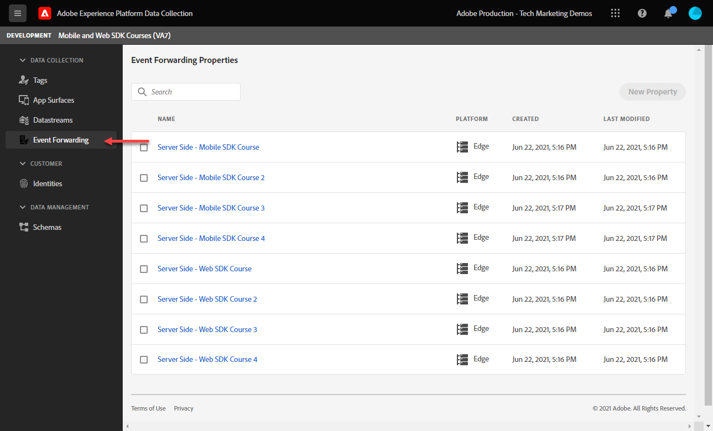
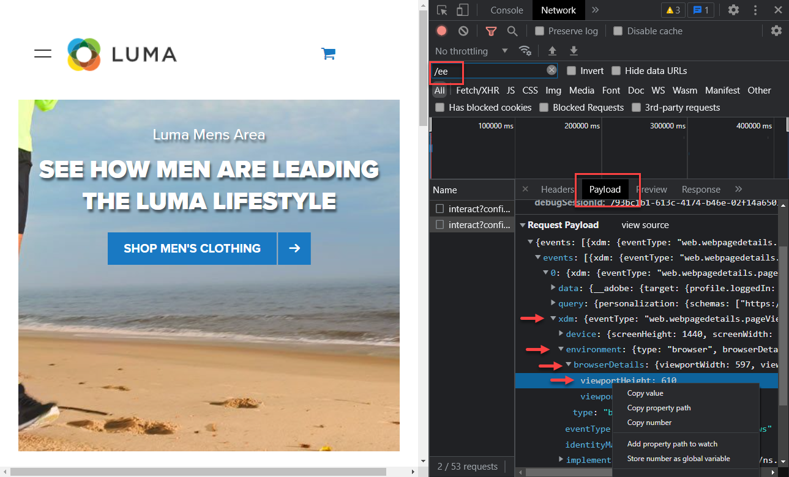
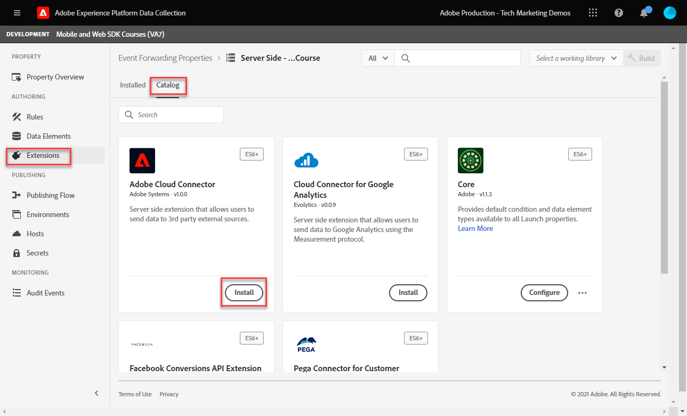

# イベント転送プロパティの設定

イベント Web SDK データを使用したイベント転送プロパティのExperience Platform方法について説明します。

イベント転送は、新しいタイプのプロパティで、データ収集で使用できます。 イベント転送を使用すると、従来のクライアント側ブラウザーではなく、サードパーティの非Adobeベンダーに対して、Adobe Experience Platform Edge Network から直接データを送信できます。 イベント転送の利点について詳しくは、 [イベント転送の概要](https://experienceleague.adobe.com/docs/experience-platform/tags/event-forwarding/overview.html?lang=en).

Adobe Experience Platformでイベント転送を使用するには、次の 3 つのオプションの 1 つ以上を使用して、まずAdobe Experience Platform Edge Network にデータを送信する必要があります。

* [Adobe Experience Platform Web SDK](overview.md)
* [Adobe Experience Platform モバイル SDK](https://developer.adobe.com/client-sdks/documentation/)
  <!--* [Server-to-Server API](https://experienceleague.adobe.com/docs/audience-manager/user-guide/api-and-sdk-code/dcs/dcs-apis/dcs-s2s.html?lang=en)-->

>[!NOTE]
>Platform Web SDK および Platform Mobile SDK は、タグを使用したデプロイメントは必要ありませんが、タグを使用してこれらの SDK をデプロイすることをお勧めします。

このチュートリアルの前のレッスンを完了したら、Web SDK を使用して Platform Edge Network にデータを送信する必要があります。 データが Platform Edge ネットワークに入ったら、イベント転送を有効にし、イベント転送プロパティを使用してAdobe以外のソリューションにデータを送信できます。

## 学習内容

このレッスンを最後まで学習すると、次の内容を習得できます。

* イベント転送プロパティの作成
* イベント転送プロパティを Platform Web SDK データストリームにリンクする
* タグプロパティのデータ要素とルールの違い、およびイベント転送プロパティのデータ要素とルール
* イベント転送データ要素の作成
* イベント転送ルールの設定
* イベント転送プロパティがデータを正常に送信していることを検証します

## 前提条件

* イベント転送を含むソフトウェアライセンス。 イベント転送は、データ収集の有料機能です。 詳しくは、Adobeアカウントチームにお問い合わせください。
* イベントの転送がExperience Cloud組織で有効になっています。
* イベント転送のユーザー権限。 ( 内 [Admin Console](https://adminconsole.adobe.com/)( Adobe Experience Platform Launch製品の下 )[!UICONTROL プラットフォーム] > [!UICONTROL Edge] およびすべて [!UICONTROL プロパティ権限]) をクリックします。 一旦許可されると、次のように表示されます [!UICONTROL イベント転送] データ収集インターフェイスの左側のナビゲーションで、次の操作をおこないます。
  

* Edge ネットワークにデータを送信するように設定されたAdobe Experience Platform Web または Mobile SDK。 このチュートリアルの次のレッスンを完了している。

   * 初期設定

      * [XDM スキーマの設定](configure-schemas.md)
      * [ID 名前空間の設定](configure-identities.md)
      * [データストリームの設定](configure-datastream.md)

   * タグ設定

      * [Web SDK 拡張機能のインストール](install-web-sdk.md)
      * [データ要素の作成](create-data-elements.md)
      * [ID の作成](create-identities.md)
      * [タグルールの作成](create-tag-rule.md)
      * [Adobe Experience Platform Debugger を使用した検証](validate-with-debugger.md)

## イベント転送プロパティの作成

まず、イベント転送プロパティを作成します。

1. を開きます。 [データ収集インターフェイス](https://experience.adobe.com/#/data-collection)
1. 選択 **[!UICONTROL イベント転送]** 左のナビゲーションから
1. 「**[!UICONTROL 新しいプロパティ]**」を選択します。
   

1. プロパティに名前を付けます。 この場合、 `Server-Side - Web SDK Course`

1. 「**[!UICONTROL 保存]**」を選択します。
   

## データストリームの設定

イベント転送で Edge ネットワークに送信したデータを使用するには、新しく作成したイベント転送プロパティを、Adobeソリューションにデータを送信する際に使用したのと同じデータストリームにリンクする必要があります。

データストリームで Target を設定するには、次の手順に従います。

1. に移動します。 [データ収集](https://experience.adobe.com/#/data-collection){target="blank"} インターフェイス
1. 左側のナビゲーションで、「 **[!UICONTROL データストリーム]**
1. 以前に作成したを選択 `Luma Web SDK` datastream

   

1. 「**[!UICONTROL サービスを追加]**」を選択します。
   
1. 選択 **[!UICONTROL イベント転送]** として **[!UICONTROL サービス]**

1. の下 **[!UICONTROL プロパティ ID]** ドロップダウンで、イベント転送プロパティに付けた名前を選択します（この場合は）。 `Server-Side - Web SDK Course`

1. の下 **[!UICONTROL 環境 ID]** ドロップダウンで、イベント転送環境をリンクするタグ環境を選択します ( この場合は `Development`

   >[!TIP]
   >
   >    イベント組織外のイベント転送環境にデータをAdobeするには、 **[!UICONTROL ID を手動で入力]** をクリックし、ID を貼り付けます。 この ID は、イベント転送プロパティの作成時に提供されます。

1. 「**[!UICONTROL 保存]**」を選択します。

   

公開フローを通じて変更を昇格させる準備が整ったら、ステージングおよび実稼動データストリームに対してこれらの手順を繰り返します。

## Platform Edge Network から非Adobeソリューションにデータを転送

この演習では、イベント転送データ要素の設定、イベント転送ルールの設定、および [Webhook.site](https://webhook.site/).

>[!NOTE]
>
>Webhook は、異なるシステムを半リアルタイムで統合する方法です。 [Webhook.site](https://webhook.site/) は、任意の受信 HTTP リクエストや電子メールを（Visual Custom Actions Builder や WebhookScript を使用して）簡単に検査、テスト、自動化できるサードパーティのツールです。

>[!IMPORTANT]
>
>さらに進むには、データ要素を既に作成して XDM オブジェクトにマッピングし、タグルールを設定し、ライブラリ内でタグ環境にそれらの変更を構築している必要があります。 まだ使用していない場合は、 **タグ設定** の手順 [前提条件](setup-event-forwarding.md#prerequisites) 」セクションに入力します。 これらの手順では、データが Platform Edge ネットワークに送信され、そこから、Adobe以外のソリューションにデータを転送するようにイベント転送プロパティを設定できます。

### イベント転送データ要素の作成

Platform Web SDK タグ拡張を使用して以前に設定した XDM オブジェクトは、イベント転送プロパティのデータ要素のデータソースになります。 タグプロパティで既に設定済みのデータを、イベント転送のデータソースとして使用します。

>[!IMPORTANT]
>
>イベント転送で XDM フィールドを参照する場合と、他のコンテキストで XDM フィールドを参照する場合では、構文に違いが 1 つあります。 イベント転送プロパティでデータを参照するには、データ要素のパスに `arc.event` プレフィックス：
>
> * `arc` は、Adobe Response Context の略語です。
> * 例：`arc.event.xdm.web.webPageDetails.URL`
>
>このパスが正しく指定されていない場合、データは収集されません。

この演習では、ブラウザービューポートの高さとExperience CloudID を XDM オブジェクトから Webhook に転送します。 XDM フィールドのパスは、 [XDM スキーマの設定](configure-schemas.md) レッスン。

>[!TIP]
>
>また、Web ブラウザーのネットワークツールを使用して、XDM オブジェクトのパスを見つけることもできます。このパスは、次の場合にフィルタリングをおこないます。 `/ee` リクエスト、ビーコンを開く [!UICONTROL **ペイロード**] をクリックし、目的の変数にドリルダウンします。 次に、マウスで右クリックし、「プロパティのパスをコピー」を選択します。 ブラウザビューポートの高さの例を次に示します。
> 

1. 次に移動： **[!UICONTROL イベント転送]** 最近作成したプロパティ

1. 左側のナビゲーションで、「 **[!UICONTROL データ要素]**

1. 選択してください **[!UICONTROL 新しいデータ要素を作成]**

   

1. **[!UICONTROL 名前]** データ要素 `environment.browserDetails.viewportHeight`

1. の下 **[!UICONTROL 拡張]**&#x200B;を終了します。 `CORE`

1. の下 **[!UICONTROL データ要素タイプ]**&#x200B;を選択します。 `Path`

1. ブラウザービューポートの高さを含む XDM オブジェクトパスに入力します。 `arc.event.xdm.environment.browserDetails.viewportHeight`

1. 「**[!UICONTROL 保存]**」を選択します

   

1. 別のデータ要素の作成

1. **[!UICONTROL 名前]** it `ecid`

1. の下 **[!UICONTROL 拡張]**&#x200B;を終了します。 `CORE`

1. の下 **[!UICONTROL データ要素タイプ]**&#x200B;を選択します。 `Path`

1. Experience CloudID を含む XDM オブジェクトパスを入力する `arc.event.xdm.identityMap.ECID.0.id`

1. 「**[!UICONTROL 保存]**」を選択します

   

   >[!CAUTION]
   >
   > 必ず `arc.event.` というプレフィックスがパスに含まれています。 また、XDM オブジェクトフィールド名と同じように大文字と小文字を区別してください。ECID 名前空間はすべて大文字にする必要があります。

   >[!TIP]
   >
   独自の Web サイトで作業する際には、Web ブラウザーのネットワークツールを使用した XDM オブジェクトパスを見つけ、次のフィルタリングをおこないます。 `/ee` リクエスト、ビーコンを開く [!UICONTROL **ペイロード**] をクリックし、目的の変数にドリルダウンします。 次に、マウスで右クリックし、「プロパティのパスをコピー」を選択します。 ブラウザビューポートの高さの例を次に示します。
   

### AdobeCloud Connector 拡張機能のインストール

データをサードパーティの場所に送信するには、まず [!UICONTROL Adobeクラウドコネクタ] 拡張子。

1. 選択 **[!UICONTROL 拡張機能]** 左側のナビゲーションで

1. を選択します。 **[!UICONTROL カタログ]** タブ

1. を検索します。 **[!UICONTROL Adobeクラウドコネクタ]**&#x200B;を選択します。 **[!UICONTROL インストール]**

   

拡張機能の設定は不要です。 この拡張機能を使用して、データを非Adobeソリューションに転送できます。

### イベント転送ルールの作成

タグプロパティのルールを設定する場合と、イベント転送プロパティのルールを設定する場合では、主に次の点が異なります。

* **[!UICONTROL イベント] &amp; [!UICONTROL 条件]**:

   * **タグ**：すべてのルールは、ルールで指定する必要があるイベントによってトリガーされます。例： `Library Loaded - Page Top`. 条件はオプションです。
   * **イベントの転送**:Platform Edge Network に送信されるすべてのイベントが、データを転送するトリガーであると想定されます。 したがって、 [!UICONTROL イベント] イベント転送ルールで選択する必要があります。 イベント転送ルールとトリガー転送ルールを管理するには、条件を設定する必要があります。

* **データ要素のトークン化**:

   * **タグ**：データ要素名は、 `%` をルール内で使用する場合は、データ要素名の先頭と末尾に配置します。 例：`%viewportHeight%`。

   * **イベントの転送**：データ要素名は、 `{{` 最初に `}}` ：データ要素名の末尾に配置します（ルールで使用される場合）。 例：`{{viewportHeight}}`。

* **一連のルールアクション**:

   * イベント転送ルールの「アクション」セクションは、常に順番に実行されます。 ルールを保存する際に、アクションの順序が正しいことを確認します。この実行シーケンスは、タグの場合のように非同期で実行することはできません。

<!--
  * **Tags**: Rule actions can easily be reordered using drag-and-drop functionality.
  * **Event forwarding**: Rule actions are always executed sequentially. Make sure the order of actions is correct when you save a rule.
-->

データを Webhook に転送するルールを設定するには、まず個人用の Webhook を取得する必要があります。

1. に移動します。 [Webhook.site](https://webhook.site)

1. 検索文字列 **固有の URL**&#x200B;を使用する場合、これをイベント転送ルールの URL リクエストとして使用します

1. 選択 **[!UICONTROL クリップボードにコピー]**

1. Webhook によってリアルタイムにイベント転送データを検証できるので、このウィンドウを開いたままにします。

   

1. 戻る **[!UICONTROL データ収集]** > **[!UICONTROL イベント転送]** > **[!UICONTROL ルール]** 左のナビゲーションから

1. 選択 **[!UICONTROL 新規ルールの作成]**

   

1. 名前を付ける `all events - ad cloud connector - webhook`

1. アクションの追加

1. の下 **[!UICONTROL 拡張]**&#x200B;を選択します。 **[!UICONTROL Adobeクラウドコネクタ]**

1. の下 **[!UICONTROL アクションタイプ]**&#x200B;を選択します。 **[!UICONTROL 取得呼び出しを実行]**

1. Webhook の URL を **[!UICONTROL URL]** フィールド

   

1. の下 **[クエリのパラメーター]**&#x200B;の場合は、前に作成した両方のデータ要素を追加します。

1. 次の日： **[!UICONTROL キー]** 列のタイプ `viewPortHeight`. 次の日： **[!UICONTROL 値]** 列に、 `{{environment.browserDetails.viewportHeight}}` データ要素を入力するか、データ要素セレクターアイコンから「 」を選択します。

1. 選択 [!UICONTROL **+もう 1 つ追加**] 別のクエリーパラメータを追加するには

1. 次の日： **[!UICONTROL キー]** 列のタイプ `ecid`. 「値」列に、 `{{ecid}}` データ要素

1. 選択 **[!UICONTROL 変更を保持]**

   

1. ルールは次のようになります

1. 「**[!UICONTROL 保存]**」を選択します

   

### ライブラリの作成とビルド

通常のタグプロパティの場合と同様に、ライブラリを作成し、イベント転送開発環境に対するすべての変更をビルドします。

>[!NOTE]
>
ステージングおよび実稼動のイベント転送プロパティをデータストリームにリンクしていない場合、ライブラリを構築する唯一のオプションとして開発環境が表示されます。

## イベント転送ルールの検証

次に、Platform Debugger と Webhook.site を使用して、イベント転送プロパティを検証できます。

1. 手順に従って、 [タグライブラリの切り替え](validate-with-debugger.md#use-the-experience-platform-debugger-to-map-to-your-tag-property) の [Luma デモサイト](https://luma.enablementadobe.com/content/luma/us/en/men.html) を Web SDK タグプロパティに追加します。

1. ページをリロードする前に、Experience PlatformDebugger でを開きます。 **[!UICONTROL ログ]** 左のナビゲーションから

1. を選択します。 **[!UICONTROL Edge]** 「 」タブで、「 **[!UICONTROL 接続]** Platform Edge Network リクエストを表示するには、以下を実行します。

   

1. ページをリロード

1. Platform Edge Network が WebHook に送信するサーバー側のリクエストを確認できる追加のリクエストが表示されます。

1. 検証に焦点を当てるリクエストは、Edge ネットワークによって送信される、完全に構築された URL を示すリクエストです

   

1. viewPortHeight および ecid クエリー文字列パラメーターに注意してください。

   

1. XDM オブジェクトで確認されるデータと一致します

   

1. 最後に、でデータが一致することを検証します。 [Webhook.site](https://webhook.site) また、開いている Webhook ウィンドウを表示して、

   

おめでとうございます。イベント転送を設定しました。

[次へ： ](conclusion.md)

>[!NOTE]
>
Adobe Experience Platform Web SDK の学習に時間を割いていただき、ありがとうございます。 ご質問がある場合、一般的なフィードバックを共有したい場合、または今後のコンテンツに関する提案がある場合は、こちらで共有してください [Experience Leagueコミュニティディスカッション投稿](https://experienceleaguecommunities.adobe.com/t5/adobe-experience-platform-launch/tutorial-discussion-implement-adobe-experience-cloud-with-web/td-p/444996)