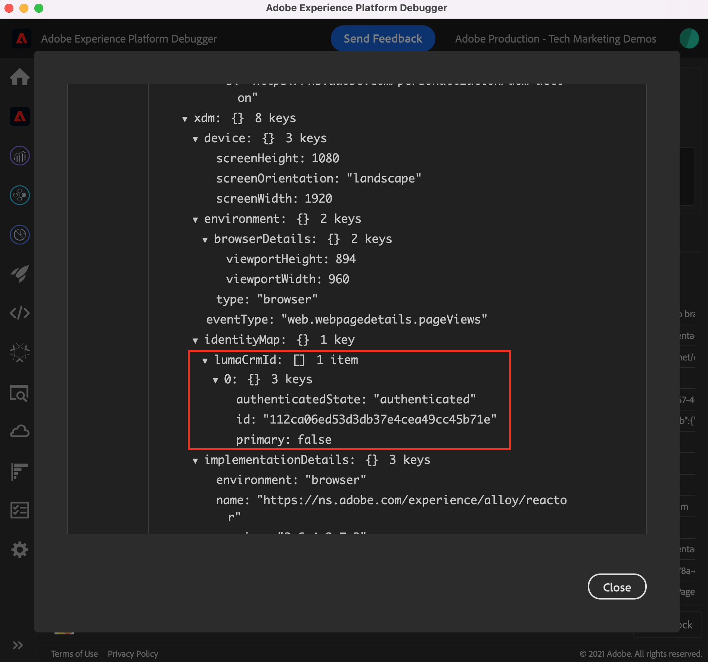
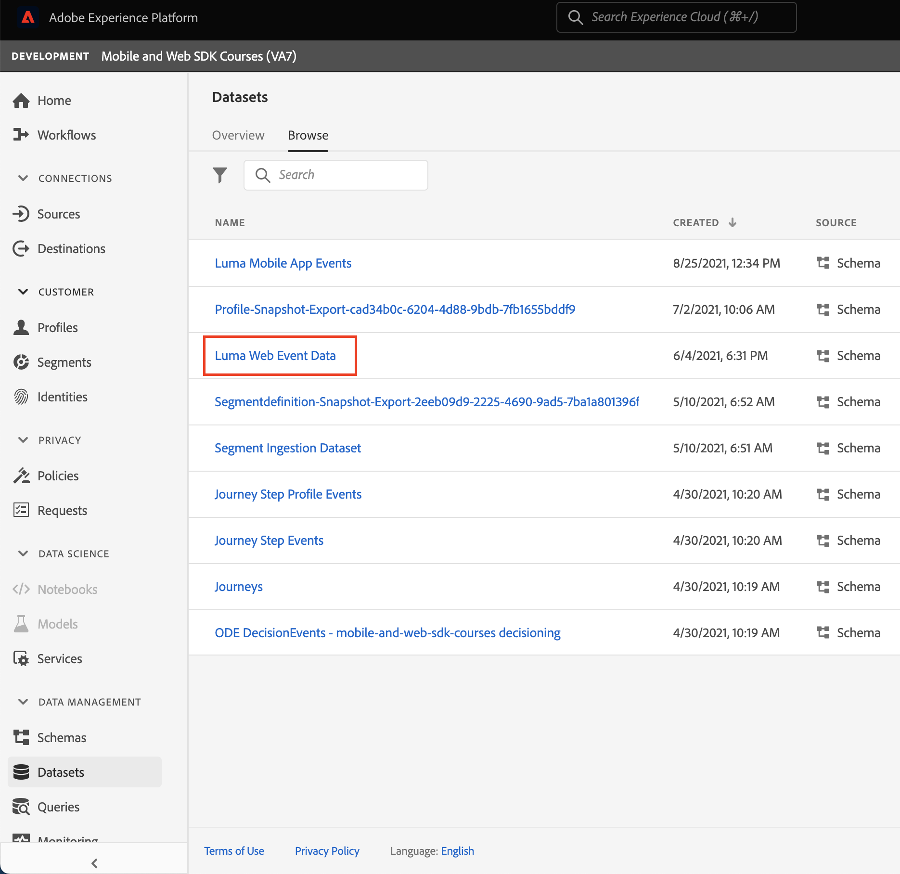
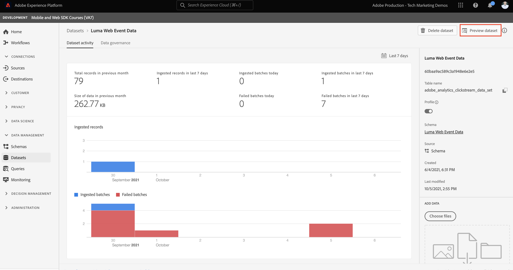

# Web SDK を使用したExperience Platformへのデータのストリーミング

Platform Web SDK を使用して、Web データをAdobe Experience Platformにストリーミングする方法について説明します。

Experience Platformは、Adobe Real-time Customer Data Platform、Adobe Customer Journey Analytics、Adobe Journey Optimizerなど、すべての新しいExperience Cloudアプリケーションの中心です。 これらのアプリケーションは、Platform Web SDK を Web データ収集の最適な方法として使用するように設計されています。

Experience Platformは、前に作成したのと同じ XDM スキーマを使用して、Luma Web サイトからイベントデータをキャプチャします。 そのデータが Platform Edge ネットワークに送信されると、データストリーム設定はそのデータをExperience Platformに転送できます。

## 学習内容

このレッスンを最後まで学習すると、以下の内容を習得できます。

* Adobe Experience Platform内でのデータセットの作成
* Web SDK データをAdobe Experience Platformに送信するためのデータストリームの設定
* リアルタイム顧客プロファイルのストリーミング Web データを有効にする
* データが Platform データセットとリアルタイム顧客プロファイルの両方にランディングしたことを検証します。

## 前提条件

次のレッスンを既に完了していること。

* The **初期設定** レッスン：
   * [XDM スキーマの設定](configure-schemas.md)
   * [データストリームの設定](configure-datastream.md)
   * [ID 名前空間の設定](configure-identities.md)

* The **タグ設定** レッスン：
   * [Web SDK 拡張機能のインストール](install-web-sdk.md)
   * [データ要素の作成](create-data-elements.md)
   * [ID の作成](create-identities.md)
   * [タグルールの作成](create-tag-rule.md)

## データセットの作成

Adobe Experience Platformに正常に取り込まれたすべてのデータは、データレイク内にデータセットとして保持されます。 A [データセット](https://experienceleague.adobe.com/docs/experience-platform/catalog/datasets/overview.html?lang=en) は、スキーマ（列）とフィールド（行）を含むテーブルなど、データのコレクションのストレージと管理の構成体です。 データセットには、保存するデータの様々な側面を記述したメタデータも含まれます。

この演習では、データセットを作成して、 [Luma デモサイト](https://luma.enablementadobe.com/content/luma/us/en.html).

>[!WARNING]
>
>既に `Luma Web Event Data` スキーマ（前のレッスンで説明したとおり） [XDM スキーマの設定](configure-schemas.md).

1. 次に移動： [Experience Platform界面](https://experience.adobe.com/platform/)
1. このチュートリアルで使用している開発用サンドボックス内にいることを確認します。
1. 開く **[!UICONTROL データ管理/データセット]** 左のナビゲーションから
1. 選択 **[!UICONTROL データセットを作成]**

   

1. を選択します。 **[!UICONTROL スキーマからデータセットを作成]** オプション

   

1. を選択します。 `Luma Web Event Data` スキーマが [前のレッスン](configure-schemas.md) 次に、「 **[!UICONTROL 次へ]**

   

1. 次を提供： **[!UICONTROL 名前]** およびオプション **[!UICONTROL 説明]** 」と表示されます。 この練習では、 `Luma Web Event Data`を選択し、「 **[!UICONTROL 完了]**

   

データセットが、Platform Web SDK 実装からのデータ収集を開始するように設定されました。

## データストリームの設定

次に、 [!UICONTROL datastream] にデータを送信 [!UICONTROL Adobe Experience Platform]. datastream は、タグのプロパティ、Platform Edge Network およびExperience Platformデータセット間のリンクです。

1. を開きます。 [データ収集](https://experience.adobe.com/#/data-collection){target="blank"} インターフェイス
1. 選択 **[!UICONTROL データストリーム]** 左のナビゲーションから
1. で作成したデータストリームを開きます。 [データストリームの設定](configure-datastream.md) 教訓 `Luma Web SDK`

   

1. 「**[!UICONTROL サービスを追加]**」を選択します。
   
1. 選択 **[!UICONTROL Adobe Experience Platform]** として **[!UICONTROL サービス]**
1. 選択 `Luma Web Event Data` として **[!UICONTROL イベントデータセット]**

1. 「**[!UICONTROL 保存]**」を選択します。

   

次の場所で [Luma デモサイト](https://luma.enablementadobe.com/content/luma/us/en.html) タグプロパティにマッピングされると、データセットがExperience Platformに入力されます。

## データセットの検証

この手順は、データがデータセットにランディングされたことを確認するために重要です。 データセットに送信されるデータの検証には、2 つの側面があります。

* を使用して検証 [!UICONTROL Experience Platformデバッガー]
* を使用して検証 [!UICONTROL データセットをプレビュー]
* を使用して検証 [!UICONTROL クエリサービス]

### Experience Platform Debugger

これらの手順は、 [デバッガーレッスン](validate-with-debugger.md). ただし、データはデータストリームで有効にした後で Platform に送信されるので、さらにサンプルデータを生成する必要があります。

1. を開きます。 [Luma デモサイト](https://luma.enablementadobe.com/content/luma/us/en.html) をクリックし、 [!UICONTROL Experience Platformデバッガー] 拡張機能アイコン

1. タグプロパティをにマッピングするように Debugger を設定します。 *あなたの* 開発環境 (「 [Debugger を使用した検証](validate-with-debugger.md) レッスン

   

1. 資格情報（`test@adobe.com`／`test`）を使用して Luma サイトにログインします。

1. [Luma のホームページ](https://luma.enablementadobe.com/content/luma/us/en.html)に戻ります。

1. デバッガーに表示される Platform Web SDK ネットワークビーコン内で、「events」行を選択してポップアップの詳細を展開します

   

1. ポップアップ内で「identityMap」を検索します。 ここに、authenticatedState、id、primary の 3 つのキーを持つ lumaCrmId が表示されます
   

これで、データが `Luma Web Event Data` データセットを作成し、「プレビューデータセット」検証の準備を整えます。

### データセットのプレビュー

データが Platform のデータレイクにランディングしたことを確認するには、次の方法を使用します。 **[!UICONTROL データセットをプレビュー]** 機能。 Web SDK データは、データレイクにマイクロバッチされ、Platform インターフェイスで定期的に更新されます。 生成したデータが表示されるまでに 10 ～ 15 分かかる場合があります。

1. Adobe Analytics の [Experience Platform](https://experience.adobe.com/platform/) インタフェース、選択 **[!UICONTROL データ管理/データセット]** 左側のナビゲーションで、 **[!UICONTROL データセット]** ダッシュボード。

   ダッシュボードリストは、組織で使用可能なすべてのデータセットを管理します。リストに表示された各データセットに関する詳細（名前、データセットが適用されるスキーマ、最新の取得実行のステータスなど）が表示されます。

1. を選択します。 `Luma Web Event Data` データセットを開きます。 **[!UICONTROL データセットアクティビティ]** 画面。

   

   アクティビティ画面には、消費されるメッセージの割合を視覚化したグラフと、成功および失敗したバッチのリストが含まれます。

1. 次から： **[!UICONTROL データセットアクティビティ]** 画面、選択 **[!UICONTROL データセットをプレビュー]** 画面の右上隅付近にあり、最大 100 行のデータをプレビューできます。 データセットが空の場合、プレビューリンクは非アクティブになります。

   

   プレビューウィンドウの右側に、データセットのスキーマの階層表示が表示されます。

   

>[!INFO]
>
>Adobe Experience Platformのクエリサービスは、湖内のデータを検証するためのより堅牢な方法ですが、このチュートリアルの範囲外です。 詳しくは、 [データの調査](https://experienceleague.adobe.com/docs/platform-learn/tutorials/queries/explore-data.html?lang=ja) （「 Platform チュートリアル」セクション）。

## リアルタイム顧客プロファイルのデータセットとスキーマの有効化

次の手順では、リアルタイム顧客プロファイルのデータセットとスキーマを有効にします。 Web SDK からのデータストリーミングは、Platform に取り込まれる多数のデータソースの 1 つで、Web データを他のデータソースと結合して、360 度の顧客プロファイルを作成したいと考えます。 リアルタイム顧客プロファイルの詳細については、次の短いビデオをご覧ください。

>[!VIDEO](https://video.tv.adobe.com/v/27251?learn=on&captions=eng)

>[!CAUTION]
>
>独自の Web サイトとデータを使用する場合は、リアルタイム顧客プロファイルでデータを有効にする前に、より堅牢なデータ検証をおこなうことをお勧めします。

**データセットを有効にするには：**

1. 作成したデータセットを開きます。 `Luma Web Event Data`

1. を選択します。 **[!UICONTROL プロファイル切り替え]** 電源を入れる

   

1. 次の操作を確認します。 **[!UICONTROL 有効にする]** データセット

   

**スキーマを有効にするには：**

1. 作成したスキーマを開きます。 `Luma Web Event Data`

1. を選択します。 **[!UICONTROL プロファイル切り替え]** 電源を入れる

   

1. 選択 **[!UICONTROL このスキーマのデータの identityMap フィールドには、プライマリ ID が含まれます。]**

   >[!IMPORTANT]
   >
   >    プライマリID は、リアルタイム顧客プロファイルに送信されるすべてのレコードで必要です。 通常、ID フィールドはスキーマ内でラベル付けされます。 ただし、ID マップを使用する場合、ID フィールドはスキーマ内に表示されません。 このダイアログでは、プライマリ ID を念頭に置いており、データを送信する際に ID マップで指定することを確認します。 ご存じのように、Web SDK は ID マップを使用し、Experience CloudID(ECID) がデフォルトのプライマリ ID です。

1. 選択 **[!UICONTROL 有効にする]**

   

1. 選択 **[!UICONTROL 保存]** 更新したスキーマを保存するには

これで、プロファイルに対してスキーマも有効になります。

>[!IMPORTANT]
>
>    プロファイルに対してスキーマを有効にすると、無効にしたり削除したりすることはできません。 また、この時点以降は、フィールドをスキーマから削除できません。 実稼動環境で独自のデータを使用する際には、後で注意する必要があります。 このチュートリアルでは、開発用サンドボックスを使用する必要があります。開発用サンドボックスは、いつでも削除できます。
>
>   
> 独自のデータを使用する場合は、次の順序でおこなうことをお勧めします。
> 
> * まず、データをデータセットに取り込みます。
> * データ取り込みプロセス中に発生した問題（データ検証やマッピングの問題など）に対処します。
> * プロファイルのデータセットとスキーマの有効化
> * データの再取り込み

### プロファイルの検証

Platform インターフェイス ( またはJourney Optimizerインターフェイス ) で顧客プロファイルを検索し、データがリアルタイム顧客プロファイルにランディングしたことを確認できます。 名前が示すように、プロファイルはリアルタイムで入力されるので、データセット内のデータの検証と同様に遅延はありません。

まず、より多くのサンプルデータを生成する必要があります。 このレッスンで前述の手順を繰り返し、タグプロパティにマッピングされた Luma Web サイトにログインします。 Inspect Platform Web SDK リクエストを使用して、 `lumaCRMId`.

1. Adobe Analytics の [Experience Platform](https://experience.adobe.com/platform/) インタフェース、選択 **[!UICONTROL プロファイル]** 左側のナビゲーションで

1. を **[!UICONTROL ID 名前空間]** use `lumaCRMId`
1. 次の値をコピー&amp;ペースト： `lumaCRMId` は、Debugger で調べた呼び出し ( この場合はExperience Platform) で渡されます。 `112ca06ed53d3db37e4cea49cc45b71e`.

   

1. プロファイルに有効な値がある場合、 `lumaCRMId`に設定されている場合、プロファイル ID はコンソールに入力されます。

   

1. フルを表示するには **[!UICONTROL 顧客プロファイル]** ID ごとに、 **[!UICONTROL プロファイル ID]** をクリックします。

   >[!NOTE]
   >
   >プロファイル ID のハイパーリンクを選択できます。または、行を選択すると、右側のメニューが開き、「プロファイル ID 」ハイパーリンクを選択できます。
   > 

   ここに、 `lumaCRMId`例： `ECID`.

   

これで、Experience Platform( およびReal-Time CDP! JOURNEY OPTIMIZER!)

[次へ： ](setup-analytics.md)

>[!NOTE]
>
>Adobe Experience Platform Web SDK の学習に時間を割いていただき、ありがとうございます。 ご質問がある場合、一般的なフィードバックを共有したい場合、または今後のコンテンツに関する提案がある場合は、こちらで共有してください [Experience Leagueコミュニティディスカッション投稿](https://experienceleaguecommunities.adobe.com/t5/adobe-experience-platform-launch/tutorial-discussion-implement-adobe-experience-cloud-with-web/td-p/444996)