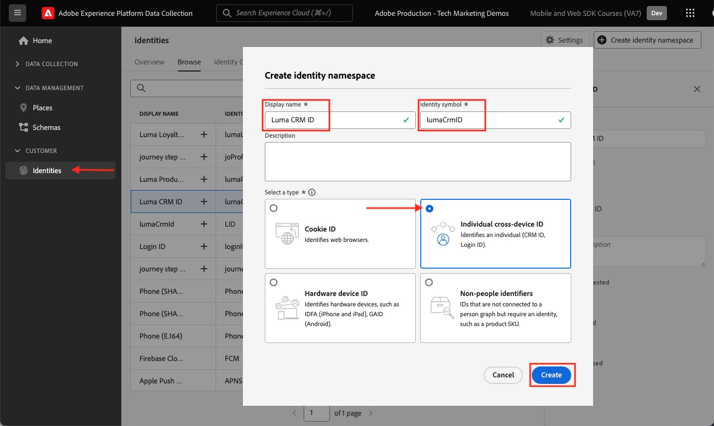

# ID 名前空間の設定

Adobe Experience Platform Web SDK で使用する ID 名前空間の設定方法について説明します。

[Adobe Experience Cloud ID サービス &#x200B;](https://experienceleague.adobe.com/ja/docs/id-service/using/home) は、SDK ベースのAdobe アプリケーション間で共通の訪問者 ID （ECID）を設定して、アプリケーション間のオーディエンス共有などのExperience Cloud機能を強化します。 また、独自の顧客 ID をサービスに送信して、クロスデバイスターゲティングや、顧客関係管理（CRM）システムなどの他のシステムとの統合を有効にすることもできます。

[Adobe Experience Platform ID サービス &#x200B;](https://experienceleague.adobe.com/ja/docs/experience-platform/identity/home) （はい、2 つあります）は、ECID と顧客 ID を使用して ID グラフを生成し、属性と行動をリアルタイム顧客プロファイルに結合できるようにします。

>[!NOTE]
>
>カスタム ID 名前空間は、Adobe Analytics、Adobe Target、Adobe Audience Managerを Web SDKで実装する場合は _必須ではありません_ （認証済み ID は、後で示すように、`data` オブジェクトではなく `xdm` オブジェクトで渡すことができます）。 ID 名前空間は、Journey Optimizer、Real-Time Customer Data Platform、Customer Journey Analyticsなどの Platform ネイティブアプリケーションに必要です。 独自の実装で ID 名前空間を使用しないことにすることもできますが、このチュートリアルの一部としてこれを行う必要があります。

>[!NOTE]
>
> デモ目的で、このレッスンの演習では、資格情報 [&#x200B; ユーザー：](https://luma.enablementadobe.com/content/luma/us/en.html) / パスワード：テスト **を使用して `test@test.com`Luma デモサイト** にログインした架空の顧客の ID の詳細を取得します。

## 学習目標

このレッスンを最後まで学習すると、以下の内容を習得できます。

* ID 名前空間について
* カスタム ID 名前空間を作成して内部 CRM ID をキャプチャします

## 前提条件

前のレッスンを完了している必要があります。

* [スキーマの設定](configure-schemas.md)

>[!IMPORTANT]
>
>Experience Cloud Web SDK ライブラリには訪問者 ID サービス機能が含まれているので、Adobe Experience Platform Web SDKを実装する場合、[JavaScript ID 拡張 &#x200B;](https://exchange.adobe.com/apps/ec/100160/adobe-experience-cloud-id-launch-extension) は必要ありません。
>
> Web サイトで既に（Visitor API またはExperience Cloud ID Service Tag extension を通じて）Experience Cloud ID サービスを使用している場合に、Adobe Experience Platform Web SDKへの移行中もそのサービスを引き続き使用するには、最新バージョンの Visitor API またはExperience Cloud ID Service Tag extension を使用する必要があります。 詳しくは、「[ID の移行 &#x200B;](https://experienceleague.adobe.com/ja/docs/experience-platform/edge/identity/overview)」を参照してください。

## ID 名前空間の作成

この演習では、Luma のカスタム ID フィールド `lumaCrmId` の ID 名前空間を作成します。 ID 名前空間は、同じ名前空間内の 2 つの一致する値により、2 つのデータソースで ID グラフを構成できるので、リアルタイム顧客プロファイルを作成するうえで重要な役割を果たします。

演習を開始する前に、この短いビデオを視聴して、Adobe Experience Platformでの ID について詳しく確認してください。

>[!VIDEO](https://video.tv.adobe.com/v/3422774?learn=on&enablevpops&captions=jpn)

次に、Luma CRM ID の名前空間を作成します。

1. [&#x200B; データ収集インターフェイス &#x200B;](https://experience.adobe.com/data-collection/){target="_blank"} を開きます。
1. チュートリアルに使用するサンドボックスを選択します

   >[!NOTE]
   >
   >Real-Time CDPやJourney Optimizerなどの Platform ベースのアプリケーションを使用している場合は、このチュートリアルで開発用サンドボックスを使用することをお勧めします。 そうでない場合は、**[!UICONTROL Prod]** サンドボックスを使用します。

1. 左側のナビゲーションの **[!UICONTROL ID]** を選択します
1. 「**[!UICONTROL 参照]**」を選択します。

   ID 名前空間のリストがページのメインインターフェイスに表示され、名前、ID 記号、最終更新日および標準名前空間かカスタム名前空間かが示されます。 右側のパネルには、「ID グラフの強度 [!UICONTROL &#x200B; に関する情報が表示さ &#x200B;] ます。

1. **[!UICONTROL ID 名前空間を作成]** を選択します

   

1. 詳細を以下のように入力して、「**[!UICONTROL 作成]**」を選択します。

   | フィールド | 値 |
   |---------------|-----------|
   | 表示名 | Luma CRM ID |
   | ID シンボル | lumaCrmId |
   | タイプ | 個人のクロスデバイス ID |

   

   ID 名前空間は、**[!UICONTROL ID]** 画面に入力されます。

   

>[!NOTE]
>
> [ID の作成 &#x200B;](create-identities.md) レッスンでは、ID を Platform Edge Networkに送信する際にこの名前空間を使用する方法を学びます。

ID が配置されたので、データストリームを設定できます。

>[!NOTE]
>
>Adobe Experience Platform Web SDKの学習にご協力いただき、ありがとうございます。 ご不明な点がある場合や、一般的なフィードバックを共有したい場合、または今後のコンテンツに関するご提案がある場合は、この [Experience League Community Discussion の投稿でお知らせください &#x200B;](https://experienceleaguecommunities.adobe.com/t5/adobe-experience-platform-data/tutorial-discussion-implement-adobe-experience-cloud-with-web/td-p/444996?profile.language=ja)
